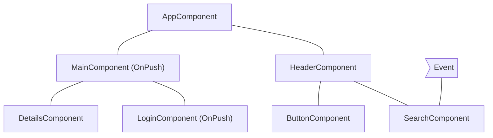
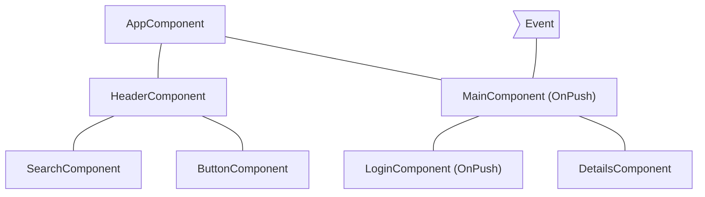
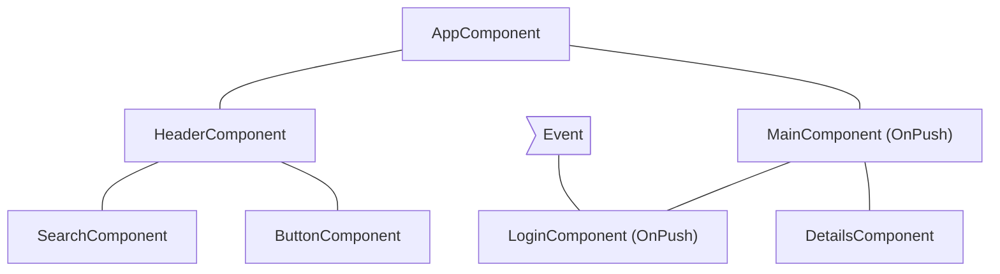
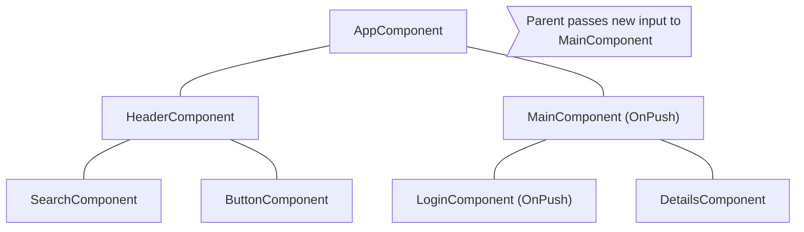

# Skipping component subtrees

JavaScript, by default, uses mutable data structures that you can reference from multiple different components. Angular runs change detection over your entire component tree to make sure that the most up-to-date state of your data structures is reflected in the DOM.

Change detection is sufficiently fast for most applications. However, when an application has an especially large component tree, running change detection across the whole application can cause performance issues. You can address this by configuring change detection to only run on a subset of the component tree.

If you are confident that a part of the application is not affected by a state change, you can use [OnPush](/api/core/ChangeDetectionStrategy) to skip change detection in an entire component subtree.

## Using `OnPush`

OnPush change detection instructs Angular to run change detection for a component subtree **only** when:

* The root component of the subtree receives new inputs as the result of a template binding. Angular compares the current and past value of the input with `==`.
* Angular handles an event _(for example using event binding, output binding, or `@HostListener` )_ in the subtree's root component or any of its children whether they are using OnPush change detection or not.

You can set the change detection strategy of a component to `OnPush` in the `@Component` decorator:

```ts
import { ChangeDetectionStrategy, Component } from '@angular/core';
@Component({
  changeDetection: ChangeDetectionStrategy.OnPush,
})
export class MyComponent {}
```

## Common change detection scenarios

This section examines several common change detection scenarios to illustrate Angular's behavior.

### An event is handled by a component with default change detection

If Angular handles an event within a component without `OnPush` strategy, the framework executes change detection on the entire component tree. Angular will skip descendant component subtrees with roots using `OnPush`, which have not received new inputs.

As an example, if we set the change detection strategy of `MainComponent` to `OnPush` and the user interacts with a component outside the subtree with root `MainComponent`, Angular will check all the pink components from the diagram below (`AppComponent`, `HeaderComponent`, `SearchComponent`, `ButtonComponent`) unless `MainComponent` receives new inputs:



## An event is handled by a component with OnPush

If Angular handles an event within a component with OnPush strategy, the framework will execute change detection within the entire component tree. Angular will ignore component subtrees with roots using OnPush, which have not received new inputs and are outside the component which handled the event.

As an example, if Angular handles an event within `MainComponent`, the framework will run change detection in the entire component tree. Angular will ignore the subtree with root `LoginComponent` because it has `OnPush` and the event happened outside of its scope.



## An event is handled by a descendant of a component with OnPush

If Angular handles an event in a component with OnPush, the framework will execute change detection in the entire component tree, including the component’s ancestors.

As an example, in the diagram below, Angular handles an event in `LoginComponent` which uses OnPush. Angular will invoke change detection in the entire component subtree including `MainComponent` (`LoginComponent`’s parent), even though `MainComponent` has `OnPush` as well. Angular checks `MainComponent` as well because `LoginComponent` is part of its view.



## New inputs to component with OnPush

Angular will run change detection within a child component with `OnPush` when setting an input property as result of a template binding.

For example, in the diagram below, `AppComponent` passes a new input to `MainComponent`, which has `OnPush`. Angular will run change detection in `MainComponent` but will not run change detection in `LoginComponent`, which also has `OnPush`, unless it receives new inputs as well.



## Edge cases

* **Modifying input properties in TypeScript code**. When you use an API like `@ViewChild` or `@ContentChild` to get a reference to a component in TypeScript and manually modify an `@Input` property, Angular will not automatically run change detection for OnPush components. If you need Angular to run change detection, you can inject `ChangeDetectorRef` in your component and call `changeDetectorRef.markForCheck()` to tell Angular to schedule a change detection.
* **Modifying object references**. In case an input receives a mutable object as value and you modify the object but preserve the reference, Angular will not invoke change detection. That’s the expected behavior because the previous and the current value of the input point to the same reference.
