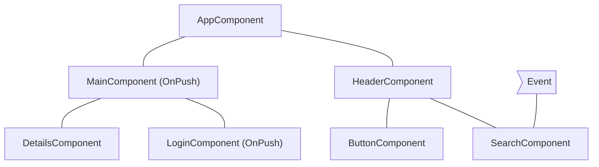
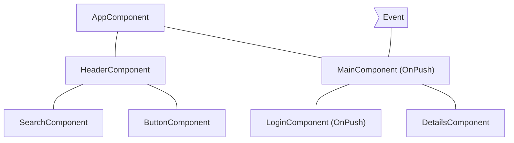
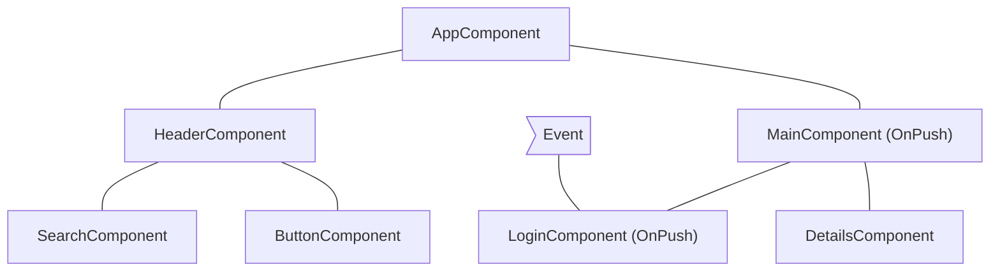
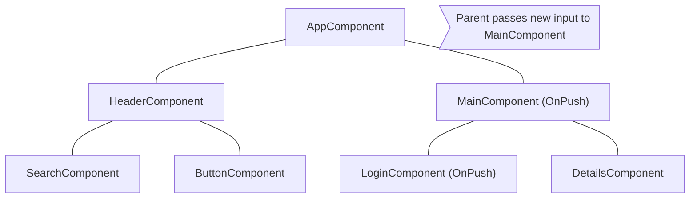

# Пропуск поддеревьев компонентов

JavaScript по умолчанию использует изменяемые структуры данных, на которые могут ссылаться разные компоненты. Angular запускает обнаружение изменений по всему дереву компонентов, чтобы актуальное состояние структур данных отражалось в DOM.

Для большинства приложений обнаружение изменений достаточно быстрое. Но при особенно большом дереве компонентов проход по всему приложению может вызывать проблемы с производительностью. Это можно решить, настроив обнаружение изменений так, чтобы оно выполнялось только на части дерева.

## Использование `OnPush` {#using-onpush}

OnPush — стратегия обнаружения изменений по умолчанию в Angular (начиная с v22). Она указывает Angular запускать обнаружение изменений для поддерева компонентов **только** когда:

- Корневой компонент поддерева получает новые input в результате привязки в шаблоне. Angular сравнивает текущее и прошлое значение input через `==`.
- Angular обрабатывает событие _(например, через event binding, output binding или `@HostListener`)_ в корневом компоненте поддерева или в любом из его потомков — независимо от того, используют ли они OnPush.

## Типовые сценарии обнаружения изменений {#common-change-detection-scenarios}

В этом разделе рассматриваются несколько типовых сценариев, иллюстрирующих поведение Angular.

### Событие обрабатывается компонентом с `Eager` обнаружением изменений {#an-event-is-handled-by-a-component-with-eager-change-detection}

Если Angular обрабатывает событие внутри компонента со стратегией `Eager`, фреймворк выполняет обнаружение изменений по всему дереву компонентов. Angular пропустит поддеревья-потомки с корнями на `OnPush`, которые не получили новых input.

Например, если стратегия обнаружения изменений `MainComponent` — `OnPush`, а пользователь взаимодействует с компонентом вне поддерева с корнем `MainComponent`, Angular проверит все розовые компоненты на диаграмме ниже (`AppComponent`, `HeaderComponent`, `SearchComponent`, `ButtonComponent`), если только `MainComponent` не получит новые input:

```mermaid
graph TD;
    app[AppComponent] --- header[HeaderComponent];
    app --- main["MainComponent (OnPush)"];
    header --- search[SearchComponent];
    header --- button[ButtonComponent];
    main --- login["LoginComponent (OnPush)"];
    main --- details[DetailsComponent];
    event>Event] --- search

class app checkedNode
class header checkedNode
class button checkedNode
class search checkedNode
class event eventNode
```

## Событие обрабатывается компонентом с OnPush {#an-event-is-handled-by-a-component-with-onpush}

Если Angular обрабатывает событие внутри компонента со стратегией OnPush, фреймворк выполнит обнаружение изменений по всему дереву. Angular проигнорирует поддеревья с корнями на OnPush, которые не получили новых input и находятся вне компонента, обработавшего событие.

Например, если Angular обрабатывает событие внутри `MainComponent`, фреймворк запустит обнаружение изменений по всему дереву. Angular проигнорирует поддерево с корнем `LoginComponent`, потому что у него `OnPush`, а событие произошло вне его области.

```mermaid
graph TD;
    app[AppComponent] --- header[HeaderComponent];
    app --- main["MainComponent (OnPush)"];
    header --- search[SearchComponent];
    header --- button[ButtonComponent];
    main --- login["LoginComponent (OnPush)"];
    main --- details[DetailsComponent];
    event>Event] --- main

class app checkedNode
class header checkedNode
class button checkedNode
class search checkedNode
class main checkedNode
class details checkedNode
class event eventNode
```

## Событие обрабатывается потомком компонента с OnPush {#an-event-is-handled-by-a-descendant-of-a-component-with-onpush}

Если Angular обрабатывает событие в компоненте с OnPush, фреймворк выполнит обнаружение изменений по всему дереву, включая предков компонента.

Например, на диаграмме ниже Angular обрабатывает событие в `LoginComponent` с OnPush. Angular вызовет обнаружение изменений во всём поддереве, включая `MainComponent` (родитель `LoginComponent`), хотя у `MainComponent` тоже `OnPush`. Angular проверяет и `MainComponent`, потому что `LoginComponent` — часть его view.

```mermaid
graph TD;
    app[AppComponent] --- header[HeaderComponent];
    app --- main["MainComponent (OnPush)"];
    header --- search[SearchComponent];
    header --- button[ButtonComponent];
    main --- login["LoginComponent (OnPush)"];
    main --- details[DetailsComponent];
    event>Event] --- login

class app checkedNode
class header checkedNode
class button checkedNode
class search checkedNode
class login checkedNode
class main checkedNode
class details checkedNode
class event eventNode
```

## Новые input у компонента с OnPush {#new-inputs-to-component-with-onpush}

Angular запустит обнаружение изменений во дочернем компоненте с `OnPush` при установке input-свойства в результате привязки в шаблоне.

Например, на диаграмме ниже `AppComponent` передаёт новый input в `MainComponent` с `OnPush`. Angular запустит обнаружение изменений в `MainComponent`, но не в `LoginComponent`, у которого тоже `OnPush`, если только тот тоже не получит новые input.

```mermaid
graph TD;
    app[AppComponent] --- header[HeaderComponent];
    app --- main["MainComponent (OnPush)"];
    header --- search[SearchComponent];
    header --- button[ButtonComponent];
    main --- login["LoginComponent (OnPush)"];
    main --- details[DetailsComponent];
    event>Parent passes new input to MainComponent]

class app checkedNode
class header checkedNode
class button checkedNode
class search checkedNode
class main checkedNode
class details checkedNode
class event eventNode
```

## Краевые случаи {#edge-cases}

- **Изменение input-свойств в коде TypeScript**. Если через API вроде `@ViewChild` или `@ContentChild` получить ссылку на компонент в TypeScript и вручную изменить свойство `@Input`, Angular не запустит обнаружение изменений для OnPush-компонентов автоматически. Если нужно запустить обнаружение изменений, внедрите `ChangeDetectorRef` и вызовите `changeDetectorRef.markForCheck()`, чтобы Angular запланировал обнаружение изменений.
- **Изменение ссылок на объекты**. Если input получает изменяемый объект и вы меняете объект, сохраняя ссылку, Angular не вызовет обнаружение изменений. Это ожидаемое поведение: предыдущее и текущее значение input указывают на одну и ту же ссылку.
