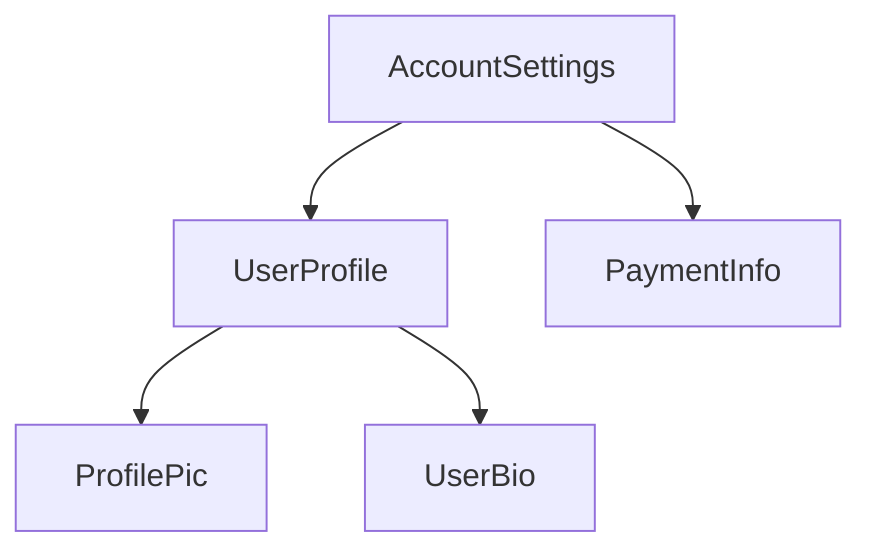

<docs-decorative-header title="Anatomy of a component" imgSrc="adev/src/assets/images/components.svg"> <!-- markdownlint-disable-line -->
</docs-decorative-header>

Tip: This guide assumes you've already read the [Essentials Guide](essentials). Read that first if you're new to Angular.

Every component must have:

* A TypeScript class with _behaviors_ such as handling user input and fetching data from a server
* An HTML template that controls what renders into the DOM
* A [CSS selector](https://developer.mozilla.org/docs/Learn/CSS/Building_blocks/Selectors) that defines how the component is used in HTML

You provide Angular-specific information for a component by adding a `@Component` [decorator](https://www.typescriptlang.org/docs/handbook/decorators.html) on top of the TypeScript class:

<docs-code language="ts" highlight="[1, 2, 3, 4]">
@Component({
  selector: 'profile-photo',
  template: ``,
})
export class ProfilePhoto { }
</docs-code>

For full details on writing Angular templates, see the [Templates guide](guide/templates).

The object passed to the `@Component` decorator is called the component's **metadata**. This includes the `selector`, `template`, and other properties described throughout this guide.

Components can optionally include a list of CSS styles that apply to that component's DOM:

<docs-code language="ts" highlight="[4]">
@Component({
  selector: 'profile-photo',
  template: ``,
  styles: `img { border-radius: 50%; }`,
})
export class ProfilePhoto { }
</docs-code>

By default, a component's styles only affect elements defined in that component's template. See [Styling Components](guide/components/styling) for details on Angular's approach to styling.

You can alternatively choose to write your template and styles in separate files:

<docs-code language="ts" highlight="[3, 4]">
@Component({
  selector: 'profile-photo',
  templateUrl: 'profile-photo.html',
  styleUrl: 'profile-photo.css',
})
export class ProfilePhoto { }
</docs-code>

This can help separate the concerns of _presentation_ from _behavior_ in your project. You can choose one approach for your entire project, or you decide which to use for each component.

Both `templateUrl` and `styleUrl` are relative to the directory in which the component resides.

## Using components

Every component defines a [CSS selector](https://developer.mozilla.org/docs/Learn/CSS/Building_blocks/Selectors):

<docs-code language="ts" highlight="[2]">
@Component({
  selector: 'profile-photo',
  ...
})
export class ProfilePhoto { }
</docs-code>

See [Component Selectors](guide/components/selectors) for details about which types of selectors Angular supports and guidance on choosing a selector.

You use a component by creating a matching HTML element in the template of _other_ components:

<docs-code language="ts" highlight="[4]">
@Component({
  selector: 'user-profile',
  template: `
    <profile-photo />
    <button>Upload a new profile photo</button>`,
  ...,
})
export class UserProfile { }
</docs-code>

See [Importing and using components](guide/components/importing) for details on how to reference and use other components in your template.

Angular creates an instance of the component for every matching HTML element it encounters. The DOM element that matches a component's selector is referred to as that component's **host element**. The contents of a component's template are rendered inside its host element.

The DOM rendered by a component, corresponding to that component's template, is called that
component's **view**.

In composing components in this way, **you can think of your Angular application as a tree of components**.

This tree structure is important to understanding several other Angular concepts, including [dependency injection](guide/di) and [child queries](guide/components/queries).
