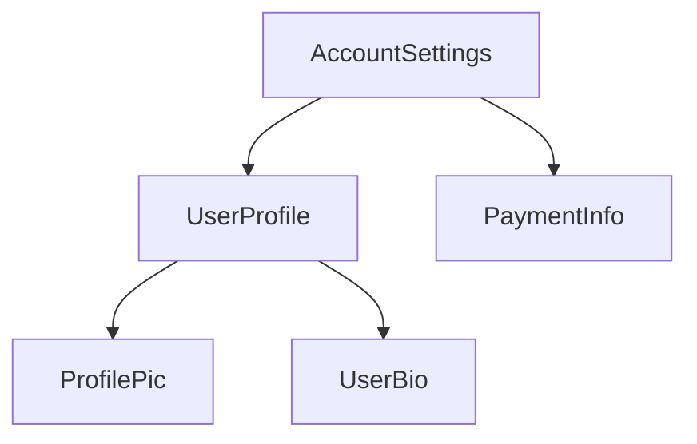

<docs-decorative-header title="Анатомия компонента" imgSrc="adev/src/assets/images/components.svg"> <!-- markdownlint-disable-line -->
</docs-decorative-header>

TIP: В этом руководстве предполагается, что вы уже ознакомились с [Руководством по основам](essentials). Прочитайте его в первую очередь, если вы новичок в Angular.

Каждый компонент должен содержать:

- TypeScript-класс с _поведением_, таким как обработка пользовательского ввода и получение данных с сервера
- HTML-шаблон, который управляет отображением в DOM
- [CSS-селектор](https://developer.mozilla.org/docs/Learn/CSS/Building_blocks/Selectors), определяющий, как компонент используется в HTML

Специфичная для Angular информация о компоненте задается с помощью [декоратора](https://www.typescriptlang.org/docs/handbook/decorators.html) `@Component`, размещаемого над TypeScript-классом:

```angular-ts {highlight: [1, 2, 3, 4]}
@Component({
  selector: 'profile-photo',
  template: ``,
})
export class ProfilePhoto {}
```

Подробную информацию о написании шаблонов Angular, включая привязку данных, обработку событий и поток управления, см. в [Руководстве по шаблонам](guide/templates).

Объект, передаваемый в декоратор `@Component`, называется **метаданными** компонента. Он включает свойства `selector`, `template` и другие, описанные в данном руководстве.

Компоненты могут дополнительно включать список CSS-стилей, применяемых к DOM этого компонента:

```angular-ts {highlight: [4]}
@Component({
  selector: 'profile-photo',
  template: ``,
  styles: `
    img {
      border-radius: 50%;
    }
  `,
})
export class ProfilePhoto {}
```

По умолчанию стили компонента применяются только к элементам, определённым в его шаблоне. Подробнее об подходе Angular к стилизации см. в разделе [Стилизация компонентов](guide/components/styling).

Вы также можете вынести шаблон и стили в отдельные файлы:

```ts {highlight: [3,4]}
@Component({
  selector: 'profile-photo',
  templateUrl: 'profile-photo.html',
  styleUrl: 'profile-photo.css',
})
export class ProfilePhoto {}
```

Это помогает разделить задачи _представления_ и _поведения_ в вашем проекте. Вы можете выбрать один подход для всего проекта или решать для каждого компонента отдельно.

Пути `templateUrl` и `styleUrl` указываются относительно директории, в которой находится компонент.

## Использование компонентов {#using-components}

### Импорты в декораторе `@Component` {#imports-in-the-component-decorator}

Чтобы использовать компонент, [директиву](guide/directives) или [pipe](guide/templates/pipes), необходимо добавить
их в массив `imports` в декораторе `@Component`:

```ts
import {ProfilePhoto} from './profile-photo';

@Component({
  // Import the `ProfilePhoto` component in
  // order to use it in this component's template.
  imports: [ProfilePhoto],
  /* ... */
})
export class UserProfile {}
```

По умолчанию компоненты Angular являются _standalone_, что означает, что вы можете напрямую добавлять их в массив `imports` других компонентов. Компоненты, созданные в более ранних версиях Angular, могут вместо этого указывать `standalone: false` в декораторе `@Component`. Для таких компонентов следует импортировать `NgModule`, в котором они определены. Подробнее см. в [руководстве по NgModule](guide/ngmodules/overview).

Important: В версиях Angular до 19.0.0 параметр `standalone` по умолчанию имеет значение `false`.

### Отображение компонентов в шаблоне {#showing-components-in-a-template}

Каждый компонент определяет [CSS-селектор](https://developer.mozilla.org/docs/Learn/CSS/Building_blocks/Selectors):

```angular-ts {highlight: [2]}
@Component({
  selector: 'profile-photo',
  ...
})
export class ProfilePhoto { }
```

Подробнее о поддерживаемых типах селекторов и рекомендациях по их выбору см. в разделе [Селекторы компонентов](guide/components/selectors).

Для отображения компонента создайте соответствующий HTML-элемент в шаблоне _другого_ компонента:

```angular-ts {highlight: [8]}
@Component({
  selector: 'profile-photo',
})
export class ProfilePhoto {}

@Component({
  imports: [ProfilePhoto],
  template: `<profile-photo />`,
})
export class UserProfile {}
```

Angular создает экземпляр компонента для каждого соответствующего HTML-элемента, который он встречает. DOM-элемент, соответствующий селектору компонента, называется **хост-элементом** этого компонента. Содержимое шаблона компонента отображается внутри его хост-элемента.

DOM, отрисованный компонентом (соответствующий его шаблону), называется **представлением** (view) этого компонента.

Компонуя компоненты таким образом, **вы можете представить ваше Angular-приложение как дерево компонентов**.


```mermaid
flowchart TD
    A[AccountSettings]-->B
    A-->C
    B[UserProfile]-->D
    B-->E
    C[PaymentInfo]
    D[ProfilePic]
    E[UserBio]
```

Эта древовидная структура важна для понимания ряда других концепций Angular, включая [внедрение зависимостей](guide/di) и [дочерние запросы](guide/components/queries).
