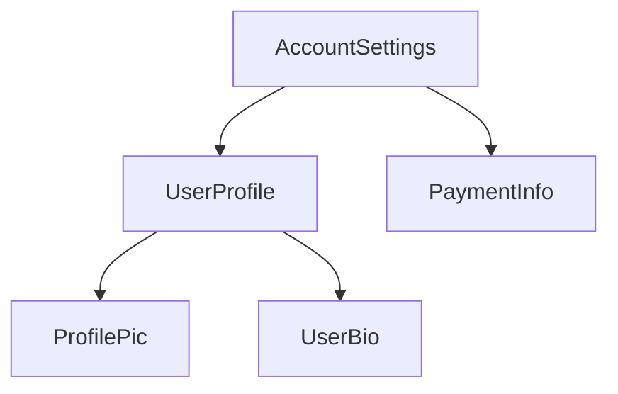

<docs-decorative-header title="Анатомия компонента" imgSrc="adev/src/assets/images/components.svg"> <!-- markdownlint-disable-line -->
</docs-decorative-header>

СОВЕТ: Это руководство предполагает, что вы уже ознакомились с [Руководством по основам](essentials). Прочитайте его в первую очередь, если вы новичок в Angular.

Каждый компонент должен содержать:

- Класс TypeScript с _поведением_, например обработку пользовательского ввода и получение данных с сервера
- HTML-шаблон, управляющий тем, что рендерится в DOM
- [CSS-селектор](https://developer.mozilla.org/docs/Learn/CSS/Building_blocks/Selectors), определяющий, как компонент используется в HTML

Специфичная для Angular информация о компоненте задаётся добавлением декоратора `@Component` на класс TypeScript:

```angular-ts {highlight: [1, 2, 3, 4]}
@Component({
  selector: 'profile-photo',
  template: ``,
})
export class ProfilePhoto {}
```

Подробное описание синтаксиса Angular-шаблонов, включая привязки данных, обработку событий и управление потоком, см. в [Руководстве по шаблонам](guide/templates).

Объект, передаваемый декоратору `@Component`, называется **метаданными** компонента. В него входят `selector`, `template` и другие свойства, описанные в этом руководстве.

Компоненты могут опционально включать список CSS-стилей, применяемых к DOM этого компонента:

```angular-ts {highlight: [4]}
@Component({
  selector: 'profile-photo',
  template: ``,
  styles: `
    img {
      border-radius: 50%;
    }
  `,
})
export class ProfilePhoto {}
```

По умолчанию стили компонента применяются только к элементам, определённым в его шаблоне. Подробнее см. в разделе [Стилизация компонентов](guide/components/styling).

Также можно вынести шаблон и стили в отдельные файлы:

```ts {highlight: [3,4]}
@Component({
  selector: 'profile-photo',
  templateUrl: 'profile-photo.html',
  styleUrl: 'profile-photo.css',
})
export class ProfilePhoto {}
```

Это помогает разделить _представление_ и _поведение_ в вашем проекте. Можно выбрать один подход для всего проекта или решать это для каждого компонента отдельно.

Пути в `templateUrl` и `styleUrl` указываются относительно директории, в которой находится компонент.

## Использование компонентов {#using-components}

### Импорты в декораторе `@Component` {#imports-in-the-component-decorator}

Чтобы использовать компонент, [директиву](guide/directives) или [Pipe](guide/templates/pipes), необходимо добавить
его в массив `imports` декоратора `@Component`:

```ts
import {ProfilePhoto} from './profile-photo';

@Component({
  // Import the `ProfilePhoto` component in
  // order to use it in this component's template.
  imports: [ProfilePhoto],
  /* ... */
})
export class UserProfile {}
```

По умолчанию Angular-компоненты являются _standalone_, то есть их можно напрямую добавить в массив `imports` других компонентов. Компоненты, созданные в более ранних версиях Angular, могут иметь `standalone: false` в своём декораторе `@Component`. Для таких компонентов вместо этого импортируется `NgModule`, в котором определён компонент. Подробнее см. в [Руководстве по NgModule](guide/ngmodules/overview).

Важно: в версиях Angular до 19.0.0 опция `standalone` по умолчанию имеет значение `false`.

### Отображение компонентов в шаблоне {#showing-components-in-a-template}

Каждый компонент определяет [CSS-селектор](https://developer.mozilla.org/docs/Learn/CSS/Building_blocks/Selectors):

```angular-ts {highlight: [2]}
@Component({
  selector: 'profile-photo',
  ...
})
export class ProfilePhoto { }
```

Подробнее о поддерживаемых типах селекторов и рекомендациях по их выбору см. в разделе [Селекторы компонентов](guide/components/selectors).

Компонент отображается путём создания соответствующего HTML-элемента в шаблоне _другого_ компонента:

```angular-ts {highlight: [8]}
@Component({
  selector: 'profile-photo',
})
export class ProfilePhoto {}

@Component({
  imports: [ProfilePhoto],
  template: `<profile-photo />`,
})
export class UserProfile {}
```

Angular создаёт экземпляр компонента для каждого совпадающего HTML-элемента. DOM-элемент, соответствующий селектору компонента, называется **host-элементом** этого компонента. Содержимое шаблона компонента рендерится внутри его host-элемента.

DOM, отрисованный компонентом согласно его шаблону, называется **представлением (view)** компонента.

При такой компоновке компонентов **можно представить Angular-приложение как дерево компонентов**.


```mermaid
flowchart TD
    A[AccountSettings]-->B
    A-->C
    B[UserProfile]-->D
    B-->E
    C[PaymentInfo]
    D[ProfilePic]
    E[UserBio]
```

Эта древовидная структура важна для понимания ряда других концепций Angular, включая [внедрение зависимостей](guide/di) и [дочерние запросы](guide/components/queries).
