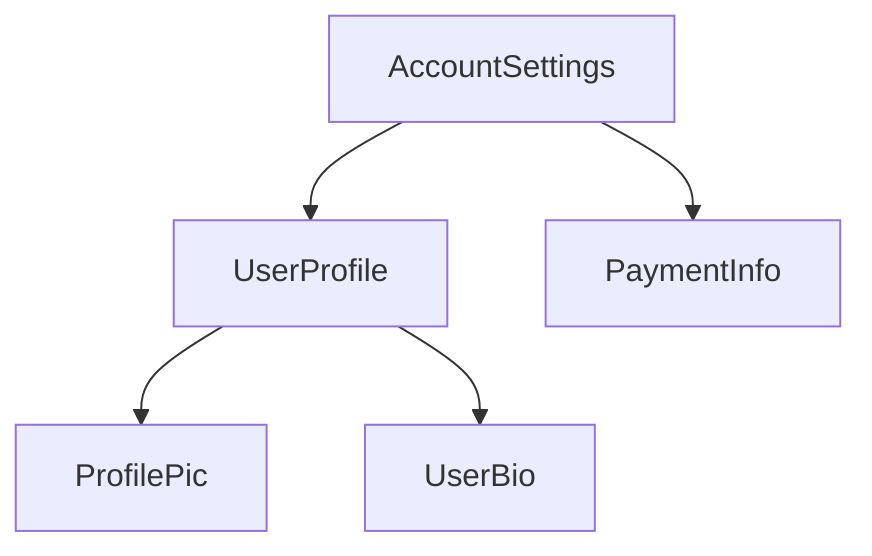

<docs-decorative-header title="Анатомия компонента" imgSrc="adev/src/assets/images/components.svg"> <!-- markdownlint-disable-line -->
</docs-decorative-header>

TIP: Это руководство предполагает, что вы уже прочитали [Essentials Guide](essentials). Если вы новичок в Angular, начните с него.

У каждого компонента должны быть:

- Класс TypeScript с _поведением_ — обработка пользовательского ввода, получение данных с сервера и т.п.
- HTML-шаблон, который управляет тем, что рендерится в DOM
- [CSS selector](https://developer.mozilla.org/docs/Learn/CSS/Building_blocks/Selectors), определяющий, как компонент используется в HTML

Angular-специфичную информацию для компонента вы задаёте, добавляя [декоратор](https://www.typescriptlang.org/docs/handbook/decorators.html) `@Component` над классом TypeScript:

```angular-ts {highlight: [1, 2, 3, 4]}
@Component({
  selector: 'profile-photo',
  template: ``,
})
export class ProfilePhoto {}
```

Полные детали написания шаблонов Angular — включая привязку данных, обработку событий и control flow — см. в [руководстве по шаблонам](guide/templates).

Объект, передаваемый в декоратор `@Component`, называется **метаданными** компонента. Он включает `selector`, `template` и другие свойства, описанные в этом руководстве.

Компоненты опционально могут включать список CSS-стилей, применяемых к DOM этого компонента:

```angular-ts {highlight: [4]}
@Component({
  selector: 'profile-photo',
  template: ``,
  styles: `
    img {
      border-radius: 50%;
    }
  `,
})
export class ProfilePhoto {}
```

По умолчанию стили компонента влияют только на элементы, определённые в шаблоне этого компонента. Подробнее о подходе Angular к стилизации — в [Styling Components](guide/components/styling).

Альтернативно можно писать шаблон и стили в отдельных файлах:

```ts {highlight: [3,4]}
@Component({
  selector: 'profile-photo',
  templateUrl: 'profile-photo.html',
  styleUrl: 'profile-photo.css',
})
export class ProfilePhoto {}
```

Это помогает разделить заботы _presentation_ и _behavior_ в проекте. Можно выбрать один подход для всего проекта или решать для каждого компонента отдельно.

И `templateUrl`, и `styleUrl` относительны к директории, в которой находится компонент.

## Использование компонентов {#using-components}

### Imports в декораторе `@Component` {#imports-in-the-component-decorator}

Чтобы использовать компонент, [директиву](guide/directives) или [pipe](guide/templates/pipes), нужно добавить
их в массив `imports` в декораторе `@Component`:

```ts
import {ProfilePhoto} from './profile-photo';

@Component({
  // Import the `ProfilePhoto` component in
  // order to use it in this component's template.
  imports: [ProfilePhoto],
  /* ... */
})
export class UserProfile {}
```

По умолчанию компоненты Angular — _standalone_, то есть их можно напрямую добавлять в массив `imports` других компонентов. Компоненты, созданные в более ранней версии Angular, могут вместо этого указывать `standalone: false` в декораторе `@Component`. Для таких компонентов импортируйте `NgModule`, в котором определён компонент. Подробности — в полном [руководстве по `NgModule`](guide/ngmodules/overview).

IMPORTANT: В версиях Angular до 19.0.0 опция `standalone` по умолчанию равна `false`.

### Показ компонентов в шаблоне {#showing-components-in-a-template}

Каждый компонент определяет [CSS selector](https://developer.mozilla.org/docs/Learn/CSS/Building_blocks/Selectors):

```angular-ts {highlight: [2]}
@Component({
  selector: 'profile-photo',
  ...
})
export class ProfilePhoto { }
```

Подробнее о типах selectors, которые поддерживает Angular, и рекомендации по выбору — в [Component Selectors](guide/components/selectors).

Компонент показывают, создавая соответствующий HTML-элемент в шаблоне _других_ компонентов:

```angular-ts {highlight: [8]}
@Component({
  selector: 'profile-photo',
})
export class ProfilePhoto {}

@Component({
  imports: [ProfilePhoto],
  template: `<profile-photo />`,
})
export class UserProfile {}
```

Angular создаёт экземпляр компонента для каждого подходящего HTML-элемента. DOM-элемент, соответствующий selector компонента, называется **host-элементом** этого компонента. Содержимое шаблона компонента рендерится внутри его host-элемента.

DOM, отрендеренный компонентом и соответствующий шаблону этого компонента, называется
**view** компонента.

Компонуя компоненты таким образом, **можно думать о Angular-приложении как о дереве компонентов**.


```mermaid
flowchart TD
    A[AccountSettings]-->B
    A-->C
    B[UserProfile]-->D
    B-->E
    C[PaymentInfo]
    D[ProfilePic]
    E[UserBio]
```

Эта древовидная структура важна для понимания ряда других концепций Angular, включая [внедрение зависимостей](guide/di) и [child queries](guide/components/queries).
