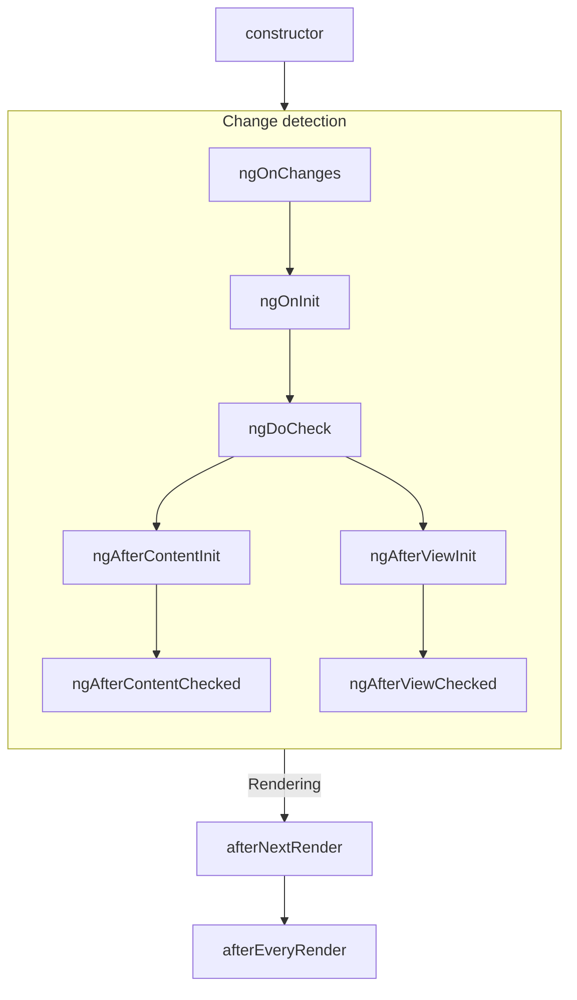
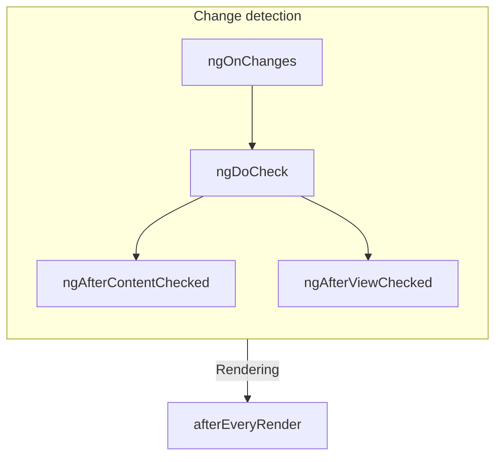

# Component Lifecycle

TIP: This guide assumes you've already read the [Essentials Guide](essentials). Read that first if you're new to Angular.

A component's **lifecycle** is the sequence of steps that happen between the component's creation
and its destruction. Each step represents a different part of Angular's process for rendering
components and checking them for updates over time.

In your components, you can implement **lifecycle hooks** to run code during these steps.
Lifecycle hooks that relate to a specific component instance are implemented as methods on your
component class. Lifecycle hooks that relate the Angular application as a whole are implemented
as functions that accept a callback.

A component's lifecycle is tightly connected to how Angular checks your components for changes over
time. For the purposes of understanding this lifecycle, you only need to know that Angular walks
your application tree from top to bottom, checking template bindings for changes. The lifecycle
hooks described below run while Angular is doing this traversal. This traversal visits each
component exactly once, so you should always avoid making further state changes in the middle of the
process.

## Summary

<div class="docs-table docs-scroll-track-transparent">
  <table>
    <tr>
      <td><strong>Phase</strong></td>
      <td><strong>Method</strong></td>
      <td><strong>Summary</strong></td>
    </tr>
    <tr>
      <td>Creation</td>
      <td><code>constructor</code></td>
      <td>
        <a href="https://developer.mozilla.org/docs/Web/JavaScript/Reference/Classes/constructor" target="_blank">
          Standard JavaScript class constructor
        </a>. Runs when Angular instantiates the component.
      </td>
    </tr>
    <tr>
      <td rowspan="7">Change<p>Detection</td>
      <td><code>ngOnInit</code>
      </td>
      <td>Runs once after Angular has initialized all the component's inputs.</td>
    </tr>
    <tr>
      <td><code>ngOnChanges</code></td>
      <td>Runs every time the component's inputs have changed.</td>
    </tr>
    <tr>
      <td><code>ngDoCheck</code></td>
      <td>Runs every time this component is checked for changes.</td>
    </tr>
    <tr>
      <td><code>ngAfterContentInit</code></td>
      <td>Runs once after the component's <em>content</em> has been initialized.</td>
    </tr>
    <tr>
      <td><code>ngAfterContentChecked</code></td>
      <td>Runs every time this component content has been checked for changes.</td>
    </tr>
    <tr>
      <td><code>ngAfterViewInit</code></td>
      <td>Runs once after the component's <em>view</em> has been initialized.</td>
    </tr>
    <tr>
      <td><code>ngAfterViewChecked</code></td>
      <td>Runs every time the component's view has been checked for changes.</td>
    </tr>
    <tr>
      <td rowspan="2">Rendering</td>
      <td><code>afterNextRender</code></td>
      <td>Runs once the next time that <strong>all</strong> components have been rendered to the DOM.</td>
    </tr>
    <tr>
      <td><code>afterEveryRender</code></td>
      <td>Runs every time <strong>all</strong> components have been rendered to the DOM.</td>
    </tr>
    <tr>
      <td>Destruction</td>
      <td><code>ngOnDestroy</code></td>
      <td>Runs once before the component is destroyed.</td>
    </tr>
  </table>
</div>

### ngOnInit

The `ngOnInit` method runs after Angular has initialized all the components inputs with their
initial values. A component's `ngOnInit` runs exactly once.

This step happens _before_ the component's own template is initialized. This means that you can
update the component's state based on its initial input values.

### ngOnChanges

The `ngOnChanges` method runs after any component inputs have changed.

This step happens _before_ the component's own template is checked. This means that you can update
the component's state based on its initial input values.

During initialization, the first `ngOnChanges` runs before `ngOnInit`.

#### Inspecting changes

The `ngOnChanges` method accepts one `SimpleChanges` argument. This object is
a [`Record`](https://www.typescriptlang.org/docs/handbook/utility-types.html#recordkeys-type)
mapping each component input name to a `SimpleChange` object. Each `SimpleChange` contains the
input's previous value, its current value, and a flag for whether this is the first time the input
has changed.

```ts
@Component({
  /* ... */
})
export class UserProfile {
  name = input('');

  ngOnChanges(changes: SimpleChanges) {
    for (const inputName in changes) {
      const inputValues = changes[inputName];
      console.log(`Previous ${inputName} == ${inputValues.previousValue}`);
      console.log(`Current ${inputName} == ${inputValues.currentValue}`);
      console.log(`Is first ${inputName} change == ${inputValues.firstChange}`);
    }
  }
}
```

If you provide an `alias` for any input properties, the `SimpleChanges` Record still uses the
TypeScript property name as a key, rather than the alias.

### ngOnDestroy

The `ngOnDestroy` method runs once just before a component is destroyed. Angular destroys a
component when it is no longer shown on the page, such as being hidden by `@if` or upon navigating
to another page.

#### DestroyRef

As an alternative to the `ngOnDestroy` method, you can inject an instance of `DestroyRef`. You can
register a callback to be invoked upon the component's destruction by calling the `onDestroy` method
of `DestroyRef`.

```ts
@Component({
  /* ... */
})
export class UserProfile {
  constructor() {
    inject(DestroyRef).onDestroy(() => {
      console.log('UserProfile destruction');
    });
  }
}
```

You can pass the `DestroyRef` instance to functions or classes outside your component. Use this
pattern if you have other code that should run some cleanup behavior when the component is
destroyed.

You can also use `DestroyRef` to keep setup code close to cleanup code, rather than putting
all cleanup code in the `ngOnDestroy` method.

### ngDoCheck

The `ngDoCheck` method runs before every time Angular checks a component's template for changes.

You can use this lifecycle hook to manually check for state changes outside of Angular's normal
change detection, manually updating the component's state.

This method runs very frequently and can significantly impact your page's performance. Avoid
defining this hook whenever possible, only using it when you have no alternative.

During initialization, the first `ngDoCheck` runs after `ngOnInit`.

### ngAfterContentInit

The `ngAfterContentInit` method runs once after all the children nested inside the component (its
_content_) have been initialized.

You can use this lifecycle hook to read the results of
[content queries](guide/components/queries#content-queries). While you can access the initialized
state of these queries, attempting to change any state in this method results in an
[ExpressionChangedAfterItHasBeenCheckedError](errors/NG0100)

### ngAfterContentChecked

The `ngAfterContentChecked` method runs every time the children nested inside the component (its
_content_) have been checked for changes.

This method runs very frequently and can significantly impact your page's performance. Avoid
defining this hook whenever possible, only using it when you have no alternative.

While you can access the updated state
of [content queries](guide/components/queries#content-queries) here, attempting to
change any state in this method results in
an [ExpressionChangedAfterItHasBeenCheckedError](errors/NG0100).

### ngAfterViewInit

The `ngAfterViewInit` method runs once after all the children in the component's template (its
_view_) have been initialized.

You can use this lifecycle hook to read the results of
[view queries](guide/components/queries#view-queries). While you can access the initialized state of
these queries, attempting to change any state in this method results in an
[ExpressionChangedAfterItHasBeenCheckedError](errors/NG0100)

### ngAfterViewChecked

The `ngAfterViewChecked` method runs every time the children in the component's template (its
_view_) have been checked for changes.

This method runs very frequently and can significantly impact your page's performance. Avoid
defining this hook whenever possible, only using it when you have no alternative.

While you can access the updated state of [view queries](guide/components/queries#view-queries)
here, attempting to
change any state in this method results in
an [ExpressionChangedAfterItHasBeenCheckedError](errors/NG0100).

### afterEveryRender and afterNextRender

The `afterEveryRender` and `afterNextRender` functions let you register a **render callback** to be
invoked after Angular has finished rendering _all components_ on the page into the DOM.

These functions are different from the other lifecycle hooks described in this guide. Rather than a
class method, they are standalone functions that accept a callback. The execution of render
callbacks are not tied to any specific component instance, but instead an application-wide hook.

`afterEveryRender` and `afterNextRender` must be called in
an [injection context](guide/di/dependency-injection-context), typically a
component's constructor.

You can use render callbacks to perform manual DOM operations.
See [Using DOM APIs](guide/components/dom-apis) for guidance on working with the DOM in Angular.

Render callbacks do not run during server-side rendering or during build-time pre-rendering.

#### after*Render phases

When using `afterEveryRender` or `afterNextRender`, you can optionally split the work into phases. The
phase gives you control over the sequencing of DOM operations, letting you sequence _write_
operations before _read_ operations in order to minimize
[layout thrashing](https://web.dev/avoid-large-complex-layouts-and-layout-thrashing). In order to
communicate across phases, a phase function may return a result value that can be accessed in the
next phase.

```ts
import {Component, ElementRef, afterNextRender} from '@angular/core';

@Component({...})
export class UserProfile {
  private prevPadding = 0;
  private elementHeight = 0;

  constructor() {
    private elementRef = inject(ElementRef);
    const nativeElement = elementRef.nativeElement;

    afterNextRender({
      // Use the `Write` phase to write to a geometric property.
      write: () => {
        const padding = computePadding();
        const changed = padding !== this.prevPadding;
        if (changed) {
          nativeElement.style.padding = padding;
        }
        return changed; // Communicate whether anything changed to the read phase.
      },

      // Use the `Read` phase to read geometric properties after all writes have occurred.
      read: (didWrite) => {
        if (didWrite) {
          this.elementHeight = nativeElement.getBoundingClientRect().height;
        }
      }
    });
  }
}
```

There are four phases, run in the following order:

| Phase            | Description                                                                                                                                                                                           |
| ---------------- | ----------------------------------------------------------------------------------------------------------------------------------------------------------------------------------------------------- |
| `earlyRead`      | Use this phase to read any layout-affecting DOM properties and styles that are strictly necessary for subsequent calculation. Avoid this phase if possible, preferring the `write` and `read` phases. |
| `mixedReadWrite` | Default phase. Use for any operations need to both read and write layout-affecting properties and styles. Avoid this phase if possible, preferring the explicit `write` and `read` phases.            |
| `write`          | Use this phase to write layout-affecting DOM properties and styles.                                                                                                                                   |
| `read`           | Use this phase to read any layout-affecting DOM properties.                                                                                                                                           |

## Lifecycle interfaces

Angular provides a TypeScript interface for each lifecycle method. You can optionally import
and `implement` these interfaces to ensure that your implementation does not have any typos or
misspellings.

Each interface has the same name as the corresponding method without the `ng` prefix. For example,
the interface for `ngOnInit` is `OnInit`.

```ts
@Component({
  /* ... */
})
export class UserProfile implements OnInit {
  ngOnInit() {
    /* ... */
  }
}
```

## Execution order

The following diagrams show the execution order of Angular's lifecycle hooks.

### During initialization



### Subsequent updates



### Ordering with directives

When you put one or more directives on the same element as a component, either in a template or with
the `hostDirectives` property, the framework does not guarantee any ordering of a given lifecycle
hook between the component and the directives on a single element. Never depend on an observed
ordering, as this may change in later versions of Angular.
