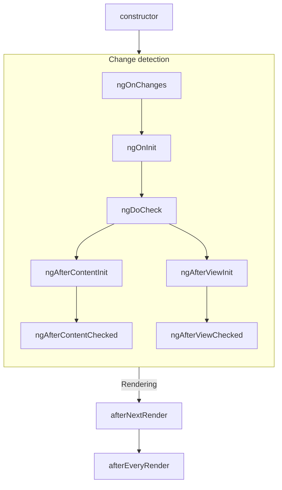
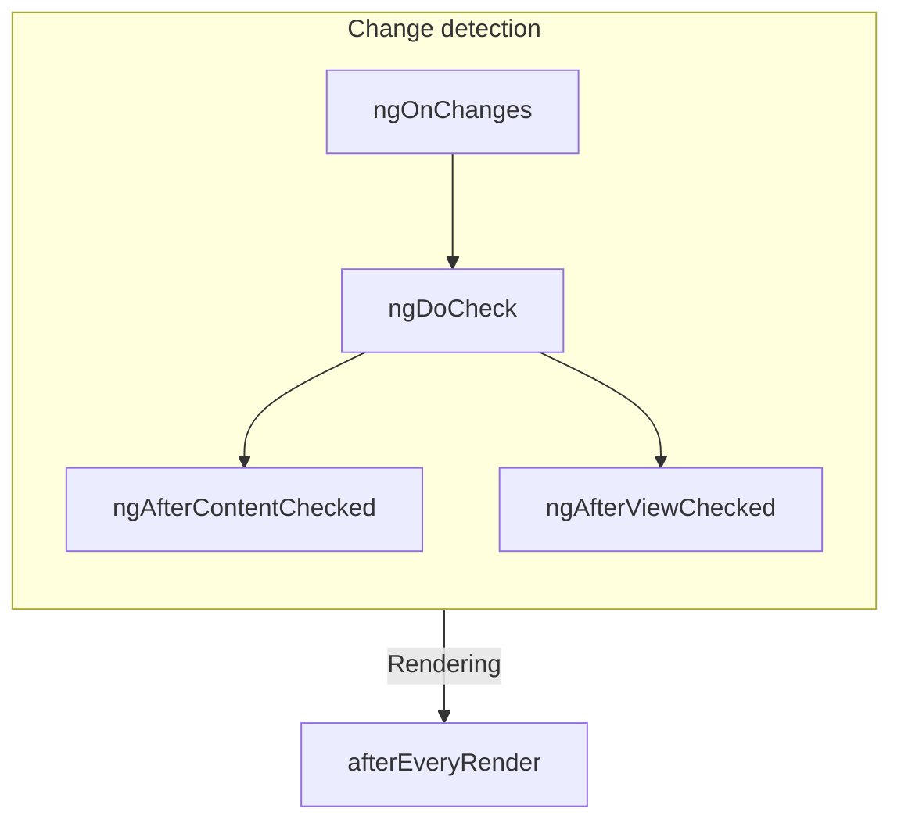

# Жизненный цикл компонента

TIP: Это руководство предполагает, что вы уже прочитали [Essentials Guide](essentials). Прочитайте его сначала, если вы новичок в Angular.

**Жизненный цикл** компонента — последовательность шагов между созданием компонента
и его уничтожением. Каждый шаг представляет разную часть процесса Angular по отрисовке
компонентов и проверке их на обновления со временем.

В компонентах можно реализовать **lifecycle hooks** для выполнения кода во время этих шагов.
Lifecycle hooks, относящиеся к конкретному экземпляру компонента, реализуются как методы на
классе компонента. Lifecycle hooks, относящиеся к приложению Angular в целом, реализуются
как функции, принимающие callback.

Жизненный цикл компонента тесно связан с тем, как Angular проверяет компоненты на изменения со
временем. Для понимания этого жизненного цикла достаточно знать, что Angular обходит
дерево приложения сверху вниз, проверяя template bindings на изменения. Lifecycle
hooks, описанные ниже, выполняются, пока Angular делает этот обход. Этот обход посещает каждый
компонент ровно один раз, поэтому всегда следует избегать дальнейших изменений состояния в середине
процесса.

## Сводка {#summary}

<div class="docs-table docs-scroll-track-transparent">
  <table>
    <tr>
      <td><strong>Фаза</strong></td>
      <td><strong>Метод</strong></td>
      <td><strong>Сводка</strong></td>
    </tr>
    <tr>
      <td>Creation</td>
      <td><code>constructor</code></td>
      <td>
        <a href="https://developer.mozilla.org/docs/Web/JavaScript/Reference/Classes/constructor" target="_blank">
          Стандартный конструктор класса JavaScript
        </a>. Выполняется, когда Angular создаёт экземпляр компонента.
      </td>
    </tr>
    <tr>
      <td rowspan="7">Change<p>Detection</td>
      <td><code>ngOnInit</code>
      </td>
      <td>Выполняется один раз после того, как Angular инициализировал все inputs компонента.</td>
    </tr>
    <tr>
      <td><code>ngOnChanges</code></td>
      <td>Выполняется каждый раз, когда inputs компонента изменились.</td>
    </tr>
    <tr>
      <td><code>ngDoCheck</code></td>
      <td>Выполняется каждый раз, когда этот компонент проверяется на изменения.</td>
    </tr>
    <tr>
      <td><code>ngAfterContentInit</code></td>
      <td>Выполняется один раз после инициализации <em>content</em> компонента.</td>
    </tr>
    <tr>
      <td><code>ngAfterContentChecked</code></td>
      <td>Выполняется каждый раз, когда content этого компонента проверен на изменения.</td>
    </tr>
    <tr>
      <td><code>ngAfterViewInit</code></td>
      <td>Выполняется один раз после инициализации <em>view</em> компонента.</td>
    </tr>
    <tr>
      <td><code>ngAfterViewChecked</code></td>
      <td>Выполняется каждый раз, когда view компонента проверен на изменения.</td>
    </tr>
    <tr>
      <td rowspan="2">Rendering</td>
      <td><code>afterNextRender</code></td>
      <td>Выполняется один раз в следующий раз, когда <strong>все</strong> компоненты отрисованы в DOM.</td>
    </tr>
    <tr>
      <td><code>afterEveryRender</code></td>
      <td>Выполняется каждый раз, когда <strong>все</strong> компоненты отрисованы в DOM.</td>
    </tr>
    <tr>
      <td>Destruction</td>
      <td><code>ngOnDestroy</code></td>
      <td>Выполняется один раз перед уничтожением компонента.</td>
    </tr>
  </table>
</div>

### ngOnInit {#ngoninit}

Метод `ngOnInit` выполняется после того, как Angular инициализировал все inputs компонента их
начальными значениями. `ngOnInit` компонента выполняется ровно один раз.

Этот шаг происходит _до_ инициализации собственного шаблона компонента. Это значит, что можно
обновить состояние компонента на основе его начальных значений inputs.

### ngOnChanges {#ngonchanges}

Метод `ngOnChanges` выполняется после изменения любых inputs компонента.

Этот шаг происходит _до_ проверки собственного шаблона компонента. Это значит, что можно обновить
состояние компонента на основе его начальных значений inputs.

Во время инициализации первый `ngOnChanges` выполняется до `ngOnInit`.

#### Просмотр изменений {#inspecting-changes}

Метод `ngOnChanges` принимает один аргумент `SimpleChanges`. Этот объект —
[`Record`](https://www.typescriptlang.org/docs/handbook/utility-types.html#recordkeys-type),
сопоставляющий каждое имя input компонента с объектом `SimpleChange`. Каждый `SimpleChange` содержит
предыдущее значение input, его текущее значение и флаг, является ли это первым изменением input.

Можно опционально передать текущий класс или this как первый generic-аргумент для более строгой проверки типов.

```ts
@Component({
  /* ... */
})
export class UserProfile {
  name = input('');

  ngOnChanges(changes: SimpleChanges<UserProfile>) {
    if (changes.name) {
      console.log(`Previous: ${changes.name.previousValue}`);
      console.log(`Current: ${changes.name.currentValue}`);
      console.log(`Is first ${changes.name.firstChange}`);
    }
  }
}
```

Если предоставить `alias` для любых input-свойств, `SimpleChanges` Record всё равно использует
имя свойства TypeScript как ключ, а не алиас.

### ngOnDestroy {#ngondestroy}

Метод `ngOnDestroy` выполняется один раз непосредственно перед уничтожением компонента. Angular уничтожает
компонент, когда он больше не показывается на странице — например, скрыт `@if` или при навигации
на другую страницу.

#### DestroyRef {#destroyref}

Как альтернативу методу `ngOnDestroy` можно внедрить экземпляр `DestroyRef`. Можно
зарегистрировать callback для вызова при уничтожении компонента, вызвав метод `onDestroy`
у `DestroyRef`.

```ts
@Component({
  /* ... */
})
export class UserProfile {
  constructor() {
    inject(DestroyRef).onDestroy(() => {
      console.log('UserProfile destruction');
    });
  }
}
```

Можно передать экземпляр `DestroyRef` функциям или классам вне компонента. Используйте этот
паттерн, если есть другой код, который должен выполнить cleanup-поведение при уничтожении
компонента.

Также можно использовать `DestroyRef`, чтобы держать setup-код рядом с cleanup-кодом, вместо того чтобы помещать
весь cleanup-код в метод `ngOnDestroy`.

##### Обнаружение уничтожения экземпляра {#detecting-instance-destruction}

`DestroyRef` предоставляет свойство `destroyed`, позволяющее проверить, был ли данный экземпляр уже уничтожен. Это полезно для избежания операций на уничтоженных компонентах, особенно при работе с отложенной или асинхронной логикой.

Проверяя `destroyRef.destroyed`, можно предотвратить выполнение кода после очистки экземпляра, избегая потенциальных ошибок вроде `NG0911: View has already been destroyed.`.

### ngDoCheck {#ngdocheck}

Метод `ngDoCheck` выполняется перед каждым разом, когда Angular проверяет шаблон компонента на изменения.

Можно использовать этот lifecycle hook для ручной проверки изменений состояния вне обычного
change detection Angular, вручную обновляя состояние компонента.

Этот метод выполняется очень часто и может существенно влиять на производительность страницы. Избегайте
определения этого hook, когда возможно, используя его только когда нет альтернативы.

Во время инициализации первый `ngDoCheck` выполняется после `ngOnInit`.

### ngAfterContentInit {#ngaftercontentinit}

Метод `ngAfterContentInit` выполняется один раз после инициализации всех детей, вложенных внутрь компонента (его
_content_).

Можно использовать этот lifecycle hook для чтения результатов
[content queries](guide/components/queries#content-queries). Хотя можно получить доступ к инициализированному
состоянию этих queries, попытка изменить любое состояние в этом методе приводит к
[ExpressionChangedAfterItHasBeenCheckedError](errors/NG0100)

### ngAfterContentChecked {#ngaftercontentchecked}

Метод `ngAfterContentChecked` выполняется каждый раз, когда дети, вложенные внутрь компонента (его
_content_), проверены на изменения.

Этот метод выполняется очень часто и может существенно влиять на производительность страницы. Избегайте
определения этого hook, когда возможно, используя его только когда нет альтернативы.

Хотя здесь можно получить доступ к обновлённому состоянию
[content queries](guide/components/queries#content-queries), попытка
изменить любое состояние в этом методе приводит к
[ExpressionChangedAfterItHasBeenCheckedError](errors/NG0100).

### ngAfterViewInit {#ngafterviewinit}

Метод `ngAfterViewInit` выполняется один раз после инициализации всех детей в шаблоне компонента (его
_view_).

Можно использовать этот lifecycle hook для чтения результатов
[view queries](guide/components/queries#view-queries). Хотя можно получить доступ к инициализированному состоянию
этих queries, попытка изменить любое состояние в этом методе приводит к
[ExpressionChangedAfterItHasBeenCheckedError](errors/NG0100)

### ngAfterViewChecked {#ngafterviewchecked}

Метод `ngAfterViewChecked` выполняется каждый раз, когда дети в шаблоне компонента (его
_view_) проверены на изменения.

Этот метод выполняется очень часто и может существенно влиять на производительность страницы. Избегайте
определения этого hook, когда возможно, используя его только когда нет альтернативы.

Хотя здесь можно получить доступ к обновлённому состоянию [view queries](guide/components/queries#view-queries),
попытка
изменить любое состояние в этом методе приводит к
[ExpressionChangedAfterItHasBeenCheckedError](errors/NG0100).

### afterEveryRender и afterNextRender {#aftereveryrender-and-afternextrender}

Функции `afterEveryRender` и `afterNextRender` позволяют зарегистрировать **render callback** для
вызова после того, как Angular закончил отрисовку _всех компонентов_ на странице в DOM.

Эти функции отличаются от других lifecycle hooks, описанных в этом руководстве. Вместо метода
класса это standalone-функции, принимающие callback. Выполнение render
callbacks не привязано к какому-либо конкретному экземпляру компонента, а является application-wide hook.

`afterEveryRender` и `afterNextRender` должны вызываться в
[injection context](guide/di/dependency-injection-context), обычно в
конструкторе компонента.

Можно использовать render callbacks для выполнения ручных DOM-операций.
См. [Using DOM APIs](guide/components/dom-apis) для указаний по работе с DOM в Angular.

Render callbacks не выполняются во время server-side rendering или во время build-time pre-rendering.

#### Фазы after\*Render {#afterrender-phases}

При использовании `afterEveryRender` или `afterNextRender` можно опционально разделить работу на фазы. Фаза
даёт контроль над последовательностью DOM-операций, позволяя упорядочить операции _write_
перед операциями _read_, чтобы минимизировать
[layout thrashing](https://web.dev/avoid-large-complex-layouts-and-layout-thrashing). Чтобы
общаться между фазами, функция фазы может вернуть значение результата, доступное в
следующей фазе.

```ts
import {Component, ElementRef, afterNextRender} from '@angular/core';

@Component(/* ... */)
export class UserProfile {
  private prevPadding = 0;
  private elementHeight = 0;

  constructor() {
    const elementRef = inject(ElementRef);
    const nativeElement = elementRef.nativeElement;

    afterNextRender({
      // Use the `Write` phase to write to a geometric property.
      write: () => {
        const padding = computePadding();
        const changed = padding !== this.prevPadding;
        if (changed) {
          nativeElement.style.padding = padding;
        }
        return changed; // Communicate whether anything changed to the read phase.
      },

      // Use the `Read` phase to read geometric properties after all writes have occurred.
      read: (didWrite) => {
        if (didWrite) {
          this.elementHeight = nativeElement.getBoundingClientRect().height;
        }
      },
    });
  }
}
```

Есть четыре фазы, выполняемые в следующем порядке:

| Фаза             | Описание                                                                                                                                                                                              |
| ---------------- | ----------------------------------------------------------------------------------------------------------------------------------------------------------------------------------------------------- |
| `earlyRead`      | Используйте эту фазу для чтения любых layout-affecting DOM-свойств и стилей, строго необходимых для последующих вычислений. Избегайте этой фазы, если возможно, предпочитая фазы `write` и `read`. |
| `write`          | Используйте эту фазу для записи layout-affecting DOM-свойств и стилей.                                                                                                                                |
| `mixedReadWrite` | Фаза по умолчанию. Используйте для любых операций, которым нужно и читать, и писать layout-affecting свойства и стили. Избегайте этой фазы, если возможно, предпочитая явные фазы `write` и `read`. |
| `read`           | Используйте эту фазу для чтения любых layout-affecting DOM-свойств.                                                                                                                                   |

## Интерфейсы жизненного цикла {#lifecycle-interfaces}

Angular предоставляет TypeScript-интерфейс для каждого метода жизненного цикла. Можно опционально импортировать
и `implement` эти интерфейсы, чтобы гарантировать, что реализация не содержит опечаток или
ошибок написания.

Каждый интерфейс имеет то же имя, что и соответствующий метод без префикса `ng`. Например,
интерфейс для `ngOnInit` — `OnInit`.

```ts
@Component({
  /* ... */
})
export class UserProfile implements OnInit {
  ngOnInit() {
    /* ... */
  }
}
```

## Порядок выполнения {#execution-order}

Следующие диаграммы показывают порядок выполнения lifecycle hooks Angular.

### Во время инициализации {#during-initialization}


```mermaid
graph TD;
id[constructor]-->CHANGE;
subgraph CHANGE [Change detection]
direction TB
ngOnChanges-->ngOnInit;
ngOnInit-->ngDoCheck;
ngDoCheck-->ngAfterContentInit;
ngDoCheck-->ngAfterViewInit
ngAfterContentInit-->ngAfterContentChecked
ngAfterViewInit-->ngAfterViewChecked
end
CHANGE--Rendering-->afterNextRender-->afterEveryRender
```

### Последующие обновления {#subsequent-updates}


```mermaid
graph TD;
subgraph CHANGE [Change detection]
direction TB
ngOnChanges-->ngDoCheck
ngDoCheck-->ngAfterContentChecked;
ngDoCheck-->ngAfterViewChecked
end
CHANGE--Rendering-->afterEveryRender
```

### Упорядочивание с директивами {#ordering-with-directives}

Когда вы помещаете одну или несколько директив на тот же элемент, что и компонент — либо в шаблоне, либо через
свойство `hostDirectives` — фреймворк не гарантирует какой-либо порядок данного lifecycle
hook между компонентом и директивами на одном элементе. Никогда не полагайтесь на наблюдаемый
порядок, так как это может измениться в более поздних версиях Angular.
