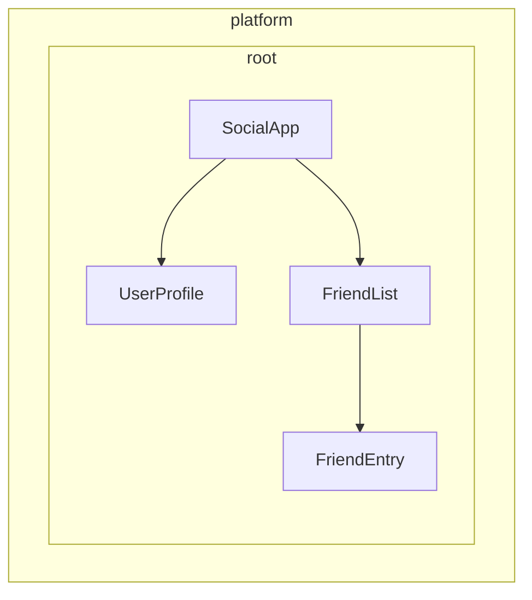

# Defining dependency providers

Angular provides two ways to make services available for injection:

1. **Automatic provision** - Using `providedIn` in the `@Injectable` decorator or by providing a factory in the `InjectionToken` configuration
2. **Manual provision** - Using the `providers` array in components, directives, routes, or application config

In the [previous guide](/guide/di/creating-and-using-services), you learned how to create services using `providedIn: 'root'`, which handles most common use cases. This guide explores additional patterns for both automatic and manual provider configuration.

## Automatic provision for non-class dependencies

While the `@Injectable` decorator with `providedIn: 'root'` works great for services (classes), you might need to provide other types of values globally - like configuration objects, functions, or primitive values. Angular provides `InjectionToken` for this purpose.

### What is an InjectionToken?

An `InjectionToken` is an object that Angular's dependency injection system uses to uniquely identify values for injection. Think of it as a special key that lets you store and retrieve any type of value in Angular's DI system:

```ts
import {InjectionToken} from '@angular/core';

// Create a token for a string value
export const API_URL = new InjectionToken<string>('api.url');

// Create a token for a function
export const LOGGER = new InjectionToken<(msg: string) => void>('logger.function');

// Create a token for a complex type
export interface Config {
  apiUrl: string;
  timeout: number;
}
export const CONFIG_TOKEN = new InjectionToken<Config>('app.config');
```

NOTE: The string parameter (e.g., `'api.url'`) is a description purely for debugging — Angular identifies tokens by their object reference, not this string.

### InjectionToken with `providedIn: 'root'`

An `InjectionToken` that has a `factory` results in `providedIn: 'root'` by default (but can be overidden via the `providedIn` prop).

```ts
// 📁 /app/config.token.ts
import {InjectionToken} from '@angular/core';

export interface AppConfig {
  apiUrl: string;
  version: string;
  features: Record<string, boolean>;
}

// Globally available configuration using providedIn
export const APP_CONFIG = new InjectionToken<AppConfig>('app.config', {
  providedIn: 'root',
  factory: () => ({
    apiUrl: 'https://api.example.com',
    version: '1.0.0',
    features: {
      darkMode: true,
      analytics: false,
    },
  }),
});

// No need to add to providers array - available everywhere!
@Component({
  selector: 'app-header',
  template: `<h1>Version: {{ config.version }}</h1>`,
})
export class Header {
  config = inject(APP_CONFIG); // Automatically available
}
```

### When to use InjectionToken with factory functions

InjectionToken with factory functions is ideal when you can't use a class but need to provide dependencies globally:

```ts
// 📁 /app/logger.token.ts
import {InjectionToken, inject} from '@angular/core';
import {APP_CONFIG} from './config.token';

// Logger function type
export type LoggerFn = (level: string, message: string) => void;

// Global logger function with dependencies
export const LOGGER_FN = new InjectionToken<LoggerFn>('logger.function', {
  providedIn: 'root',
  factory: () => {
    const config = inject(APP_CONFIG);

    return (level: string, message: string) => {
      if (config.features.logging !== false) {
        console[level](`[${new Date().toISOString()}] ${message}`);
      }
    };
  },
});

// 📁 /app/storage.token.ts
// Providing browser APIs as tokens
export const LOCAL_STORAGE = new InjectionToken<Storage>('localStorage', {
  // providedIn: 'root' is configured as the default
  factory: () => window.localStorage,
});

export const SESSION_STORAGE = new InjectionToken<Storage>('sessionStorage', {
  providedIn: 'root',
  factory: () => window.sessionStorage,
});

// 📁 /app/feature-flags.token.ts
// Complex configuration with runtime logic
export const FEATURE_FLAGS = new InjectionToken<Map<string, boolean>>('feature.flags', {
  providedIn: 'root',
  factory: () => {
    const flags = new Map<string, boolean>();

    // Parse from environment or URL params
    const urlParams = new URLSearchParams(window.location.search);
    const enableBeta = urlParams.get('beta') === 'true';

    flags.set('betaFeatures', enableBeta);
    flags.set('darkMode', true);
    flags.set('newDashboard', false);

    return flags;
  },
});
```

This approach offers several advantages:

- **No manual provider configuration needed** - Works just like `providedIn: 'root'` for services
- **Tree-shakeable** - Only included if actually used
- **Type-safe** - Full TypeScript support for non-class values
- **Can inject other dependencies** - Factory functions can use `inject()` to access other services

## Understanding manual provider configuration

When you need more control than `providedIn: 'root'` offers, you can manually configure providers. Manual configuration through the `providers` array is useful when:

1. **The service doesn't have `providedIn`** - Services without automatic provision must be manually provided
2. **You want a new instance** - To create a separate instance at the component/directive level instead of using the shared one
3. **You need runtime configuration** - When service behavior depends on runtime values
4. **You're providing non-class values** - Configuration objects, functions, or primitive values

### Example: Service without `providedIn`

```ts
import {Injectable, Component, inject} from '@angular/core';

// Service without providedIn
@Injectable()
export class LocalDataStore {
  private data: string[] = [];

  addData(item: string) {
    this.data.push(item);
  }
}

// Component must provide it
@Component({
  selector: 'app-example',
  // A provider is required here because the `LocalDataStore` service has no providedIn.
  providers: [LocalDataStore],
  template: `...`,
})
export class Example {
  dataStore = inject(LocalDataStore);
}
```

### Example: Creating component-specific instances

Services with `providedIn: 'root'` can be overridden at the component level. This ties the instance of the service to the life of a component. As a result, when the component gets destroyed, the provided service is also destroyed as well.

```ts
import {Injectable, Component, inject} from '@angular/core';

@Injectable({providedIn: 'root'})
export class DataStore {
  private data: ListItem[] = [];
}

// This component gets its own instance
@Component({
  selector: 'app-isolated',
  // Creates new instance of `DataStore` rather than using the root-provided instance.
  providers: [DataStore],
  template: `...`,
})
export class Isolated {
  dataStore = inject(DataStore); // Component-specific instance
}
```

## Injector hierarchy in Angular

Angular's dependency injection system is hierarchical. When a component requests a dependency, Angular starts with that component's injector and walks up the tree until it finds a provider for that dependency. Each component in your application tree can have its own injector, and these injectors form a hierarchy that mirrors your component tree.

This hierarchy enables:

- **Scoped instances**: Different parts of your app can have different instances of the same service
- **Override behavior**: Child components can override providers from parent components
- **Memory efficiency**: Services are only instantiated where needed

In Angular, any element with a component or directive can provide values to all of its descendants.



In the example above:

1. `SocialApp` can provide values for `UserProfile` and `FriendList`
2. `FriendList` can provide values for injection to `FriendEntry`, but cannot provide values for injection in `UserProfile` because it's not part of the tree

## Declaring a provider

Think of Angular's dependency injection system as a hash map or dictionary. Each provider configuration object defines a key-value pair:

- **Key (Provider identifier)**: The unique identifier you use to request a dependency
- **Value**: What Angular should return when that token is requested

When manually providing dependencies, you typically see this shorthand syntax:

```angular-ts
import {Component} from '@angular/core';
import {LocalService} from './local-service';

@Component({
  selector: 'app-example',
  providers: [LocalService], // Service without providedIn
})
export class Example {}
```

This is actually a shorthand for a more detailed provider configuration:

```ts
{
  // This is the shorthand version
  providers: [LocalService],

  // This is the full version
  providers: [
    { provide: LocalService, useClass: LocalService }
  ]
}
```

### Provider configuration object

Every provider configuration object has two primary parts:

1. **Provider identifier**: The unique key that Angular uses to get the dependency (set via the `provide` property)
2. **Value**: The actual dependency that you want Angular to fetch, configured with different keys based on the desired type:
   - `useClass` - Provides a JavaScript class
   - `useValue` - Provides a static value
   - `useFactory` - Provides a factory function that returns the value
   - `useExisting` - Provides an alias to an existing provider

### Provider identifiers

Provider identifiers allow Angular's dependency injection (DI) system to retrieve a dependency through a unique ID. You can generate provider identifiers in two ways:

1. [Class names](#class-names)
2. [Injection tokens](#injection-tokens)

#### Class names

Class name use the imported class directly as the identifier:

```angular-ts
import {Component} from '@angular/core';
import {LocalService} from './local-service';

@Component({
  selector: 'app-example',
  providers: [{provide: LocalService, useClass: LocalService}],
})
export class Example {
  /* ... */
}
```

The class serves as both the identifier and the implementation, which is why Angular provides the shorthand `providers: [LocalService]`.

#### Injection tokens

Angular provides a built-in [`InjectionToken`](api/core/InjectionToken) class that creates a unique object reference for injectable values or when you want to provide multiple implementations of the same interface.

```ts
// 📁 /app/tokens.ts
import {InjectionToken} from '@angular/core';
import {DataService} from './data-service.interface';

export const DATA_SERVICE_TOKEN = new InjectionToken<DataService>('DataService');
```

NOTE: The string `'DataService'` is a description used purely for debugging purposes. Angular identifies the token by its object reference, not this string.

Use the token in your provider configuration:

```angular-ts
import {Component, inject} from '@angular/core';
import {LocalDataService} from './local-data-service';
import {DATA_SERVICE_TOKEN} from './tokens';

@Component({
  selector: 'app-example',
  providers: [{provide: DATA_SERVICE_TOKEN, useClass: LocalDataService}],
})
export class Example {
  private dataService = inject(DATA_SERVICE_TOKEN);
}
```

#### Can TypeScript interfaces be identifiers for injection?

TypeScript interfaces cannot be used for injection because they don't exist at runtime:

```ts
// ❌ This won't work!
interface DataService {
  getData(): string[];
}

// Interfaces disappear after TypeScript compilation
@Component({
  providers: [
    {provide: DataService, useClass: LocalDataService}, // Error!
  ],
})
export class Example {
  private dataService = inject(DataService); // Error!
}

// ✅ Use InjectionToken instead
export const DATA_SERVICE_TOKEN = new InjectionToken<DataService>('DataService');

@Component({
  providers: [{provide: DATA_SERVICE_TOKEN, useClass: LocalDataService}],
})
export class Example {
  private dataService = inject(DATA_SERVICE_TOKEN); // Works!
}
```

The InjectionToken provides a runtime value that Angular's DI system can use, while still maintaining type safety through TypeScript's generic type parameter.

### Provider value types

#### useClass

`useClass` provides a JavaScript class as a dependency. This is the default when using the shorthand syntax:

```ts
// Shorthand
providers: [DataService];

// Full syntax
providers: [{provide: DataService, useClass: DataService}];

// Different implementation
providers: [{provide: DataService, useClass: MockDataService}];

// Conditional implementation
providers: [
  {
    provide: StorageService,
    useClass: environment.production ? CloudStorageService : LocalStorageService,
  },
];
```

#### Practical example: Logger substitution

You can substitute implementations to extend functionality:

```ts
import {Injectable, Component, inject} from '@angular/core';

// Base logger
@Injectable()
export class Logger {
  log(message: string) {
    console.log(message);
  }
}

// Enhanced logger with timestamp
@Injectable()
export class BetterLogger extends Logger {
  override log(message: string) {
    super.log(`[${new Date().toISOString()}] ${message}`);
  }
}

// Logger that includes user context
@Injectable()
export class EvenBetterLogger extends Logger {
  private userService = inject(UserService);

  override log(message: string) {
    const name = this.userService.user.name;
    super.log(`Message to ${name}: ${message}`);
  }
}

// In your component
@Component({
  selector: 'app-example',
  providers: [
    UserService, // EvenBetterLogger needs this
    {provide: Logger, useClass: EvenBetterLogger},
  ],
})
export class Example {
  private logger = inject(Logger); // Gets EvenBetterLogger instance
}
```

#### useValue

`useValue` provides any JavaScript data type as a static value:

```ts
providers: [
  {provide: API_URL_TOKEN, useValue: 'https://api.example.com'},
  {provide: MAX_RETRIES_TOKEN, useValue: 3},
  {provide: FEATURE_FLAGS_TOKEN, useValue: {darkMode: true, beta: false}},
];
```

IMPORTANT: TypeScript types and interfaces cannot serve as dependency values. They exist only at compile-time.

#### Practical example: Application configuration

A common use case for `useValue` is providing application configuration:

```ts
// Define configuration interface
export interface AppConfig {
  apiUrl: string;
  appTitle: string;
  features: {
    darkMode: boolean;
    analytics: boolean;
  };
}

// Create injection token
export const APP_CONFIG = new InjectionToken<AppConfig>('app.config');

// Define configuration
const appConfig: AppConfig = {
  apiUrl: 'https://api.example.com',
  appTitle: 'My Application',
  features: {
    darkMode: true,
    analytics: false,
  },
};

// Provide in bootstrap
bootstrapApplication(AppComponent, {
  providers: [{provide: APP_CONFIG, useValue: appConfig}],
});

// Use in component
@Component({
  selector: 'app-header',
  template: `<h1>{{ title }}</h1>`,
})
export class Header {
  private config = inject(APP_CONFIG);
  title = this.config.appTitle;
}
```

#### useFactory

`useFactory` provides a function that generates a new value for injection:

```ts
export const loggerFactory = (config: AppConfig) => {
  return new LoggerService(config.logLevel, config.endpoint);
};

providers: [
  {
    provide: LoggerService,
    useFactory: loggerFactory,
    deps: [APP_CONFIG], // Dependencies for the factory function
  },
];
```

You can mark factory dependencies as optional:

```ts
import {Optional} from '@angular/core';

providers: [
  {
    provide: MyService,
    useFactory: (required: RequiredService, optional?: OptionalService) => {
      return new MyService(required, optional || new DefaultService());
    },
    deps: [RequiredService, [new Optional(), OptionalService]],
  },
];
```

#### Practical example: Configuration-based API client

Here's a complete example showing how to use a factory to create a service with runtime configuration:

```ts
// Service that needs runtime configuration
class ApiClient {
  constructor(
    private http: HttpClient,
    private baseUrl: string,
    private rateLimitMs: number,
  ) {}

  async fetchData(endpoint: string) {
    // Apply rate limiting based on user tier
    await this.applyRateLimit();
    return this.http.get(`${this.baseUrl}/${endpoint}`);
  }

  private async applyRateLimit() {
    // Simplified example - real implementation would track request timing
    return new Promise((resolve) => setTimeout(resolve, this.rateLimitMs));
  }
}

// Factory function that configures based on user tier
import {inject} from '@angular/core';
import {HttpClient} from '@angular/common/http';
const apiClientFactory = () => {
  const http = inject(HttpClient);
  const userService = inject(UserService);

  // Assuming userService provides these values
  const baseUrl = userService.getApiBaseUrl();
  const rateLimitMs = userService.getRateLimit();

  return new ApiClient(http, baseUrl, rateLimitMs);
};

// Provider configuration
export const apiClientProvider = {
  provide: ApiClient,
  useFactory: apiClientFactory,
};

// Usage in component
@Component({
  selector: 'app-dashboard',
  providers: [apiClientProvider],
})
export class Dashboard {
  private apiClient = inject(ApiClient);
}
```

#### useExisting

`useExisting` creates an alias for a provider that was already defined. Both tokens return the same instance:

```ts
providers: [
  NewLogger, // The actual service
  {provide: OldLogger, useExisting: NewLogger}, // The alias
];
```

IMPORTANT: Don't confuse `useExisting` with `useClass`. `useClass` creates separate instances, while `useExisting` ensures you get the same singleton instance.

### Multiple providers

Use the `multi: true` flag when multiple providers contribute values to the same token:

```ts
export const INTERCEPTOR_TOKEN = new InjectionToken<Interceptor[]>('interceptors');

providers: [
  {provide: INTERCEPTOR_TOKEN, useClass: AuthInterceptor, multi: true},
  {provide: INTERCEPTOR_TOKEN, useClass: LoggingInterceptor, multi: true},
  {provide: INTERCEPTOR_TOKEN, useClass: RetryInterceptor, multi: true},
];
```

When you inject `INTERCEPTOR_TOKEN`, you'll receive an array containing instances of all three interceptors.

## Where can you specify providers?

Angular offers several levels where you can register providers, each with different implications for scope, lifecycle, and performance:

- [**Application bootstrap**](#application-bootstrap) - Global singletons available everywhere
- [**On an element (component or directive)**](#component-or-directive-providers) - Isolated instances for specific component trees
- [**Route**](#route-providers) - Feature-specific services for lazy-loaded modules

### Application bootstrap

Use application-level providers in `bootstrapApplication` when:

- **The service is used across multiple feature areas** - Services like HTTP clients, logging, or authentication that many parts of your app need
- **You want a true singleton** - One instance shared by the entire application
- **The service has no component-specific configuration** - General-purpose utilities that work the same everywhere
- **You're providing global configuration** - API endpoints, feature flags, or environment settings

```ts
// main.ts
bootstrapApplication(App, {
  providers: [
    {provide: API_BASE_URL, useValue: 'https://api.example.com'},
    {provide: INTERCEPTOR_TOKEN, useClass: AuthInterceptor, multi: true},
    LoggingService, // Used throughout the app
    {provide: ErrorHandler, useClass: GlobalErrorHandler},
  ],
});
```

**Benefits:**

- Single instance reduces memory usage
- Available everywhere without additional setup
- Easier to manage global state

**Drawbacks:**

- Always included in your JavaScript bundle, even if the value is never injected
- Cannot be easily customized per feature
- Harder to test individual components in isolation

#### Why provide during bootstrap instead of using `providedIn: 'root'`?

You might want a provider during bootstrap when:

- The provider has side-effects (e.g., installing the client-side router)
- The provider requires configuration (e.g., routes)
- You're using Angular's `provideSomething` pattern (e.g., `provideRouter`, `provideHttpClient`)

### Component or directive providers

Use component or directive providers when:

- **The service has component-specific state** - Form validators, component-specific caches, or UI state managers
- **You need isolated instances** - Each component needs its own copy of the service
- **The service is only used by one component tree** - Specialized services that don't need global access
- **You're creating reusable components** - Components that should work independently with their own services

```angular-ts
// Specialized form component with its own validation service
@Component({
  selector: 'app-advanced-form',
  providers: [
    FormValidationService, // Each form gets its own validator
    {provide: FORM_CONFIG, useValue: {strictMode: true}},
  ],
})
export class AdvancedForm {}

// Modal component with isolated state management
@Component({
  selector: 'app-modal',
  providers: [
    ModalStateService, // Each modal manages its own state
  ],
})
export class Modal {}
```

**Benefits:**

- Better encapsulation and isolation
- Easier to test components individually
- Multiple instances can coexist with different configurations

**Drawbacks:**

- New instance created for each component (higher memory usage)
- No shared state between components
- Must be provided wherever needed
- Always included in the same JavaScript bundle as the component or directive, even if the value is never injected

NOTE: If multiple directives on the same element provide the same token, one will win, but which one is undefined.

### Route providers

Use route-level providers for:

- **Feature-specific services** - Services only needed for particular routes or feature modules
- **Lazy-loaded module dependencies** - Services that should only load with specific features
- **Route-specific configuration** - Settings that vary by application area

```ts
// routes.ts
export const routes: Routes = [
  {
    path: 'admin',
    providers: [
      AdminService, // Only loaded with admin routes
      {provide: FEATURE_FLAGS, useValue: {adminMode: true}},
    ],
    loadChildren: () => import('./admin/admin.routes'),
  },
  {
    path: 'shop',
    providers: [
      ShoppingCartService, // Isolated shopping state
      PaymentService,
    ],
    loadChildren: () => import('./shop/shop.routes'),
  },
];
```

## Library author patterns

When creating Angular libraries, you often need to provide flexible configuration options for consumers while maintaining clean APIs. Angular's own libraries demonstrate powerful patterns for achieving this.

### The `provide` pattern

Instead of requiring users to manually configure complex providers, library authors can export functions that return provider configurations:

```ts
// 📁 /libs/analytics/src/providers.ts
import {InjectionToken, Provider, inject} from '@angular/core';

// Configuration interface
export interface AnalyticsConfig {
  trackingId: string;
  enableDebugMode?: boolean;
  anonymizeIp?: boolean;
}

// Internal token for configuration
const ANALYTICS_CONFIG = new InjectionToken<AnalyticsConfig>('analytics.config');

// Main service that uses the configuration
export class AnalyticsService {
  private config = inject(ANALYTICS_CONFIG);

  track(event: string, properties?: any) {
    // Implementation using config
  }
}

// Provider function for consumers
export function provideAnalytics(config: AnalyticsConfig): Provider[] {
  return [{provide: ANALYTICS_CONFIG, useValue: config}, AnalyticsService];
}

// Usage in consumer app
// main.ts
bootstrapApplication(App, {
  providers: [
    provideAnalytics({
      trackingId: 'GA-12345',
      enableDebugMode: !environment.production,
    }),
  ],
});
```

### Advanced provider patterns with options

For more complex scenarios, you can combine multiple configuration approaches:

```ts
// 📁 /libs/http-client/src/provider.ts
import {Provider, InjectionToken, inject} from '@angular/core';

// Feature flags for optional functionality
export enum HttpFeatures {
  Interceptors = 'interceptors',
  Caching = 'caching',
  Retry = 'retry',
}

// Configuration interfaces
export interface HttpConfig {
  baseUrl?: string;
  timeout?: number;
  headers?: Record<string, string>;
}

export interface RetryConfig {
  maxAttempts: number;
  delayMs: number;
}

// Internal tokens
const HTTP_CONFIG = new InjectionToken<HttpConfig>('http.config');
const RETRY_CONFIG = new InjectionToken<RetryConfig>('retry.config');
const HTTP_FEATURES = new InjectionToken<Set<HttpFeatures>>('http.features');

// Core service
class HttpClientService {
  private config = inject(HTTP_CONFIG, {optional: true});
  private features = inject(HTTP_FEATURES);

  get(url: string) {
    // Use config and check features
  }
}

// Feature services
class RetryInterceptor {
  private config = inject(RETRY_CONFIG);
  // Retry logic
}

class CacheInterceptor {
  // Caching logic
}

// Main provider function
export function provideHttpClient(config?: HttpConfig, ...features: HttpFeature[]): Provider[] {
  const providers: Provider[] = [
    {provide: HTTP_CONFIG, useValue: config || {}},
    {provide: HTTP_FEATURES, useValue: new Set(features.map((f) => f.kind))},
    HttpClientService,
  ];

  // Add feature-specific providers
  features.forEach((feature) => {
    providers.push(...feature.providers);
  });

  return providers;
}

// Feature configuration functions
export interface HttpFeature {
  kind: HttpFeatures;
  providers: Provider[];
}

export function withInterceptors(...interceptors: any[]): HttpFeature {
  return {
    kind: HttpFeatures.Interceptors,
    providers: interceptors.map((interceptor) => ({
      provide: INTERCEPTOR_TOKEN,
      useClass: interceptor,
      multi: true,
    })),
  };
}

export function withCaching(): HttpFeature {
  return {
    kind: HttpFeatures.Caching,
    providers: [CacheInterceptor],
  };
}

export function withRetry(config: RetryConfig): HttpFeature {
  return {
    kind: HttpFeatures.Retry,
    providers: [{provide: RETRY_CONFIG, useValue: config}, RetryInterceptor],
  };
}

// Consumer usage with multiple features
bootstrapApplication(App, {
  providers: [
    provideHttpClient(
      {baseUrl: 'https://api.example.com'},
      withInterceptors(AuthInterceptor, LoggingInterceptor),
      withCaching(),
      withRetry({maxAttempts: 3, delayMs: 1000}),
    ),
  ],
});
```

### Why use provider functions instead of direct configuration?

Provider functions offer several advantages for library authors:

1. **Encapsulation** - Internal tokens and implementation details remain private
2. **Type safety** - TypeScript ensures correct configuration at compile time
3. **Flexibility** - Easily compose features with `with*` pattern
4. **Future-proofing** - Internal implementation can change without breaking consumers
5. **Consistency** - Aligns with Angular's own patterns (`provideRouter`, `provideHttpClient`, etc.)

This pattern is extensively used in Angular's own libraries and is considered a best practice for library authors who need to provide configurable services.
