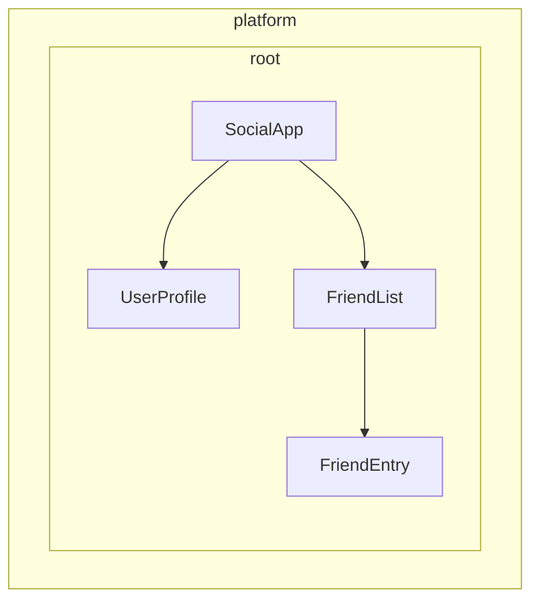

# Определение провайдеров зависимостей

В Angular есть два способа сделать сервисы доступными для внедрения:

1. **Автоматическое предоставление** — через `providedIn` в декораторе `@Injectable`, декоратор [`@Service`](guide/di/creating-and-using-services#using-the-service-vs-injectable-decorator) или фабрику в конфигурации `InjectionToken`
2. **Ручное предоставление** — через массив `providers` в компонентах, директивах, маршрутах или конфигурации приложения

В [предыдущем руководстве](/guide/di/creating-and-using-services) вы узнали, как создавать сервисы с `providedIn: 'root'`, что покрывает большинство типичных сценариев. Здесь рассматриваются дополнительные паттерны автоматической и ручной конфигурации провайдеров.

## Автоматическое предоставление для не-классовых зависимостей {#automatic-provision-for-non-class-dependencies}

Декоратор `@Injectable` с `providedIn: 'root'` отлично подходит для сервисов (классов), но иногда нужно глобально предоставить другие типы значений — объекты конфигурации, функции или примитивы. Для этого Angular предоставляет `InjectionToken`.

### Что такое InjectionToken? {#what-is-an-injectiontoken}

`InjectionToken` — объект, который система внедрения зависимостей Angular использует для уникальной идентификации значений при внедрении. Это специальный ключ для хранения и получения любого типа значения в системе DI:

```ts
import {InjectionToken} from '@angular/core';

// Create a token for a string value
export const API_URL = new InjectionToken<string>('api.url');

// Create a token for a function
export const LOGGER = new InjectionToken<(msg: string) => void>('logger.function');

// Create a token for a complex type
export interface Config {
  apiUrl: string;
  timeout: number;
}
export const CONFIG_TOKEN = new InjectionToken<Config>('app.config');
```

NOTE: Строковый параметр (например, `'api.url'`) — описание только для отладки; Angular идентифицирует токены по ссылке на объект, а не по этой строке.

### InjectionToken с `providedIn: 'root'` {#injectiontoken-with-providedin-root}

У `InjectionToken` с `factory` по умолчанию получается `providedIn: 'root'` (можно переопределить через свойство `providedIn`).

```ts
// 📁 /app/config.token.ts
import {InjectionToken} from '@angular/core';

export interface AppConfig {
  apiUrl: string;
  version: string;
  features: Record<string, boolean>;
}

// Globally available configuration using providedIn
export const APP_CONFIG = new InjectionToken<AppConfig>('app.config', {
  providedIn: 'root',
  factory: () => ({
    apiUrl: 'https://api.example.com',
    version: '1.0.0',
    features: {
      darkMode: true,
      analytics: false,
    },
  }),
});

// No need to add to providers array - available everywhere!
@Component({
  selector: 'app-header',
  template: `<h1>Version: {{ config.version }}</h1>`,
})
export class Header {
  config = inject(APP_CONFIG); // Automatically available
}
```

### Когда использовать InjectionToken с фабричными функциями {#when-to-use-injectiontoken-with-factory-functions}

InjectionToken с фабричными функциями идеален, когда нельзя использовать класс, но нужно предоставить зависимости глобально:

```ts
// 📁 /app/logger.token.ts
import {InjectionToken, inject} from '@angular/core';
import {APP_CONFIG} from './config.token';

// Logger function type
export type LoggerFn = (level: string, message: string) => void;

// Global logger function with dependencies
export const LOGGER_FN = new InjectionToken<LoggerFn>('logger.function', {
  providedIn: 'root',
  factory: () => {
    const config = inject(APP_CONFIG);

    return (level: string, message: string) => {
      if (config.features.logging !== false) {
        console[level](`[${new Date().toISOString()}] ${message}`);
      }
    };
  },
});

// 📁 /app/storage.token.ts
// Providing browser APIs as tokens
export const LOCAL_STORAGE = new InjectionToken<Storage>('localStorage', {
  // providedIn: 'root' is configured as the default
  factory: () => window.localStorage,
});

export const SESSION_STORAGE = new InjectionToken<Storage>('sessionStorage', {
  providedIn: 'root',
  factory: () => window.sessionStorage,
});

// 📁 /app/feature-flags.token.ts
// Complex configuration with runtime logic
export const FEATURE_FLAGS = new InjectionToken<Map<string, boolean>>('feature.flags', {
  providedIn: 'root',
  factory: () => {
    const flags = new Map<string, boolean>();

    // Parse from environment or URL params
    const urlParams = new URLSearchParams(window.location.search);
    const enableBeta = urlParams.get('beta') === 'true';

    flags.set('betaFeatures', enableBeta);
    flags.set('darkMode', true);
    flags.set('newDashboard', false);

    return flags;
  },
});
```

У такого подхода несколько преимуществ:

- **Не нужна ручная конфигурация провайдера** — работает как `providedIn: 'root'` для сервисов
- **Tree-shakeable** — включается только при фактическом использовании
- **Типобезопасность** — полная поддержка TypeScript для не-классовых значений
- **Можно внедрять другие зависимости** — фабрики могут использовать `inject()` для доступа к другим сервисам

## Ручная конфигурация провайдеров {#understanding-manual-provider-configuration}

Когда нужен больший контроль, чем даёт `providedIn: 'root'`, провайдеры настраивают вручную. Ручная конфигурация через массив `providers` полезна, когда:

1. **У сервиса нет `providedIn`** — сервисы без автоматического предоставления нужно регистрировать вручную
2. **Нужен новый экземпляр** — отдельный экземпляр на уровне компонента/директивы вместо общего
3. **Нужна runtime-конфигурация** — поведение сервиса зависит от значений во время выполнения
4. **Предоставляются не-классовые значения** — объекты конфигурации, функции или примитивы

### Пример: сервис без `providedIn` {#example-service-without-providedin}

```ts
import {Injectable, Component, inject} from '@angular/core';

// Service without providedIn
@Injectable()
export class LocalDataStore {
  private data: string[] = [];

  addData(item: string) {
    this.data.push(item);
  }
}

// Component must provide it
@Component({
  selector: 'app-example',
  // A provider is required here because the `LocalDataStore` service has no providedIn.
  providers: [LocalDataStore],
  template: `...`,
})
export class Example {
  dataStore = inject(LocalDataStore);
}
```

### Пример: экземпляры на уровне компонента {#example-creating-component-specific-instances}

Сервисы с `providedIn: 'root'` можно переопределить на уровне компонента. Экземпляр сервиса привязывается к жизни компонента: при уничтожении компонента уничтожается и предоставленный сервис.

```ts
import {Injectable, Component, inject} from '@angular/core';

@Injectable({providedIn: 'root'})
export class DataStore {
  private data: ListItem[] = [];
}

// This component gets its own instance
@Component({
  selector: 'app-isolated',
  // Creates new instance of `DataStore` rather than using the root-provided instance.
  providers: [DataStore],
  template: `...`,
})
export class Isolated {
  dataStore = inject(DataStore); // Component-specific instance
}
```

## Иерархия инжекторов в Angular {#injector-hierarchy-in-angular}

Система внедрения зависимостей Angular иерархична. Когда компонент запрашивает зависимость, Angular начинает с инжектора этого компонента и поднимается по дереву, пока не найдёт провайдер. У каждого компонента в дереве приложения может быть свой инжектор; эти инжекторы образуют иерархию, зеркально отражающую дерево компонентов.

Иерархия позволяет:

- **Область экземпляров**: разные части приложения могут иметь разные экземпляры одного сервиса
- **Переопределение**: дочерние компоненты могут переопределять провайдеры родительских
- **Эффективность памяти**: сервисы создаются только там, где нужны

В Angular любой элемент с компонентом или директивой может предоставлять значения всем своим потомкам.


```mermaid
graph TD
    subgraph platform
        subgraph root
            direction TB
            A[SocialApp] --> B[UserProfile]
            A --> C[FriendList]
            C --> D[FriendEntry]
        end
    end
```

В примере выше:

1. `SocialApp` может предоставлять значения для `UserProfile` и `FriendList`
2. `FriendList` может предоставлять значения для внедрения в `FriendEntry`, но не в `UserProfile`, потому что тот не входит в это поддерево

## Объявление провайдера {#declaring-a-provider}

Систему DI Angular можно представить как хеш-таблицу или словарь. Каждый объект конфигурации провайдера задаёт пару ключ–значение:

- **Ключ (идентификатор провайдера)**: уникальный идентификатор для запроса зависимости
- **Значение**: что Angular должен вернуть при запросе этого токена

При ручном предоставлении зависимостей обычно виден сокращённый синтаксис:

```angular-ts
import {Component} from '@angular/core';
import {LocalService} from './local-service';

@Component({
  selector: 'app-example',
  providers: [LocalService], // Service without providedIn
})
export class Example {}
```

Это сокращение для более подробной конфигурации провайдера:

```ts
{
  // This is the shorthand version
  providers: [LocalService],

  // This is the full version
  providers: [
    { provide: LocalService, useClass: LocalService }
  ]
}
```

### Объект конфигурации провайдера {#provider-configuration-object}

У каждого объекта конфигурации провайдера две основные части:

1. **Идентификатор провайдера**: уникальный ключ, по которому Angular получает зависимость (свойство `provide`)
2. **Значение**: сама зависимость, настраиваемая разными ключами в зависимости от типа:
   - `useClass` — предоставляет класс JavaScript
   - `useValue` — предоставляет статическое значение
   - `useFactory` — предоставляет фабричную функцию, возвращающую значение
   - `useExisting` — предоставляет псевдоним существующего провайдера

### Идентификаторы провайдеров {#provider-identifiers}

Идентификаторы провайдеров позволяют системе DI Angular получать зависимость по уникальному ID. Их можно создать двумя способами:

1. [Имена классов](#class-names)
2. [Injection tokens](#injection-tokens)

#### Имена классов {#class-names}

Имена классов используют импортированный класс напрямую как идентификатор:

```angular-ts
import {Component} from '@angular/core';
import {LocalService} from './local-service';

@Component({
  selector: 'app-example',
  providers: [{provide: LocalService, useClass: LocalService}],
})
export class Example {
  /* ... */
}
```

Класс служит и идентификатором, и реализацией — поэтому Angular предоставляет сокращение `providers: [LocalService]`.

#### Injection tokens {#injection-tokens}

Angular предоставляет встроенный класс [`InjectionToken`](api/core/InjectionToken), создающий уникальную ссылку на объект для внедряемых значений или когда нужно предоставить несколько реализаций одного интерфейса.

```ts
// 📁 /app/tokens.ts
import {InjectionToken} from '@angular/core';
import {DataService} from './data-service.interface';

export const DATA_SERVICE_TOKEN = new InjectionToken<DataService>('DataService');
```

NOTE: Строка `'DataService'` — описание только для отладки. Angular идентифицирует токен по ссылке на объект, а не по этой строке.

Используйте токен в конфигурации провайдера:

```angular-ts
import {Component, inject} from '@angular/core';
import {LocalDataService} from './local-data-service';
import {DATA_SERVICE_TOKEN} from './tokens';

@Component({
  selector: 'app-example',
  providers: [{provide: DATA_SERVICE_TOKEN, useClass: LocalDataService}],
})
export class Example {
  private dataService = inject(DATA_SERVICE_TOKEN);
}
```

#### Могут ли интерфейсы TypeScript быть идентификаторами для внедрения? {#can-typescript-interfaces-be-identifiers-for-injection}

Интерфейсы TypeScript нельзя использовать для внедрения — их нет в runtime:

```ts
// ❌ This won't work!
interface DataService {
  getData(): string[];
}

// Interfaces disappear after TypeScript compilation
@Component({
  providers: [
    {provide: DataService, useClass: LocalDataService}, // Error!
  ],
})
export class Example {
  private dataService = inject(DataService); // Error!
}

// ✅ Use InjectionToken instead
export const DATA_SERVICE_TOKEN = new InjectionToken<DataService>('DataService');

@Component({
  providers: [{provide: DATA_SERVICE_TOKEN, useClass: LocalDataService}],
})
export class Example {
  private dataService = inject(DATA_SERVICE_TOKEN); // Works!
}
```

InjectionToken даёт runtime-значение, которое может использовать система DI Angular, сохраняя типобезопасность через generic-параметр TypeScript.

### Типы значений провайдера {#provider-value-types}

#### useClass {#useclass}

`useClass` предоставляет класс JavaScript как зависимость. Это значение по умолчанию при сокращённом синтаксисе:

```ts
// Shorthand
providers: [DataService];

// Full syntax
providers: [{provide: DataService, useClass: DataService}];

// Different implementation
providers: [{provide: DataService, useClass: MockDataService}];

// Conditional implementation
providers: [
  {
    provide: StorageService,
    useClass: environment.production ? CloudStorageService : LocalStorageService,
  },
];
```

#### Практический пример: подмена Logger {#practical-example-logger-substitution}

Реализации можно подменять для расширения функциональности:

```ts
import {Injectable, Component, inject} from '@angular/core';

// Base logger
@Injectable()
export class Logger {
  log(message: string) {
    console.log(message);
  }
}

// Enhanced logger with timestamp
@Injectable()
export class BetterLogger extends Logger {
  override log(message: string) {
    super.log(`[${new Date().toISOString()}] ${message}`);
  }
}

// Logger that includes user context
@Injectable()
export class EvenBetterLogger extends Logger {
  private userService = inject(UserService);

  override log(message: string) {
    const name = this.userService.user.name;
    super.log(`Message to ${name}: ${message}`);
  }
}

// In your component
@Component({
  selector: 'app-example',
  providers: [
    UserService, // EvenBetterLogger needs this
    {provide: Logger, useClass: EvenBetterLogger},
  ],
})
export class Example {
  private logger = inject(Logger); // Gets EvenBetterLogger instance
}
```

#### useValue {#usevalue}

`useValue` предоставляет любой тип данных JavaScript как статическое значение:

```ts
providers: [
  {provide: API_URL_TOKEN, useValue: 'https://api.example.com'},
  {provide: MAX_RETRIES_TOKEN, useValue: 3},
  {provide: FEATURE_FLAGS_TOKEN, useValue: {darkMode: true, beta: false}},
];
```

IMPORTANT: Типы и интерфейсы TypeScript не могут служить значениями зависимостей. Они существуют только на этапе компиляции.

#### Практический пример: конфигурация приложения {#practical-example-application-configuration}

Типичный сценарий для `useValue` — предоставление конфигурации приложения:

```ts
// Define configuration interface
export interface AppConfig {
  apiUrl: string;
  appTitle: string;
  features: {
    darkMode: boolean;
    analytics: boolean;
  };
}

// Create injection token
export const APP_CONFIG = new InjectionToken<AppConfig>('app.config');

// Define configuration
const appConfig: AppConfig = {
  apiUrl: 'https://api.example.com',
  appTitle: 'My Application',
  features: {
    darkMode: true,
    analytics: false,
  },
};

// Provide in bootstrap
bootstrapApplication(AppComponent, {
  providers: [{provide: APP_CONFIG, useValue: appConfig}],
});

// Use in component
@Component({
  selector: 'app-header',
  template: `<h1>{{ title }}</h1>`,
})
export class Header {
  private config = inject(APP_CONFIG);
  title = this.config.appTitle;
}
```

#### useFactory {#usefactory}

`useFactory` предоставляет функцию, генерирующую новое значение для внедрения:

```ts
export const loggerFactory = (config: AppConfig) => {
  return new LoggerService(config.logLevel, config.endpoint);
};

providers: [
  {
    provide: LoggerService,
    useFactory: loggerFactory,
    deps: [APP_CONFIG], // Dependencies for the factory function
  },
];
```

Зависимости фабрики можно пометить как опциональные:

```ts
import {Optional} from '@angular/core';

providers: [
  {
    provide: MyService,
    useFactory: (required: RequiredService, optional?: OptionalService) => {
      return new MyService(required, optional || new DefaultService());
    },
    deps: [RequiredService, [new Optional(), OptionalService]],
  },
];
```

#### Практический пример: API-клиент на основе конфигурации {#practical-example-configuration-based-api-client}

Полный пример создания сервиса с runtime-конфигурацией через фабрику:

```ts
// Service that needs runtime configuration
class ApiClient {
  constructor(
    private http: HttpClient,
    private baseUrl: string,
    private rateLimitMs: number,
  ) {}

  async fetchData(endpoint: string) {
    // Apply rate limiting based on user tier
    await this.applyRateLimit();
    return this.http.get(`${this.baseUrl}/${endpoint}`);
  }

  private async applyRateLimit() {
    // Simplified example - real implementation would track request timing
    return new Promise((resolve) => setTimeout(resolve, this.rateLimitMs));
  }
}

// Factory function that configures based on user tier
import {inject} from '@angular/core';
import {HttpClient} from '@angular/common/http';
const apiClientFactory = () => {
  const http = inject(HttpClient);
  const userService = inject(UserService);

  // Assuming userService provides these values
  const baseUrl = userService.getApiBaseUrl();
  const rateLimitMs = userService.getRateLimit();

  return new ApiClient(http, baseUrl, rateLimitMs);
};

// Provider configuration
export const apiClientProvider = {
  provide: ApiClient,
  useFactory: apiClientFactory,
};

// Usage in component
@Component({
  selector: 'app-dashboard',
  providers: [apiClientProvider],
})
export class Dashboard {
  private apiClient = inject(ApiClient);
}
```

#### useExisting {#useexisting}

`useExisting` создаёт псевдоним для уже определённого провайдера. Оба токена возвращают один и тот же экземпляр:

```ts
providers: [
  NewLogger, // The actual service
  {provide: OldLogger, useExisting: NewLogger}, // The alias
];
```

IMPORTANT: Не путайте `useExisting` с `useClass`. `useClass` создаёт отдельные экземпляры, а `useExisting` гарантирует один и тот же синглтон.

### Несколько провайдеров {#multiple-providers}

Используйте флаг `multi: true`, когда несколько провайдеров вносят значения в один токен:

```ts
export const INTERCEPTOR_TOKEN = new InjectionToken<Interceptor[]>('interceptors');

providers: [
  {provide: INTERCEPTOR_TOKEN, useClass: AuthInterceptor, multi: true},
  {provide: INTERCEPTOR_TOKEN, useClass: LoggingInterceptor, multi: true},
  {provide: INTERCEPTOR_TOKEN, useClass: RetryInterceptor, multi: true},
];
```

При внедрении `INTERCEPTOR_TOKEN` вы получите массив с экземплярами всех трёх interceptor'ов.

## Где можно указывать провайдеры? {#where-can-you-specify-providers}

Angular предлагает несколько уровней регистрации провайдеров с разными последствиями для области, жизненного цикла и производительности:

- [**Bootstrap приложения**](#application-bootstrap) — глобальные синглтоны, доступные везде
- [**На элементе (компонент или директива)**](#component-or-directive-providers) — изолированные экземпляры для конкретных деревьев компонентов
- [**Маршрут**](#route-providers) — сервисы для конкретных фич лениво загружаемых модулей

### Bootstrap приложения {#application-bootstrap}

Используйте провайдеры уровня приложения в `bootstrapApplication`, когда:

- **Сервис используется в нескольких областях фич** — HTTP-клиенты, логирование, аутентификация
- **Нужен настоящий синглтон** — один экземпляр на всё приложение
- **У сервиса нет конфигурации, специфичной для компонента** — утилиты общего назначения
- **Предоставляется глобальная конфигурация** — API endpoints, feature flags, настройки окружения

```ts
// main.ts
bootstrapApplication(App, {
  providers: [
    {provide: API_BASE_URL, useValue: 'https://api.example.com'},
    {provide: INTERCEPTOR_TOKEN, useClass: AuthInterceptor, multi: true},
    LoggingService, // Used throughout the app
    {provide: ErrorHandler, useClass: GlobalErrorHandler},
  ],
});
```

**Преимущества:**

- Один экземпляр снижает расход памяти
- Доступен везде без дополнительной настройки
- Проще управлять глобальным состоянием

**Недостатки:**

- Всегда включается в JavaScript-бандл, даже если значение никогда не внедряется
- Сложнее кастомизировать по фичам
- Сложнее тестировать отдельные компоненты изолированно

#### Зачем предоставлять при bootstrap вместо `providedIn: 'root'`? {#why-provide-during-bootstrap-instead-of-using-providedin-root}

Провайдер при bootstrap может понадобиться, когда:

- у провайдера есть побочные эффекты (например, установка клиентского роутера)
- провайдеру нужна конфигурация (например, маршруты)
- используется паттерн Angular `provideSomething` (например, `provideRouter`, `provideHttpClient`)

### Провайдеры компонента или директивы {#component-or-directive-providers}

Используйте провайдеры компонента или директивы, когда:

- **У сервиса есть состояние, специфичное для компонента** — валидаторы форм, кэши, менеджеры UI-состояния
- **Нужны изолированные экземпляры** — каждому компоненту своя копия сервиса
- **Сервис используется только одним деревом компонентов** — специализированные сервисы без глобального доступа
- **Создаются переиспользуемые компоненты** — компоненты, работающие независимо со своими сервисами

```angular-ts
// Specialized form component with its own validation service
@Component({
  selector: 'app-advanced-form',
  providers: [
    FormValidationService, // Each form gets its own validator
    {provide: FORM_CONFIG, useValue: {strictMode: true}},
  ],
})
export class AdvancedForm {}

// Modal component with isolated state management
@Component({
  selector: 'app-modal',
  providers: [
    ModalStateService, // Each modal manages its own state
  ],
})
export class Modal {}
```

**Преимущества:**

- Лучшая инкапсуляция и изоляция
- Проще тестировать компоненты по отдельности
- Несколько экземпляров могут сосуществовать с разной конфигурацией

**Недостатки:**

- Новый экземпляр для каждого компонента (больше памяти)
- Нет общего состояния между компонентами
- Нужно предоставлять везде, где требуется
- Всегда включается в тот же JavaScript-бандл, что и компонент или директива, даже если значение никогда не внедряется

NOTE: Если несколько директив на одном элементе предоставляют один токен, победит одна из них, но какая — не определено.

### Провайдеры маршрута {#route-providers}

Используйте провайдеры уровня маршрута для:

- **Сервисов конкретной фичи** — нужны только для определённых маршрутов или feature-модулей
- **Зависимостей лениво загружаемых модулей** — сервисы, которые должны загружаться только с конкретными фичами
- **Конфигурации, специфичной для маршрута** — настройки, различающиеся по областям приложения

```ts
// routes.ts
export const routes: Routes = [
  {
    path: 'admin',
    providers: [
      AdminService, // Only loaded with admin routes
      {provide: FEATURE_FLAGS, useValue: {adminMode: true}},
    ],
    loadChildren: () => import('./admin/admin.routes'),
  },
  {
    path: 'shop',
    providers: [
      ShoppingCartService, // Isolated shopping state
      PaymentService,
    ],
    loadChildren: () => import('./shop/shop.routes'),
  },
];
```

Сервисы, предоставленные на уровне маршрута, доступны всем компонентам и директивам внутри этого маршрута, а также его guard'ам и resolver'ам.

Поскольку эти сервисы создаются независимо от компонентов маршрута, у них нет прямого доступа к информации, специфичной для маршрута.

## Паттерны для авторов библиотек {#library-author-patterns}

При создании библиотек Angular часто нужны гибкие опции конфигурации для потребителей при сохранении чистых API. Собственные библиотеки Angular демонстрируют мощные паттерны для этого.

### Паттерн `provide` {#the-provide-pattern}

Вместо того чтобы требовать от пользователей вручную настраивать сложные провайдеры, авторы библиотек могут экспортировать функции, возвращающие конфигурации провайдеров:

```ts
// 📁 /libs/analytics/src/providers.ts
import {InjectionToken, Provider, inject} from '@angular/core';

// Configuration interface
export interface AnalyticsConfig {
  trackingId: string;
  enableDebugMode?: boolean;
  anonymizeIp?: boolean;
}

// Internal token for configuration
const ANALYTICS_CONFIG = new InjectionToken<AnalyticsConfig>('analytics.config');

// Main service that uses the configuration
export class AnalyticsService {
  private config = inject(ANALYTICS_CONFIG);

  track(event: string, properties?: any) {
    // Implementation using config
  }
}

// Provider function for consumers
export function provideAnalytics(config: AnalyticsConfig): Provider[] {
  return [{provide: ANALYTICS_CONFIG, useValue: config}, AnalyticsService];
}

// Usage in consumer app
// main.ts
bootstrapApplication(App, {
  providers: [
    provideAnalytics({
      trackingId: 'GA-12345',
      enableDebugMode: !environment.production,
    }),
  ],
});
```

### Продвинутые паттерны провайдеров с опциями {#advanced-provider-patterns-with-options}

Для более сложных сценариев можно комбинировать несколько подходов к конфигурации:

```ts
// 📁 /libs/http-client/src/provider.ts
import {Provider, InjectionToken, inject} from '@angular/core';

// Feature flags for optional functionality
export enum HttpFeatures {
  Interceptors = 'interceptors',
  Caching = 'caching',
  Retry = 'retry',
}

// Configuration interfaces
export interface HttpConfig {
  baseUrl?: string;
  timeout?: number;
  headers?: Record<string, string>;
}

export interface RetryConfig {
  maxAttempts: number;
  delayMs: number;
}

// Internal tokens
const HTTP_CONFIG = new InjectionToken<HttpConfig>('http.config');
const RETRY_CONFIG = new InjectionToken<RetryConfig>('retry.config');
const HTTP_FEATURES = new InjectionToken<Set<HttpFeatures>>('http.features');

// Core service
class HttpClientService {
  private config = inject(HTTP_CONFIG, {optional: true});
  private features = inject(HTTP_FEATURES);

  get(url: string) {
    // Use config and check features
  }
}

// Feature services
class RetryInterceptor {
  private config = inject(RETRY_CONFIG);
  // Retry logic
}

class CacheInterceptor {
  // Caching logic
}

// Main provider function
export function provideHttpClient(config?: HttpConfig, ...features: HttpFeature[]): Provider[] {
  const providers: Provider[] = [
    {provide: HTTP_CONFIG, useValue: config || {}},
    {provide: HTTP_FEATURES, useValue: new Set(features.map((f) => f.kind))},
    HttpClientService,
  ];

  // Add feature-specific providers
  features.forEach((feature) => {
    providers.push(...feature.providers);
  });

  return providers;
}

// Feature configuration functions
export interface HttpFeature {
  kind: HttpFeatures;
  providers: Provider[];
}

export function withInterceptors(...interceptors: any[]): HttpFeature {
  return {
    kind: HttpFeatures.Interceptors,
    providers: interceptors.map((interceptor) => ({
      provide: INTERCEPTOR_TOKEN,
      useClass: interceptor,
      multi: true,
    })),
  };
}

export function withCaching(): HttpFeature {
  return {
    kind: HttpFeatures.Caching,
    providers: [CacheInterceptor],
  };
}

export function withRetry(config: RetryConfig): HttpFeature {
  return {
    kind: HttpFeatures.Retry,
    providers: [{provide: RETRY_CONFIG, useValue: config}, RetryInterceptor],
  };
}

// Consumer usage with multiple features
bootstrapApplication(App, {
  providers: [
    provideHttpClient(
      {baseUrl: 'https://api.example.com'},
      withInterceptors(AuthInterceptor, LoggingInterceptor),
      withCaching(),
      withRetry({maxAttempts: 3, delayMs: 1000}),
    ),
  ],
});
```

### Зачем функции провайдеров вместо прямой конфигурации? {#why-use-provider-functions-instead-of-direct-configuration}

Функции провайдеров дают авторам библиотек несколько преимуществ:

1. **Инкапсуляция** — внутренние токены и детали реализации остаются приватными
2. **Типобезопасность** — TypeScript гарантирует корректную конфигурацию на этапе компиляции
3. **Гибкость** — легко компоновать фичи паттерном `with*`
4. **Устойчивость к изменениям** — внутренняя реализация может меняться без поломки потребителей
5. **Согласованность** — соответствует собственным паттернам Angular (`provideRouter`, `provideHttpClient` и т.д.)

Этот паттерн широко используется в библиотеках Angular и считается лучшей практикой для авторов библиотек, которым нужно предоставлять настраиваемые сервисы.
