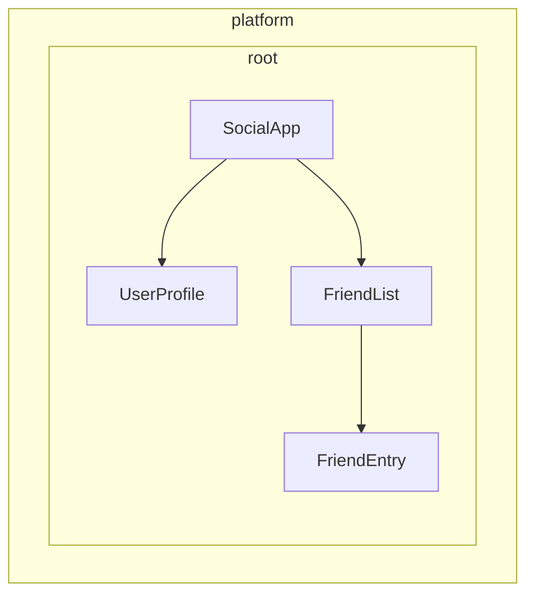

# Определение провайдеров зависимостей

Angular предоставляет два способа сделать сервисы доступными для внедрения:

1. **Автоматическое предоставление** — с помощью `providedIn` в декораторе `@Injectable` или путём указания фабрики в конфигурации `InjectionToken`
2. **Ручное предоставление** — с помощью массива `providers` в компонентах, директивах, маршрутах или конфигурации приложения

В [предыдущем руководстве](guide/di/creating-and-using-services) вы узнали, как создавать сервисы с помощью `providedIn: 'root'`, что охватывает большинство распространённых случаев использования. Это руководство рассматривает дополнительные паттерны для автоматической и ручной настройки провайдеров.

## Автоматическое предоставление для зависимостей, не являющихся классами {#automatic-provision-for-non-class-dependencies}

В то время как декоратор `@Injectable` с `providedIn: 'root'` отлично подходит для сервисов (классов), иногда может потребоваться глобально предоставить другие типы значений — например, объекты конфигурации, функции или примитивные значения. Для этого Angular предоставляет `InjectionToken`.

### Что такое InjectionToken? {#what-is-an-injectiontoken}

`InjectionToken` — это объект, который система внедрения зависимостей Angular использует для уникальной идентификации значений при внедрении. Считайте его специальным ключом, позволяющим хранить и извлекать любой тип значения в системе DI Angular:

```ts
import {InjectionToken} from '@angular/core';

// Токен для строкового значения
export const API_URL = new InjectionToken<string>('api.url');

// Токен для функции
export const LOGGER = new InjectionToken<(msg: string) => void>('logger.function');

// Токен для сложного типа
export interface Config {
  apiUrl: string;
  timeout: number;
}
export const CONFIG_TOKEN = new InjectionToken<Config>('app.config');
```

NOTE: Строковый параметр (например, `'api.url'`) — это описание исключительно для отладки; Angular идентифицирует токены по ссылке на объект, а не по этой строке.

### InjectionToken с `providedIn: 'root'` {#injectiontoken-with-providedin-root}

`InjectionToken` с указанной `factory` по умолчанию получает `providedIn: 'root'` (но это можно переопределить через свойство `providedIn`).

```ts
// 📁 /app/config.token.ts
import {InjectionToken} from '@angular/core';

export interface AppConfig {
  apiUrl: string;
  version: string;
  features: Record<string, boolean>;
}

// Глобально доступная конфигурация с использованием providedIn
export const APP_CONFIG = new InjectionToken<AppConfig>('app.config', {
  providedIn: 'root',
  factory: () => ({
    apiUrl: 'https://api.example.com',
    version: '1.0.0',
    features: {
      darkMode: true,
      analytics: false,
    },
  }),
});

// Не нужно добавлять в массив providers — доступно везде!
@Component({
  selector: 'app-header',
  template: `<h1>Version: {{ config.version }}</h1>`,
})
export class Header {
  config = inject(APP_CONFIG); // Доступно автоматически
}
```

### Когда использовать InjectionToken с фабричными функциями {#when-to-use-injectiontoken-with-factory-functions}

InjectionToken с фабричными функциями идеален, когда нельзя использовать класс, но нужно предоставить зависимости глобально:

```ts
// 📁 /app/logger.token.ts
import {InjectionToken, inject} from '@angular/core';
import {APP_CONFIG} from './config.token';

// Тип функции логирования
export type LoggerFn = (level: string, message: string) => void;

// Глобальная функция логирования с зависимостями
export const LOGGER_FN = new InjectionToken<LoggerFn>('logger.function', {
  providedIn: 'root',
  factory: () => {
    const config = inject(APP_CONFIG);

    return (level: string, message: string) => {
      if (config.features.logging !== false) {
        console[level](`[${new Date().toISOString()}] ${message}`);
      }
    };
  },
});

// 📁 /app/storage.token.ts
// Предоставление браузерных API в виде токенов
export const LOCAL_STORAGE = new InjectionToken<Storage>('localStorage', {
  // providedIn: 'root' настроен по умолчанию
  factory: () => window.localStorage,
});

export const SESSION_STORAGE = new InjectionToken<Storage>('sessionStorage', {
  providedIn: 'root',
  factory: () => window.sessionStorage,
});

// 📁 /app/feature-flags.token.ts
// Сложная конфигурация с логикой времени выполнения
export const FEATURE_FLAGS = new InjectionToken<Map<string, boolean>>('feature.flags', {
  providedIn: 'root',
  factory: () => {
    const flags = new Map<string, boolean>();

    // Разбор из окружения или параметров URL
    const urlParams = new URLSearchParams(window.location.search);
    const enableBeta = urlParams.get('beta') === 'true';

    flags.set('betaFeatures', enableBeta);
    flags.set('darkMode', true);
    flags.set('newDashboard', false);

    return flags;
  },
});
```

Этот подход предоставляет ряд преимуществ:

- **Не требует ручной настройки провайдеров** — работает так же, как `providedIn: 'root'` для сервисов
- **Tree-shakeable** — включается в бандл только если реально используется
- **Типобезопасен** — полная поддержка TypeScript для значений, не являющихся классами
- **Может внедрять другие зависимости** — фабричные функции могут использовать `inject()` для доступа к другим сервисам

## Понимание ручной настройки провайдеров {#understanding-manual-provider-configuration}

Когда нужно больше контроля, чем предоставляет `providedIn: 'root'`, можно настроить провайдеры вручную. Ручная настройка через массив `providers` полезна, когда:

1. **Сервис не имеет `providedIn`** — сервисы без автоматического предоставления должны быть предоставлены вручную
2. **Нужен новый экземпляр** — чтобы создать отдельный экземпляр на уровне компонента/директивы вместо использования общего
3. **Требуется конфигурация времени выполнения** — когда поведение сервиса зависит от значений времени выполнения
4. **Предоставляются значения, не являющиеся классами** — объекты конфигурации, функции или примитивные значения

### Пример: сервис без `providedIn` {#example-service-without-providedin}

```ts
import {Injectable, Component, inject} from '@angular/core';

// Сервис без providedIn
@Injectable()
export class LocalDataStore {
  private data: string[] = [];

  addData(item: string) {
    this.data.push(item);
  }
}

// Компонент должен предоставить сервис
@Component({
  selector: 'app-example',
  // Провайдер обязателен, так как у `LocalDataStore` нет providedIn.
  providers: [LocalDataStore],
  template: `...`,
})
export class Example {
  dataStore = inject(LocalDataStore);
}
```

### Пример: создание экземпляров, специфичных для компонента {#example-creating-component-specific-instances}

Сервисы с `providedIn: 'root'` можно переопределить на уровне компонента. Это привязывает экземпляр сервиса к жизненному циклу компонента. В результате при уничтожении компонента предоставленный сервис также уничтожается.

```ts
import {Injectable, Component, inject} from '@angular/core';

@Injectable({providedIn: 'root'})
export class DataStore {
  private data: ListItem[] = [];
}

// Этот компонент получает собственный экземпляр
@Component({
  selector: 'app-isolated',
  // Создаёт новый экземпляр `DataStore` вместо использования корневого.
  providers: [DataStore],
  template: `...`,
})
export class Isolated {
  dataStore = inject(DataStore); // Экземпляр, специфичный для компонента
}
```

## Иерархия инжекторов в Angular {#injector-hierarchy-in-angular}

Система внедрения зависимостей Angular иерархична. Когда компонент запрашивает зависимость, Angular начинает с инжектора этого компонента и поднимается по дереву до тех пор, пока не найдёт провайдер для этой зависимости. Каждый компонент в дереве приложения может иметь собственный инжектор, и эти инжекторы образуют иерархию, отражающую дерево компонентов.

Эта иерархия обеспечивает:

- **Ограниченные по области видимости экземпляры**: разные части приложения могут иметь разные экземпляры одного и того же сервиса
- **Переопределение поведения**: дочерние компоненты могут переопределять провайдеры родительских компонентов
- **Эффективность памяти**: сервисы создаются только там, где они нужны

В Angular любой элемент с компонентом или директивой может предоставлять значения всем своим потомкам.


```mermaid
graph TD
    subgraph platform
        subgraph root
            direction TB
            A[SocialApp] --> B[UserProfile]
            A --> C[FriendList]
            C --> D[FriendEntry]
        end
    end
```

В приведённом примере:

1. `SocialApp` может предоставлять значения для `UserProfile` и `FriendList`
2. `FriendList` может предоставлять значения для `FriendEntry`, но не может предоставлять значения для `UserProfile`, так как он не является частью этого поддерева

## Объявление провайдера {#declaring-a-provider}

Представьте систему внедрения зависимостей Angular как хэш-таблицу или словарь. Каждый объект конфигурации провайдера определяет пару ключ-значение:

- **Ключ (идентификатор провайдера)**: уникальный идентификатор, используемый для запроса зависимости
- **Значение**: то, что Angular должен вернуть при запросе этого токена

При ручном предоставлении зависимостей обычно используется сокращённый синтаксис:

```angular-ts
import {Component} from '@angular/core';
import {LocalService} from './local-service';

@Component({
  selector: 'app-example',
  providers: [LocalService], // Сервис без providedIn
})
export class Example {}
```

Это фактически сокращение для более подробной конфигурации провайдера:

```ts
{
  // Это сокращённый вариант
  providers: [LocalService],

  // Это полный вариант
  providers: [
    { provide: LocalService, useClass: LocalService }
  ]
}
```

### Объект конфигурации провайдера {#provider-configuration-object}

Каждый объект конфигурации провайдера состоит из двух основных частей:

1. **Идентификатор провайдера**: уникальный ключ, используемый Angular для получения зависимости (задаётся через свойство `provide`)
2. **Значение**: фактическая зависимость, которую Angular должен вернуть, настраиваемая с помощью различных ключей в зависимости от желаемого типа:
   - `useClass` — предоставляет класс JavaScript
   - `useValue` — предоставляет статическое значение
   - `useFactory` — предоставляет фабричную функцию, возвращающую значение
   - `useExisting` — создаёт псевдоним для существующего провайдера

### Идентификаторы провайдеров {#provider-identifiers}

Идентификаторы провайдеров позволяют системе внедрения зависимостей (DI) Angular получать зависимость через уникальный идентификатор. Идентификаторы провайдеров можно создать двумя способами:

1. [Имена классов](#class-names)
2. [Токены внедрения](#injection-tokens)

#### Имена классов {#class-names}

Имена классов используют импортированный класс непосредственно в качестве идентификатора:

```angular-ts
import {Component} from '@angular/core';
import {LocalService} from './local-service';

@Component({
  selector: 'app-example',
  providers: [{provide: LocalService, useClass: LocalService}],
})
export class Example {
  /* ... */
}
```

Класс служит одновременно идентификатором и реализацией, поэтому Angular предоставляет сокращение `providers: [LocalService]`.

#### Токены внедрения {#injection-tokens}

Angular предоставляет встроенный класс [`InjectionToken`](api/core/InjectionToken), который создаёт уникальную ссылку на объект для injectable-значений или когда нужно предоставить несколько реализаций одного интерфейса.

```ts
// 📁 /app/tokens.ts
import {InjectionToken} from '@angular/core';
import {DataService} from './data-service.interface';

export const DATA_SERVICE_TOKEN = new InjectionToken<DataService>('DataService');
```

NOTE: Строка `'DataService'` — это описание, используемое исключительно для отладки. Angular идентифицирует токен по ссылке на объект, а не по этой строке.

Используйте токен в конфигурации провайдера:

```angular-ts
import {Component, inject} from '@angular/core';
import {LocalDataService} from './local-data-service';
import {DATA_SERVICE_TOKEN} from './tokens';

@Component({
  selector: 'app-example',
  providers: [{provide: DATA_SERVICE_TOKEN, useClass: LocalDataService}],
})
export class Example {
  private dataService = inject(DATA_SERVICE_TOKEN);
}
```

#### Могут ли интерфейсы TypeScript быть идентификаторами для внедрения? {#can-typescript-interfaces-be-identifiers-for-injection}

Интерфейсы TypeScript не могут использоваться для внедрения, поскольку они не существуют во время выполнения:

```ts
// ❌ Это не сработает!
interface DataService {
  getData(): string[];
}

// Интерфейсы исчезают после компиляции TypeScript
@Component({
  providers: [
    {provide: DataService, useClass: LocalDataService}, // Ошибка!
  ],
})
export class Example {
  private dataService = inject(DataService); // Ошибка!
}

// ✅ Используйте InjectionToken
export const DATA_SERVICE_TOKEN = new InjectionToken<DataService>('DataService');

@Component({
  providers: [{provide: DATA_SERVICE_TOKEN, useClass: LocalDataService}],
})
export class Example {
  private dataService = inject(DATA_SERVICE_TOKEN); // Работает!
}
```

InjectionToken предоставляет значение времени выполнения, которое может использовать система DI Angular, сохраняя при этом типобезопасность через параметр обобщённого типа TypeScript.

### Типы значений провайдера {#provider-value-types}

#### useClass {#useclass}

`useClass` предоставляет класс JavaScript в качестве зависимости. Это значение по умолчанию при использовании сокращённого синтаксиса:

```ts
// Сокращённый синтаксис
providers: [DataService];

// Полный синтаксис
providers: [{provide: DataService, useClass: DataService}];

// Другая реализация
providers: [{provide: DataService, useClass: MockDataService}];

// Условная реализация
providers: [
  {
    provide: StorageService,
    useClass: environment.production ? CloudStorageService : LocalStorageService,
  },
];
```

#### Практический пример: замена Logger {#practical-example-logger-substitution}

Можно подменить реализации для расширения функциональности:

```ts
import {Injectable, Component, inject} from '@angular/core';

// Базовый logger
@Injectable()
export class Logger {
  log(message: string) {
    console.log(message);
  }
}

// Расширенный logger с временной меткой
@Injectable()
export class BetterLogger extends Logger {
  override log(message: string) {
    super.log(`[${new Date().toISOString()}] ${message}`);
  }
}

// Logger с контекстом пользователя
@Injectable()
export class EvenBetterLogger extends Logger {
  private userService = inject(UserService);

  override log(message: string) {
    const name = this.userService.user.name;
    super.log(`Message to ${name}: ${message}`);
  }
}

// В компоненте
@Component({
  selector: 'app-example',
  providers: [
    UserService, // EvenBetterLogger нуждается в этом
    {provide: Logger, useClass: EvenBetterLogger},
  ],
})
export class Example {
  private logger = inject(Logger); // Получает экземпляр EvenBetterLogger
}
```

#### useValue {#usevalue}

`useValue` предоставляет любой тип данных JavaScript в качестве статического значения:

```ts
providers: [
  {provide: API_URL_TOKEN, useValue: 'https://api.example.com'},
  {provide: MAX_RETRIES_TOKEN, useValue: 3},
  {provide: FEATURE_FLAGS_TOKEN, useValue: {darkMode: true, beta: false}},
];
```

IMPORTANT: Типы и интерфейсы TypeScript не могут служить значениями зависимостей. Они существуют только во время компиляции.

#### Практический пример: конфигурация приложения {#practical-example-application-configuration}

Распространённый случай использования `useValue` — предоставление конфигурации приложения:

```ts
// Определение интерфейса конфигурации
export interface AppConfig {
  apiUrl: string;
  appTitle: string;
  features: {
    darkMode: boolean;
    analytics: boolean;
  };
}

// Создание токена внедрения
export const APP_CONFIG = new InjectionToken<AppConfig>('app.config');

// Определение конфигурации
const appConfig: AppConfig = {
  apiUrl: 'https://api.example.com',
  appTitle: 'My Application',
  features: {
    darkMode: true,
    analytics: false,
  },
};

// Предоставление при bootstrap
bootstrapApplication(AppComponent, {
  providers: [{provide: APP_CONFIG, useValue: appConfig}],
});

// Использование в компоненте
@Component({
  selector: 'app-header',
  template: `<h1>{{ title }}</h1>`,
})
export class Header {
  private config = inject(APP_CONFIG);
  title = this.config.appTitle;
}
```

#### useFactory {#usefactory}

`useFactory` предоставляет функцию, генерирующую новое значение для внедрения:

```ts
export const loggerFactory = (config: AppConfig) => {
  return new LoggerService(config.logLevel, config.endpoint);
};

providers: [
  {
    provide: LoggerService,
    useFactory: loggerFactory,
    deps: [APP_CONFIG], // Зависимости для фабричной функции
  },
];
```

Зависимости фабрики можно пометить как необязательные:

```ts
import {Optional} from '@angular/core';

providers: [
  {
    provide: MyService,
    useFactory: (required: RequiredService, optional?: OptionalService) => {
      return new MyService(required, optional || new DefaultService());
    },
    deps: [RequiredService, [new Optional(), OptionalService]],
  },
];
```

#### Практический пример: API-клиент на основе конфигурации {#practical-example-configuration-based-api-client}

Вот полный пример использования фабрики для создания сервиса с конфигурацией времени выполнения:

```ts
// Сервис, требующий конфигурации времени выполнения
class ApiClient {
  constructor(
    private http: HttpClient,
    private baseUrl: string,
    private rateLimitMs: number,
  ) {}

  async fetchData(endpoint: string) {
    // Применение ограничения скорости в зависимости от уровня пользователя
    await this.applyRateLimit();
    return this.http.get(`${this.baseUrl}/${endpoint}`);
  }

  private async applyRateLimit() {
    // Упрощённый пример — реальная реализация отслеживала бы время запросов
    return new Promise((resolve) => setTimeout(resolve, this.rateLimitMs));
  }
}

// Фабричная функция, настраивающая сервис на основе уровня пользователя
import {inject} from '@angular/core';
import {HttpClient} from '@angular/common/http';
const apiClientFactory = () => {
  const http = inject(HttpClient);
  const userService = inject(UserService);

  // Предполагается, что userService предоставляет эти значения
  const baseUrl = userService.getApiBaseUrl();
  const rateLimitMs = userService.getRateLimit();

  return new ApiClient(http, baseUrl, rateLimitMs);
};

// Конфигурация провайдера
export const apiClientProvider = {
  provide: ApiClient,
  useFactory: apiClientFactory,
};

// Использование в компоненте
@Component({
  selector: 'app-dashboard',
  providers: [apiClientProvider],
})
export class Dashboard {
  private apiClient = inject(ApiClient);
}
```

#### useExisting {#useexisting}

`useExisting` создаёт псевдоним для уже определённого провайдера. Оба токена возвращают один и тот же экземпляр:

```ts
providers: [
  NewLogger, // Фактический сервис
  {provide: OldLogger, useExisting: NewLogger}, // Псевдоним
];
```

IMPORTANT: Не путайте `useExisting` с `useClass`. `useClass` создаёт отдельные экземпляры, тогда как `useExisting` гарантирует получение одного и того же экземпляра-синглтона.

### Множественные провайдеры {#multiple-providers}

Используйте флаг `multi: true`, когда несколько провайдеров вносят значения в один и тот же токен:

```ts
export const INTERCEPTOR_TOKEN = new InjectionToken<Interceptor[]>('interceptors');

providers: [
  {provide: INTERCEPTOR_TOKEN, useClass: AuthInterceptor, multi: true},
  {provide: INTERCEPTOR_TOKEN, useClass: LoggingInterceptor, multi: true},
  {provide: INTERCEPTOR_TOKEN, useClass: RetryInterceptor, multi: true},
];
```

При внедрении `INTERCEPTOR_TOKEN` вы получите массив, содержащий экземпляры всех трёх интерцепторов.

## Где можно указывать провайдеры? {#where-can-you-specify-providers}

Angular предлагает несколько уровней для регистрации провайдеров, каждый с разными последствиями для области видимости, жизненного цикла и производительности:

- [**Bootstrap приложения**](#application-bootstrap) — глобальные синглтоны, доступные везде
- [**На элементе (компоненте или директиве)**](#component-or-directive-providers) — изолированные экземпляры для конкретных деревьев компонентов
- [**Маршрут**](#route-providers) — сервисы, специфичные для функциональности, для ленивозагружаемых модулей

### Bootstrap приложения {#application-bootstrap}

Используйте провайдеры на уровне приложения в `bootstrapApplication`, когда:

- **Сервис используется в нескольких функциональных областях** — такие сервисы, как HTTP-клиенты, логирование или аутентификация, нужны многим частям приложения
- **Нужен настоящий синглтон** — один экземпляр, разделяемый всем приложением
- **Сервис не имеет специфичной для компонента конфигурации** — утилиты общего назначения, работающие одинаково везде
- **Предоставляется глобальная конфигурация** — конечные точки API, флаги функций или настройки окружения

```ts
// main.ts
bootstrapApplication(App, {
  providers: [
    {provide: API_BASE_URL, useValue: 'https://api.example.com'},
    {provide: INTERCEPTOR_TOKEN, useClass: AuthInterceptor, multi: true},
    LoggingService, // Используется во всём приложении
    {provide: ErrorHandler, useClass: GlobalErrorHandler},
  ],
});
```

**Преимущества:**

- Единственный экземпляр снижает потребление памяти
- Доступен везде без дополнительной настройки
- Проще управлять глобальным состоянием

**Недостатки:**

- Всегда включается в бандл JavaScript, даже если значение никогда не внедряется
- Трудно настраивать по-разному для каждой функциональности
- Сложнее тестировать отдельные компоненты изолированно

#### Зачем предоставлять при bootstrap вместо использования `providedIn: 'root'`? {#why-provide-during-bootstrap-instead-of-using-providedin-root}

Провайдер при bootstrap может понадобиться, когда:

- Провайдер имеет побочные эффекты (например, установка клиентского роутера)
- Провайдер требует конфигурации (например, маршруты)
- Используется паттерн Angular `provideSomething` (например, `provideRouter`, `provideHttpClient`)

### Провайдеры компонента или директивы {#component-or-directive-providers}

Используйте провайдеры компонента или директивы, когда:

- **Сервис имеет состояние, специфичное для компонента** — валидаторы форм, кэши компонентов или менеджеры UI-состояния
- **Нужны изолированные экземпляры** — каждый компонент нуждается в собственной копии сервиса
- **Сервис используется только одним деревом компонентов** — специализированные сервисы, которым не нужен глобальный доступ
- **Создаются переиспользуемые компоненты** — компоненты, которые должны работать независимо со своими собственными сервисами

```angular-ts
// Специализированный компонент формы с собственным сервисом валидации
@Component({
  selector: 'app-advanced-form',
  providers: [
    FormValidationService, // Каждая форма получает собственный валидатор
    {provide: FORM_CONFIG, useValue: {strictMode: true}},
  ],
})
export class AdvancedForm {}

// Модальный компонент с изолированным управлением состоянием
@Component({
  selector: 'app-modal',
  providers: [
    ModalStateService, // Каждое модальное окно управляет собственным состоянием
  ],
})
export class Modal {}
```

**Преимущества:**

- Лучшая инкапсуляция и изоляция
- Проще тестировать компоненты по отдельности
- Несколько экземпляров могут сосуществовать с разными конфигурациями

**Недостатки:**

- Новый экземпляр создаётся для каждого компонента (больше потребление памяти)
- Нет общего состояния между компонентами
- Необходимо предоставлять везде, где нужен
- Всегда включается в тот же бандл JavaScript, что и компонент или директива, даже если значение никогда не внедряется

NOTE: Если несколько директив на одном элементе предоставляют один и тот же токен, одна из них «победит», но какая именно — не определено.

### Провайдеры маршрута {#route-providers}

Используйте провайдеры на уровне маршрута для:

- **Сервисов, специфичных для функциональности** — сервисы, нужные только для определённых маршрутов или функциональных модулей
- **Зависимостей ленивозагружаемых модулей** — сервисы, которые должны загружаться только с конкретными функциональностями
- **Конфигурации, специфичной для маршрута** — настройки, варьирующиеся в зависимости от области приложения

```ts
// routes.ts
export const routes: Routes = [
  {
    path: 'admin',
    providers: [
      AdminService, // Загружается только с маршрутами admin
      {provide: FEATURE_FLAGS, useValue: {adminMode: true}},
    ],
    loadChildren: () => import('./admin/admin.routes'),
  },
  {
    path: 'shop',
    providers: [
      ShoppingCartService, // Изолированное состояние корзины
      PaymentService,
    ],
    loadChildren: () => import('./shop/shop.routes'),
  },
];
```

Сервисы, предоставленные на уровне маршрута, доступны всем компонентам и директивам в этом маршруте, а также его guard'ам и resolver'ам.

Поскольку эти сервисы создаются независимо от компонентов маршрута, у них нет прямого доступа к информации, специфичной для маршрута.

## Паттерны для авторов библиотек {#library-author-patterns}

При создании Angular-библиотек часто нужно предоставить потребителям гибкие варианты конфигурации, сохраняя при этом чистые API. Собственные библиотеки Angular демонстрируют мощные паттерны для достижения этой цели.

### Паттерн `provide` {#the-provide-pattern}

Вместо того чтобы требовать от пользователей ручной настройки сложных провайдеров, авторы библиотек могут экспортировать функции, возвращающие конфигурации провайдеров:

```ts
// 📁 /libs/analytics/src/providers.ts
import {InjectionToken, Provider, inject} from '@angular/core';

// Интерфейс конфигурации
export interface AnalyticsConfig {
  trackingId: string;
  enableDebugMode?: boolean;
  anonymizeIp?: boolean;
}

// Внутренний токен для конфигурации
const ANALYTICS_CONFIG = new InjectionToken<AnalyticsConfig>('analytics.config');

// Основной сервис, использующий конфигурацию
export class AnalyticsService {
  private config = inject(ANALYTICS_CONFIG);

  track(event: string, properties?: any) {
    // Реализация с использованием config
  }
}

// Функция-провайдер для потребителей
export function provideAnalytics(config: AnalyticsConfig): Provider[] {
  return [{provide: ANALYTICS_CONFIG, useValue: config}, AnalyticsService];
}

// Использование в приложении-потребителе
// main.ts
bootstrapApplication(App, {
  providers: [
    provideAnalytics({
      trackingId: 'GA-12345',
      enableDebugMode: !environment.production,
    }),
  ],
});
```

### Продвинутые паттерны провайдеров с опциями {#advanced-provider-patterns-with-options}

Для более сложных сценариев можно комбинировать несколько подходов к конфигурации:

```ts
// 📁 /libs/http-client/src/provider.ts
import {Provider, InjectionToken, inject} from '@angular/core';

// Флаги функций для необязательной функциональности
export enum HttpFeatures {
  Interceptors = 'interceptors',
  Caching = 'caching',
  Retry = 'retry',
}

// Интерфейсы конфигурации
export interface HttpConfig {
  baseUrl?: string;
  timeout?: number;
  headers?: Record<string, string>;
}

export interface RetryConfig {
  maxAttempts: number;
  delayMs: number;
}

// Внутренние токены
const HTTP_CONFIG = new InjectionToken<HttpConfig>('http.config');
const RETRY_CONFIG = new InjectionToken<RetryConfig>('retry.config');
const HTTP_FEATURES = new InjectionToken<Set<HttpFeatures>>('http.features');

// Основной сервис
class HttpClientService {
  private config = inject(HTTP_CONFIG, {optional: true});
  private features = inject(HTTP_FEATURES);

  get(url: string) {
    // Используйте config и проверьте features
  }
}

// Сервисы функций
class RetryInterceptor {
  private config = inject(RETRY_CONFIG);
  // Логика повторных попыток
}

class CacheInterceptor {
  // Логика кэширования
}

// Основная функция-провайдер
export function provideHttpClient(config?: HttpConfig, ...features: HttpFeature[]): Provider[] {
  const providers: Provider[] = [
    {provide: HTTP_CONFIG, useValue: config || {}},
    {provide: HTTP_FEATURES, useValue: new Set(features.map((f) => f.kind))},
    HttpClientService,
  ];

  // Добавление провайдеров, специфичных для функций
  features.forEach((feature) => {
    providers.push(...feature.providers);
  });

  return providers;
}

// Функции конфигурации функций
export interface HttpFeature {
  kind: HttpFeatures;
  providers: Provider[];
}

export function withInterceptors(...interceptors: any[]): HttpFeature {
  return {
    kind: HttpFeatures.Interceptors,
    providers: interceptors.map((interceptor) => ({
      provide: INTERCEPTOR_TOKEN,
      useClass: interceptor,
      multi: true,
    })),
  };
}

export function withCaching(): HttpFeature {
  return {
    kind: HttpFeatures.Caching,
    providers: [CacheInterceptor],
  };
}

export function withRetry(config: RetryConfig): HttpFeature {
  return {
    kind: HttpFeatures.Retry,
    providers: [{provide: RETRY_CONFIG, useValue: config}, RetryInterceptor],
  };
}

// Использование потребителем с несколькими функциями
bootstrapApplication(App, {
  providers: [
    provideHttpClient(
      {baseUrl: 'https://api.example.com'},
      withInterceptors(AuthInterceptor, LoggingInterceptor),
      withCaching(),
      withRetry({maxAttempts: 3, delayMs: 1000}),
    ),
  ],
});
```

### Почему использовать функции-провайдеры вместо прямой конфигурации? {#why-use-provider-functions-instead-of-direct-configuration}

Функции-провайдеры предлагают несколько преимуществ для авторов библиотек:

1. **Инкапсуляция** — внутренние токены и детали реализации остаются приватными
2. **Типобезопасность** — TypeScript обеспечивает корректность конфигурации во время компиляции
3. **Гибкость** — легко компонировать функции с паттерном `with*`
4. **Перспективность** — внутренняя реализация может меняться без нарушения совместимости с потребителями
5. **Последовательность** — соответствует собственным паттернам Angular (`provideRouter`, `provideHttpClient` и т.д.)

Этот паттерн широко используется в собственных библиотеках Angular и считается лучшей практикой для авторов библиотек, которым нужно предоставлять настраиваемые сервисы.
