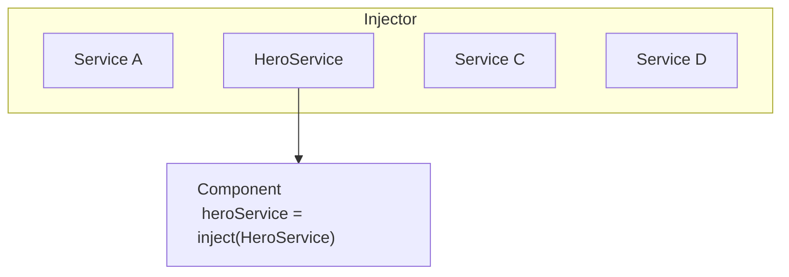

# Understanding dependency injection

Dependency injection, or DI, is one of the fundamental concepts in Angular. DI is wired into the Angular framework and allows classes with Angular decorators, such as Components, Directives, Pipes, and Injectables, to configure dependencies that they need.

Two main roles exist in the DI system: dependency consumer and dependency provider.

Angular facilitates the interaction between dependency consumers and dependency providers using an abstraction called `Injector`. When a dependency is requested, the injector checks its registry to see if there is an instance already available there. If not, a new instance is created and stored in the registry. Angular creates an application-wide injector (also known as the "root" injector) during the application bootstrap process. In most cases you don't need to manually create injectors, but you should know that there is a layer that connects providers and consumers.

This topic covers basic scenarios of how a class can act as a dependency. Angular also allows you to use functions, objects, primitive types such as string or Boolean, or any other types as dependencies. For more information, see [Dependency providers](guide/di/dependency-injection-providers).

## Providing a dependency

Consider a class called `HeroService` that needs to act as a dependency in a component.

The first step is to add the `@Injectable` decorator to show that the class can be injected.

<docs-code language="typescript" highlight="[1]">
@Injectable()
class HeroService {}
</docs-code>

The next step is to make it available in the DI by providing it.
A dependency can be provided in multiple places:

- [**Preferred**: At the application root level using `providedIn`](#preferred-at-the-application-root-level-using-providedin)
- [At the Component level](#at-the-component-level)
- [At the application root level using `ApplicationConfig`](#at-the-application-root-level-using-applicationconfig)
- [`NgModule` based applications](#ngmodule-based-applications)

### **Preferred**: At the application root level using `providedIn`

Providing a service at the application root level using `providedIn` allows injecting the service into all other classes.
Using `providedIn` enables Angular and JavaScript code optimizers to effectively remove services that are unused (known as tree-shaking).

You can provide a service by using `providedIn: 'root'` in the `@Injectable` decorator:

<docs-code language="typescript" highlight="[2]">
@Injectable({
  providedIn: 'root'
})
class HeroService {}
</docs-code>

When you provide the service at the root level, Angular creates a single, shared instance of the `HeroService` and injects it into any class that asks for it.

### At the Component level

You can provide services at `@Component` level by using the `providers` field of the `@Component` decorator.
In this case the `HeroService` becomes available to all instances of this component and other components and directives used in the template.

For example:

<docs-code language="typescript" highlight="[4]">
@Component({
  selector: 'hero-list',
  template: '...',
  providers: [HeroService]
})
class HeroListComponent {}
</docs-code>

When you register a provider at the component level, you get a new instance of the service with each new instance of that component.

NOTE: Declaring a service like this causes `HeroService` to always be included in your application— even if the service is unused.

### At the application root level using `ApplicationConfig`

You can use the `providers` field of the `ApplicationConfig` (passed to the `bootstrapApplication` function) to provide a service or other `Injectable` at the application level.

In the example below, the `HeroService` is available to all components, directives, and pipes:

<docs-code language="typescript" highlight="[3]">
export const appConfig: ApplicationConfig = {
    providers: [
      { provide: HeroService },
    ]
};
</docs-code>

Then, in `main.ts`:

<docs-code language="typescript">
bootstrapApplication(AppComponent, appConfig)
</docs-code>

NOTE: Declaring a service like this causes `HeroService` to always be included in your application— even if the service is unused.

### `NgModule` based applications

`@NgModule`-based applications use the `providers` field of the `@NgModule` decorator to provide a service or other `Injectable` available at the application level.

A service provided in a module is available to all declarations of the module, or to any other modules which share the same `ModuleInjector`.
To understand all edge-cases, see [Hierarchical injectors](guide/di/hierarchical-dependency-injection).

NOTE: Declaring a service using `providers` causes the service to be included in your application— even if the service is unused.

## Injecting/consuming a dependency

Use Angular's `inject` function to retrieve dependencies.

```ts
import {inject, Component} from 'angular/core';

@Component({/* ... */})
export class UserProfile {
  // You can use the `inject` function in property initializers.
  private userClient = inject(UserClient);

  constructor() {
    // You can also use the `inject` function in a constructor.
    const logger = inject(Logger);
  }
}
```

You can use the `inject` function in any [injection context](guide/di/dependency-injection-context). Most of the time, this is in a class property initializer or a class constructor for components, directives, services, and pipes.

When Angular discovers that a component depends on a service, it first checks if the injector has any existing instances of that service. If a requested service instance doesn't yet exist, the injector creates one using the registered provider, and adds it to the injector before returning the service to Angular.

When all requested services have been resolved and returned, Angular can call the component's constructor with those services as arguments.



## What's next

<docs-pill-row>
  <docs-pill href="/guide/di/creating-injectable-service" title="Creating an injectable service"/>
</docs-pill-row>
