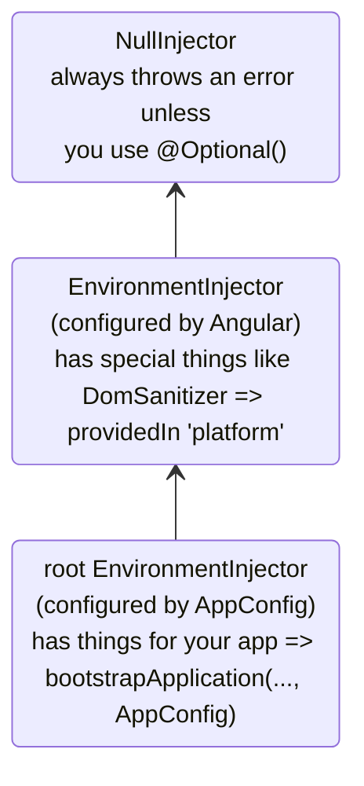
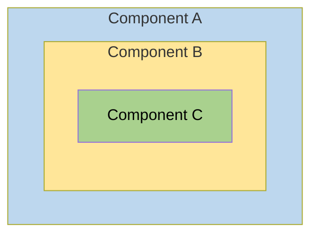
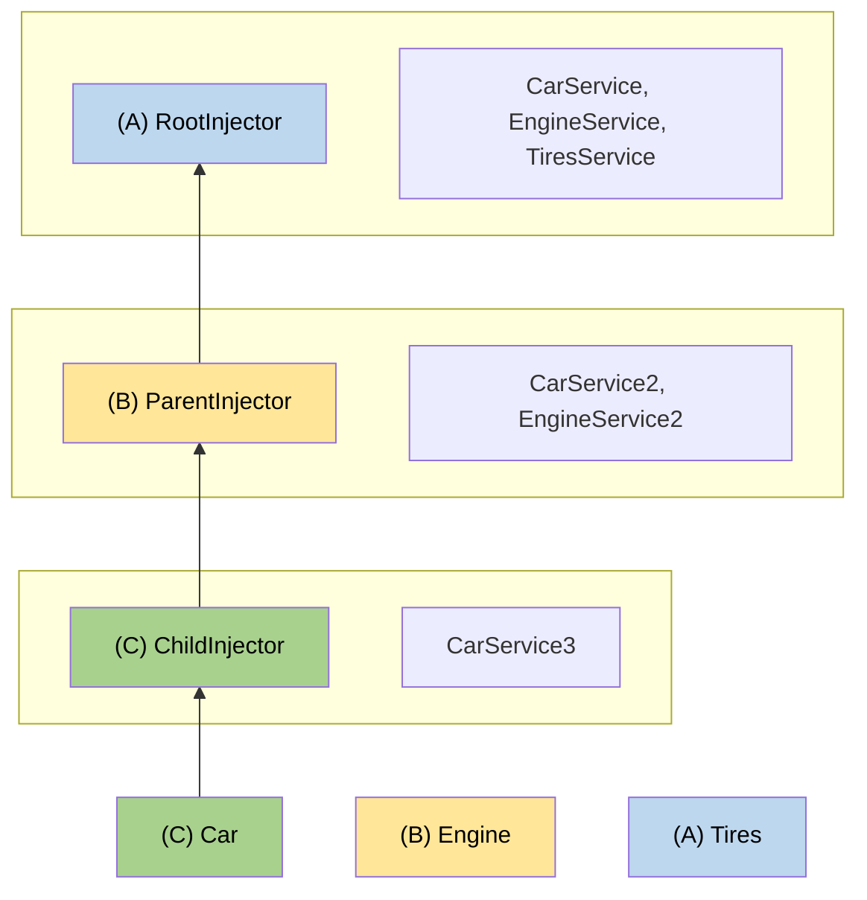

# Hierarchical injectors

This guide provides in-depth coverage of Angular's hierarchical dependency injection system, including resolution rules, modifiers, and advanced patterns.

NOTE: For basic concepts about injector hierarchy and provider scoping, see the [defining dependency providers guide](guide/di/defining-dependency-providers#injector-hierarchy-in-angular).

## Types of injector hierarchies

Angular has two injector hierarchies:

| Injector hierarchies            | Details                                                                                                                                                                   |
| :------------------------------ | :------------------------------------------------------------------------------------------------------------------------------------------------------------------------ |
| `EnvironmentInjector` hierarchy | Configure an `EnvironmentInjector` in this hierarchy using `@Injectable()` or `providers` array in `ApplicationConfig`.                                                   |
| `ElementInjector` hierarchy     | Created implicitly at each DOM element. An `ElementInjector` is empty by default unless you configure it in the `providers` property on `@Directive()` or `@Component()`. |

<docs-callout title="NgModule Based Applications">
For `NgModule` based applications, you can provide dependencies with the `ModuleInjector` hierarchy using an `@NgModule()` or `@Injectable()` annotation.
</docs-callout>

### `EnvironmentInjector`

The `EnvironmentInjector` can be configured in one of two ways by using:

- The `@Injectable()` `providedIn` property to refer to `root` or `platform`
- The `ApplicationConfig` `providers` array

<docs-callout title="Tree-shaking and @Injectable()">

Using the `@Injectable()` `providedIn` property is preferable to using the `ApplicationConfig` `providers` array. With `@Injectable()` `providedIn`, optimization tools can perform tree-shaking, which removes services that your application isn't using. This results in smaller bundle sizes.

Tree-shaking is especially useful for a library because the application which uses the library may not have a need to inject it.

</docs-callout>

`EnvironmentInjector` is configured by the `ApplicationConfig.providers`.

Provide services using `providedIn` of `@Injectable()` as follows:

```ts {highlight:[4]}
import { Injectable } from '@angular/core';

@Injectable({
  providedIn: 'root' // <--provides this service in the root EnvironmentInjector
})
export class ItemService {
  name = 'telephone';
}
```

The `@Injectable()` decorator identifies a service class.
The `providedIn` property configures a specific `EnvironmentInjector`, here `root`, which makes the service available in the `root` `EnvironmentInjector`.

### ModuleInjector

In the case of `NgModule` based applications, the ModuleInjector can be configured in one of two ways by using:

- The `@Injectable()` `providedIn` property to refer to `root` or `platform`
- The `@NgModule()` `providers` array

`ModuleInjector` is configured by the `@NgModule.providers` and `NgModule.imports` property. `ModuleInjector` is a flattening of all the providers arrays that can be reached by following the `NgModule.imports` recursively.

Child `ModuleInjector` hierarchies are created when lazy loading other `@NgModules`.

### Platform injector

There are two more injectors above `root`, an additional `EnvironmentInjector` and `NullInjector()`.

Consider how Angular bootstraps the application with the following in `main.ts`:

```ts
bootstrapApplication(AppComponent, appConfig);
```

The `bootstrapApplication()` method creates a child injector of the platform injector which is configured by the `ApplicationConfig` instance.
This is the `root` `EnvironmentInjector`.

The `platformBrowserDynamic()` method creates an injector configured by a `PlatformModule`, which contains platform-specific dependencies.
This allows multiple applications to share a platform configuration.
For example, a browser has only one URL bar, no matter how many applications you have running.
You can configure additional platform-specific providers at the platform level by supplying `extraProviders` using the `platformBrowser()` function.

The next parent injector in the hierarchy is the `NullInjector()`, which is the top of the tree.
If you've gone so far up the tree that you are looking for a service in the `NullInjector()`, you'll get an error unless you've used `@Optional()` because ultimately, everything ends at the `NullInjector()` and it returns an error or, in the case of `@Optional()`, `null`.
For more information on `@Optional()`, see the [`@Optional()` section](#optional) of this guide.

The following diagram represents the relationship between the `root` `ModuleInjector` and its parent injectors as the previous paragraphs describe.



While the name `root` is a special alias, other `EnvironmentInjector` hierarchies don't have aliases.
You have the option to create `EnvironmentInjector` hierarchies whenever a dynamically loaded component is created, such as with the Router, which will create child `EnvironmentInjector` hierarchies.

All requests forward up to the root injector, whether you configured it with the `ApplicationConfig` instance passed to the `bootstrapApplication()` method, or registered all providers with `root` in their own services.

<docs-callout title="@Injectable() vs. ApplicationConfig">

If you configure an app-wide provider in the `ApplicationConfig` of `bootstrapApplication`, it overrides one configured for `root` in the `@Injectable()` metadata.
You can do this to configure a non-default provider of a service that is shared with multiple applications.

Here is an example of the case where the component router configuration includes a non-default [location strategy](guide/routing#location-strategy) by listing its provider in the `providers` list of the `ApplicationConfig`.

```ts
providers: [
  { provide: LocationStrategy, useClass: HashLocationStrategy }
]
```

For `NgModule` based applications, configure app-wide providers in the `AppModule` `providers`.

</docs-callout>

### `ElementInjector`

Angular creates `ElementInjector` hierarchies implicitly for each DOM element.

Providing a service in the `@Component()` decorator using its `providers` or `viewProviders` property configures an `ElementInjector`.
For example, the following `TestComponent` configures the `ElementInjector` by providing the service as follows:

```ts {highlight:[3]}
@Component({
  /* … */
  providers: [{ provide: ItemService, useValue: { name: 'lamp' } }]
})
export class TestComponent
```

HELPFUL: See the [resolution rules](#resolution-rules) section to understand the relationship between the `EnvironmentInjector` tree, the `ModuleInjector` and the `ElementInjector` tree.

When you provide services in a component, that service is available by way of the `ElementInjector` at that component instance.
It may also be visible at child component/directives based on visibility rules described in the [resolution rules](#resolution-rules) section.

When the component instance is destroyed, so is that service instance.

#### `@Directive()` and `@Component()`

A component is a special type of directive, which means that just as `@Directive()` has a `providers` property, `@Component()` does too.
This means that directives as well as components can configure providers, using the `providers` property.
When you configure a provider for a component or directive using the `providers` property, that provider belongs to the `ElementInjector` of that component or directive.
Components and directives on the same element share an injector.

## Resolution rules

When resolving a token for a component/directive, Angular resolves it in two phases:

1. Against its parents in the `ElementInjector` hierarchy.
2. Against its parents in the `EnvironmentInjector` hierarchy.

When a component declares a dependency, Angular tries to satisfy that dependency with its own `ElementInjector`.
If the component's injector lacks the provider, it passes the request up to its parent component's `ElementInjector`.

The requests keep forwarding up until Angular finds an injector that can handle the request or runs out of ancestor `ElementInjector` hierarchies.

If Angular doesn't find the provider in any `ElementInjector` hierarchies, it goes back to the element where the request originated and looks in the `EnvironmentInjector` hierarchy.
If Angular still doesn't find the provider, it throws an error.

If you have registered a provider for the same DI token at different levels, the first one Angular encounters is the one it uses to resolve the dependency.
If, for example, a provider is registered locally in the component that needs a service,
Angular doesn't look for another provider of the same service.

HELPFUL: For `NgModule` based applications, Angular will search the `ModuleInjector` hierarchy if it cannot find a provider in the `ElementInjector` hierarchies.

## Resolution modifiers

Angular's resolution behavior can be modified with `optional`, `self`, `skipSelf` and `host`.
Import each of them from `@angular/core` and use each in the [`inject`](/api/core/inject) configuration when you inject your service.

### Types of modifiers

Resolution modifiers fall into three categories:

- What to do if Angular doesn't find what you're looking for, that is `optional`
- Where to start looking, that is `skipSelf`
- Where to stop looking, `host` and `self`

By default, Angular always starts at the current `Injector` and keeps searching all the way up.
Modifiers allow you to change the starting, or _self_, location and the ending location.

Additionally, you can combine all of the modifiers except:

- `host` and `self`
- `skipSelf` and `self`.

### `optional`

`optional` allows Angular to consider a service you inject to be optional.
This way, if it can't be resolved at runtime, Angular resolves the service as `null`, rather than throwing an error.
In the following example, the service, `OptionalService`, isn't provided in the service, `ApplicationConfig`, `@NgModule()`, or component class, so it isn't available anywhere in the app.

```ts {header:"src/app/optional/optional.component.ts"}
export class OptionalComponent {
  public optional? = inject(OptionalService, {optional: true});
}
```

### `self`

Use `self` so that Angular will only look at the `ElementInjector` for the current component or directive.

A good use case for `self` is to inject a service but only if it is available on the current host element.
To avoid errors in this situation, combine `self` with `optional`.

For example, in the following `SelfNoDataComponent`, notice the injected `LeafService` as a property.

```ts {header: 'self-no-data.component.ts', highlight: [7]}
@Component({
  selector: 'app-self-no-data',
  templateUrl: './self-no-data.component.html',
  styleUrls: ['./self-no-data.component.css']
})
export class SelfNoDataComponent {
  public leaf = inject(LeafService, {optional: true, self: true});
}
```

In this example, there is a parent provider and injecting the service will return the value, however, injecting the service with `self` and `optional` will return `null` because `self` tells the injector to stop searching in the current host element.

Another example shows the component class with a provider for `FlowerService`.
In this case, the injector looks no further than the current `ElementInjector` because it finds the `FlowerService` and returns the tulip 🌷.

```ts {header:"src/app/self/self.component.ts"}
@Component({
  selector: 'app-self',
  templateUrl: './self.component.html',
  styleUrls: ['./self.component.css'],
  providers: [{provide: FlowerService, useValue: {emoji: '🌷'}}],
})
export class SelfComponent {
  constructor(@Self() public flower: FlowerService) {}
}
```

### `skipSelf`

`skipSelf` is the opposite of `self`.
With `skipSelf`, Angular starts its search for a service in the parent `ElementInjector`, rather than in the current one.
So if the parent `ElementInjector` were using the fern <code>🌿</code> value for `emoji`, but you had maple leaf <code>🍁</code> in the component's `providers` array, Angular would ignore maple leaf <code>🍁</code> and use fern <code>🌿</code>.

To see this in code, assume that the following value for `emoji` is what the parent component were using, as in this service:

```ts {header: 'leaf.service.ts'}
export class LeafService {
  emoji = '🌿';
}
```

Imagine that in the child component, you had a different value, maple leaf 🍁 but you wanted to use the parent's value instead.
This is when you'd use `skipSelf`:

```ts {header:"skipself.component.ts" highlight:[[6],[10]]}
@Component({
  selector: 'app-skipself',
  templateUrl: './skipself.component.html',
  styleUrls: ['./skipself.component.css'],
  // Angular would ignore this LeafService instance
  providers: [{ provide: LeafService, useValue: { emoji: '🍁' } }]
})
export class SkipselfComponent {
  // Use skipSelf as inject option
  public leaf = inject(LeafService, {skipSelf: true});
}
```

In this case, the value you'd get for `emoji` would be fern <code>🌿</code>, not maple leaf <code>🍁</code>.

#### `skipSelf` option with `optional`

Use the `skipSelf` option with `optional` to prevent an error if the value is `null`.

In the following example, the `Person` service is injected during property initialization.
`skipSelf` tells Angular to skip the current injector and `optional` will prevent an error should the `Person` service be `null`.

```ts
class Person {
  parent = inject(Person, {optional: true, skipSelf: true})
}
```

### `host`

<!-- TODO: Remove ambiguity between host and self. -->

`host` lets you designate a component as the last stop in the injector tree when searching for providers.

Even if there is a service instance further up the tree, Angular won't continue looking.
Use `host` as follows:

```ts {header:"host.component.ts" highlight:[[6],[9]]}
@Component({
  selector: 'app-host',
  templateUrl: './host.component.html',
  styleUrls: ['./host.component.css'],
  // provide the service
  providers: [{provide: FlowerService, useValue: {emoji: '🌷'}}],
})
export class HostComponent {
  // use host when injecting the service
  flower = inject(FlowerService, {host: true, optional: true});
}
```

Since `HostComponent` has the `host` option , no matter what the parent of `HostComponent` might have as a `flower.emoji` value, the `HostComponent` will use tulip <code>🌷</code>.

### Modifiers with constructor injection

Similarly as presented before, the behavior of constructor injection can be modified with `@Optional()`, `@Self()`, `@SkipSelf()` and `@Host()`.

Import each of them from `@angular/core` and use each in the component class constructor when you inject your service.

```ts {header:"self-no-data.component.ts" highlight:[2]}
export class SelfNoDataComponent {
  constructor(@Self() @Optional() public leaf?: LeafService) { }
}
```

## Logical structure of the template

When you provide services in the component class, services are visible within the `ElementInjector` tree relative to where and how you provide those services.

Understanding the underlying logical structure of the Angular template will give you a foundation for configuring services and in turn control their visibility.

Components are used in your templates, as in the following example:

```html
<app-root>
  <app-child />;
</app-root>
```

HELPFUL: Usually, you declare the components and their templates in separate files.
For the purposes of understanding how the injection system works, it is useful to look at them from the point of view of a combined logical tree.
The term _logical_ distinguishes it from the render tree, which is your application's DOM tree.
To mark the locations of where the component templates are located, this guide uses the `<#VIEW>` pseudo-element, which doesn't actually exist in the render tree and is present for mental model purposes only.

The following is an example of how the `<app-root>` and `<app-child>` view trees are combined into a single logical tree:

```html
<app-root>
  <#VIEW>
    <app-child>
     <#VIEW>
       …content goes here…
     </#VIEW>
    </app-child>
  </#VIEW>
</app-root>
```

Understanding the idea of the `<#VIEW>` demarcation is especially significant when you configure services in the component class.

## Example: Providing services in `@Component()`

How you provide services using a `@Component()` (or `@Directive()`) decorator determines their visibility.
The following sections demonstrate `providers` and `viewProviders` along with ways to modify service visibility with `skipSelf` and `host`.

A component class can provide services in two ways:

| Arrays                       | Details                                        |
| :--------------------------- | :--------------------------------------------- |
| With a `providers` array     | `@Component({ providers: [SomeService] })`     |
| With a `viewProviders` array | `@Component({ viewProviders: [SomeService] })` |

In the examples below, you will see the logical tree of an Angular application.
To illustrate how the injector works in the context of templates, the logical tree will represent the HTML structure of the application.
For example, the logical tree will show that `<child-component>` is a direct children of `<parent-component>`.

In the logical tree, you will see special attributes: `@Provide`, `@Inject`, and `@ApplicationConfig`.
These aren't real attributes but are here to demonstrate what is going on under the hood.

| Angular service attribute | Details                                                                                  |
| :------------------------ | :--------------------------------------------------------------------------------------- |
| `@Inject(Token)=>Value`   | If `Token` is injected at this location in the logical tree, its value would be `Value`. |
| `@Provide(Token=Value)`   | Indicates that `Token` is provided with `Value` at this location in the logical tree.    |
| `@ApplicationConfig`      | Demonstrates that a fallback `EnvironmentInjector` should be used at this location.      |

### Example app structure

The example application has a `FlowerService` provided in `root` with an `emoji` value of red hibiscus <code>🌺</code>.

```ts {header:"lower.service.ts"}
@Injectable({
  providedIn: 'root'
})
export class FlowerService {
  emoji = '🌺';
}
```

Consider an application with only an `AppComponent` and a `ChildComponent`.
The most basic rendered view would look like nested HTML elements such as the following:

```html
<app-root> <!-- AppComponent selector -->
<app-child> <!-- ChildComponent selector -->
</app-child>
</app-root>
```

However, behind the scenes, Angular uses a logical view representation as follows when resolving injection requests:

```html
<app-root> <!-- AppComponent selector -->
  <#VIEW>
    <app-child> <!-- ChildComponent selector -->
      <#VIEW>
      </#VIEW>
    </app-child>
  </#VIEW>
</app-root>
```

The `<#VIEW>` here represents an instance of a template.
Notice that each component has its own `<#VIEW>`.

Knowledge of this structure can inform how you provide and inject your services, and give you complete control of service visibility.

Now, consider that `<app-root>` injects the `FlowerService`:

```typescript
export class AppComponent  {
  flower = inject(FlowerService);
}
```

Add a binding to the `<app-root>` template to visualize the result:

```html
<p>Emoji from FlowerService: {{flower.emoji}}</p>
```

The output in the view would be:

```shell
Emoji from FlowerService: 🌺
```

In the logical tree, this would be represented as follows:

```html
<app-root @ApplicationConfig
        @Inject(FlowerService) flower=>"🌺">
  <#VIEW>
    <p>Emoji from FlowerService: {{flower.emoji}} (🌺)</p>
    <app-child>
      <#VIEW>
      </#VIEW>
    </app-child>
  </#VIEW>
</app-root>
```

When `<app-root>` requests the `FlowerService`, it is the injector's job to resolve the `FlowerService` token.
The resolution of the token happens in two phases:

1. The injector determines the starting location in the logical tree and an ending location of the search.
   The injector begins with the starting location and looks for the token at each view level in the logical tree.
   If the token is found it is returned.

1. If the token is not found, the injector looks for the closest parent `EnvironmentInjector` to delegate the request to.

In the example case, the constraints are:

1. Start with `<#VIEW>` belonging to `<app-root>` and end with `<app-root>`.
   - Normally the starting point for search is at the point of injection.
     However, in this case `<app-root>` is a component. `@Component`s are special in that they also include their own `viewProviders`, which is why the search starts at `<#VIEW>` belonging to `<app-root>`.
     This would not be the case for a directive matched at the same location.
   - The ending location happens to be the same as the component itself, because it is the topmost component in this application.

1. The `EnvironmentInjector` provided by the `ApplicationConfig` acts as the fallback injector when the injection token can't be found in the `ElementInjector` hierarchies.

### Using the `providers` array

Now, in the `ChildComponent` class, add a provider for `FlowerService` to demonstrate more complex resolution rules in the upcoming sections:

```ts
@Component({
  selector: 'app-child',
  templateUrl: './child.component.html',
  styleUrls: ['./child.component.css'],
  // use the providers array to provide a service
  providers: [{provide: FlowerService, useValue: {emoji: '🌻'}}],
})
export class ChildComponent {
  // inject the service
  flower = inject(FlowerService);
}
```

Now that the `FlowerService` is provided in the `@Component()` decorator, when the `<app-child>` requests the service, the injector has only to look as far as the `ElementInjector` in the `<app-child>`.
It won't have to continue the search any further through the injector tree.

The next step is to add a binding to the `ChildComponent` template.

```html
<p>Emoji from FlowerService: {{flower.emoji}}</p>
```

To render the new values, add `<app-child>` to the bottom of the `AppComponent` template so the view also displays the sunflower:

```shell
Child Component
Emoji from FlowerService: 🌻
```

In the logical tree, this is represented as follows:

```html
<app-root @ApplicationConfig
          @Inject(FlowerService) flower=>"🌺">
  <#VIEW>

  <p>Emoji from FlowerService: {{flower.emoji}} (🌺)</p>
  <app-child @Provide(FlowerService="🌻" )
             @Inject(FlowerService)=>"🌻"> <!-- search ends here -->
    <#VIEW> <!-- search starts here -->
    <h2>Child Component</h2>
    <p>Emoji from FlowerService: {{flower.emoji}} (🌻)</p>
  </
  #VIEW>
  </app-child>
</#VIEW>
</app-root>
```

When `<app-child>` requests the `FlowerService`, the injector begins its search at the `<#VIEW>` belonging to `<app-child>` \(`<#VIEW>` is included because it is injected from `@Component()`\) and ends with `<app-child>`.
In this case, the `FlowerService` is resolved in the `providers` array with sunflower <code>🌻</code> of the `<app-child>`.
The injector doesn't have to look any further in the injector tree.
It stops as soon as it finds the `FlowerService` and never sees the red hibiscus <code>🌺</code>.

### Using the `viewProviders` array

Use the `viewProviders` array as another way to provide services in the `@Component()` decorator.
Using `viewProviders` makes services visible in the `<#VIEW>`.

HELPFUL: The steps are the same as using the `providers` array, with the exception of using the `viewProviders` array instead.

For step-by-step instructions, continue with this section.
If you can set it up on your own, skip ahead to [Modifying service availability](#visibility-of-provided-tokens).

For demonstration, we are building an `AnimalService` to demonstrate `viewProviders`.
First, create an `AnimalService` with an `emoji` property of whale <code>🐳</code>:

```typescript
import {Injectable} from '@angular/core';

@Injectable({
  providedIn: 'root',
})
export class AnimalService {
  emoji = '🐳';
}
```

Following the same pattern as with the `FlowerService`, inject the `AnimalService` in the `AppComponent` class:

```ts
export class AppComponent {
  public flower = inject(FlowerService);
  public animal = inject(AnimalService);
}
```

HELPFUL: You can leave all the `FlowerService` related code in place as it will allow a comparison with the `AnimalService`.

Add a `viewProviders` array and inject the `AnimalService` in the `<app-child>` class, too, but give `emoji` a different value.
Here, it has a value of dog 🐶.

```typescript
@Component({
  selector: 'app-child',
  templateUrl: './child.component.html',
  styleUrls: ['./child.component.css'],
  // provide services
  providers: [{provide: FlowerService, useValue: {emoji: '🌻'}}],
  viewProviders: [{provide: AnimalService, useValue: {emoji: '🐶'}}],
})
export class ChildComponent {
  // inject services
  flower = inject(FlowerService);
  animal = inject(AnimalService);
}
```

Add bindings to the `ChildComponent` and the `AppComponent` templates.
In the `ChildComponent` template, add the following binding:

```html
<p>Emoji from AnimalService: {{animal.emoji}}</p>
```

Additionally, add the same to the `AppComponent` template:

```html
<p>Emoji from AnimalService: {{animal.emoji}}</p>s
```

Now you should see both values in the browser:

```shell
AppComponent
Emoji from AnimalService: 🐳

Child Component
Emoji from AnimalService: 🐶
```

The logic tree for this example of `viewProviders` is as follows:

```html
<app-root @ApplicationConfig
          @Inject(AnimalService) animal=>"🐳">
  <#VIEW>
  <app-child>
    <#VIEW @Provide(AnimalService="🐶")
    @Inject(AnimalService=>"🐶")>

    <!-- ^^using viewProviders means AnimalService is available in <#VIEW>-->
    <p>Emoji from AnimalService: {{animal.emoji}} (🐶)</p>
  </
  #VIEW>
  </app-child>
</#VIEW>
</app-root>
```

Just as with the `FlowerService` example, the `AnimalService` is provided in the `<app-child>` `@Component()` decorator.
This means that since the injector first looks in the `ElementInjector` of the component, it finds the `AnimalService` value of dog <code>🐶</code>.
It doesn't need to continue searching the `ElementInjector` tree, nor does it need to search the `ModuleInjector`.

### `providers` vs. `viewProviders`

The `viewProviders` field is conceptually similar to `providers`, but there is one notable difference.
Configured providers in `viewProviders` are not visible to projected content that ends up as a logical children of the component.

To see the difference between using `providers` and `viewProviders`, add another component to the example and call it `InspectorComponent`.
`InspectorComponent` will be a child of the `ChildComponent`.
In `inspector.component.ts`, inject the `FlowerService` and `AnimalService` during property initialization:

```typescript
export class InspectorComponent {
  flower = inject(FlowerService);
  animal = inject(AnimalService);
}
```

You do not need a `providers` or `viewProviders` array.
Next, in `inspector.component.html`, add the same markup from previous components:

```html
<p>Emoji from FlowerService: {{flower.emoji}}</p>
<p>Emoji from AnimalService: {{animal.emoji}}</p>
```

Remember to add the `InspectorComponent` to the `ChildComponent` `imports` array.

```ts
@Component({
  ...
  imports: [InspectorComponent]
})
```

Next, add the following to `child.component.html`:

```html
...

<div class="container">
  <h3>Content projection</h3>
  <ng-content />
</div>
<h3>Inside the view</h3>

<app-inspector />
```

`<ng-content>` allows you to project content, and `<app-inspector>` inside the `ChildComponent` template makes the `InspectorComponent` a child component of `ChildComponent`.

Next, add the following to `app.component.html` to take advantage of content projection.

```html
<app-child>
  <app-inspector />
</app-child>
```

The browser now renders the following, omitting the previous examples for brevity:

```shell
...
Content projection

Emoji from FlowerService: 🌻
Emoji from AnimalService: 🐳

Emoji from FlowerService: 🌻
Emoji from AnimalService: 🐶
```

These four bindings demonstrate the difference between `providers` and `viewProviders`.
Remember that the dog emoji <code>🐶</code> is declared inside the `<#VIEW>` of `ChildComponent` and isn't visible to the projected content.
Instead, the projected content sees the whale <code>🐳</code>.

However, in the next output section though, the `InspectorComponent` is an actual child component of `ChildComponent`, `InspectorComponent` is inside the `<#VIEW>`, so when it asks for the `AnimalService`, it sees the dog <code>🐶</code>.

The `AnimalService` in the logical tree would look like this:

```html
<app-root @ApplicationConfig
          @Inject(AnimalService) animal=>"🐳">
  <#VIEW>
  <app-child>
    <#VIEW @Provide(AnimalService="🐶")
    @Inject(AnimalService=>"🐶")>

    <!-- ^^using viewProviders means AnimalService is available in <#VIEW>-->
    <p>Emoji from AnimalService: {{animal.emoji}} (🐶)</p>

    <div class="container">
      <h3>Content projection</h3>
      <app-inspector @Inject(AnimalService) animal=>"🐳">
        <p>Emoji from AnimalService: {{animal.emoji}} (🐳)</p>
      </app-inspector>
    </div>

    <app-inspector>
      <#VIEW @Inject(AnimalService) animal=>"🐶">
      <p>Emoji from AnimalService: {{animal.emoji}} (🐶)</p>
    </
    #VIEW>
    </app-inspector>
  </
  #VIEW>
  </app-child>

</#VIEW>
</app-root>
```

The projected content of `<app-inspector>` sees the whale <code>🐳</code>, not the dog <code>🐶</code>, because the dog <code>🐶</code> is inside the `<app-child>` `<#VIEW>`.
The `<app-inspector>` can only see the dog <code>🐶</code> if it is also within the `<#VIEW>`.

### Visibility of provided tokens

Visibility decorators influence where the search for the injection token begins and ends in the logic tree.
To do this, place visibility configuration at the point of injection, that is, when invoking `inject()`, rather than at a point of declaration.

To alter where the injector starts looking for `FlowerService`, add `skipSelf` to the `<app-child>` `inject()` invocation where `FlowerService` is injected.
This invocation is a property initializer the `<app-child>` as shown in `child.component.ts`:

```typescript
  flower = inject(FlowerService, { skipSelf: true })
```

With `skipSelf`, the `<app-child>` injector doesn't look to itself for the `FlowerService`.
Instead, the injector starts looking for the `FlowerService` at the `ElementInjector` of the `<app-root>`, where it finds nothing.
Then, it goes back to the `<app-child>` `ModuleInjector` and finds the red hibiscus <code>🌺</code> value, which is available because `<app-child>` and `<app-root>` share the same `ModuleInjector`.
The UI renders the following:

```shell
Emoji from FlowerService: 🌺
```

In a logical tree, this same idea might look like this:

```html
<app-root @ApplicationConfig
          @Inject(FlowerService) flower=>"🌺">
  <#VIEW>
  <app-child @Provide(FlowerService="🌻" )>
    <#VIEW @Inject(FlowerService, SkipSelf)=>"🌺">

    <!-- With SkipSelf, the injector looks to the next injector up the tree (app-root) -->

  </
  #VIEW>
  </app-child>
</#VIEW>
</app-root>
```

Though `<app-child>` provides the sunflower <code>🌻</code>, the application renders the red hibiscus <code>🌺</code> because `skipSelf` causes the current injector (`app-child`) to skip itself and look to its parent.

If you now add `host` (in addition to the `skipSelf`), the result will be `null`.
This is because `host` limits the upper bound of the search to the `app-child` `<#VIEW>`.
Here's the idea in the logical tree:

```html
<app-root @ApplicationConfig
          @Inject(FlowerService) flower=>"🌺">
  <#VIEW> <!-- end search here with null-->
  <app-child @Provide(FlowerService="🌻" )> <!-- start search here -->
    <#VIEW inject(FlowerService, {skipSelf: true, host: true, optional:true})=>null>
  </
  #VIEW>
  </app-parent>
</#VIEW>
</app-root>
```

Here, the services and their values are the same, but `host` stops the injector from looking any further than the `<#VIEW>` for `FlowerService`, so it doesn't find it and returns `null`.

### `skipSelf` and `viewProviders`

Remember, `<app-child>` provides the `AnimalService` in the `viewProviders` array with the value of dog <code>🐶</code>.
Because the injector has only to look at the `ElementInjector` of the `<app-child>` for the `AnimalService`, it never sees the whale <code>🐳</code>.

As in the `FlowerService` example, if you add `skipSelf` to the `inject()` of `AnimalService`, the injector won't look in the `ElementInjector` of the current `<app-child>` for the `AnimalService`.
Instead, the injector will begin at the `<app-root>` `ElementInjector`.

```typescript
@Component({
  selector: 'app-child',
  …
  viewProviders: [
    { provide: AnimalService, useValue: { emoji: '🐶' } },
  ],
})
```

The logical tree looks like this with `skipSelf` in `<app-child>`:

```html
<app-root @ApplicationConfig
          @Inject(AnimalService=>"🐳")>
  <#VIEW><!-- search begins here -->
  <app-child>
    <#VIEW @Provide(AnimalService="🐶")
    @Inject(AnimalService, SkipSelf=>"🐳")>

    <!--Add skipSelf -->

  </
  #VIEW>
  </app-child>
</#VIEW>
</app-root>
```

With `skipSelf` in the `<app-child>`, the injector begins its search for the `AnimalService` in the `<app-root>` `ElementInjector` and finds whale 🐳.

### `host` and `viewProviders`

If you just use `host` for the injection of `AnimalService`, the result is dog <code>🐶</code> because the injector finds the `AnimalService` in the `<app-child>` `<#VIEW>` itself.
The `ChildComponent` configures the `viewProviders` so that the dog emoji is provided as `AnimalService` value.
You can also see `host` the `inject()`:

```typescript
@Component({
  selector: 'app-child',
  …
  viewProviders: [
    { provide: AnimalService, useValue: { emoji: '🐶' } },
  ]
})
export class ChildComponent {
  animal = inject(AnimalService, { host: true })
}
```

`host: true` causes the injector to look until it encounters the edge of the `<#VIEW>`.

```html
<app-root @ApplicationConfig
          @Inject(AnimalService=>"🐳")>
  <#VIEW>
  <app-child>
    <#VIEW @Provide(AnimalService="🐶")
    inject(AnimalService, {host: true}=>"🐶")> <!-- host stops search here -->
  </
  #VIEW>
  </app-child>
</#VIEW>
</app-root>
```

Add a `viewProviders` array with a third animal, hedgehog <code>🦔</code>, to the `app.component.ts` `@Component()` metadata:

```typescript
@Component({
  selector: 'app-root',
  templateUrl: './app.component.html',
  styleUrls: [ './app.component.css' ],
  viewProviders: [
    { provide: AnimalService, useValue: { emoji: '🦔' } },
  ],
})
```

Next, add `skipSelf` along with `host` to the `inject()` for the `AnimalService` injection in `child.component.ts`.
Here are `host` and `skipSelf` in the `animal` property initialization:

```typescript
export class ChildComponent {
  animal = inject(AnimalService, { host: true, skipSelf: true });
}
```

<!-- TODO: This requires a rework. It seems not well explained what `viewProviders`/`injectors` is here
  and how `host` works.
 -->

When `host` and `skipSelf` were applied to the `FlowerService`, which is in the `providers` array, the result was `null` because `skipSelf` starts its search in the `<app-child>` injector, but `host` stops searching at `<#VIEW>` —where there is no `FlowerService`
In the logical tree, you can see that the `FlowerService` is visible in `<app-child>`, not its `<#VIEW>`.

However, the `AnimalService`, which is provided in the `AppComponent` `viewProviders` array, is visible.

The logical tree representation shows why this is:

```html
<app-root @ApplicationConfig
          @Inject(AnimalService=>"🐳")>
  <#VIEW @Provide(AnimalService="🦔")
  @Inject(AnimalService, @Optional)=>"🦔">

  <!-- ^^skipSelf starts here,  host stops here^^ -->
  <app-child>
    <#VIEW @Provide(AnimalService="🐶")
    inject(AnimalService, {skipSelf:true, host: true, optional: true})=>"🦔">
    <!-- Add skipSelf ^^-->
  </
  #VIEW>
  </app-child>
</#VIEW>
</app-root>
```

`skipSelf`, causes the injector to start its search for the `AnimalService` at the `<app-root>`, not the `<app-child>`, where the request originates, and `host` stops the search at the `<app-root>` `<#VIEW>`.
Since `AnimalService` is provided by way of the `viewProviders` array, the injector finds hedgehog <code>🦔</code> in the `<#VIEW>`.

## Example: `ElementInjector` use cases

The ability to configure one or more providers at different levels opens up useful possibilities.

### Scenario: service isolation

Architectural reasons may lead you to restrict access to a service to the application domain where it belongs.
For example, consider we build a `VillainsListComponent` that displays a list of villains.
It gets those villains from a `VillainsService`.

If you provide `VillainsService` in the root `AppModule`, it will make `VillainsService` visible everywhere in the application.
If you later modify the `VillainsService`, you could break something in other components that started depending this service by accident.

Instead, you should provide the `VillainsService` in the `providers` metadata of the `VillainsListComponent` like this:

```typescript
@Component({
  selector: 'app-villains-list',
  templateUrl: './villains-list.component.html',
  providers: [VillainsService],
})
export class VillainsListComponent {}
```

By providing `VillainsService` in the `VillainsListComponent` metadata and nowhere else, the service becomes available only in the `VillainsListComponent` and its subcomponent tree.

`VillainService` is a singleton with respect to `VillainsListComponent` because that is where it is declared.
As long as `VillainsListComponent` does not get destroyed it will be the same instance of `VillainService` but if there are multiple instances of `VillainsListComponent`, then each instance of `VillainsListComponent` will have its own instance of `VillainService`.

### Scenario: multiple edit sessions

Many applications allow users to work on several open tasks at the same time.
For example, in a tax preparation application, the preparer could be working on several tax returns, switching from one to the other throughout the day.

To demonstrate that scenario, imagine a `HeroListComponent` that displays a list of super heroes.

To open a hero's tax return, the preparer clicks on a hero name, which opens a component for editing that return.
Each selected hero tax return opens in its own component and multiple returns can be open at the same time.

Each tax return component has the following characteristics:

- Is its own tax return editing session
- Can change a tax return without affecting a return in another component
- Has the ability to save the changes to its tax return or cancel them

Suppose that the `HeroTaxReturnComponent` had logic to manage and restore changes.
That would be a straightforward task for a hero tax return.
In the real world, with a rich tax return data model, the change management would be tricky.
You could delegate that management to a helper service, as this example does.

The `HeroTaxReturnService` caches a single `HeroTaxReturn`, tracks changes to that return, and can save or restore it.
It also delegates to the application-wide singleton `HeroService`, which it gets by injection.

```typescript
import {inject, Injectable} from '@angular/core';
import {HeroTaxReturn} from './hero';
import {HeroesService} from './heroes.service';

@Injectable()
export class HeroTaxReturnService {
  private currentTaxReturn!: HeroTaxReturn;
  private originalTaxReturn!: HeroTaxReturn;

  private heroService = inject(HeroesService);

  set taxReturn(htr: HeroTaxReturn) {
    this.originalTaxReturn = htr;
    this.currentTaxReturn = htr.clone();
  }

  get taxReturn(): HeroTaxReturn {
    return this.currentTaxReturn;
  }

  restoreTaxReturn() {
    this.taxReturn = this.originalTaxReturn;
  }

  saveTaxReturn() {
    this.taxReturn = this.currentTaxReturn;
    this.heroService.saveTaxReturn(this.currentTaxReturn).subscribe();
  }
}
```

Here is the `HeroTaxReturnComponent` that makes use of `HeroTaxReturnService`.

```typescript
import {Component, input, output} from '@angular/core';
import {HeroTaxReturn} from './hero';
import {HeroTaxReturnService} from './hero-tax-return.service';

@Component({
  selector: 'app-hero-tax-return',
  templateUrl: './hero-tax-return.component.html',
  styleUrls: ['./hero-tax-return.component.css'],
  providers: [HeroTaxReturnService],
})
export class HeroTaxReturnComponent {
  message = '';

  close = output<void>();

  get taxReturn(): HeroTaxReturn {
    return this.heroTaxReturnService.taxReturn;
  }

  taxReturn = input.required<HeroTaxReturn>();

  constructor() {
    effect(() => {
      this.heroTaxReturnService.taxReturn = this.taxReturn();
    });
  }

  private heroTaxReturnService = inject(HeroTaxReturnService);

  onCanceled() {
    this.flashMessage('Canceled');
    this.heroTaxReturnService.restoreTaxReturn();
  }

  onClose() {
    this.close.emit();
  }

  onSaved() {
    this.flashMessage('Saved');
    this.heroTaxReturnService.saveTaxReturn();
  }

  flashMessage(msg: string) {
    this.message = msg;
    setTimeout(() => (this.message = ''), 500);
  }
}
```

The _tax-return-to-edit_ arrives by way of the `input` property, which is implemented with getters and setters.
The setter initializes the component's own instance of the `HeroTaxReturnService` with the incoming return.
The getter always returns what that service says is the current state of the hero.
The component also asks the service to save and restore this tax return.

This won't work if the service is an application-wide singleton.
Every component would share the same service instance, and each component would overwrite the tax return that belonged to another hero.

To prevent this, configure the component-level injector of `HeroTaxReturnComponent` to provide the service, using the `providers` property in the component metadata.

```typescript
  providers: [HeroTaxReturnService]
```

The `HeroTaxReturnComponent` has its own provider of the `HeroTaxReturnService`.
Recall that every component _instance_ has its own injector.
Providing the service at the component level ensures that _every_ instance of the component gets a private instance of the service. This makes sure that no tax return gets overwritten.

HELPFUL: The rest of the scenario code relies on other Angular features and techniques that you can learn about elsewhere in the documentation.

### Scenario: specialized providers

Another reason to provide a service again at another level is to substitute a _more specialized_ implementation of that service, deeper in the component tree.

For example, consider a `Car` component that includes tire service information and depends on other services to provide more details about the car.

The root injector, marked as (A), uses _generic_ providers for details about `CarService` and `EngineService`.

1. `Car` component (A). Component (A) displays tire service data about a car and specifies generic services to provide more information about the car.

2. Child component (B). Component (B) defines its own, _specialized_ providers for `CarService` and `EngineService` that have special capabilities suitable for what's going on in component (B).

3. Child component (C) as a child of Component (B). Component (C) defines its own, even _more specialized_ provider for `CarService`.



Behind the scenes, each component sets up its own injector with zero, one, or more providers defined for that component itself.

When you resolve an instance of `Car` at the deepest component (C), its injector produces:

- An instance of `Car` resolved by injector (C)
- An `Engine` resolved by injector (B)
- Its `Tires` resolved by the root injector (A).



## More on dependency injection

<docs-pill-row>
  <docs-pill href="/guide/di/dependency-injection-providers" title="DI Providers"/>
</docs-pill-row>
