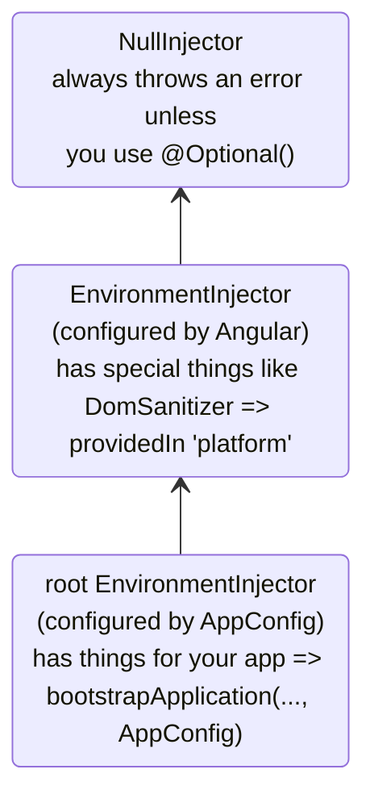
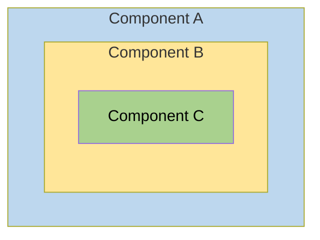
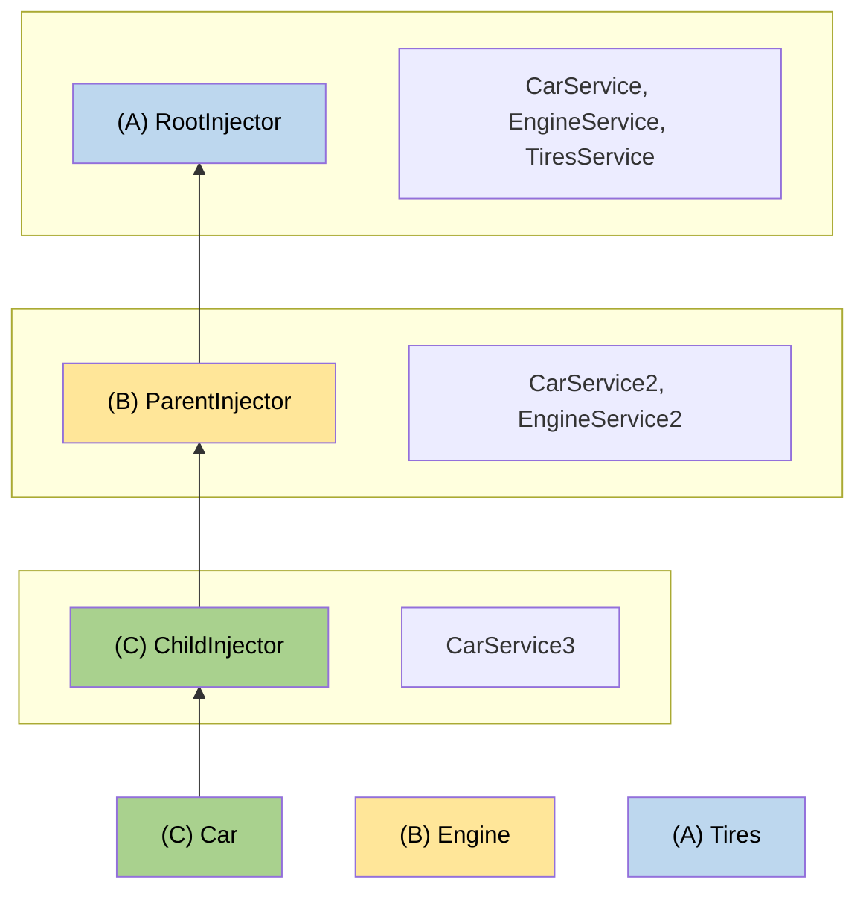

# Иерархические инжекторы

Это руководство подробно описывает иерархическую систему внедрения зависимостей Angular: правила разрешения, модификаторы и продвинутые паттерны.

NOTE: Базовые концепции иерархии инжекторов и области провайдеров см. в [руководстве по определению провайдеров зависимостей](guide/di/defining-dependency-providers#injector-hierarchy-in-angular).

## Типы иерархий инжекторов {#types-of-injector-hierarchies}

В Angular две иерархии инжекторов:

| Иерархия инжекторов            | Подробности                                                                                                                                                               |
| :----------------------------- | :------------------------------------------------------------------------------------------------------------------------------------------------------------------------ |
| Иерархия `EnvironmentInjector` | Настраивается через `@Service()` или массив `providers` в `ApplicationConfig`.                                                                                            |
| Иерархия `ElementInjector`     | Создаётся неявно для каждого DOM-элемента. По умолчанию пуста, пока не настроить свойство `providers` у `@Directive()` или `@Component()`.                                |

<docs-callout title="NgModule Based Applications">
В приложениях на основе `NgModule` зависимости можно предоставлять через иерархию `ModuleInjector` с помощью аннотации `@NgModule()` или `@Injectable()`.
</docs-callout>

### `EnvironmentInjector` {#environmentinjector}

`EnvironmentInjector` можно настроить одним из двух способов:

- Через `@Service()`
- Через массив `providers` в `ApplicationConfig`

<docs-callout title="Tree-shaking and @Service()">

Декоратор `@Service()` предпочтительнее массива `providers` в `ApplicationConfig`. С `@Service` инструменты оптимизации могут выполнять tree-shaking и удалять неиспользуемые сервисы. Это уменьшает размер бандла.

Tree-shaking особенно полезен для библиотеки: приложение, использующее библиотеку, может не внедрять этот сервис.

</docs-callout>

`EnvironmentInjector` настраивается через `ApplicationConfig.providers`.

Предоставляйте сервисы с `@Service()` так:

```ts {highlight:[4]}
import {Service} from '@angular/core';

@Service() // <--provides this service in the root EnvironmentInjector
export class ItemService {
  name = 'telephone';
}
```

Декораторы `@Service()` или `@Injectable()` идентифицируют класс сервиса.

### ModuleInjector {#moduleinjector}

В приложениях на основе `NgModule` ModuleInjector можно настроить одним из способов:

- Декоратор `@Service()`,
- Свойство `providedIn` у `@Injectable()` со значением `root` или `platform`
- Массив `providers` у `@NgModule()`

`ModuleInjector` настраивается свойствами `@NgModule.providers` и `NgModule.imports`. `ModuleInjector` — это объединение всех массивов providers, достижимых рекурсивным обходом `NgModule.imports`.

Дочерние иерархии `ModuleInjector` создаются при ленивой загрузке других `@NgModules`.

### Platform injector {#platform-injector}

Над `root` есть ещё два инжектора: дополнительный `EnvironmentInjector` и `NullInjector()`.

Рассмотрим, как Angular загружает приложение в `main.ts`:

```ts
bootstrapApplication(App, appConfig);
```

Метод `bootstrapApplication()` создаёт дочерний инжектор platform-инжектора, настроенный экземпляром `ApplicationConfig`.
Это `root` `EnvironmentInjector`.

Метод `platformBrowserDynamic()` создаёт инжектор, настроенный `PlatformModule` с платформо-специфичными зависимостями.
Это позволяет нескольким приложениям делить конфигурацию платформы.
Например, у браузера одна адресная строка, сколько бы приложений ни работало.
Дополнительные платформо-специфичные провайдеры можно настроить на уровне платформы, передав `extraProviders` в функцию `platformBrowser()`.

Следующий родительский инжектор в иерархии — `NullInjector()`, вершина дерева.
Если поиск дошёл до `NullInjector()`, вы получите ошибку, если не использовали `@Optional()`: всё заканчивается на `NullInjector()`, который возвращает ошибку или, в случае `@Optional()`, `null`.
Подробнее об `@Optional()` — в [разделе `@Optional()`](#optional) этого руководства.

Следующая диаграмма показывает связь между `root` `ModuleInjector` и его родительскими инжекторами.


```mermaid
stateDiagram-v2
    elementInjector: EnvironmentInjector<br>(configured by Angular)<br>has special things like DomSanitizer => providedIn 'platform'
    rootInjector: root EnvironmentInjector<br>(configured by AppConfig)<br>has things for your app => bootstrapApplication(..., AppConfig)
    nullInjector: NullInjector<br>always throws an error unless<br>you use @Optional()

    direction BT
    rootInjector --> elementInjector
    elementInjector --> nullInjector
```

Имя `root` — специальный псевдоним; у других иерархий `EnvironmentInjector` псевдонимов нет.
Иерархии `EnvironmentInjector` можно создавать при создании динамически загружаемого компонента, например через Router, который создаёт дочерние иерархии `EnvironmentInjector`.

Все запросы поднимаются к root-инжектору — независимо от того, настроили ли вы его через `ApplicationConfig` в `bootstrapApplication()`, или зарегистрировали провайдеры с `root` в самих сервисах.

<docs-callout title="@Injectable() vs. ApplicationConfig">

Если настроить app-wide провайдер в `ApplicationConfig` у `bootstrapApplication`, он переопределяет конфигурацию для `root` в метаданных `@Injectable()`.
Так можно настроить нестандартный провайдер сервиса, общего для нескольких приложений.

Пример: конфигурация роутера компонентов включает нестандартную [стратегию location](guide/routing/common-router-tasks#locationstrategy-and-browser-url-styles), перечисляя её провайдер в списке `providers` у `ApplicationConfig`.

```ts
providers: [{provide: LocationStrategy, useClass: HashLocationStrategy}];
```

В приложениях на основе `NgModule` app-wide провайдеры настраивают в `providers` у `AppModule`.

</docs-callout>

### `ElementInjector` {#elementinjector}

Angular неявно создаёт иерархии `ElementInjector` для каждого DOM-элемента.

Предоставление сервиса в декораторе `@Component()` через свойства `providers` или `viewProviders` настраивает `ElementInjector`.
Например, следующий `TestComponent` настраивает `ElementInjector`, предоставляя сервис так:

```ts {highlight:[3]}
@Component({
  /* … */
  providers: [{ provide: ItemService, useValue: { name: 'lamp' } }]
})
export class TestComponent
```

HELPFUL: См. раздел [правила разрешения](#resolution-rules), чтобы понять связь между деревом `EnvironmentInjector`, `ModuleInjector` и деревом `ElementInjector`.

Когда вы предоставляете сервисы в компоненте, сервис доступен через `ElementInjector` этого экземпляра компонента.
Он также может быть виден дочерним компонентам/директивам согласно правилам видимости из раздела [правила разрешения](#resolution-rules).

Когда экземпляр компонента уничтожается, уничтожается и экземпляр сервиса.

#### `@Directive()` и `@Component()` {#directive-and-component}

Компонент — особый тип директивы, поэтому у `@Component()` есть свойство `providers`, как и у `@Directive()`.
Директивы и компоненты могут настраивать провайдеры через свойство `providers`.
Когда вы настраиваете провайдер для компонента или директивы через `providers`, этот провайдер принадлежит `ElementInjector` этого компонента или директивы.
Компоненты и директивы на одном элементе делят один инжектор.

## Правила разрешения {#resolution-rules}

При разрешении токена для компонента/директивы Angular делает это в две фазы:

1. Против родителей в иерархии `ElementInjector`.
2. Против родителей в иерархии `EnvironmentInjector`.

Когда компонент объявляет зависимость, Angular пытается удовлетворить её собственным `ElementInjector`.
Если у инжектора компонента нет провайдера, запрос передаётся родительскому `ElementInjector`.

Запросы продолжают подниматься, пока Angular не найдёт инжектор, способный обработать запрос, или не закончатся предки в иерархиях `ElementInjector`.

Если Angular не находит провайдер ни в одной иерархии `ElementInjector`, он возвращается к элементу, откуда исходил запрос, и ищет в иерархии `EnvironmentInjector`.
Если провайдер всё ещё не найден, Angular выбрасывает ошибку.

Если провайдер для одного DI-токена зарегистрирован на разных уровнях, Angular использует первый встреченный.
Например, если провайдер зарегистрирован локально в компоненте, которому нужен сервис, Angular не ищет другой провайдер того же сервиса.

HELPFUL: В приложениях на основе `NgModule` Angular ищет в иерархии `ModuleInjector`, если не находит провайдер в иерархиях `ElementInjector`.

## Модификаторы разрешения {#resolution-modifiers}

Поведение разрешения Angular можно изменить с помощью `optional`, `self`, `skipSelf` и `host`.
Импортируйте каждый из `@angular/core` и используйте в конфигурации [`inject`](/api/core/inject) при внедрении сервиса.

### Типы модификаторов {#types-of-modifiers}

Модификаторы разрешения делятся на три категории:

- Что делать, если Angular не находит нужное — `optional`
- Где начинать поиск — `skipSelf`
- Где останавливать поиск — `host` и `self`

По умолчанию Angular всегда начинает с текущего `Injector` и продолжает поиск вверх.
Модификаторы позволяют изменить начальную (_self_) и конечную точки поиска.

Кроме того, можно комбинировать все модификаторы, кроме:

- `host` и `self`
- `skipSelf` и `self`.

### `optional` {#optional}

`optional` позволяет считать внедряемый сервис опциональным.
Если его нельзя разрешить в runtime, Angular разрешает сервис как `null`, а не выбрасывает ошибку.
В следующем примере сервис `OptionalService` не предоставлен в сервисе, `ApplicationConfig`, `@NgModule()` или классе компонента, поэтому недоступен нигде в приложении.

```ts {header:"src/app/optional/optional.ts"}
export class Optional {
  public optional? = inject(OptionalService, {optional: true});
}
```

### `self` {#self}

Используйте `self`, чтобы Angular смотрел только на `ElementInjector` текущего компонента или директивы.

Хороший сценарий для `self` — внедрить сервис только если он доступен на текущем host-элементе.
Чтобы избежать ошибок, комбинируйте `self` с `optional`.

Например, в следующем `SelfNoData` обратите внимание на внедрённый `LeafService` как свойство.

```ts {header: 'self-no-data.ts', highlight: [7]}
@Component({
  selector: 'app-self-no-data',
  templateUrl: './self-no-data.html',
  styleUrls: ['./self-no-data.css'],
})
export class SelfNoData {
  public leaf = inject(LeafService, {optional: true, self: true});
}
```

В этом примере есть родительский провайдер, и обычное внедрение вернёт значение; однако внедрение с `self` и `optional` вернёт `null`, потому что `self` останавливает поиск на текущем host-элементе.

Другой пример показывает класс компонента с провайдером для `FlowerService`.
В этом случае инжектор не ищет дальше текущего `ElementInjector`, потому что находит `FlowerService` и возвращает тюльпан 🌷.

```ts {header:"src/app/self/self.ts"}
@Component({
  selector: 'app-self',
  templateUrl: './self.html',
  styleUrls: ['./self.css'],
  providers: [{provide: FlowerService, useValue: {emoji: '🌷'}}],
})
export class Self {
  public flower = inject(FlowerService, {self: true});
}
```

### `skipSelf` {#skipself}

`skipSelf` — противоположность `self`.
С `skipSelf` Angular начинает поиск сервиса в родительском `ElementInjector`, а не в текущем.
Поэтому если родительский `ElementInjector` использует значение папоротника <code>🌿</code> для `emoji`, а в массиве `providers` компонента — кленовый лист <code>🍁</code>, Angular проигнорирует кленовый лист <code>🍁</code> и использует папоротник <code>🌿</code>.

В коде предположим, что родительский компонент использует следующее значение `emoji`, как в этом сервисе:

```ts {header: 'leaf.service.ts'}
export class LeafService {
  emoji = '🌿';
}
```

Представьте, что в дочернем компоненте другое значение — кленовый лист 🍁, но нужно использовать значение родителя.
Тогда применяют `skipSelf`:

```ts {header:"skipself.ts" highlight:[[6],[10]]}
@Component({
  selector: 'app-skipself',
  templateUrl: './skipself.html',
  styleUrls: ['./skipself.css'],
  // Angular would ignore this LeafService instance
  providers: [{provide: LeafService, useValue: {emoji: '🍁'}}],
})
export class Skipself {
  // Use skipSelf as inject option
  public leaf = inject(LeafService, {skipSelf: true});
}
```

В этом случае значение `emoji` будет папоротник <code>🌿</code>, а не кленовый лист <code>🍁</code>.

#### Опция `skipSelf` с `optional` {#skipself-option-with-optional}

Используйте опцию `skipSelf` с `optional`, чтобы предотвратить ошибку, если значение `null`.

В следующем примере сервис `Person` внедряется при инициализации свойства.
`skipSelf` говорит Angular пропустить текущий инжектор, а `optional` предотвратит ошибку, если `Person` окажется `null`.

```ts
class Person {
  parent = inject(Person, {optional: true, skipSelf: true});
}
```

### `host` {#host}

<!-- TODO: Remove ambiguity between host and self. -->

`host` позволяет назначить компонент последней остановкой в дереве инжекторов при поиске провайдеров.

Даже если экземпляр сервиса есть выше по дереву, Angular не продолжит поиск.
Используйте `host` так:

```ts {header:"host.ts" highlight:[[6],[9]]}
@Component({
  selector: 'app-host',
  templateUrl: './host.html',
  styleUrls: ['./host.css'],
  // provide the service
  providers: [{provide: FlowerService, useValue: {emoji: '🌷'}}],
})
export class Host {
  // use host when injecting the service
  flower = inject(FlowerService, {host: true, optional: true});
}
```

Поскольку у `Host` есть опция `host`, независимо от значения `flower.emoji` у родителя `Host`, `Host` будет использовать тюльпан <code>🌷</code>.

### Модификаторы с внедрением через конструктор {#modifiers-with-constructor-injection}

Аналогично, поведение внедрения через конструктор можно изменить с помощью `@Optional()`, `@Self()`, `@SkipSelf()` и `@Host()`.

Импортируйте каждый из `@angular/core` и используйте в конструкторе класса компонента при внедрении сервиса.

```ts {header:"self-no-data.ts" highlight:[2]}
export class SelfNoData {
  constructor(@Self() @Optional() public leaf?: LeafService) {}
}
```

## Логическая структура шаблона {#logical-structure-of-the-template}

Когда вы предоставляете сервисы в классе компонента, они видны в дереве `ElementInjector` относительно того, где и как вы их предоставляете.

Понимание логической структуры шаблона Angular даёт основу для настройки сервисов и контроля их видимости.

Компоненты используются в шаблонах, как в следующем примере:

```html
<app-root> <app-child />; </app-root>
```

HELPFUL: Обычно компоненты и их шаблоны объявляют в отдельных файлах.
Чтобы понять, как работает система внедрения, полезно смотреть на них как на объединённое логическое дерево.
Термин _логическое_ отличает его от дерева рендера — DOM-дерева приложения.
Чтобы отметить расположение шаблонов компонентов, в этом руководстве используется псевдоэлемент `<#VIEW>`, которого нет в дереве рендера и который нужен только для ментальной модели.

Пример объединения деревьев представлений `<app-root>` и `<app-child>` в одно логическое дерево:

```html
<app-root>
  <#VIEW>
    <app-child>
     <#VIEW>
       …content goes here…
     </#VIEW>
    </app-child>
  </#VIEW>
</app-root>
```

Понимание разметки `<#VIEW>` особенно важно при настройке сервисов в классе компонента.

## Пример: предоставление сервисов в `@Component()` {#example-providing-services-in-component}

То, как вы предоставляете сервисы через декоратор `@Component()` (или `@Directive()`), определяет их видимость.
В следующих разделах демонстрируются `providers` и `viewProviders`, а также способы изменения видимости сервисов с `skipSelf` и `host`.

Класс компонента может предоставлять сервисы двумя способами:

| Массивы                      | Подробности                                    |
| :--------------------------- | :--------------------------------------------- |
| Массив `providers`           | `@Component({ providers: [SomeService] })`     |
| Массив `viewProviders`       | `@Component({ viewProviders: [SomeService] })` |

В примерах ниже вы увидите логическое дерево приложения Angular.
Чтобы показать, как инжектор работает в контексте шаблонов, логическое дерево представляет HTML-структуру приложения.
Например, логическое дерево покажет, что `<child-component>` — прямой потомок `<parent-component>`.

В логическом дереве вы увидите специальные атрибуты: `@Provide`, `@Inject` и `@ApplicationConfig`.
Это не настоящие атрибуты — они демонстрируют, что происходит «под капотом».

| Атрибут сервиса Angular   | Подробности                                                                                          |
| :------------------------ | :--------------------------------------------------------------------------------------------------- |
| `@Inject(Token)=>Value`   | Если `Token` внедряется в этом месте логического дерева, его значение будет `Value`.                 |
| `@Provide(Token=Value)`   | Указывает, что `Token` предоставлен со значением `Value` в этом месте логического дерева.            |
| `@ApplicationConfig`      | Показывает, что в этом месте следует использовать запасной `EnvironmentInjector`.                    |

### Структура примера приложения {#example-app-structure}

В примере приложения `FlowerService` предоставлен в `root` со значением `emoji` — красный гибискус <code>🌺</code>.

```ts {header:"flower.service.ts"}
@Service()
export class FlowerService {
  emoji = '🌺';
}
```

Рассмотрим приложение только с `App` и `Child`.
Самое базовое отрендеренное представление выглядело бы как вложенные HTML-элементы:

```html
<app-root>
  <!-- App selector -->
  <app-child> <!-- Child selector --> </app-child>
</app-root>
```

Однако за кулисами Angular использует логическое представление при разрешении запросов внедрения:

```html
<app-root> <!-- App selector -->
  <#VIEW>
    <app-child> <!-- Child selector -->
      <#VIEW>
      </#VIEW>
    </app-child>
  </#VIEW>
</app-root>
```

Здесь `<#VIEW>` представляет экземпляр шаблона.
У каждого компонента свой `<#VIEW>`.

Знание этой структуры помогает предоставлять и внедрять сервисы и даёт полный контроль над их видимостью.

Теперь предположим, что `<app-root>` внедряет `FlowerService`:

```typescript
export class App {
  flower = inject(FlowerService);
}
```

Добавьте привязку в шаблон `<app-root>`, чтобы визуализировать результат:

```html
<p>Emoji from FlowerService: {{flower.emoji}}</p>
```

Вывод в представлении:

```text {hideCopy}
Emoji from FlowerService: 🌺
```

В логическом дереве это выглядит так:

```html
<app-root @ApplicationConfig
        @Inject(FlowerService) flower=>"🌺">
  <#VIEW>
    <p>Emoji from FlowerService: {{flower.emoji}} (🌺)</p>
    <app-child>
      <#VIEW>
      </#VIEW>
    </app-child>
  </#VIEW>
</app-root>
```

Когда `<app-root>` запрашивает `FlowerService`, задача инжектора — разрешить токен `FlowerService`.
Разрешение токена происходит в две фазы:

1. Инжектор определяет начальную и конечную точки поиска в логическом дереве.
   Он начинает с начальной точки и ищет токен на каждом уровне представления.
   Если токен найден — возвращает его.

1. Если токен не найден, инжектор ищет ближайший родительский `EnvironmentInjector`, чтобы делегировать запрос.

В примере ограничения такие:

1. Начать с `<#VIEW>`, принадлежащего `<app-root>`, и закончить на `<app-root>`.
   - Обычно поиск начинается в точке внедрения.
     Однако `<app-root>` — компонент. У `@Component` также есть собственные `viewProviders`, поэтому поиск начинается с `<#VIEW>` у `<app-root>`.
     Для директивы, сопоставленной в том же месте, это было бы иначе.
   - Конечная точка совпадает с самим компонентом, потому что это самый верхний компонент в приложении.

1. `EnvironmentInjector`, предоставленный `ApplicationConfig`, действует как запасной инжектор, когда токен не найден в иерархиях `ElementInjector`.

### Использование массива `providers` {#using-the-providers-array}

Теперь в классе `Child` добавьте провайдер для `FlowerService`, чтобы продемонстрировать более сложные правила разрешения:

```ts
@Component({
  selector: 'app-child',
  templateUrl: './child.html',
  styleUrls: ['./child.css'],
  // use the providers array to provide a service
  providers: [{provide: FlowerService, useValue: {emoji: '🌻'}}],
})
export class Child {
  // inject the service
  flower = inject(FlowerService);
}
```

Теперь, когда `FlowerService` предоставлен в декораторе `@Component()`, при запросе сервиса `<app-child>` инжектору достаточно посмотреть на `ElementInjector` в `<app-child>`.
Ему не нужно продолжать поиск дальше по дереву инжекторов.

Следующий шаг — добавить привязку в шаблон `Child`.

```html
<p>Emoji from FlowerService: {{flower.emoji}}</p>
```

Чтобы отобразить новые значения, добавьте `<app-child>` в конец шаблона `App`, чтобы представление также показывало подсолнух:

```text {hideCopy}
Child Component
Emoji from FlowerService: 🌻
```

В логическом дереве это представлено так:

```html
<app-root @ApplicationConfig
          @Inject(FlowerService) flower=>"🌺">
  <#VIEW>

  <p>Emoji from FlowerService: {{flower.emoji}} (🌺)</p>
  <app-child @Provide(FlowerService="🌻" )
             @Inject(FlowerService)=>"🌻"> <!-- search ends here -->
    <#VIEW> <!-- search starts here -->
    <h2>Child Component</h2>
    <p>Emoji from FlowerService: {{flower.emoji}} (🌻)</p>
  </
  #VIEW>
  </app-child>
</#VIEW>
</app-root>
```

Когда `<app-child>` запрашивает `FlowerService`, инжектор начинает поиск с `<#VIEW>`, принадлежащего `<app-child>` (`<#VIEW>` включён, потому что внедрение идёт из `@Component()`), и заканчивает на `<app-child>`.
В этом случае `FlowerService` разрешается в массиве `providers` с подсолнухом <code>🌻</code> у `<app-child>`.
Инжектору не нужно смотреть дальше по дереву.
Он останавливается, как только находит `FlowerService`, и никогда не видит красный гибискус <code>🌺</code>.

### Использование массива `viewProviders` {#using-the-viewproviders-array}

Массив `viewProviders` — ещё один способ предоставить сервисы в декораторе `@Component()`.
С `viewProviders` сервисы видны в `<#VIEW>`.

HELPFUL: Шаги те же, что и с массивом `providers`, за исключением использования `viewProviders`.

Для пошаговых инструкций продолжайте этот раздел.
Если можете настроить самостоятельно, переходите к [изменению доступности сервисов](#visibility-of-provided-tokens).

Для демонстрации создаём `AnimalService`, чтобы показать `viewProviders`.
Сначала создайте `AnimalService` со свойством `emoji` — кит <code>🐳</code>:

```typescript
import {Service} from '@angular/core';

@Service()
export class AnimalService {
  emoji = '🐳';
}
```

По тому же паттерну, что и с `FlowerService`, внедрите `AnimalService` в классе `App`:

```ts
export class App {
  public flower = inject(FlowerService);
  public animal = inject(AnimalService);
}
```

HELPFUL: Код, связанный с `FlowerService`, можно оставить — он позволит сравнить с `AnimalService`.

Добавьте массив `viewProviders` и внедрите `AnimalService` также в классе `<app-child>`, но дайте `emoji` другое значение.
Здесь это собака 🐶.

```typescript
@Component({
  selector: 'app-child',
  templateUrl: './child.html',
  styleUrls: ['./child.css'],
  // provide services
  providers: [{provide: FlowerService, useValue: {emoji: '🌻'}}],
  viewProviders: [{provide: AnimalService, useValue: {emoji: '🐶'}}],
})
export class Child {
  // inject services
  flower = inject(FlowerService);
  animal = inject(AnimalService);
}
```

Добавьте привязки в шаблоны `Child` и `App`.
В шаблоне `Child`:

```html
<p>Emoji from AnimalService: {{animal.emoji}}</p>
```

И то же в шаблоне `App`:

```html
<p>Emoji from AnimalService: {{animal.emoji}}</p>
```

В браузере должны быть видны оба значения:

```text {hideCopy}
App
Emoji from AnimalService: 🐳

Child Component
Emoji from AnimalService: 🐶
```

Логическое дерево для этого примера `viewProviders`:

```html
<app-root @ApplicationConfig
          @Inject(AnimalService) animal=>"🐳">
  <#VIEW>
  <app-child>
    <#VIEW @Provide(AnimalService="🐶")
    @Inject(AnimalService=>"🐶")>

    <!-- ^^using viewProviders means AnimalService is available in <#VIEW>-->
    <p>Emoji from AnimalService: {{animal.emoji}} (🐶)</p>
  </
  #VIEW>
  </app-child>
</#VIEW>
</app-root>
```

Как и в примере с `FlowerService`, `AnimalService` предоставлен в декораторе `@Component()` у `<app-child>`.
Это значит, что инжектор сначала смотрит в `ElementInjector` компонента и находит значение `AnimalService` — собака <code>🐶</code>.
Ему не нужно продолжать поиск по дереву `ElementInjector` или в `ModuleInjector`.

### `providers` и `viewProviders` {#providers-vs-viewproviders}

Поле `viewProviders` концептуально похоже на `providers`, но есть важное отличие.
Провайдеры в `viewProviders` видны только внутри собственного представления компонента — контент, спроецированный через `<ng-content>`, их не видит.

Чтобы увидеть разницу между `providers` и `viewProviders`, добавьте ещё один компонент — `Inspector`.
`Inspector` будет потомком `Child`.
В `inspector.ts` внедрите `FlowerService` и `AnimalService` при инициализации свойств:

```typescript
export class Inspector {
  flower = inject(FlowerService);
  animal = inject(AnimalService);
}
```

Массивы `providers` или `viewProviders` не нужны.
Далее в `inspector.html` добавьте ту же разметку, что и в предыдущих компонентах:

```html
<p>Emoji from FlowerService: {{flower.emoji}}</p>
<p>Emoji from AnimalService: {{animal.emoji}}</p>
```

Не забудьте добавить `Inspector` в массив `imports` у `Child`.

```ts
@Component({
  ...
  imports: [Inspector]
})
```

Далее добавьте в `child.html`:

```html
...

<div class="container">
  <h3>Content projection</h3>
  <ng-content />
</div>
<h3>Inside the view</h3>

<app-inspector />
```

`<ng-content>` позволяет проецировать контент, а `<app-inspector>` внутри шаблона `Child` делает `Inspector` дочерним компонентом `Child`.

Далее добавьте в `app.html`, чтобы использовать проекцию контента:

```html
<app-child>
  <app-inspector />
</app-child>
```

Браузер теперь рендерит следующее (предыдущие примеры опущены для краткости):

```text {hideCopy}
...
Content projection

Emoji from FlowerService: 🌻
Emoji from AnimalService: 🐳

Emoji from FlowerService: 🌻
Emoji from AnimalService: 🐶
```

Эти четыре привязки демонстрируют разницу между `providers` и `viewProviders`.
Помните: эмодзи собаки <code>🐶</code> объявлен внутри `<#VIEW>` у `Child` и не виден спроецированному контенту.
Вместо этого спроецированный контент видит кита <code>🐳</code>.

Может возникнуть вопрос, почему спроецированный `<app-inspector>` всё ещё видит <code>🐳</code> из `viewProviders` у `App`.
Причина в том, что Angular DI отслеживает **где компонент был объявлен**, а не где он в итоге отрендерен.
`<app-inspector>` живёт в шаблоне `App` — внутри `<#VIEW>` у `App` — поэтому `viewProviders` у `App` доступны.
Проекция в `Child` отрезает доступ к `viewProviders` у `Child` (<code>🐶</code>), но провайдеры `App` (<code>🐳</code>) по-прежнему достижимы вверх по дереву.

Однако в следующем блоке вывода `Inspector` — настоящий дочерний компонент `Child`, он внутри `<#VIEW>`, поэтому при запросе `AnimalService` видит собаку <code>🐶</code>.

`AnimalService` в логическом дереве выглядел бы так:

```html
<app-root @ApplicationConfig
          @Inject(AnimalService) animal=>"🐳">
  <#VIEW>
  <app-child>
    <#VIEW @Provide(AnimalService="🐶")
    @Inject(AnimalService=>"🐶")>

    <!-- ^^using viewProviders means AnimalService is available in <#VIEW>-->
    <p>Emoji from AnimalService: {{animal.emoji}} (🐶)</p>

    <div class="container">
      <h3>Content projection</h3>
      <app-inspector @Inject(AnimalService) animal=>"🐳">
        <p>Emoji from AnimalService: {{animal.emoji}} (🐳)</p>
      </app-inspector>
    </div>

    <app-inspector>
      <#VIEW @Inject(AnimalService) animal=>"🐶">
      <p>Emoji from AnimalService: {{animal.emoji}} (🐶)</p>
    </
    #VIEW>
    </app-inspector>
  </
  #VIEW>
  </app-child>

</#VIEW>
</app-root>
```

Спроецированный `<app-inspector>` получает <code>🐳</code>, потому что <code>🐶</code> принадлежит представлению `Child`, и спроецированный контент до него не дотягивается.
<code>🐳</code> доступен, потому что `<app-inspector>` был объявлен в шаблоне `App` и может подняться к `viewProviders` у `App`.

`<app-inspector>`, живущий напрямую внутри шаблона `Child` (не спроецированный), получает <code>🐶</code> — он внутри `<#VIEW>`, границы пересекать не нужно.

### Видимость предоставленных токенов {#visibility-of-provided-tokens}

Декораторы видимости влияют на то, где начинается и заканчивается поиск injection token в логическом дереве.
Для этого размещайте конфигурацию видимости в точке внедрения — при вызове `inject()`, а не в точке объявления.

Чтобы изменить, где инжектор начинает искать `FlowerService`, добавьте `skipSelf` к вызову `inject()` в `<app-child>`, где внедряется `FlowerService`.
Этот вызов — инициализатор свойства в `<app-child>`, как показано в `child.ts`:

```typescript
flower = inject(FlowerService, {skipSelf: true});
```

С `skipSelf` инжектор `<app-child>` не ищет `FlowerService` у себя.
Вместо этого поиск начинается с `ElementInjector` у `<app-root>`, где ничего нет.
Затем он возвращается к `ModuleInjector` у `<app-child>` и находит значение красного гибискуса <code>🌺</code>, доступное потому что `<app-child>` и `<app-root>` делят один `ModuleInjector`.
UI показывает:

```text {hideCopy}
Emoji from FlowerService: 🌺
```

В логическом дереве та же идея может выглядеть так:

```html
<app-root @ApplicationConfig
          @Inject(FlowerService) flower=>"🌺">
  <#VIEW>
  <app-child @Provide(FlowerService="🌻" )>
    <#VIEW @Inject(FlowerService, SkipSelf)=>"🌺">

    <!-- With SkipSelf, the injector looks to the next injector up the tree (app-root) -->

  </
  #VIEW>
  </app-child>
</#VIEW>
</app-root>
```

Хотя `<app-child>` предоставляет подсолнух <code>🌻</code>, приложение рендерит красный гибискус <code>🌺</code>, потому что `skipSelf` заставляет текущий инжектор (`app-child`) пропустить себя и смотреть на родителя.

Если теперь добавить `host` (в дополнение к `skipSelf`), результат будет `null`.
Это потому что `host` ограничивает верхнюю границу поиска `<#VIEW>` у `app-child`.
В логическом дереве:

```html
<app-root @ApplicationConfig
          @Inject(FlowerService) flower=>"🌺">
  <#VIEW> <!-- end search here with null-->
  <app-child @Provide(FlowerService="🌻" )> <!-- start search here -->
    <#VIEW inject(FlowerService, {skipSelf: true, host: true, optional:true})=>null>
  </
  #VIEW>
  </app-parent>
</#VIEW>
</app-root>
```

Здесь сервисы и их значения те же, но `host` останавливает инжектор на `<#VIEW>` для `FlowerService`, поэтому он не находит его и возвращает `null`.

### `skipSelf` и `viewProviders` {#skipself-and-viewproviders}

Помните: `<app-child>` предоставляет `AnimalService` в массиве `viewProviders` со значением собака <code>🐶</code>.
Поскольку инжектору достаточно посмотреть на `ElementInjector` у `<app-child>` для `AnimalService`, он никогда не видит кита <code>🐳</code>.

Как в примере с `FlowerService`, если добавить `skipSelf` к `inject()` для `AnimalService`, инжектор не будет искать в `ElementInjector` текущего `<app-child>`.
Вместо этого поиск начнётся с `ElementInjector` у `<app-root>`.

```typescript
@Component({
  selector: 'app-child',
  …
  viewProviders: [
    { provide: AnimalService, useValue: { emoji: '🐶' } },
  ],
})
```

Логическое дерево с `skipSelf` в `<app-child>`:

```html
<app-root @ApplicationConfig
          @Inject(AnimalService=>"🐳")>
  <#VIEW><!-- search begins here -->
  <app-child>
    <#VIEW @Provide(AnimalService="🐶")
    @Inject(AnimalService, SkipSelf=>"🐳")>

    <!--Add skipSelf -->

  </
  #VIEW>
  </app-child>
</#VIEW>
</app-root>
```

С `skipSelf` в `<app-child>` инжектор начинает поиск `AnimalService` в `ElementInjector` у `<app-root>` и находит кита 🐳.

### `host` и `viewProviders` {#host-and-viewproviders}

Если использовать только `host` при внедрении `AnimalService`, результат — собака <code>🐶</code>, потому что инжектор находит `AnimalService` в самом `<#VIEW>` у `<app-child>`.
`Child` настраивает `viewProviders` так, что эмодзи собаки предоставляется как значение `AnimalService`.
Также можно увидеть `host` в `inject()`:

```typescript
@Component({
  selector: 'app-child',
  …
  viewProviders: [
    { provide: AnimalService, useValue: { emoji: '🐶' } },
  ]
})
export class Child {
  animal = inject(AnimalService, { host: true })
}
```

`host: true` заставляет инжектор искать, пока он не встретит границу `<#VIEW>`.

```html
<app-root @ApplicationConfig
          @Inject(AnimalService=>"🐳")>
  <#VIEW>
  <app-child>
    <#VIEW @Provide(AnimalService="🐶")
    inject(AnimalService, {host: true}=>"🐶")> <!-- host stops search here -->
  </
  #VIEW>
  </app-child>
</#VIEW>
</app-root>
```

Добавьте массив `viewProviders` с третьим животным — ёж <code>🦔</code> — в метаданные `@Component()` у `app.ts`:

```typescript
@Component({
  selector: 'app-root',
  templateUrl: './app.html',
  styleUrls: [ './app.css' ],
  viewProviders: [
    { provide: AnimalService, useValue: { emoji: '🦔' } },
  ],
})
```

Далее добавьте `skipSelf` вместе с `host` к `inject()` для внедрения `AnimalService` в `child.ts`.
Вот `host` и `skipSelf` в инициализации свойства `animal`:

```typescript
export class Child {
  animal = inject(AnimalService, {host: true, skipSelf: true});
}
```

<!-- TODO: This requires a rework. It seems not well explained what `viewProviders`/`injectors` is here
  and how `host` works.
 -->

Когда `host` и `skipSelf` применялись к `FlowerService` в массиве `providers`, результат был `null`, потому что `skipSelf` начинает поиск в инжекторе `<app-child>`, а `host` останавливает поиск на `<#VIEW>` — где нет `FlowerService`.
В логическом дереве видно, что `FlowerService` виден в `<app-child>`, а не в его `<#VIEW>`.

Однако `AnimalService`, предоставленный в массиве `viewProviders` у `App`, виден.

Логическое представление показывает почему:

```html
<app-root @ApplicationConfig
          @Inject(AnimalService=>"🐳")>
  <#VIEW @Provide(AnimalService="🦔")
  @Inject(AnimalService, @Optional)=>"🦔">

  <!-- ^^skipSelf starts here,  host stops here^^ -->
  <app-child>
    <#VIEW @Provide(AnimalService="🐶")
    inject(AnimalService, {skipSelf:true, host: true, optional: true})=>"🦔">
    <!-- Add skipSelf ^^-->
  </
  #VIEW>
  </app-child>
</#VIEW>
</app-root>
```

`skipSelf` заставляет инжектор начинать поиск `AnimalService` с `<app-root>`, а не с `<app-child>`, откуда исходит запрос, а `host` останавливает поиск на `<#VIEW>` у `<app-root>`.
Поскольку `AnimalService` предоставлен через массив `viewProviders`, инжектор находит ежа <code>🦔</code> в `<#VIEW>`.

## Пример: сценарии использования `ElementInjector` {#example-elementinjector-use-cases}

Возможность настраивать один или несколько провайдеров на разных уровнях открывает полезные возможности.

### Сценарий: изоляция сервиса {#scenario-service-isolation}

Архитектурные причины могут потребовать ограничить доступ к сервису доменом приложения, которому он принадлежит.
Например, рассмотрим `VillainsList`, отображающий список злодеев.
Он получает злодеев из `VillainsService`.

Если предоставить `VillainsService` в корневом `AppModule`, сервис станет виден везде в приложении.
Если позже изменить `VillainsService`, можно сломать что-то в других компонентах, которые случайно начали от него зависеть.

Вместо этого следует предоставить `VillainsService` в метаданных `providers` у `VillainsList`:

```typescript
@Component({
  selector: 'app-villains-list',
  templateUrl: './villains-list.html',
  providers: [VillainsService],
})
export class VillainsList {}
```

Предоставляя `VillainsService` в метаданных `VillainsList` и нигде больше, сервис становится доступен только в `VillainsList` и его поддереве компонентов.

`VillainsService` — синглтон относительно `VillainsList`, потому что объявлен там.
Пока `VillainsList` не уничтожен, это будет один и тот же экземпляр `VillainsService`, но если экземпляров `VillainsList` несколько, у каждого будет свой экземпляр `VillainsService`.

### Сценарий: несколько сессий редактирования {#scenario-multiple-edit-sessions}

Многие приложения позволяют пользователям работать над несколькими открытыми задачами одновременно.
Например, в приложении для подготовки налоговых деклараций специалист может работать над несколькими декларациями, переключаясь между ними в течение дня.

Чтобы продемонстрировать этот сценарий, представьте `HeroList`, отображающий список супергероев.

Чтобы открыть налоговую декларацию героя, специалист кликает по имени героя, что открывает компонент для редактирования этой декларации.
Каждая выбранная декларация открывается в своём компоненте, и несколько деклараций могут быть открыты одновременно.

У каждого компонента налоговой декларации следующие характеристики:

- Это собственная сессия редактирования декларации
- Можно менять декларацию, не затрагивая декларацию в другом компоненте
- Можно сохранить изменения или отменить их

Предположим, у `HeroTaxReturn` есть логика управления и восстановления изменений.
Для декларации героя это была бы простая задача.
В реальном мире с богатой моделью данных налоговой декларации управление изменениями было бы сложным.
Этим можно делегировать вспомогательному сервису, как в этом примере.

`HeroTaxReturnService` кэширует один `HeroTaxReturn`, отслеживает изменения этой декларации и может сохранить или восстановить её.
Он также делегирует app-wide синглтону `HeroService`, который получает через внедрение.

```typescript
import {inject, Service} from '@angular/core';
import {HeroTaxReturn} from './hero';
import {HeroesService} from './heroes.service';

@Service({autoProvided: false})
export class HeroTaxReturnService {
  private currentTaxReturn!: HeroTaxReturn;
  private originalTaxReturn!: HeroTaxReturn;

  private heroService = inject(HeroesService);

  set taxReturn(htr: HeroTaxReturn) {
    this.originalTaxReturn = htr;
    this.currentTaxReturn = htr.clone();
  }

  get taxReturn(): HeroTaxReturn {
    return this.currentTaxReturn;
  }

  restoreTaxReturn() {
    this.taxReturn = this.originalTaxReturn;
  }

  saveTaxReturn() {
    this.taxReturn = this.currentTaxReturn;
    this.heroService.saveTaxReturn(this.currentTaxReturn).subscribe();
  }
}
```

Вот `HeroTaxReturn`, использующий `HeroTaxReturnService`.

```typescript
import {Component, input, output} from '@angular/core';
import {HeroTaxReturn} from './hero';
import {HeroTaxReturnService} from './hero-tax-return.service';

@Component({
  selector: 'app-hero-tax-return',
  templateUrl: './hero-tax-return.html',
  styleUrls: ['./hero-tax-return.css'],
  providers: [HeroTaxReturnService],
})
export class HeroTaxReturn {
  message = '';

  close = output<void>();

  get taxReturn(): HeroTaxReturn {
    return this.heroTaxReturnService.taxReturn;
  }

  taxReturn = input.required<HeroTaxReturn>();

  constructor() {
    effect(() => {
      this.heroTaxReturnService.taxReturn = this.taxReturn();
    });
  }

  private heroTaxReturnService = inject(HeroTaxReturnService);

  onCanceled() {
    this.flashMessage('Canceled');
    this.heroTaxReturnService.restoreTaxReturn();
  }

  onClose() {
    this.close.emit();
  }

  onSaved() {
    this.flashMessage('Saved');
    this.heroTaxReturnService.saveTaxReturn();
  }

  flashMessage(msg: string) {
    this.message = msg;
    setTimeout(() => (this.message = ''), 500);
  }
}
```

_Декларация для редактирования_ приходит через свойство `input`, реализованное геттерами и сеттерами.
Сеттер инициализирует собственный экземпляр `HeroTaxReturnService` компонента входящей декларацией.
Геттер всегда возвращает то, что сервис считает текущим состоянием героя.
Компонент также просит сервис сохранить и восстановить эту декларацию.

Это не сработает, если сервис — app-wide синглтон.
Каждый компонент делил бы один экземпляр сервиса, и каждый перезаписывал бы декларацию другого героя.

Чтобы предотвратить это, настройте инжектор уровня компонента `HeroTaxReturn` для предоставления сервиса через свойство `providers` в метаданных компонента.

```typescript
providers: [HeroTaxReturnService];
```

У `HeroTaxReturn` свой провайдер `HeroTaxReturnService`.
Помните: у каждого _экземпляра_ компонента свой инжектор.
Предоставление сервиса на уровне компонента гарантирует, что _каждый_ экземпляр компонента получает приватный экземпляр сервиса. Так ни одна декларация не будет перезаписана.

HELPFUL: Остальной код сценария опирается на другие возможности и техники Angular, о которых можно узнать в других разделах документации.

### Сценарий: специализированные провайдеры {#scenario-specialized-providers}

Ещё одна причина снова предоставить сервис на другом уровне — подставить _более специализированную_ реализацию этого сервиса глубже в дереве компонентов.

Например, рассмотрим компонент `Car`, который включает информацию об обслуживании шин и зависит от других сервисов для деталей об автомобиле.

Root-инжектор, отмеченный как (A), использует _общие_ провайдеры для деталей о `CarService` и `EngineService`.

1. Компонент `Car` (A). Компонент (A) отображает данные об обслуживании шин и указывает общие сервисы для дополнительной информации об автомобиле.

2. Дочерний компонент (B). Компонент (B) определяет собственные _специализированные_ провайдеры для `CarService` и `EngineService` с особыми возможностями, подходящими для происходящего в компоненте (B).

3. Дочерний компонент (C) как потомок компонента (B). Компонент (C) определяет собственный, ещё _более специализированный_ провайдер для `CarService`.


```mermaid
graph TD;
subgraph COMPONENT_A[Component A]
subgraph COMPONENT_B[Component B]
COMPONENT_C[Component C]
end
end

style COMPONENT_A fill:#BDD7EE
style COMPONENT_B fill:#FFE699
style COMPONENT_C fill:#A9D18E,color:#000
classDef noShadow filter:none
class COMPONENT_A,COMPONENT_B,COMPONENT_C noShadow
```

За кулисами каждый компонент настраивает свой инжектор с нулём, одним или несколькими провайдерами, определёнными для самого компонента.

Когда вы разрешаете экземпляр `Car` в самом глубоком компоненте (C), его инжектор производит:

- Экземпляр `Car`, разрешённый инжектором (C)
- `Engine`, разрешённый инжектором (B)
- Его `Tires`, разрешённые root-инжектором (A).


```mermaid
graph BT;

subgraph A[" "]
direction LR
RootInjector["(A) RootInjector"]
ServicesA["CarService, EngineService, TiresService"]
end

subgraph B[" "]
direction LR
ParentInjector["(B) ParentInjector"]
ServicesB["CarService2, EngineService2"]
end

subgraph C[" "]
direction LR
ChildInjector["(C) ChildInjector"]
ServicesC["CarService3"]
end

direction LR
car["(C) Car"]
engine["(B) Engine"]
tires["(A) Tires"]

direction BT
car-->ChildInjector
ChildInjector-->ParentInjector-->RootInjector

class car,engine,tires,RootInjector,ParentInjector,ChildInjector,ServicesA,ServicesB,ServicesC,A,B,C noShadow
style car fill:#A9D18E,color:#000
style ChildInjector fill:#A9D18E,color:#000
style engine fill:#FFE699,color:#000
style ParentInjector fill:#FFE699,color:#000
style tires fill:#BDD7EE,color:#000
style RootInjector fill:#BDD7EE,color:#000
```

## Ещё о внедрении зависимостей {#more-on-dependency-injection}

<docs-pill-row>
  <docs-pill href="/guide/di/defining-dependency-providers" title="DI Providers"/>
</docs-pill-row>
