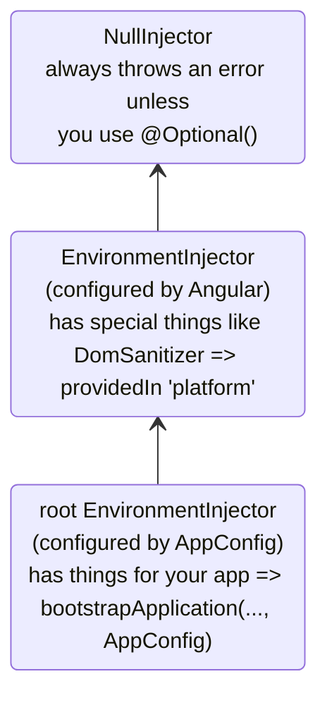
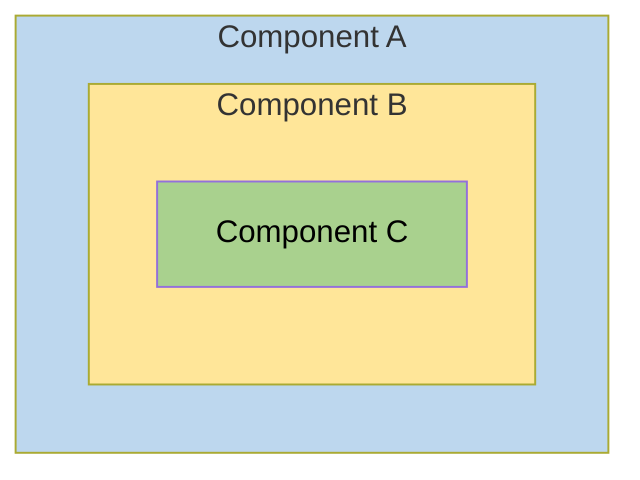
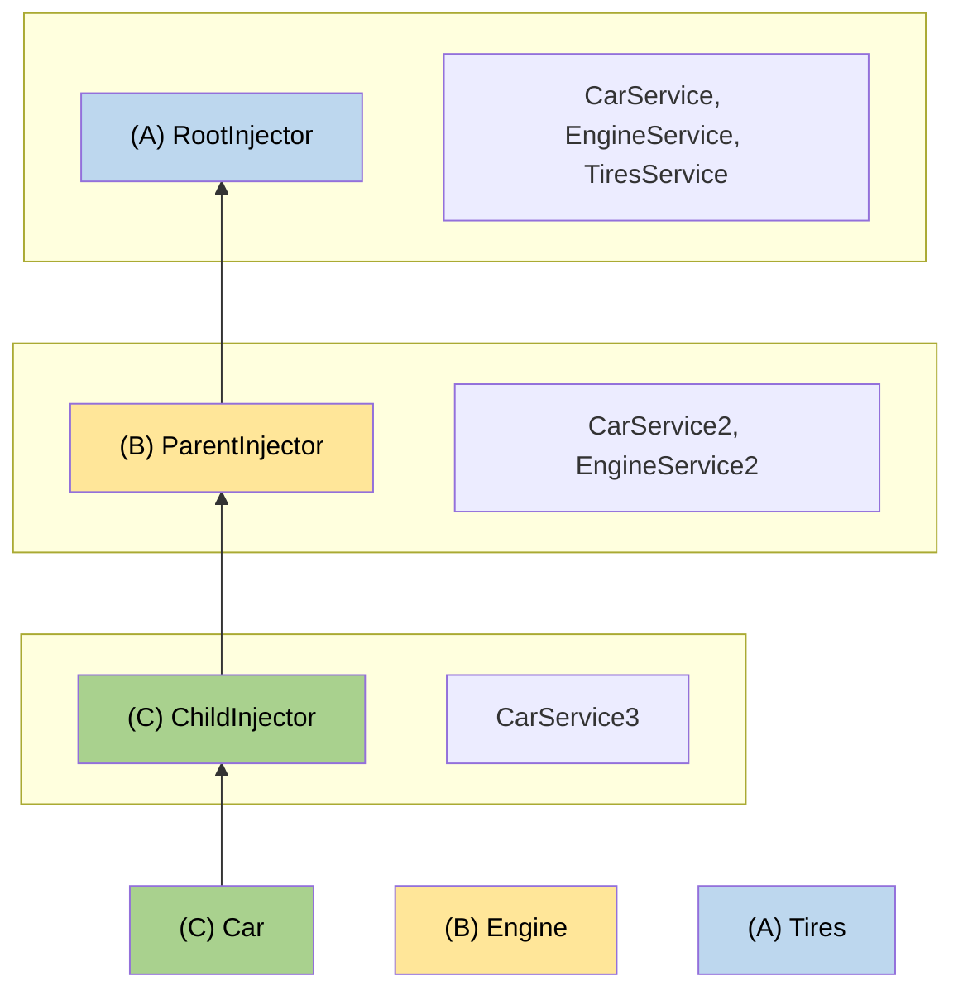

# Иерархические инжекторы {#hierarchical-injectors}

В этом руководстве подробно рассматривается иерархическая система внедрения зависимостей Angular, включая правила разрешения, модификаторы и продвинутые шаблоны.

NOTE: Основные концепции иерархии инжекторов и области видимости провайдеров см. в [руководстве по определению провайдеров зависимостей](guide/di/defining-dependency-providers#injector-hierarchy-in-angular).

## Типы иерархий инжекторов {#types-of-injector-hierarchies}

В Angular есть две иерархии инжекторов:

| Иерархии инжекторов             | Подробности                                                                                                                                                                                       |
| :------------------------------ | :------------------------------------------------------------------------------------------------------------------------------------------------------------------------------------------------ |
| Иерархия `EnvironmentInjector`  | Настройте `EnvironmentInjector` в этой иерархии с помощью `@Injectable()` или массива `providers` в `ApplicationConfig`.                                                                          |
| Иерархия `ElementInjector`      | Создаётся неявно для каждого DOM-элемента. По умолчанию `ElementInjector` пуст, если вы не настроите его в свойстве `providers` в `@Directive()` или `@Component()`.                              |

<docs-callout title="Приложения на основе NgModule">
Для приложений на основе `NgModule` можно предоставлять зависимости с использованием иерархии `ModuleInjector` через аннотацию `@NgModule()` или `@Injectable()`.
</docs-callout>

### `EnvironmentInjector` {#environmentinjector}

`EnvironmentInjector` можно настроить одним из двух способов:

- С помощью свойства `providedIn` в `@Injectable()`, указывающего `root` или `platform`
- С помощью массива `providers` в `ApplicationConfig`

<docs-callout title="Tree-shaking и @Injectable()">

Использование свойства `providedIn` в `@Injectable()` предпочтительнее использования массива `providers` в `ApplicationConfig`. С `@Injectable()` `providedIn` инструменты оптимизации могут выполнять tree-shaking, удаляя сервисы, которые не используются приложением. Это приводит к меньшим размерам бандла.

Tree-shaking особенно полезен для библиотек, поскольку приложение, использующее библиотеку, может не нуждаться в её внедрении.

</docs-callout>

`EnvironmentInjector` настраивается с помощью `ApplicationConfig.providers`.

Предоставляйте сервисы с помощью `providedIn` в `@Injectable()` следующим образом:

```ts {highlight:[4]}
import {Injectable} from '@angular/core';

@Injectable({
  providedIn: 'root', // <--provides this service in the root EnvironmentInjector
})
export class ItemService {
  name = 'telephone';
}
```

Декоратор `@Injectable()` идентифицирует класс сервиса.
Свойство `providedIn` настраивает конкретный `EnvironmentInjector` — здесь `root` — что делает сервис доступным в корневом `EnvironmentInjector`.

### ModuleInjector {#moduleinjector}

В случае приложений на основе `NgModule` `ModuleInjector` можно настроить одним из двух способов:

- С помощью свойства `providedIn` в `@Injectable()`, указывающего `root` или `platform`
- С помощью массива `providers` в `@NgModule()`

`ModuleInjector` настраивается свойствами `@NgModule.providers` и `NgModule.imports`. `ModuleInjector` является плоским объединением всех массивов провайдеров, которые можно достичь, рекурсивно следуя по `NgModule.imports`.

Дочерние иерархии `ModuleInjector` создаются при отложенной загрузке других `@NgModules`.

### Инжектор платформы {#platform-injector}

Над `root` есть ещё два инжектора: дополнительный `EnvironmentInjector` и `NullInjector()`.

Рассмотрим, как Angular загружает приложение со следующим кодом в `main.ts`:

```ts
bootstrapApplication(App, appConfig);
```

Метод `bootstrapApplication()` создаёт дочерний инжектор инжектора платформы, настроенный экземпляром `ApplicationConfig`.
Это и есть корневой `EnvironmentInjector`.

Метод `platformBrowserDynamic()` создаёт инжектор, настроенный `PlatformModule`, который содержит зависимости, специфичные для платформы.
Это позволяет нескольким приложениям совместно использовать конфигурацию платформы.
Например, в браузере есть только одна строка URL, независимо от того, сколько приложений запущено.
Вы можете настроить дополнительные провайдеры, специфичные для платформы, на уровне платформы, передав `extraProviders` с помощью функции `platformBrowser()`.

Следующий родительский инжектор в иерархии — это `NullInjector()`, который является вершиной дерева.
Если вы поднялись так высоко в дереве, что ищете сервис в `NullInjector()`, вы получите ошибку — если только не используете `@Optional()`, — поскольку в конечном счёте всё заканчивается в `NullInjector()`, который возвращает ошибку или, в случае `@Optional()`, `null`.
Подробнее о `@Optional()` см. в [разделе `@Optional()`](#optional) этого руководства.

На следующей диаграмме показана взаимосвязь корневого `ModuleInjector` и его родительских инжекторов, как описано в предыдущих абзацах.


```mermaid
stateDiagram-v2
    elementInjector: EnvironmentInjector<br>(configured by Angular)<br>has special things like DomSanitizer => providedIn 'platform'
    rootInjector: root EnvironmentInjector<br>(configured by AppConfig)<br>has things for your app => bootstrapApplication(..., AppConfig)
    nullInjector: NullInjector<br>always throws an error unless<br>you use @Optional()

    direction BT
    rootInjector --> elementInjector
    elementInjector --> nullInjector
```

Хотя имя `root` является специальным псевдонимом, другие иерархии `EnvironmentInjector` псевдонимов не имеют.
При создании динамически загружаемого компонента, например с помощью Router, можно создавать иерархии `EnvironmentInjector`, которые будут создавать дочерние иерархии `EnvironmentInjector`.

Все запросы направляются вверх до корневого инжектора, независимо от того, настроен ли он через экземпляр `ApplicationConfig`, переданный в метод `bootstrapApplication()`, или все провайдеры зарегистрированы с `root` в своих собственных сервисах.

<docs-callout title="@Injectable() vs. ApplicationConfig">

Если вы настраиваете провайдер уровня приложения в `ApplicationConfig` в `bootstrapApplication`, он переопределяет провайдер, настроенный для `root` в метаданных `@Injectable()`.
Это можно использовать для настройки нестандартного провайдера сервиса, разделяемого несколькими приложениями.

Вот пример случая, когда конфигурация маршрутизатора компонента включает нестандартную [стратегию расположения](guide/routing/common-router-tasks#locationstrategy-and-browser-url-styles) путём включения её провайдера в список `providers` в `ApplicationConfig`.

```ts
providers: [{provide: LocationStrategy, useClass: HashLocationStrategy}];
```

Для приложений на основе `NgModule` настраивайте провайдеры уровня приложения в `providers` `AppModule`.

</docs-callout>

### `ElementInjector` {#elementinjector}

Angular неявно создаёт иерархии `ElementInjector` для каждого DOM-элемента.

Предоставление сервиса в декораторе `@Component()` с помощью свойства `providers` или `viewProviders` настраивает `ElementInjector`.
Например, следующий `TestComponent` настраивает `ElementInjector`, предоставляя сервис следующим образом:

```ts {highlight:[3]}
@Component({
  /* … */
  providers: [{ provide: ItemService, useValue: { name: 'lamp' } }]
})
export class TestComponent
```

HELPFUL: Взаимосвязь между деревом `EnvironmentInjector`, `ModuleInjector` и деревом `ElementInjector` описана в разделе [правил разрешения](#resolution-rules).

Когда вы предоставляете сервисы в компоненте, этот сервис становится доступным через `ElementInjector` в этом экземпляре компонента.
Он также может быть виден в дочерних компонентах/директивах в соответствии с правилами видимости, описанными в разделе [правил разрешения](#resolution-rules).

При уничтожении экземпляра компонента уничтожается и экземпляр сервиса.

#### `@Directive()` и `@Component()` {#directive-and-component}

Компонент — это особый тип директивы, что означает: как `@Directive()` имеет свойство `providers`, так и `@Component()`.
Это означает, что директивы, как и компоненты, могут настраивать провайдеры с помощью свойства `providers`.
Когда вы настраиваете провайдер для компонента или директивы с помощью свойства `providers`, этот провайдер принадлежит `ElementInjector` данного компонента или директивы.
Компоненты и директивы на одном элементе совместно используют один инжектор.

## Правила разрешения {#resolution-rules}

При разрешении токена для компонента/директивы Angular выполняет его в два этапа:

1. В родителях в иерархии `ElementInjector`.
2. В родителях в иерархии `EnvironmentInjector`.

Когда компонент объявляет зависимость, Angular пытается удовлетворить её с помощью собственного `ElementInjector`.
Если инжектор компонента не имеет провайдера, он передаёт запрос вверх в `ElementInjector` родительского компонента.

Запросы продолжают передаваться вверх, пока Angular не найдёт инжектор, способный обработать запрос, или не исчерпает иерархии `ElementInjector` предков.

Если Angular не находит провайдер ни в одной иерархии `ElementInjector`, он возвращается к элементу, откуда был сделан запрос, и ищет в иерархии `EnvironmentInjector`.
Если Angular всё ещё не находит провайдер, он выбрасывает ошибку.

Если вы зарегистрировали провайдер для одного и того же токена DI на разных уровнях, первый, обнаруженный Angular, используется для разрешения зависимости.
Например, если провайдер зарегистрирован локально в компоненте, которому нужен сервис, Angular не будет искать другой провайдер того же сервиса.

HELPFUL: Для приложений на основе `NgModule` Angular будет искать в иерархии `ModuleInjector`, если не может найти провайдер в иерархиях `ElementInjector`.

## Модификаторы разрешения {#resolution-modifiers}

Поведение разрешения Angular можно изменить с помощью `optional`, `self`, `skipSelf` и `host`.
Импортируйте каждый из них из `@angular/core` и используйте в конфигурации [`inject`](/api/core/inject) при внедрении сервиса.

### Типы модификаторов {#types-of-modifiers}

Модификаторы разрешения делятся на три категории:

- Что делать, если Angular не находит искомое — `optional`
- Где начинать поиск — `skipSelf`
- Где заканчивать поиск — `host` и `self`

По умолчанию Angular всегда начинает с текущего `Injector` и продолжает поиск вверх.
Модификаторы позволяют изменить начальную (_self_) или конечную точку поиска.

Кроме того, можно комбинировать все модификаторы, кроме:

- `host` и `self`
- `skipSelf` и `self`.

### `optional` {#optional}

`optional` позволяет Angular считать внедряемый сервис опциональным.
Таким образом, если сервис не удаётся разрешить во время выполнения, Angular разрешает его как `null`, а не выбрасывает ошибку.
В следующем примере сервис `OptionalService` не предоставлен ни в сервисе, ни в `ApplicationConfig`, ни в `@NgModule()`, ни в классе компонента, поэтому он недоступен нигде в приложении.

```ts {header:"src/app/optional/optional.ts"}
export class Optional {
  public optional? = inject(OptionalService, {optional: true});
}
```

### `self` {#self}

Используйте `self`, чтобы Angular искал только в `ElementInjector` текущего компонента или директивы.

Хороший вариант использования `self` — внедрение сервиса, но только если он доступен на текущем хост-элементе.
Чтобы избежать ошибок в этой ситуации, комбинируйте `self` с `optional`.

Например, в следующем `SelfNoData` обратите внимание на внедрённый `LeafService` как свойство.

```ts {header: 'self-no-data.ts', highlight: [7]}
@Component({
  selector: 'app-self-no-data',
  templateUrl: './self-no-data.html',
  styleUrls: ['./self-no-data.css'],
})
export class SelfNoData {
  public leaf = inject(LeafService, {optional: true, self: true});
}
```

В этом примере существует родительский провайдер, и внедрение сервиса вернёт значение. Однако внедрение с `self` и `optional` вернёт `null`, поскольку `self` говорит инжектору прекратить поиск на текущем хост-элементе.

Другой пример показывает класс компонента с провайдером для `FlowerService`.
В этом случае инжектор не ищет дальше текущего `ElementInjector`, поскольку находит `FlowerService` и возвращает тюльпан 🌷.

```ts {header:"src/app/self/self.ts"}
@Component({
  selector: 'app-self',
  templateUrl: './self.html',
  styleUrls: ['./self.css'],
  providers: [{provide: FlowerService, useValue: {emoji: '🌷'}}],
})
export class Self {
  constructor(@Self() public flower: FlowerService) {}
}
```

### `skipSelf` {#skipsself}

`skipSelf` является противоположностью `self`.
С `skipSelf` Angular начинает поиск сервиса в родительском `ElementInjector`, а не в текущем.
Так, если родительский `ElementInjector` использовал значение папоротника <code>🌿</code> для `emoji`, а в массиве `providers` компонента был кленовый лист <code>🍁</code>, Angular проигнорирует кленовый лист <code>🍁</code> и использует папоротник <code>🌿</code>.

Чтобы увидеть это в коде, предположим, что родительский компонент использует следующее значение `emoji` в этом сервисе:

```ts {header: 'leaf.service.ts'}
export class LeafService {
  emoji = '🌿';
}
```

Представьте, что в дочернем компоненте у вас другое значение — кленовый лист 🍁, но вы хотите использовать значение родителя.
Вот когда нужно использовать `skipSelf`:

```ts {header:"skipself.ts" highlight:[[6],[10]]}
@Component({
  selector: 'app-skipself',
  templateUrl: './skipself.html',
  styleUrls: ['./skipself.css'],
  // Angular would ignore this LeafService instance
  providers: [{provide: LeafService, useValue: {emoji: '🍁'}}],
})
export class Skipself {
  // Use skipSelf as inject option
  public leaf = inject(LeafService, {skipSelf: true});
}
```

В этом случае значением `emoji` будет папоротник <code>🌿</code>, а не кленовый лист <code>🍁</code>.

#### Опция `skipSelf` вместе с `optional` {#skipsself-option-with-optional}

Используйте опцию `skipSelf` вместе с `optional`, чтобы предотвратить ошибку, если значение равно `null`.

В следующем примере сервис `Person` внедряется при инициализации свойства.
`skipSelf` указывает Angular пропустить текущий инжектор, а `optional` предотвратит ошибку, если сервис `Person` равен `null`.

```ts
class Person {
  parent = inject(Person, {optional: true, skipSelf: true});
}
```

### `host` {#host}

<!-- TODO: Remove ambiguity between host and self. -->

`host` позволяет назначить компонент последней остановкой в дереве инжекторов при поиске провайдеров.

Даже если экземпляр сервиса существует выше в дереве, Angular не будет продолжать поиск.
Используйте `host` следующим образом:

```ts {header:"host.ts" highlight:[[6],[9]]}
@Component({
  selector: 'app-host',
  templateUrl: './host.html',
  styleUrls: ['./host.css'],
  // provide the service
  providers: [{provide: FlowerService, useValue: {emoji: '🌷'}}],
})
export class Host {
  // use host when injecting the service
  flower = inject(FlowerService, {host: true, optional: true});
}
```

Поскольку `Host` имеет опцию `host`, какое бы значение `flower.emoji` ни имел родитель `Host`, `Host` будет использовать тюльпан <code>🌷</code>.

### Модификаторы при внедрении через конструктор {#modifiers-with-constructor-injection}

Аналогично рассмотренному выше, поведение внедрения через конструктор можно изменить с помощью `@Optional()`, `@Self()`, `@SkipSelf()` и `@Host()`.

Импортируйте каждый из них из `@angular/core` и используйте в конструкторе класса компонента при внедрении сервиса.

```ts {header:"self-no-data.ts" highlight:[2]}
export class SelfNoData {
  constructor(@Self() @Optional() public leaf?: LeafService) {}
}
```

## Логическая структура шаблона {#logical-structure-of-the-template}

Когда вы предоставляете сервисы в классе компонента, эти сервисы видны в дереве `ElementInjector` относительно того, где и как вы их предоставляете.

Понимание базовой логической структуры шаблона Angular даст вам основу для настройки сервисов и управления их видимостью.

Компоненты используются в шаблонах, как в следующем примере:

```html
<app-root> <app-child />; </app-root>
```

HELPFUL: Обычно вы объявляете компоненты и их шаблоны в отдельных файлах.
Для понимания работы системы внедрения полезно рассматривать их с точки зрения объединённого логического дерева.
Термин _логическое_ отличает его от дерева рендеринга — DOM-дерева вашего приложения.
Для обозначения мест расположения шаблонов компонентов в этом руководстве используется псевдоэлемент `<#VIEW>`, который не существует в дереве рендеринга и служит лишь концептуальной моделью.

Вот пример того, как деревья представлений `<app-root>` и `<app-child>` объединяются в единое логическое дерево:

```html
<app-root>
  <#VIEW>
    <app-child>
     <#VIEW>
       …content goes here…
     </#VIEW>
    </app-child>
  </#VIEW>
</app-root>
```

Понимание концепции разграничения `<#VIEW>` особенно важно при настройке сервисов в классе компонента.

## Пример: предоставление сервисов в `@Component()` {#example-providing-services-in-component}

Способ предоставления сервисов с помощью декоратора `@Component()` (или `@Directive()`) определяет их видимость.
В следующих разделах демонстрируются `providers` и `viewProviders`, а также способы изменения видимости сервисов с помощью `skipSelf` и `host`.

Класс компонента может предоставлять сервисы двумя способами:

| Массивы                          | Подробности                                         |
| :------------------------------- | :-------------------------------------------------- |
| С массивом `providers`           | `@Component({ providers: [SomeService] })`          |
| С массивом `viewProviders`       | `@Component({ viewProviders: [SomeService] })`      |

В примерах ниже вы увидите логическое дерево Angular-приложения.
Для иллюстрации работы инжектора в контексте шаблонов логическое дерево будет представлять HTML-структуру приложения.
Например, логическое дерево покажет, что `<child-component>` является прямым потомком `<parent-component>`.

В логическом дереве вы увидите специальные атрибуты: `@Provide`, `@Inject` и `@ApplicationConfig`.
Это не реальные атрибуты, они лишь демонстрируют, что происходит под капотом.

| Атрибут сервиса Angular   | Подробности                                                                                       |
| :------------------------ | :------------------------------------------------------------------------------------------------ |
| `@Inject(Token)=>Value`   | Если `Token` внедрён в этом месте логического дерева, его значением будет `Value`.                |
| `@Provide(Token=Value)`   | Указывает, что `Token` предоставлен со значением `Value` в этом месте логического дерева.         |
| `@ApplicationConfig`      | Демонстрирует, что в этом месте должен использоваться запасной `EnvironmentInjector`.             |

### Структура примера приложения {#example-app-structure}

В примере приложения есть `FlowerService`, предоставленный в `root` со значением `emoji` — красный гибискус <code>🌺</code>.

```ts {header:"lower.service.ts"}
@Injectable({
  providedIn: 'root',
})
export class FlowerService {
  emoji = '🌺';
}
```

Рассмотрим приложение только с `App` и `Child`.
Наиболее простой отрисованный вид будет выглядеть как вложенные HTML-элементы:

```html
<app-root>
  <!-- App selector -->
  <app-child> <!-- Child selector --> </app-child>
</app-root>
```

Однако за кулисами Angular использует следующее логическое представление при разрешении запросов внедрения:

```html
<app-root> <!-- App selector -->
  <#VIEW>
    <app-child> <!-- Child selector -->
      <#VIEW>
      </#VIEW>
    </app-child>
  </#VIEW>
</app-root>
```

`<#VIEW>` здесь представляет экземпляр шаблона.
Обратите внимание, что каждый компонент имеет собственный `<#VIEW>`.

Знание этой структуры даёт информацию о том, как предоставлять и внедрять сервисы, и обеспечивает полный контроль над их видимостью.

Теперь рассмотрим, что `<app-root>` внедряет `FlowerService`:

```typescript
export class App {
  flower = inject(FlowerService);
}
```

Добавьте привязку в шаблон `<app-root>` для визуализации результата:

```html
<p>Emoji from FlowerService: {{flower.emoji}}</p>
```

Вывод в представлении будет:

```text {hideCopy}
Emoji from FlowerService: 🌺
```

В логическом дереве это будет представлено следующим образом:

```html
<app-root @ApplicationConfig
        @Inject(FlowerService) flower=>"🌺">
  <#VIEW>
    <p>Emoji from FlowerService: {{flower.emoji}} (🌺)</p>
    <app-child>
      <#VIEW>
      </#VIEW>
    </app-child>
  </#VIEW>
</app-root>
```

Когда `<app-root>` запрашивает `FlowerService`, задача инжектора — разрешить токен `FlowerService`.
Разрешение токена происходит в два этапа:

1. Инжектор определяет начальную точку поиска в логическом дереве и конечную точку.
   Инжектор начинает с начальной точки и ищет токен на каждом уровне представления в логическом дереве.
   Если токен найден, он возвращается.

1. Если токен не найден, инжектор ищет ближайший родительский `EnvironmentInjector` для делегирования запроса.

В данном примере ограничения таковы:

1. Начало с `<#VIEW>`, принадлежащего `<app-root>`, и окончание в `<app-root>`.
   - Обычно начальная точка поиска — это точка внедрения.
     Однако в данном случае `<app-root>` является компонентом. `@Component` — особый случай, поскольку они также включают свои собственные `viewProviders`, поэтому поиск начинается с `<#VIEW>`, принадлежащего `<app-root>`.
     Это не касается директивы, совпадающей в том же месте.
   - Конечная точка совпадает с самим компонентом, поскольку это самый верхний компонент в приложении.

1. `EnvironmentInjector`, предоставляемый `ApplicationConfig`, действует как запасной инжектор, когда токен внедрения не может быть найден в иерархиях `ElementInjector`.

### Использование массива `providers` {#using-the-providers-array}

Теперь в классе `Child` добавим провайдер для `FlowerService`, чтобы продемонстрировать более сложные правила разрешения в следующих разделах:

```ts
@Component({
  selector: 'app-child',
  templateUrl: './child.html',
  styleUrls: ['./child.css'],
  // use the providers array to provide a service
  providers: [{provide: FlowerService, useValue: {emoji: '🌻'}}],
})
export class Child {
  // inject the service
  flower = inject(FlowerService);
}
```

Теперь, когда `FlowerService` предоставлен в декораторе `@Component()`, при запросе сервиса от `<app-child>` инжектору нужно смотреть только в `ElementInjector` в `<app-child>`.
Ему не нужно продолжать поиск по дереву инжекторов.

Следующий шаг — добавить привязку в шаблон `Child`.

```html
<p>Emoji from FlowerService: {{flower.emoji}}</p>
```

Чтобы отобразить новые значения, добавьте `<app-child>` в конец шаблона `App`, чтобы представление также отображало подсолнух:

```text {hideCopy}
Child Component
Emoji from FlowerService: 🌻
```

В логическом дереве это представляется следующим образом:

```html
<app-root @ApplicationConfig
          @Inject(FlowerService) flower=>"🌺">
  <#VIEW>

  <p>Emoji from FlowerService: {{flower.emoji}} (🌺)</p>
  <app-child @Provide(FlowerService="🌻" )
             @Inject(FlowerService)=>"🌻"> <!-- search ends here -->
    <#VIEW> <!-- search starts here -->
    <h2>Child Component</h2>
    <p>Emoji from FlowerService: {{flower.emoji}} (🌻)</p>
  </
  #VIEW>
  </app-child>
</#VIEW>
</app-root>
```

Когда `<app-child>` запрашивает `FlowerService`, инжектор начинает поиск с `<#VIEW>`, принадлежащего `<app-child>` \(`<#VIEW>` включён, поскольку внедрение происходит из `@Component()`\) и заканчивает в `<app-child>`.
В данном случае `FlowerService` разрешён в массиве `providers` со значением подсолнуха <code>🌻</code> в `<app-child>`.
Инжектору не нужно продолжать поиск по дереву инжекторов.
Он останавливается, как только находит `FlowerService`, и никогда не видит красный гибискус <code>🌺</code>.

### Использование массива `viewProviders` {#using-the-viewproviders-array}

Используйте массив `viewProviders` как ещё один способ предоставления сервисов в декораторе `@Component()`.
Использование `viewProviders` делает сервисы видимыми в `<#VIEW>`.

HELPFUL: Шаги аналогичны использованию массива `providers`, за исключением того, что здесь используется массив `viewProviders`.

Для пошаговых инструкций продолжайте читать этот раздел.
Если вы можете настроить это самостоятельно, переходите к разделу [Изменение доступности сервисов](#visibility-of-provided-tokens).

Для демонстрации мы создадим `AnimalService`, чтобы показать `viewProviders`.
Сначала создайте `AnimalService` со свойством `emoji` — кит <code>🐳</code>:

```typescript
import {Injectable} from '@angular/core';

@Injectable({
  providedIn: 'root',
})
export class AnimalService {
  emoji = '🐳';
}
```

Следуя тому же шаблону, что и с `FlowerService`, внедрите `AnimalService` в класс `App`:

```ts
export class App {
  public flower = inject(FlowerService);
  public animal = inject(AnimalService);
}
```

HELPFUL: Весь код, связанный с `FlowerService`, можно оставить на месте, поскольку он позволит сравнить с `AnimalService`.

Добавьте массив `viewProviders` и внедрите `AnimalService` в класс `<app-child>`, но дайте `emoji` другое значение.
Здесь ему присвоено значение собаки 🐶.

```typescript
@Component({
  selector: 'app-child',
  templateUrl: './child.html',
  styleUrls: ['./child.css'],
  // provide services
  providers: [{provide: FlowerService, useValue: {emoji: '🌻'}}],
  viewProviders: [{provide: AnimalService, useValue: {emoji: '🐶'}}],
})
export class Child {
  // inject services
  flower = inject(FlowerService);
  animal = inject(AnimalService);
}
```

Добавьте привязки в шаблоны `Child` и `App`.
В шаблоне `Child` добавьте следующую привязку:

```html
<p>Emoji from AnimalService: {{animal.emoji}}</p>
```

Также добавьте аналогичную привязку в шаблон `App`:

```html
<p>Emoji from AnimalService: {{animal.emoji}}</p>
```

Теперь вы должны видеть оба значения в браузере:

```text {hideCopy}
App
Emoji from AnimalService: 🐳

Child Component
Emoji from AnimalService: 🐶
```

Логическое дерево для этого примера с `viewProviders` выглядит следующим образом:

```html
<app-root @ApplicationConfig
          @Inject(AnimalService) animal=>"🐳">
  <#VIEW>
  <app-child>
    <#VIEW @Provide(AnimalService="🐶")
    @Inject(AnimalService=>"🐶")>

    <!-- ^^using viewProviders means AnimalService is available in <#VIEW>-->
    <p>Emoji from AnimalService: {{animal.emoji}} (🐶)</p>
  </
  #VIEW>
  </app-child>
</#VIEW>
</app-root>
```

Как и в примере с `FlowerService`, `AnimalService` предоставлен в декораторе `@Component()` компонента `<app-child>`.
Это означает, что поскольку инжектор сначала ищет в `ElementInjector` компонента, он находит значение `AnimalService` — собаку <code>🐶</code>.
Ему не нужно продолжать поиск в дереве `ElementInjector` или в `ModuleInjector`.

### `providers` vs. `viewProviders` {#providers-vs-viewproviders}

Поле `viewProviders` концептуально похоже на `providers`, но есть одно существенное отличие.
Настроенные в `viewProviders` провайдеры не видны проецируемому содержимому, которое становится логическими дочерними элементами компонента.

Чтобы увидеть разницу между `providers` и `viewProviders`, добавьте в пример ещё один компонент и назовите его `Inspector`.
`Inspector` будет дочерним компонентом `Child`.
В `inspector.ts` внедрите `FlowerService` и `AnimalService` при инициализации свойств:

```typescript
export class Inspector {
  flower = inject(FlowerService);
  animal = inject(AnimalService);
}
```

Массивы `providers` или `viewProviders` не нужны.
Далее в `inspector.html` добавьте аналогичную разметку из предыдущих компонентов:

```html
<p>Emoji from FlowerService: {{flower.emoji}}</p>
<p>Emoji from AnimalService: {{animal.emoji}}</p>
```

Не забудьте добавить `Inspector` в массив `imports` компонента `Child`.

```ts
@Component({
  ...
  imports: [Inspector]
})
```

Далее добавьте следующее в `child.html`:

```html
...

<div class="container">
  <h3>Content projection</h3>
  <ng-content />
</div>
<h3>Inside the view</h3>

<app-inspector />
```

`<ng-content>` позволяет проецировать содержимое, а `<app-inspector>` внутри шаблона `Child` делает `Inspector` дочерним компонентом `Child`.

Далее добавьте следующее в `app.html` для использования проецирования содержимого:

```html
<app-child>
  <app-inspector />
</app-child>
```

Теперь браузер отображает следующее (предыдущие примеры для краткости опущены):

```text {hideCopy}
...
Content projection

Emoji from FlowerService: 🌻
Emoji from AnimalService: 🐳

Emoji from FlowerService: 🌻
Emoji from AnimalService: 🐶
```

Эти четыре привязки демонстрируют разницу между `providers` и `viewProviders`.
Помните, что эмодзи собаки <code>🐶</code> объявлен внутри `<#VIEW>` компонента `Child` и не виден проецируемому содержимому.
Вместо этого проецируемое содержимое видит кита <code>🐳</code>.

Однако в следующем разделе вывода `Inspector` является фактическим дочерним компонентом `Child`, он находится внутри `<#VIEW>`, поэтому при запросе `AnimalService` видит собаку <code>🐶</code>.

`AnimalService` в логическом дереве будет выглядеть следующим образом:

```html
<app-root @ApplicationConfig
          @Inject(AnimalService) animal=>"🐳">
  <#VIEW>
  <app-child>
    <#VIEW @Provide(AnimalService="🐶")
    @Inject(AnimalService=>"🐶")>

    <!-- ^^using viewProviders means AnimalService is available in <#VIEW>-->
    <p>Emoji from AnimalService: {{animal.emoji}} (🐶)</p>

    <div class="container">
      <h3>Content projection</h3>
      <app-inspector @Inject(AnimalService) animal=>"🐳">
        <p>Emoji from AnimalService: {{animal.emoji}} (🐳)</p>
      </app-inspector>
    </div>

    <app-inspector>
      <#VIEW @Inject(AnimalService) animal=>"🐶">
      <p>Emoji from AnimalService: {{animal.emoji}} (🐶)</p>
    </
    #VIEW>
    </app-inspector>
  </
  #VIEW>
  </app-child>

</#VIEW>
</app-root>
```

Проецируемое содержимое `<app-inspector>` видит кита <code>🐳</code>, а не собаку <code>🐶</code>, поскольку собака <code>🐶</code> находится внутри `<#VIEW>` компонента `<app-child>`.
`<app-inspector>` может видеть собаку <code>🐶</code> только если он также находится внутри `<#VIEW>`.

### Видимость предоставленных токенов {#visibility-of-provided-tokens}

Декораторы видимости влияют на то, где начинается и где заканчивается поиск токена внедрения в логическом дереве.
Для этого конфигурация видимости размещается в точке внедрения, то есть при вызове `inject()`, а не в точке объявления.

Чтобы изменить начальную точку поиска `FlowerService` инжектором, добавьте `skipSelf` к вызову `inject()` для `FlowerService` в `<app-child>`.
Этот вызов является инициализатором свойства в `<app-child>`, как показано в `child.ts`:

```typescript
flower = inject(FlowerService, {skipSelf: true});
```

С `skipSelf` инжектор `<app-child>` не ищет `FlowerService` в себе.
Вместо этого инжектор начинает поиск `FlowerService` в `ElementInjector` компонента `<app-root>`, где ничего не находит.
Затем он обращается к `ModuleInjector` компонента `<app-child>` и находит значение красного гибискуса <code>🌺</code>, которое доступно, поскольку `<app-child>` и `<app-root>` совместно используют один `ModuleInjector`.
Пользовательский интерфейс отображает следующее:

```text {hideCopy}
Emoji from FlowerService: 🌺
```

В логическом дереве это выглядит следующим образом:

```html
<app-root @ApplicationConfig
          @Inject(FlowerService) flower=>"🌺">
  <#VIEW>
  <app-child @Provide(FlowerService="🌻" )>
    <#VIEW @Inject(FlowerService, SkipSelf)=>"🌺">

    <!-- With SkipSelf, the injector looks to the next injector up the tree (app-root) -->

  </
  #VIEW>
  </app-child>
</#VIEW>
</app-root>
```

Хотя `<app-child>` предоставляет подсолнух <code>🌻</code>, приложение отображает красный гибискус <code>🌺</code>, поскольку `skipSelf` заставляет текущий инжектор (`app-child`) пропустить себя и обратиться к родителю.

Если теперь добавить `host` (в дополнение к `skipSelf`), результатом будет `null`.
Это потому, что `host` ограничивает верхнюю границу поиска до `<#VIEW>` компонента `app-child`.
Вот как это выглядит в логическом дереве:

```html
<app-root @ApplicationConfig
          @Inject(FlowerService) flower=>"🌺">
  <#VIEW> <!-- end search here with null-->
  <app-child @Provide(FlowerService="🌻" )> <!-- start search here -->
    <#VIEW inject(FlowerService, {skipSelf: true, host: true, optional:true})=>null>
  </
  #VIEW>
  </app-parent>
</#VIEW>
</app-root>
```

Здесь сервисы и их значения одинаковы, но `host` останавливает инжектор от поиска за пределами `<#VIEW>` для `FlowerService`, поэтому сервис не найден и возвращается `null`.

### `skipSelf` и `viewProviders` {#skipsself-and-viewproviders}

Помните, что `<app-child>` предоставляет `AnimalService` в массиве `viewProviders` со значением собаки <code>🐶</code>.
Поскольку инжектору нужно смотреть только в `ElementInjector` компонента `<app-child>` для `AnimalService`, он никогда не видит кита <code>🐳</code>.

Как и в примере с `FlowerService`, если добавить `skipSelf` к `inject()` для `AnimalService`, инжектор не будет искать `AnimalService` в `ElementInjector` текущего `<app-child>`.
Вместо этого инжектор начнёт поиск с `ElementInjector` компонента `<app-root>`.

```typescript
@Component({
  selector: 'app-child',
  …
  viewProviders: [
    { provide: AnimalService, useValue: { emoji: '🐶' } },
  ],
})
```

Логическое дерево с `skipSelf` в `<app-child>` выглядит следующим образом:

```html
<app-root @ApplicationConfig
          @Inject(AnimalService=>"🐳")>
  <#VIEW><!-- search begins here -->
  <app-child>
    <#VIEW @Provide(AnimalService="🐶")
    @Inject(AnimalService, SkipSelf=>"🐳")>

    <!--Add skipSelf -->

  </
  #VIEW>
  </app-child>
</#VIEW>
</app-root>
```

С `skipSelf` в `<app-child>` инжектор начинает поиск `AnimalService` в `ElementInjector` компонента `<app-root>` и находит кита 🐳.

### `host` и `viewProviders` {#host-and-viewproviders}

Если использовать только `host` для внедрения `AnimalService`, результатом будет собака <code>🐶</code>, поскольку инжектор находит `AnimalService` прямо в `<#VIEW>` компонента `<app-child>`.
`Child` настраивает `viewProviders` так, что эмодзи собаки предоставляется как значение `AnimalService`.
Вы также можете увидеть `host` в `inject()`:

```typescript
@Component({
  selector: 'app-child',
  …
  viewProviders: [
    { provide: AnimalService, useValue: { emoji: '🐶' } },
  ]
})
export class Child {
  animal = inject(AnimalService, { host: true })
}
```

`host: true` заставляет инжектор выполнять поиск до тех пор, пока он не достигнет границы `<#VIEW>`.

```html
<app-root @ApplicationConfig
          @Inject(AnimalService=>"🐳")>
  <#VIEW>
  <app-child>
    <#VIEW @Provide(AnimalService="🐶")
    inject(AnimalService, {host: true}=>"🐶")> <!-- host stops search here -->
  </
  #VIEW>
  </app-child>
</#VIEW>
</app-root>
```

Добавьте массив `viewProviders` с третьим животным — ежом <code>🦔</code> — в метаданные `@Component()` в `app.ts`:

```typescript
@Component({
  selector: 'app-root',
  templateUrl: './app.html',
  styleUrls: [ './app.css' ],
  viewProviders: [
    { provide: AnimalService, useValue: { emoji: '🦔' } },
  ],
})
```

Далее добавьте `skipSelf` вместе с `host` к `inject()` для внедрения `AnimalService` в `child.ts`.
Вот `host` и `skipSelf` при инициализации свойства `animal`:

```typescript
export class Child {
  animal = inject(AnimalService, {host: true, skipSelf: true});
}
```

<!-- TODO: This requires a rework. It seems not well explained what `viewProviders`/`injectors` is here
  and how `host` works.
 -->

Когда `host` и `skipSelf` применялись к `FlowerService`, находящемуся в массиве `providers`, результатом был `null`, поскольку `skipSelf` начинает поиск в инжекторе `<app-child>`, но `host` останавливает поиск на `<#VIEW>` — где нет `FlowerService`.
В логическом дереве видно, что `FlowerService` виден в `<app-child>`, но не в его `<#VIEW>`.

Однако `AnimalService`, предоставленный в массиве `viewProviders` компонента `App`, виден.

Логическое дерево объясняет, почему это так:

```html
<app-root @ApplicationConfig
          @Inject(AnimalService=>"🐳")>
  <#VIEW @Provide(AnimalService="🦔")
  @Inject(AnimalService, @Optional)=>"🦔">

  <!-- ^^skipSelf starts here,  host stops here^^ -->
  <app-child>
    <#VIEW @Provide(AnimalService="🐶")
    inject(AnimalService, {skipSelf:true, host: true, optional: true})=>"🦔">
    <!-- Add skipSelf ^^-->
  </
  #VIEW>
  </app-child>
</#VIEW>
</app-root>
```

`skipSelf` заставляет инжектор начать поиск `AnimalService` с `<app-root>`, а не с `<app-child>`, откуда исходит запрос, а `host` останавливает поиск на `<#VIEW>` компонента `<app-root>`.
Поскольку `AnimalService` предоставлен через массив `viewProviders`, инжектор находит ежа <code>🦔</code> в `<#VIEW>`.

## Пример: варианты использования `ElementInjector` {#example-elementinjector-use-cases}

Возможность настраивать одного или нескольких провайдеров на разных уровнях открывает полезные возможности.

### Сценарий: изоляция сервиса {#scenario-service-isolation}

Архитектурные соображения могут привести вас к ограничению доступа к сервису в той части приложения, к которой он относится.
Например, представим, что мы создаём `VillainsList`, отображающий список злодеев.
Он получает злодеев от сервиса `VillainsService`.

Если предоставить `VillainsService` в корневом `AppModule`, это сделает `VillainsService` видимым везде в приложении.
Если вы позже изменили `VillainsService`, это могло бы сломать что-то в других компонентах, которые случайно начали зависеть от него.

Вместо этого следует предоставить `VillainsService` в метаданных `providers` компонента `VillainsList` следующим образом:

```typescript
@Component({
  selector: 'app-villains-list',
  templateUrl: './villains-list.html',
  providers: [VillainsService],
})
export class VillainsList {}
```

Предоставляя `VillainsService` в метаданных `VillainsList` и нигде больше, сервис становится доступным только в `VillainsList` и его дереве подкомпонентов.

`VillainsService` является одиночкой относительно `VillainsList`, поскольку именно там он объявлен.
Пока `VillainsList` не уничтожен, это будет один и тот же экземпляр `VillainsService`. Однако если существует несколько экземпляров `VillainsList`, каждый из них будет иметь собственный экземпляр `VillainsService`.

### Сценарий: несколько сеансов редактирования {#scenario-multiple-edit-sessions}

Многие приложения позволяют пользователям одновременно работать над несколькими открытыми задачами.
Например, в приложении для подготовки налоговых деклараций специалист может работать с несколькими декларациями, переключаясь между ними в течение дня.

Для демонстрации этого сценария представьте `HeroList`, отображающий список супергероев.

Чтобы открыть налоговую декларацию героя, специалист нажимает на имя героя, что открывает компонент для редактирования декларации.
Каждая выбранная налоговая декларация открывается в собственном компоненте, и несколько деклараций могут быть открыты одновременно.

Каждый компонент налоговой декларации обладает следующими характеристиками:

- Является собственным сеансом редактирования налоговой декларации
- Может изменять декларацию без влияния на декларацию в другом компоненте
- Имеет возможность сохранять изменения или отменять их

Предположим, что `HeroTaxReturn` имеет логику управления изменениями и их восстановления.
Это была бы простая задача для налоговой декларации героя.
В реальном мире, с богатой моделью данных налоговой декларации, управление изменениями было бы сложным.
Это управление можно делегировать вспомогательному сервису, как и делает этот пример.

`HeroTaxReturnService` кэширует одну `HeroTaxReturn`, отслеживает изменения этой декларации и может сохранить или восстановить её.
Он также делегирует запросы к общеприкладному одиночке `HeroService`, который получает через внедрение.

```typescript
import {inject, Injectable} from '@angular/core';
import {HeroTaxReturn} from './hero';
import {HeroesService} from './heroes.service';

@Injectable()
export class HeroTaxReturnService {
  private currentTaxReturn!: HeroTaxReturn;
  private originalTaxReturn!: HeroTaxReturn;

  private heroService = inject(HeroesService);

  set taxReturn(htr: HeroTaxReturn) {
    this.originalTaxReturn = htr;
    this.currentTaxReturn = htr.clone();
  }

  get taxReturn(): HeroTaxReturn {
    return this.currentTaxReturn;
  }

  restoreTaxReturn() {
    this.taxReturn = this.originalTaxReturn;
  }

  saveTaxReturn() {
    this.taxReturn = this.currentTaxReturn;
    this.heroService.saveTaxReturn(this.currentTaxReturn).subscribe();
  }
}
```

Вот `HeroTaxReturn`, использующий `HeroTaxReturnService`.

```typescript
import {Component, input, output} from '@angular/core';
import {HeroTaxReturn} from './hero';
import {HeroTaxReturnService} from './hero-tax-return.service';

@Component({
  selector: 'app-hero-tax-return',
  templateUrl: './hero-tax-return.html',
  styleUrls: ['./hero-tax-return.css'],
  providers: [HeroTaxReturnService],
})
export class HeroTaxReturn {
  message = '';

  close = output<void>();

  get taxReturn(): HeroTaxReturn {
    return this.heroTaxReturnService.taxReturn;
  }

  taxReturn = input.required<HeroTaxReturn>();

  constructor() {
    effect(() => {
      this.heroTaxReturnService.taxReturn = this.taxReturn();
    });
  }

  private heroTaxReturnService = inject(HeroTaxReturnService);

  onCanceled() {
    this.flashMessage('Canceled');
    this.heroTaxReturnService.restoreTaxReturn();
  }

  onClose() {
    this.close.emit();
  }

  onSaved() {
    this.flashMessage('Saved');
    this.heroTaxReturnService.saveTaxReturn();
  }

  flashMessage(msg: string) {
    this.message = msg;
    setTimeout(() => (this.message = ''), 500);
  }
}
```

_Редактируемая налоговая декларация_ поступает через свойство `input`, реализованное с геттерами и сеттерами.
Сеттер инициализирует собственный экземпляр `HeroTaxReturnService` компонента входящей декларацией.
Геттер всегда возвращает то, что этот сервис считает текущим состоянием героя.
Компонент также просит сервис сохранить и восстановить эту налоговую декларацию.

Это не будет работать, если сервис является общеприкладным одиночкой.
Каждый компонент будет использовать один и тот же экземпляр сервиса, и каждый компонент будет перезаписывать налоговую декларацию, принадлежащую другому герою.

Чтобы предотвратить это, настройте инжектор уровня компонента `HeroTaxReturn` для предоставления сервиса, используя свойство `providers` в метаданных компонента.

```typescript
providers: [HeroTaxReturnService];
```

`HeroTaxReturn` имеет собственный провайдер `HeroTaxReturnService`.
Напомним, что каждый _экземпляр_ компонента имеет собственный инжектор.
Предоставление сервиса на уровне компонента гарантирует, что _каждый_ экземпляр компонента получает приватный экземпляр сервиса. Это обеспечивает отсутствие перезаписи налоговых деклараций.

HELPFUL: Остальная часть кода сценария опирается на другие возможности и техники Angular, о которых можно узнать в других частях документации.

### Сценарий: специализированные провайдеры {#scenario-specialized-providers}

Ещё одна причина повторно предоставить сервис на другом уровне — замена на _более специализированную_ реализацию этого сервиса глубже в дереве компонентов.

Например, рассмотрим компонент `Car`, включающий информацию о шинном сервисе и зависящий от других сервисов для предоставления дополнительных деталей об автомобиле.

Корневой инжектор, помеченный как (A), использует _общие_ провайдеры для деталей `CarService` и `EngineService`.

1. Компонент `Car` (A). Компонент (A) отображает данные о шинном сервисе автомобиля и указывает общие сервисы для предоставления дополнительной информации об автомобиле.

2. Дочерний компонент (B). Компонент (B) определяет собственные _специализированные_ провайдеры для `CarService` и `EngineService` со специальными возможностями, подходящими для того, что происходит в компоненте (B).

3. Дочерний компонент (C) как дочерний элемент компонента (B). Компонент (C) определяет собственный ещё _более специализированный_ провайдер для `CarService`.


```mermaid
graph TD;
subgraph COMPONENT_A[Component A]
subgraph COMPONENT_B[Component B]
COMPONENT_C[Component C]
end
end

style COMPONENT_A fill:#BDD7EE
style COMPONENT_B fill:#FFE699
style COMPONENT_C fill:#A9D18E,color:#000
classDef noShadow filter:none
class COMPONENT_A,COMPONENT_B,COMPONENT_C noShadow
```

За кулисами каждый компонент устанавливает собственный инжектор с нулём, одним или несколькими провайдерами, определёнными для самого этого компонента.

При разрешении экземпляра `Car` в самом глубоком компоненте (C) его инжектор производит:

- Экземпляр `Car`, разрешённый инжектором (C)
- `Engine`, разрешённый инжектором (B)
- `Tires`, разрешённые корневым инжектором (A).


```mermaid
graph BT;

subgraph A[" "]
direction LR
RootInjector["(A) RootInjector"]
ServicesA["CarService, EngineService, TiresService"]
end

subgraph B[" "]
direction LR
ParentInjector["(B) ParentInjector"]
ServicesB["CarService2, EngineService2"]
end

subgraph C[" "]
direction LR
ChildInjector["(C) ChildInjector"]
ServicesC["CarService3"]
end

direction LR
car["(C) Car"]
engine["(B) Engine"]
tires["(A) Tires"]

direction BT
car-->ChildInjector
ChildInjector-->ParentInjector-->RootInjector

class car,engine,tires,RootInjector,ParentInjector,ChildInjector,ServicesA,ServicesB,ServicesC,A,B,C noShadow
style car fill:#A9D18E,color:#000
style ChildInjector fill:#A9D18E,color:#000
style engine fill:#FFE699,color:#000
style ParentInjector fill:#FFE699,color:#000
style tires fill:#BDD7EE,color:#000
style RootInjector fill:#BDD7EE,color:#000
```

## Подробнее о внедрении зависимостей {#more-on-dependency-injection}

<docs-pill-row>
  <docs-pill href="/guide/di/defining-dependency-providers" title="Провайдеры DI"/>
</docs-pill-row>
