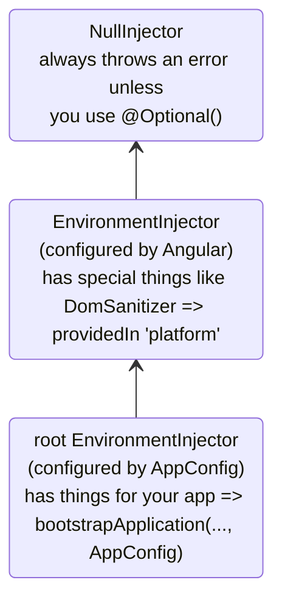
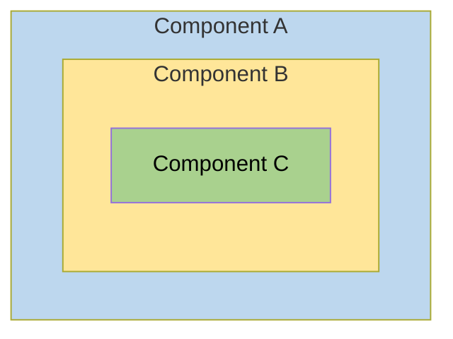
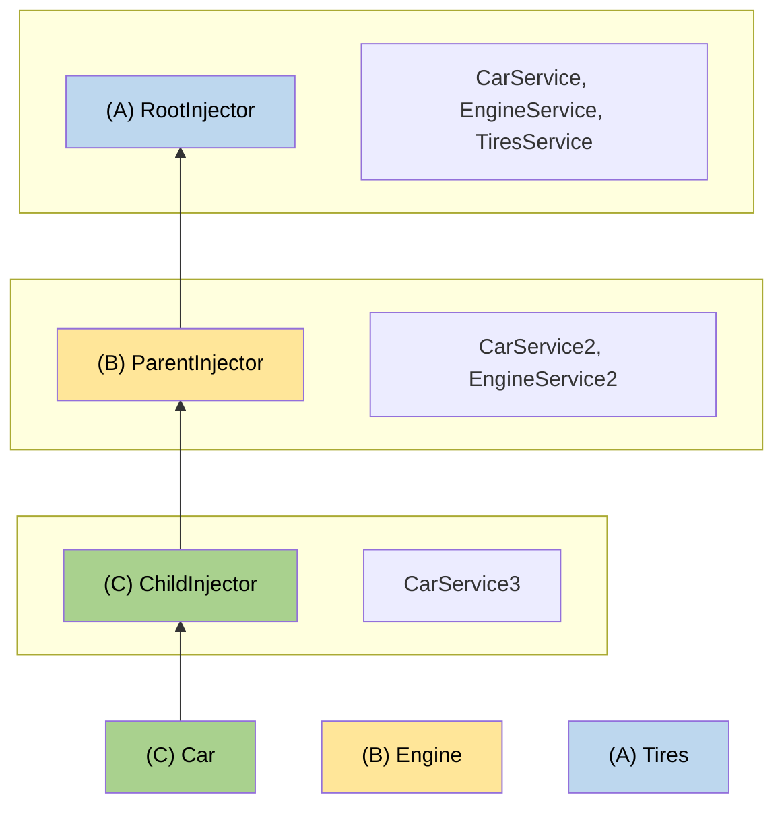

# Иерархические инжекторы

Это руководство подробно описывает иерархическую систему внедрения зависимостей Angular, включая правила разрешения, модификаторы и продвинутые паттерны.

NOTE: Базовые концепции иерархии инжекторов и области видимости провайдеров см. в [руководстве по определению провайдеров зависимостей](guide/di/defining-dependency-providers#injector-hierarchy-in-angular).

## Типы иерархий инжекторов {#types-of-injector-hierarchies}

Angular имеет две иерархии инжекторов:

| Иерархии инжекторов             | Подробности                                                                                                                                                                                        |
| :------------------------------ | :------------------------------------------------------------------------------------------------------------------------------------------------------------------------------------------------- |
| Иерархия `EnvironmentInjector`  | Настройте `EnvironmentInjector` в этой иерархии с помощью `@Injectable()` или массива `providers` в `ApplicationConfig`.                                                                           |
| Иерархия `ElementInjector`      | Создаётся неявно для каждого DOM-элемента. `ElementInjector` по умолчанию пуст, если не настроен через свойство `providers` в `@Directive()` или `@Component()`. |

<docs-callout title="Приложения на основе NgModule">
Для приложений на основе `NgModule` можно предоставлять зависимости через иерархию `ModuleInjector` с помощью аннотации `@NgModule()` или `@Injectable()`.
</docs-callout>

### `EnvironmentInjector` {#environmentinjector}

`EnvironmentInjector` можно настроить одним из двух способов:

- С помощью свойства `providedIn` в `@Injectable()`, указывающего `root` или `platform`
- С помощью массива `providers` в `ApplicationConfig`

<docs-callout title="Tree-shaking и @Injectable()">

Использование свойства `providedIn` в `@Injectable()` предпочтительнее использования массива `providers` в `ApplicationConfig`. С `@Injectable()` `providedIn` инструменты оптимизации могут выполнять tree-shaking, удаляя неиспользуемые сервисы. Это уменьшает размер бандла.

Tree-shaking особенно полезен для библиотек, поскольку приложение, использующее библиотеку, может не нуждаться в её внедрении.

</docs-callout>

`EnvironmentInjector` настраивается через `ApplicationConfig.providers`.

Предоставьте сервисы с помощью `providedIn` в `@Injectable()` следующим образом:

```ts {highlight:[4]}
import {Injectable} from '@angular/core';

@Injectable({
  providedIn: 'root', // <-- предоставляет этот сервис в корневом EnvironmentInjector
})
export class ItemService {
  name = 'telephone';
}
```

Декоратор `@Injectable()` идентифицирует класс сервиса.
Свойство `providedIn` настраивает конкретный `EnvironmentInjector`, здесь `root`, что делает сервис доступным в `root` `EnvironmentInjector`.

### ModuleInjector {#moduleinjector}

В случае приложений на основе `NgModule`, ModuleInjector можно настроить одним из двух способов:

- С помощью свойства `providedIn` в `@Injectable()`, указывающего `root` или `platform`
- С помощью массива `providers` в `@NgModule()`

`ModuleInjector` настраивается через свойства `@NgModule.providers` и `NgModule.imports`. `ModuleInjector` — это сглаживание всех массивов провайдеров, доступных при рекурсивном обходе `NgModule.imports`.

Дочерние иерархии `ModuleInjector` создаются при ленивой загрузке других `@NgModule`.

### Инжектор платформы {#platform-injector}

Выше `root` находятся ещё два инжектора: дополнительный `EnvironmentInjector` и `NullInjector()`.

Рассмотрим, как Angular выполняет bootstrap приложения в `main.ts`:

```ts
bootstrapApplication(App, appConfig);
```

Метод `bootstrapApplication()` создаёт дочерний инжектор инжектора платформы, настроенный экземпляром `ApplicationConfig`.
Это корневой `EnvironmentInjector`.

Метод `platformBrowserDynamic()` создаёт инжектор, настроенный `PlatformModule`, который содержит зависимости, специфичные для платформы.
Это позволяет нескольким приложениям совместно использовать конфигурацию платформы.
Например, браузер имеет только одну адресную строку, независимо от количества запущенных приложений.
Можно настроить дополнительные провайдеры, специфичные для платформы, на уровне платформы, передав `extraProviders` в функцию `platformBrowser()`.

Следующий родительский инжектор в иерархии — `NullInjector()`, который находится на вершине дерева.
Если вы поднялись настолько высоко, что ищете сервис в `NullInjector()`, возникнет ошибка, если не использовать `@Optional()`, так как в итоге всё заканчивается в `NullInjector()`, который возвращает ошибку или, при использовании `@Optional()`, `null`.
Подробнее о `@Optional()` см. в [разделе `@Optional()`](#optional) этого руководства.

Следующая диаграмма представляет связь между `root` `ModuleInjector` и его родительскими инжекторами, как описано в предыдущих абзацах.


```mermaid
stateDiagram-v2
    elementInjector: EnvironmentInjector<br>(configured by Angular)<br>has special things like DomSanitizer => providedIn 'platform'
    rootInjector: root EnvironmentInjector<br>(configured by AppConfig)<br>has things for your app => bootstrapApplication(..., AppConfig)
    nullInjector: NullInjector<br>always throws an error unless<br>you use @Optional()

    direction BT
    rootInjector --> elementInjector
    elementInjector --> nullInjector
```

Хотя имя `root` является специальным псевдонимом, другие иерархии `EnvironmentInjector` псевдонимов не имеют.
При создании динамически загружаемого компонента, например с помощью Router, можно создавать иерархии `EnvironmentInjector`, которые будут создавать дочерние иерархии `EnvironmentInjector`.

Все запросы передаются вверх к корневому инжектору, независимо от того, настроен ли он экземпляром `ApplicationConfig`, переданным в метод `bootstrapApplication()`, или все провайдеры зарегистрированы с `root` в своих собственных сервисах.

<docs-callout title="@Injectable() и ApplicationConfig">

Если вы настраиваете общеприкладной провайдер в `ApplicationConfig` для `bootstrapApplication`, он переопределяет провайдер, настроенный для `root` в метаданных `@Injectable()`.
Это позволяет настроить нестандартного провайдера сервиса, который используется несколькими приложениями.

Вот пример случая, когда конфигурация маршрутизатора компонента включает нестандартную [стратегию Location](guide/routing/common-router-tasks#locationstrategy-and-browser-url-styles), указывая её провайдер в списке `providers` объекта `ApplicationConfig`.

```ts
providers: [{provide: LocationStrategy, useClass: HashLocationStrategy}];
```

Для приложений на основе `NgModule` настраивайте общеприкладные провайдеры в `providers` модуля `AppModule`.

</docs-callout>

### `ElementInjector` {#elementinjector}

Angular неявно создаёт иерархии `ElementInjector` для каждого DOM-элемента.

Предоставление сервиса в декораторе `@Component()` через его свойства `providers` или `viewProviders` настраивает `ElementInjector`.
Например, следующий `TestComponent` настраивает `ElementInjector`, предоставляя сервис следующим образом:

```ts {highlight:[3]}
@Component({
  /* … */
  providers: [{ provide: ItemService, useValue: { name: 'lamp' } }]
})
export class TestComponent
```

HELPFUL: Для понимания связи между деревом `EnvironmentInjector`, `ModuleInjector` и деревом `ElementInjector` см. раздел [правила разрешения](#resolution-rules).

Когда вы предоставляете сервисы в компоненте, они становятся доступны через `ElementInjector` этого экземпляра компонента.
Они также могут быть видны дочерним компонентам/директивам в соответствии с правилами видимости, описанными в разделе [правила разрешения](#resolution-rules).

При уничтожении экземпляра компонента уничтожается и экземпляр сервиса.

#### `@Directive()` и `@Component()` {#directive-and-component}

Компонент — это особый тип директивы, что означает, что `@Directive()` и `@Component()` оба имеют свойство `providers`.
Это означает, что как директивы, так и компоненты могут настраивать провайдеры с помощью свойства `providers`.
Когда вы настраиваете провайдер для компонента или директивы с помощью свойства `providers`, этот провайдер принадлежит `ElementInjector` этого компонента или директивы.
Компоненты и директивы на одном элементе разделяют инжектор.

## Правила разрешения {#resolution-rules}

При разрешении токена для компонента/директивы Angular выполняет разрешение в два этапа:

1. Против родителей в иерархии `ElementInjector`.
2. Против родителей в иерархии `EnvironmentInjector`.

Когда компонент объявляет зависимость, Angular пытается удовлетворить её с помощью собственного `ElementInjector`.
Если у инжектора компонента нет провайдера, он передаёт запрос вверх к `ElementInjector` родительского компонента.

Запросы продолжают передаваться вверх до тех пор, пока Angular не найдёт инжектор, способный обработать запрос, или не исчерпает все иерархии `ElementInjector`.

Если Angular не находит провайдер ни в одной из иерархий `ElementInjector`, он возвращается к элементу, с которого пришёл запрос, и ищет в иерархии `EnvironmentInjector`.
Если Angular по-прежнему не находит провайдер, он выбрасывает ошибку.

Если вы зарегистрировали провайдер для одного и того же DI-токена на разных уровнях, первый найденный Angular провайдер используется для разрешения зависимости.
Например, если провайдер зарегистрирован локально в компоненте, которому нужен сервис,
Angular не будет искать другой провайдер того же сервиса.

HELPFUL: Для приложений на основе `NgModule` Angular будет искать в иерархии `ModuleInjector`, если не сможет найти провайдер в иерархиях `ElementInjector`.

## Модификаторы разрешения {#resolution-modifiers}

Поведение разрешения Angular можно изменить с помощью `optional`, `self`, `skipSelf` и `host`.
Импортируйте каждый из них из `@angular/core` и используйте в конфигурации [`inject`](/api/core/inject) при внедрении сервиса.

### Типы модификаторов {#types-of-modifiers}

Модификаторы разрешения делятся на три категории:

- Что делать, если Angular не находит нужное значение — `optional`
- Где начинать поиск — `skipSelf`
- Где остановить поиск — `host` и `self`

По умолчанию Angular всегда начинает с текущего `Injector` и продолжает поиск вверх.
Модификаторы позволяют изменить начальное местоположение, или _self_, и конечное местоположение.

Кроме того, можно комбинировать все модификаторы, кроме:

- `host` и `self`
- `skipSelf` и `self`.

### `optional` {#optional}

`optional` позволяет Angular считать внедряемый сервис необязательным.
Таким образом, если его не удаётся разрешить во время выполнения, Angular разрешает сервис как `null`, а не выбрасывает ошибку.
В следующем примере сервис `OptionalService` не предоставлен ни в сервисе, ни в `ApplicationConfig`, ни в `@NgModule()`, ни в классе компонента, поэтому он недоступен нигде в приложении.

```ts {header:"src/app/optional/optional.ts"}
export class Optional {
  public optional? = inject(OptionalService, {optional: true});
}
```

### `self` {#self}

Используйте `self`, чтобы Angular искал только в `ElementInjector` текущего компонента или директивы.

Хороший случай использования `self` — внедрение сервиса только при его наличии в текущем хост-элементе.
Чтобы избежать ошибок в такой ситуации, комбинируйте `self` с `optional`.

Например, в следующем `SelfNoData` обратите внимание на внедрённый `LeafService` как свойство.

```ts {header: 'self-no-data.ts', highlight: [7]}
@Component({
  selector: 'app-self-no-data',
  templateUrl: './self-no-data.html',
  styleUrls: ['./self-no-data.css'],
})
export class SelfNoData {
  public leaf = inject(LeafService, {optional: true, self: true});
}
```

В этом примере существует родительский провайдер, и внедрение сервиса вернёт значение, однако внедрение сервиса с `self` и `optional` вернёт `null`, потому что `self` указывает инжектору прекратить поиск на текущем хост-элементе.

Другой пример показывает класс компонента с провайдером для `FlowerService`.
В этом случае инжектор ищет не дальше текущего `ElementInjector`, так как находит `FlowerService` и возвращает тюльпан 🌷.

```ts {header:"src/app/self/self.ts"}
@Component({
  selector: 'app-self',
  templateUrl: './self.html',
  styleUrls: ['./self.css'],
  providers: [{provide: FlowerService, useValue: {emoji: '🌷'}}],
})
export class Self {
  constructor(@Self() public flower: FlowerService) {}
}
```

### `skipSelf` {#skipself}

`skipSelf` — противоположность `self`.
С `skipSelf` Angular начинает поиск сервиса в родительском `ElementInjector`, а не в текущем.
Поэтому если родительский `ElementInjector` использует значение папоротника <code>🌿</code> для `emoji`, но в массиве `providers` компонента есть кленовый лист <code>🍁</code>, Angular проигнорирует кленовый лист <code>🍁</code> и использует папоротник <code>🌿</code>.

Чтобы увидеть это в коде, предположим, что следующее значение для `emoji` используется родительским компонентом, как в этом сервисе:

```ts {header: 'leaf.service.ts'}
export class LeafService {
  emoji = '🌿';
}
```

Представьте, что в дочернем компоненте есть другое значение — кленовый лист 🍁, но вы хотите использовать значение родителя.
Вот когда нужно использовать `skipSelf`:

```ts {header:"skipself.ts" highlight:[[6],[10]]}
@Component({
  selector: 'app-skipself',
  templateUrl: './skipself.html',
  styleUrls: ['./skipself.css'],
  // Angular проигнорирует этот экземпляр LeafService
  providers: [{provide: LeafService, useValue: {emoji: '🍁'}}],
})
export class Skipself {
  // Используйте skipSelf как опцию inject
  public leaf = inject(LeafService, {skipSelf: true});
}
```

В этом случае значение для `emoji` будет папоротник <code>🌿</code>, а не кленовый лист <code>🍁</code>.

#### Опция `skipSelf` с `optional` {#skipself-option-with-optional}

Используйте опцию `skipSelf` с `optional`, чтобы предотвратить ошибку, если значение равно `null`.

В следующем примере сервис `Person` внедряется при инициализации свойства.
`skipSelf` указывает Angular пропустить текущий инжектор, а `optional` предотвратит ошибку, если сервис `Person` равен `null`.

```ts
class Person {
  parent = inject(Person, {optional: true, skipSelf: true});
}
```

### `host` {#host}

<!-- TODO: Remove ambiguity between host and self. -->

`host` позволяет обозначить компонент как последнюю остановку в дереве инжекторов при поиске провайдеров.

Даже если выше по дереву есть экземпляр сервиса, Angular не будет продолжать поиск.
Используйте `host` следующим образом:

```ts {header:"host.ts" highlight:[[6],[9]]}
@Component({
  selector: 'app-host',
  templateUrl: './host.html',
  styleUrls: ['./host.css'],
  // предоставление сервиса
  providers: [{provide: FlowerService, useValue: {emoji: '🌷'}}],
})
export class Host {
  // использование host при внедрении сервиса
  flower = inject(FlowerService, {host: true, optional: true});
}
```

Поскольку `Host` использует опцию `host`, независимо от того, какое значение `flower.emoji` имеет родитель `Host`, `Host` будет использовать тюльпан <code>🌷</code>.

### Модификаторы при инжекции через конструктор {#modifiers-with-constructor-injection}

Аналогично описанному выше, поведение инжекции через конструктор можно изменить с помощью `@Optional()`, `@Self()`, `@SkipSelf()` и `@Host()`.

Импортируйте каждый из них из `@angular/core` и используйте в конструкторе класса компонента при внедрении сервиса.

```ts {header:"self-no-data.ts" highlight:[2]}
export class SelfNoData {
  constructor(@Self() @Optional() public leaf?: LeafService) {}
}
```

## Логическая структура шаблона {#logical-structure-of-the-template}

Когда вы предоставляете сервисы в классе компонента, они видны в дереве `ElementInjector` относительно места и способа их предоставления.

Понимание базовой логической структуры шаблона Angular даст основу для настройки сервисов и управления их видимостью.

Компоненты используются в шаблонах, как в следующем примере:

```html
<app-root> <app-child />; </app-root>
```

HELPFUL: Обычно компоненты и их шаблоны объявляются в отдельных файлах.
Для понимания работы системы инжекции полезно рассматривать их с точки зрения объединённого логического дерева.
Термин _логическое_ отличает его от дерева рендеринга, которое является DOM-деревом вашего приложения.
Для обозначения мест расположения шаблонов компонентов в этом руководстве используется псевдоэлемент `<#VIEW>`, который фактически не существует в дереве рендеринга и присутствует только для ментальной модели.

Вот пример того, как деревья представлений `<app-root>` и `<app-child>` объединяются в единое логическое дерево:

```html
<app-root>
  <#VIEW>
    <app-child>
     <#VIEW>
       …content goes here…
     </#VIEW>
    </app-child>
  </#VIEW>
</app-root>
```

Понимание концепции демаркации `<#VIEW>` особенно важно при настройке сервисов в классе компонента.

## Пример: предоставление сервисов в `@Component()` {#example-providing-services-in-component}

Способ предоставления сервисов с помощью декоратора `@Component()` (или `@Directive()`) определяет их видимость.
В следующих разделах демонстрируются `providers` и `viewProviders`, а также способы изменения видимости сервисов с помощью `skipSelf` и `host`.

Класс компонента может предоставлять сервисы двумя способами:

| Массивы                          | Подробности                                          |
| :------------------------------- | :--------------------------------------------------- |
| С массивом `providers`           | `@Component({ providers: [SomeService] })`           |
| С массивом `viewProviders`       | `@Component({ viewProviders: [SomeService] })`       |

В примерах ниже вы увидите логическое дерево Angular-приложения.
Для иллюстрации работы инжектора в контексте шаблонов логическое дерево будет представлять HTML-структуру приложения.
Например, логическое дерево покажет, что `<child-component>` является прямым потомком `<parent-component>`.

В логическом дереве вы увидите специальные атрибуты: `@Provide`, `@Inject` и `@ApplicationConfig`.
Это не реальные атрибуты, они лишь демонстрируют, что происходит за кулисами.

| Атрибут сервиса Angular | Подробности                                                                                              |
| :---------------------- | :------------------------------------------------------------------------------------------------------- |
| `@Inject(Token)=>Value` | Если `Token` внедряется в этом месте логического дерева, его значение будет `Value`.                     |
| `@Provide(Token=Value)` | Указывает, что `Token` предоставлен со значением `Value` в этом месте логического дерева.                |
| `@ApplicationConfig`    | Демонстрирует, что резервный `EnvironmentInjector` должен использоваться в этом месте.                   |

### Структура примера приложения {#example-app-structure}

В примере приложения есть `FlowerService`, предоставленный в `root` со значением `emoji` — красный гибискус <code>🌺</code>.

```ts {header:"lower.service.ts"}
@Injectable({
  providedIn: 'root',
})
export class FlowerService {
  emoji = '🌺';
}
```

Рассмотрим приложение только с `App` и `Child`.
Базовое отрендеренное представление выглядит как вложенные HTML-элементы:

```html
<app-root>
  <!-- App selector -->
  <app-child> <!-- Child selector --> </app-child>
</app-root>
```

Однако за кулисами Angular использует логическое представление при разрешении запросов внедрения:

```html
<app-root> <!-- App selector -->
  <#VIEW>
    <app-child> <!-- Child selector -->
      <#VIEW>
      </#VIEW>
    </app-child>
  </#VIEW>
</app-root>
```

Здесь `<#VIEW>` представляет экземпляр шаблона.
Обратите внимание, что каждый компонент имеет собственный `<#VIEW>`.

Знание этой структуры позволяет управлять предоставлением и внедрением сервисов и полностью контролировать их видимость.

Теперь рассмотрим, как `<app-root>` внедряет `FlowerService`:

```typescript
export class App {
  flower = inject(FlowerService);
}
```

Добавьте привязку в шаблон `<app-root>` для визуализации результата:

```html
<p>Emoji from FlowerService: {{flower.emoji}}</p>
```

Вывод в представлении будет:

```text {hideCopy}
Emoji from FlowerService: 🌺
```

В логическом дереве это представлено следующим образом:

```html
<app-root @ApplicationConfig
        @Inject(FlowerService) flower=>"🌺">
  <#VIEW>
    <p>Emoji from FlowerService: {{flower.emoji}} (🌺)</p>
    <app-child>
      <#VIEW>
      </#VIEW>
    </app-child>
  </#VIEW>
</app-root>
```

Когда `<app-root>` запрашивает `FlowerService`, задача инжектора — разрешить токен `FlowerService`.
Разрешение токена происходит в два этапа:

1. Инжектор определяет начальное местоположение в логическом дереве и конечное местоположение поиска.
   Инжектор начинает с начального местоположения и ищет токен на каждом уровне представления в логическом дереве.
   Если токен найден, он возвращается.

1. Если токен не найден, инжектор ищет ближайший родительский `EnvironmentInjector` для делегирования запроса.

В данном примере ограничения следующие:

1. Начало с `<#VIEW>`, принадлежащего `<app-root>`, и конец с `<app-root>`.
   - Обычно начальная точка поиска — место внедрения.
     Однако в данном случае `<app-root>` является компонентом. `@Component` особенны тем, что они также включают собственные `viewProviders`, поэтому поиск начинается с `<#VIEW>`, принадлежащего `<app-root>`.
     Для директивы, сопоставленной в том же месте, это было бы иначе.
   - Конечное местоположение совпадает с самим компонентом, так как он является самым верхним компонентом в этом приложении.

1. `EnvironmentInjector`, предоставляемый `ApplicationConfig`, действует как резервный инжектор, когда токен внедрения не может быть найден в иерархиях `ElementInjector`.

### Использование массива `providers` {#using-the-providers-array}

Теперь в классе `Child` добавьте провайдер для `FlowerService`, чтобы продемонстрировать более сложные правила разрешения в последующих разделах:

```ts
@Component({
  selector: 'app-child',
  templateUrl: './child.html',
  styleUrls: ['./child.css'],
  // использование массива providers для предоставления сервиса
  providers: [{provide: FlowerService, useValue: {emoji: '🌻'}}],
})
export class Child {
  // внедрение сервиса
  flower = inject(FlowerService);
}
```

Теперь, когда `FlowerService` предоставлен в декораторе `@Component()`, при запросе сервиса `<app-child>` инжектор должен смотреть только на `ElementInjector` в `<app-child>`.
Продолжать поиск выше по дереву инжекторов не нужно.

Следующий шаг — добавить привязку в шаблон `Child`.

```html
<p>Emoji from FlowerService: {{flower.emoji}}</p>
```

Чтобы отобразить новые значения, добавьте `<app-child>` в нижнюю часть шаблона `App`, чтобы представление также отображало подсолнух:

```text {hideCopy}
Child Component
Emoji from FlowerService: 🌻
```

В логическом дереве это представлено следующим образом:

```html
<app-root @ApplicationConfig
          @Inject(FlowerService) flower=>"🌺">
  <#VIEW>

  <p>Emoji from FlowerService: {{flower.emoji}} (🌺)</p>
  <app-child @Provide(FlowerService="🌻" )
             @Inject(FlowerService)=>"🌻"> <!-- search ends here -->
    <#VIEW> <!-- search starts here -->
    <h2>Child Component</h2>
    <p>Emoji from FlowerService: {{flower.emoji}} (🌻)</p>
  </
  #VIEW>
  </app-child>
</#VIEW>
</app-root>
```

Когда `<app-child>` запрашивает `FlowerService`, инжектор начинает поиск с `<#VIEW>`, принадлежащего `<app-child>` \(`<#VIEW>` включён, поскольку внедрение происходит из `@Component()`\) и заканчивает с `<app-child>`.
В данном случае `FlowerService` разрешается из массива `providers` с подсолнухом <code>🌻</code> в `<app-child>`.
Инжектору не нужно искать дальше в дереве инжекторов.
Он останавливается, как только находит `FlowerService`, и не видит красный гибискус <code>🌺</code>.

### Использование массива `viewProviders` {#using-the-viewproviders-array}

Используйте массив `viewProviders` как ещё один способ предоставления сервисов в декораторе `@Component()`.
Использование `viewProviders` делает сервисы видимыми в `<#VIEW>`.

HELPFUL: Шаги аналогичны использованию массива `providers`, за исключением использования массива `viewProviders`.

Для пошаговых инструкций продолжайте читать этот раздел.
Если вы можете настроить это самостоятельно, перейдите к разделу [Изменение видимости сервисов](#visibility-of-provided-tokens).

Для демонстрации мы строим `AnimalService` для демонстрации `viewProviders`.
Сначала создайте `AnimalService` со свойством `emoji` — кит <code>🐳</code>:

```typescript
import {Injectable} from '@angular/core';

@Injectable({
  providedIn: 'root',
})
export class AnimalService {
  emoji = '🐳';
}
```

Следуя тому же паттерну, что и для `FlowerService`, внедрите `AnimalService` в класс `App`:

```ts
export class App {
  public flower = inject(FlowerService);
  public animal = inject(AnimalService);
}
```

HELPFUL: Весь код, связанный с `FlowerService`, можно оставить, так как он позволит сравнить с `AnimalService`.

Добавьте массив `viewProviders` и внедрите `AnimalService` также в класс `<app-child>`, но дайте `emoji` другое значение.
Здесь используется значение собаки 🐶.

```typescript
@Component({
  selector: 'app-child',
  templateUrl: './child.html',
  styleUrls: ['./child.css'],
  // предоставление сервисов
  providers: [{provide: FlowerService, useValue: {emoji: '🌻'}}],
  viewProviders: [{provide: AnimalService, useValue: {emoji: '🐶'}}],
})
export class Child {
  // внедрение сервисов
  flower = inject(FlowerService);
  animal = inject(AnimalService);
}
```

Добавьте привязки в шаблоны `Child` и `App`.
В шаблоне `Child` добавьте следующую привязку:

```html
<p>Emoji from AnimalService: {{animal.emoji}}</p>
```

Также добавьте то же самое в шаблон `App`:

```html
<p>Emoji from AnimalService: {{animal.emoji}}</p>
```

Теперь в браузере отображаются оба значения:

```text {hideCopy}
App
Emoji from AnimalService: 🐳

Child Component
Emoji from AnimalService: 🐶
```

Логическое дерево для этого примера с `viewProviders`:

```html
<app-root @ApplicationConfig
          @Inject(AnimalService) animal=>"🐳">
  <#VIEW>
  <app-child>
    <#VIEW @Provide(AnimalService="🐶")
    @Inject(AnimalService=>"🐶")>

    <!-- ^^использование viewProviders означает, что AnimalService доступен в <#VIEW>-->
    <p>Emoji from AnimalService: {{animal.emoji}} (🐶)</p>
  </
  #VIEW>
  </app-child>
</#VIEW>
</app-root>
```

Как и в примере с `FlowerService`, `AnimalService` предоставлен в декораторе `@Component()` для `<app-child>`.
Это означает, что поскольку инжектор сначала смотрит в `ElementInjector` компонента, он находит значение `AnimalService` — собаку <code>🐶</code>.
Ему не нужно продолжать поиск в дереве `ElementInjector` или в `ModuleInjector`.

### `providers` и `viewProviders` {#providers-vs-viewproviders}

Поле `viewProviders` концептуально похоже на `providers`, но есть одно существенное отличие.
Провайдеры, настроенные в `viewProviders`, не видны проецируемому контенту, который является логическими потомками компонента.

Чтобы увидеть разницу между `providers` и `viewProviders`, добавьте в пример ещё один компонент и назовите его `Inspector`.
`Inspector` будет дочерним компонентом `Child`.
В `inspector.ts` внедрите `FlowerService` и `AnimalService` при инициализации свойств:

```typescript
export class Inspector {
  flower = inject(FlowerService);
  animal = inject(AnimalService);
}
```

Массив `providers` или `viewProviders` не нужен.
Далее в `inspector.html` добавьте ту же разметку, что и в предыдущих компонентах:

```html
<p>Emoji from FlowerService: {{flower.emoji}}</p>
<p>Emoji from AnimalService: {{animal.emoji}}</p>
```

Не забудьте добавить `Inspector` в массив `imports` компонента `Child`.

```ts
@Component({
  ...
  imports: [Inspector]
})
```

Затем добавьте следующее в `child.html`:

```html
...

<div class="container">
  <h3>Content projection</h3>
  <ng-content />
</div>
<h3>Inside the view</h3>

<app-inspector />
```

`<ng-content>` позволяет проецировать контент, а `<app-inspector>` внутри шаблона `Child` делает `Inspector` дочерним компонентом `Child`.

Затем добавьте следующее в `app.html` для использования проекции контента.

```html
<app-child>
  <app-inspector />
</app-child>
```

Теперь браузер отображает следующее (предыдущие примеры опущены для краткости):

```text {hideCopy}
...
Content projection

Emoji from FlowerService: 🌻
Emoji from AnimalService: 🐳

Emoji from FlowerService: 🌻
Emoji from AnimalService: 🐶
```

Эти четыре привязки демонстрируют разницу между `providers` и `viewProviders`.
Помните, что эмодзи собаки <code>🐶</code> объявлен внутри `<#VIEW>` компонента `Child` и не виден проецируемому контенту.
Вместо этого проецируемый контент видит кита <code>🐳</code>.

Однако в следующем разделе вывода `Inspector` является фактическим дочерним компонентом `Child` и находится внутри `<#VIEW>`, поэтому при запросе `AnimalService` он видит собаку <code>🐶</code>.

`AnimalService` в логическом дереве выглядит следующим образом:

```html
<app-root @ApplicationConfig
          @Inject(AnimalService) animal=>"🐳">
  <#VIEW>
  <app-child>
    <#VIEW @Provide(AnimalService="🐶")
    @Inject(AnimalService=>"🐶")>

    <!-- ^^использование viewProviders означает, что AnimalService доступен в <#VIEW>-->
    <p>Emoji from AnimalService: {{animal.emoji}} (🐶)</p>

    <div class="container">
      <h3>Content projection</h3>
      <app-inspector @Inject(AnimalService) animal=>"🐳">
        <p>Emoji from AnimalService: {{animal.emoji}} (🐳)</p>
      </app-inspector>
    </div>

    <app-inspector>
      <#VIEW @Inject(AnimalService) animal=>"🐶">
      <p>Emoji from AnimalService: {{animal.emoji}} (🐶)</p>
    </
    #VIEW>
    </app-inspector>
  </
  #VIEW>
  </app-child>

</#VIEW>
</app-root>
```

Проецируемый контент `<app-inspector>` видит кита <code>🐳</code>, а не собаку <code>🐶</code>, потому что собака <code>🐶</code> находится внутри `<#VIEW>` `<app-child>`.
`<app-inspector>` может видеть собаку <code>🐶</code> только если тоже находится внутри `<#VIEW>`.

### Видимость предоставленных токенов {#visibility-of-provided-tokens}

Декораторы видимости влияют на то, где начинается и заканчивается поиск токена внедрения в логическом дереве.
Для этого помещайте конфигурацию видимости в точку внедрения, то есть при вызове `inject()`, а не в точку объявления.

Чтобы изменить место, где инжектор начинает поиск `FlowerService`, добавьте `skipSelf` в вызов `inject()` для `FlowerService` в `<app-child>`.
Этот вызов является инициализатором свойства `<app-child>`, как показано в `child.ts`:

```typescript
flower = inject(FlowerService, {skipSelf: true});
```

С `skipSelf` инжектор `<app-child>` не ищет `FlowerService` в себе.
Вместо этого инжектор начинает поиск `FlowerService` в `ElementInjector` `<app-root>`, где ничего не находит.
Затем он обращается к `ModuleInjector` `<app-child>` и находит значение красного гибискуса <code>🌺</code>, которое доступно, потому что `<app-child>` и `<app-root>` разделяют один `ModuleInjector`.
Интерфейс отображает:

```text {hideCopy}
Emoji from FlowerService: 🌺
```

В логическом дереве эта идея выглядит следующим образом:

```html
<app-root @ApplicationConfig
          @Inject(FlowerService) flower=>"🌺">
  <#VIEW>
  <app-child @Provide(FlowerService="🌻" )>
    <#VIEW @Inject(FlowerService, SkipSelf)=>"🌺">

    <!-- С SkipSelf инжектор смотрит на следующий инжектор выше по дереву (app-root) -->

  </
  #VIEW>
  </app-child>
</#VIEW>
</app-root>
```

Хотя `<app-child>` предоставляет подсолнух <code>🌻</code>, приложение отображает красный гибискус <code>🌺</code>, потому что `skipSelf` заставляет текущий инжектор (`app-child`) пропустить себя и обратиться к родителю.

Если теперь добавить `host` (в дополнение к `skipSelf`), результат будет `null`.
Это связано с тем, что `host` ограничивает верхнюю границу поиска `<#VIEW>` `app-child`.
Вот эта идея в логическом дереве:

```html
<app-root @ApplicationConfig
          @Inject(FlowerService) flower=>"🌺">
  <#VIEW> <!-- end search here with null-->
  <app-child @Provide(FlowerService="🌻" )> <!-- start search here -->
    <#VIEW inject(FlowerService, {skipSelf: true, host: true, optional:true})=>null>
  </
  #VIEW>
  </app-parent>
</#VIEW>
</app-root>
```

Здесь сервисы и их значения те же, но `host` останавливает поиск инжектора на `<#VIEW>` для `FlowerService`, поэтому он не находит его и возвращает `null`.

### `skipSelf` и `viewProviders` {#skipself-and-viewproviders}

Помните, что `<app-child>` предоставляет `AnimalService` в массиве `viewProviders` со значением собаки <code>🐶</code>.
Поскольку инжектору нужно смотреть только в `ElementInjector` `<app-child>` для `AnimalService`, он никогда не видит кита <code>🐳</code>.

Как и в примере с `FlowerService`, если добавить `skipSelf` в `inject()` для `AnimalService`, инжектор не будет искать `AnimalService` в `ElementInjector` текущего `<app-child>`.
Вместо этого инжектор начнёт поиск в `ElementInjector` `<app-root>`.

```typescript
@Component({
  selector: 'app-child',
  …
  viewProviders: [
    { provide: AnimalService, useValue: { emoji: '🐶' } },
  ],
})
```

Логическое дерево выглядит следующим образом с `skipSelf` в `<app-child>`:

```html
<app-root @ApplicationConfig
          @Inject(AnimalService=>"🐳")>
  <#VIEW><!-- search begins here -->
  <app-child>
    <#VIEW @Provide(AnimalService="🐶")
    @Inject(AnimalService, SkipSelf=>"🐳")>

    <!--Add skipSelf -->

  </
  #VIEW>
  </app-child>
</#VIEW>
</app-root>
```

С `skipSelf` в `<app-child>` инжектор начинает поиск `AnimalService` в `ElementInjector` `<app-root>` и находит кита 🐳.

### `host` и `viewProviders` {#host-and-viewproviders}

Если использовать только `host` для внедрения `AnimalService`, результатом будет собака <code>🐶</code>, потому что инжектор находит `AnimalService` в самом `<#VIEW>` `<app-child>`.
`Child` настраивает `viewProviders` так, что эмодзи собаки предоставляется как значение `AnimalService`.
Также можно увидеть `host` в `inject()`:

```typescript
@Component({
  selector: 'app-child',
  …
  viewProviders: [
    { provide: AnimalService, useValue: { emoji: '🐶' } },
  ]
})
export class Child {
  animal = inject(AnimalService, { host: true })
}
```

`host: true` заставляет инжектор искать до края `<#VIEW>`.

```html
<app-root @ApplicationConfig
          @Inject(AnimalService=>"🐳")>
  <#VIEW>
  <app-child>
    <#VIEW @Provide(AnimalService="🐶")
    inject(AnimalService, {host: true}=>"🐶")> <!-- host stops search here -->
  </
  #VIEW>
  </app-child>
</#VIEW>
</app-root>
```

Добавьте массив `viewProviders` с третьим животным — ежом <code>🦔</code> — в метаданные `@Component()` в `app.ts`:

```typescript
@Component({
  selector: 'app-root',
  templateUrl: './app.html',
  styleUrls: [ './app.css' ],
  viewProviders: [
    { provide: AnimalService, useValue: { emoji: '🦔' } },
  ],
})
```

Затем добавьте `skipSelf` вместе с `host` в `inject()` для внедрения `AnimalService` в `child.ts`.
Вот `host` и `skipSelf` при инициализации свойства `animal`:

```typescript
export class Child {
  animal = inject(AnimalService, {host: true, skipSelf: true});
}
```

<!-- TODO: This requires a rework. It seems not well explained what `viewProviders`/`injectors` is here
  and how `host` works.
 -->

Когда `host` и `skipSelf` применялись к `FlowerService`, который находится в массиве `providers`, результатом было `null`, потому что `skipSelf` начинает поиск в инжекторе `<app-child>`, но `host` останавливает поиск на `<#VIEW>` — где нет `FlowerService`.
В логическом дереве видно, что `FlowerService` виден в `<app-child>`, но не в его `<#VIEW>`.

Однако `AnimalService`, предоставленный в массиве `viewProviders` `App`, виден.

Логическое дерево показывает почему:

```html
<app-root @ApplicationConfig
          @Inject(AnimalService=>"🐳")>
  <#VIEW @Provide(AnimalService="🦔")
  @Inject(AnimalService, @Optional)=>"🦔">

  <!-- ^^skipSelf starts here,  host stops here^^ -->
  <app-child>
    <#VIEW @Provide(AnimalService="🐶")
    inject(AnimalService, {skipSelf:true, host: true, optional: true})=>"🦔">
    <!-- Add skipSelf ^^-->
  </
  #VIEW>
  </app-child>
</#VIEW>
</app-root>
```

`skipSelf` заставляет инжектор начинать поиск `AnimalService` с `<app-root>`, а не с `<app-child>`, откуда поступает запрос, а `host` останавливает поиск на `<#VIEW>` `<app-root>`.
Поскольку `AnimalService` предоставлен через массив `viewProviders`, инжектор находит ежа <code>🦔</code> в `<#VIEW>`.

## Пример: варианты использования `ElementInjector` {#example-elementinjector-use-cases}

Возможность настройки одного или нескольких провайдеров на разных уровнях открывает полезные возможности.

### Сценарий: изоляция сервиса {#scenario-service-isolation}

Архитектурные соображения могут привести к необходимости ограничить доступ к сервису областью приложения, к которой он относится.
Например, рассмотрим сборку `VillainsList`, которая отображает список злодеев.
Она получает этих злодеев из `VillainsService`.

Если предоставить `VillainsService` в корневом `AppModule`, он станет видным везде в приложении.
Если впоследствии изменить `VillainsService`, можно нарушить работу других компонентов, которые случайно начали зависеть от этого сервиса.

Вместо этого следует предоставить `VillainsService` в метаданных `providers` компонента `VillainsList` следующим образом:

```typescript
@Component({
  selector: 'app-villains-list',
  templateUrl: './villains-list.html',
  providers: [VillainsService],
})
export class VillainsList {}
```

Предоставляя `VillainsService` в метаданных `VillainsList` и нигде больше, сервис становится доступным только в `VillainsList` и его поддереве компонентов.

`VillainsService` является синглтоном относительно `VillainsList`, поскольку именно там он объявлен.
Пока `VillainsList` не уничтожен, это будет тот же экземпляр `VillainsService`, но при наличии нескольких экземпляров `VillainsList` каждый экземпляр будет иметь собственный экземпляр `VillainsService`.

### Сценарий: несколько сеансов редактирования {#scenario-multiple-edit-sessions}

Многие приложения позволяют пользователям работать одновременно с несколькими открытыми задачами.
Например, в приложении для подготовки налоговых деклараций подготовщик может работать с несколькими декларациями, переключаясь между ними в течение дня.

Для демонстрации этого сценария представьте `HeroList`, отображающий список супергероев.

Чтобы открыть налоговую декларацию героя, подготовщик нажимает на имя героя, что открывает компонент для редактирования этой декларации.
Каждая выбранная налоговая декларация открывается в собственном компоненте, и несколько деклараций могут быть открыты одновременно.

Каждый компонент налоговой декларации имеет следующие характеристики:

- Является собственным сеансом редактирования налоговой декларации
- Может изменять декларацию, не влияя на декларации в других компонентах
- Может сохранять изменения или отменять их

Предположим, что `HeroTaxReturn` имеет логику для управления и восстановления изменений.
Это была бы простая задача для декларации одного героя.
В реальном мире со сложной моделью данных управление изменениями было бы непростым.
Эту задачу можно делегировать вспомогательному сервису, как это делается в данном примере.

`HeroTaxReturnService` кэширует одну `HeroTaxReturn`, отслеживает изменения в этой декларации и может сохранять или восстанавливать её.
Он также делегирует работу общеприкладному синглтону `HeroService`, который получает через внедрение.

```typescript
import {inject, Injectable} from '@angular/core';
import {HeroTaxReturn} from './hero';
import {HeroesService} from './heroes.service';

@Injectable()
export class HeroTaxReturnService {
  private currentTaxReturn!: HeroTaxReturn;
  private originalTaxReturn!: HeroTaxReturn;

  private heroService = inject(HeroesService);

  set taxReturn(htr: HeroTaxReturn) {
    this.originalTaxReturn = htr;
    this.currentTaxReturn = htr.clone();
  }

  get taxReturn(): HeroTaxReturn {
    return this.currentTaxReturn;
  }

  restoreTaxReturn() {
    this.taxReturn = this.originalTaxReturn;
  }

  saveTaxReturn() {
    this.taxReturn = this.currentTaxReturn;
    this.heroService.saveTaxReturn(this.currentTaxReturn).subscribe();
  }
}
```

Вот `HeroTaxReturn`, использующий `HeroTaxReturnService`.

```typescript
import {Component, input, output} from '@angular/core';
import {HeroTaxReturn} from './hero';
import {HeroTaxReturnService} from './hero-tax-return.service';

@Component({
  selector: 'app-hero-tax-return',
  templateUrl: './hero-tax-return.html',
  styleUrls: ['./hero-tax-return.css'],
  providers: [HeroTaxReturnService],
})
export class HeroTaxReturn {
  message = '';

  close = output<void>();

  get taxReturn(): HeroTaxReturn {
    return this.heroTaxReturnService.taxReturn;
  }

  taxReturn = input.required<HeroTaxReturn>();

  constructor() {
    effect(() => {
      this.heroTaxReturnService.taxReturn = this.taxReturn();
    });
  }

  private heroTaxReturnService = inject(HeroTaxReturnService);

  onCanceled() {
    this.flashMessage('Canceled');
    this.heroTaxReturnService.restoreTaxReturn();
  }

  onClose() {
    this.close.emit();
  }

  onSaved() {
    this.flashMessage('Saved');
    this.heroTaxReturnService.saveTaxReturn();
  }

  flashMessage(msg: string) {
    this.message = msg;
    setTimeout(() => (this.message = ''), 500);
  }
}
```

_Декларация для редактирования_ поступает через свойство `input`, которое реализовано с помощью геттеров и сеттеров.
Сеттер инициализирует собственный экземпляр `HeroTaxReturnService` компонента с входящей декларацией.
Геттер всегда возвращает то, что сервис считает текущим состоянием героя.
Компонент также просит сервис сохранить и восстановить эту налоговую декларацию.

Это не будет работать, если сервис является общеприкладным синглтоном.
Каждый компонент будет совместно использовать один и тот же экземпляр сервиса, и каждый компонент будет перезаписывать декларацию, принадлежащую другому герою.

Чтобы предотвратить это, настройте инжектор уровня компонента для `HeroTaxReturn` на предоставление сервиса, используя свойство `providers` в метаданных компонента.

```typescript
providers: [HeroTaxReturnService];
```

`HeroTaxReturn` имеет собственный провайдер `HeroTaxReturnService`.
Помните, что каждый _экземпляр_ компонента имеет собственный инжектор.
Предоставление сервиса на уровне компонента гарантирует, что _каждый_ экземпляр компонента получает приватный экземпляр сервиса. Это гарантирует, что ни одна декларация не будет перезаписана.

HELPFUL: Остальная часть кода сценария опирается на другие возможности и техники Angular, которые можно изучить в других разделах документации.

### Сценарий: специализированные провайдеры {#scenario-specialized-providers}

Ещё одна причина повторного предоставления сервиса на другом уровне — замена _более специализированной_ реализацией этого сервиса в глубине дерева компонентов.

Например, рассмотрим компонент `Car`, включающий информацию о техническом обслуживании шин и зависящий от других сервисов для предоставления дополнительных сведений об автомобиле.

Корневой инжектор, обозначенный (A), использует _обобщённые_ провайдеры для получения сведений о `CarService` и `EngineService`.

1. Компонент `Car` (A). Компонент (A) отображает данные о техническом обслуживании шин автомобиля и задаёт обобщённые сервисы для получения дополнительных сведений об автомобиле.

2. Дочерний компонент (B). Компонент (B) определяет собственные _специализированные_ провайдеры для `CarService` и `EngineService` с особыми возможностями, подходящими для компонента (B).

3. Дочерний компонент (C) как дочерний компонент (B). Компонент (C) определяет собственный _ещё более специализированный_ провайдер для `CarService`.


```mermaid
graph TD;
subgraph COMPONENT_A[Component A]
subgraph COMPONENT_B[Component B]
COMPONENT_C[Component C]
end
end

style COMPONENT_A fill:#BDD7EE
style COMPONENT_B fill:#FFE699
style COMPONENT_C fill:#A9D18E,color:#000
classDef noShadow filter:none
class COMPONENT_A,COMPONENT_B,COMPONENT_C noShadow
```

За кулисами каждый компонент устанавливает собственный инжектор с нулём, одним или несколькими провайдерами, определёнными для этого компонента.

При разрешении экземпляра `Car` в самом глубоком компоненте (C) его инжектор создаёт:

- Экземпляр `Car`, разрешённый инжектором (C)
- `Engine`, разрешённый инжектором (B)
- Его `Tires`, разрешённые корневым инжектором (A).


```mermaid
graph BT;

subgraph A[" "]
direction LR
RootInjector["(A) RootInjector"]
ServicesA["CarService, EngineService, TiresService"]
end

subgraph B[" "]
direction LR
ParentInjector["(B) ParentInjector"]
ServicesB["CarService2, EngineService2"]
end

subgraph C[" "]
direction LR
ChildInjector["(C) ChildInjector"]
ServicesC["CarService3"]
end

direction LR
car["(C) Car"]
engine["(B) Engine"]
tires["(A) Tires"]

direction BT
car-->ChildInjector
ChildInjector-->ParentInjector-->RootInjector

class car,engine,tires,RootInjector,ParentInjector,ChildInjector,ServicesA,ServicesB,ServicesC,A,B,C noShadow
style car fill:#A9D18E,color:#000
style ChildInjector fill:#A9D18E,color:#000
style engine fill:#FFE699,color:#000
style ParentInjector fill:#FFE699,color:#000
style tires fill:#BDD7EE,color:#000
style RootInjector fill:#BDD7EE,color:#000
```

## Подробнее о внедрении зависимостей {#more-on-dependency-injection}

<docs-pill-row>
  <docs-pill href="/guide/di/defining-dependency-providers" title="Провайдеры DI"/>
</docs-pill-row>
