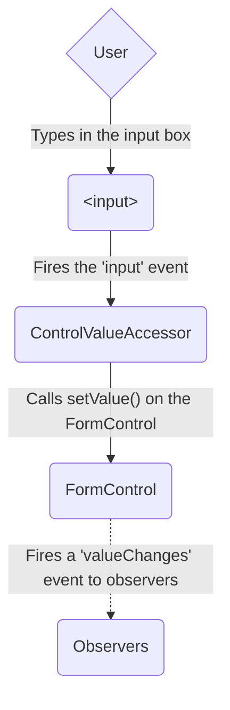
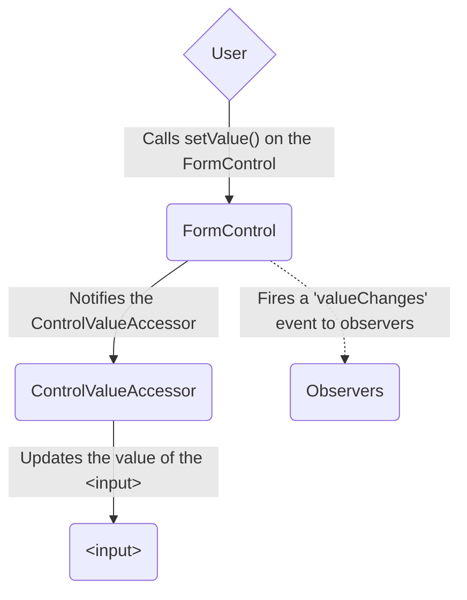
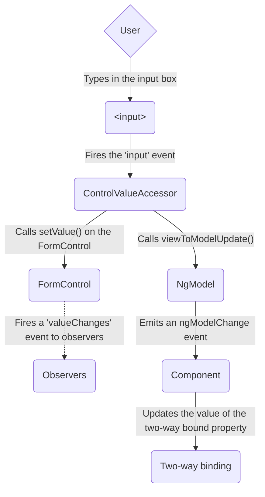
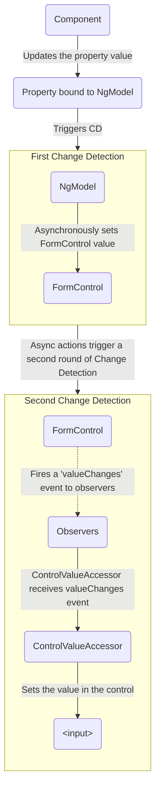

<docs-decorative-header title="Формы в Angular" imgSrc="adev/src/assets/images/overview.svg"> <!-- markdownlint-disable-line -->
Обработка пользовательского ввода с помощью форм — это основа многих распространённых приложений.
</docs-decorative-header>

Приложения используют формы, чтобы пользователи могли входить в систему, обновлять профиль, вводить конфиденциальную информацию и выполнять множество других задач по вводу данных.

Angular предоставляет два разных подхода к обработке пользовательского ввода через формы: реактивные и на основе шаблонов.

Оба подхода захватывают события ввода пользователя из представления, валидируют ввод, создают модель формы и модель данных для обновления, а также предоставляют способ отслеживания изменений.

TIP: Если вы ищете новые экспериментальные Signal Forms, ознакомьтесь с нашим [руководством по основам Signal Forms](/essentials/signal-forms)!

Это руководство поможет вам выбрать тип формы, наиболее подходящий для вашей задачи.
Здесь описаны общие строительные блоки, используемые обоими подходами.
Также приведены ключевые различия между подходами и демонстрируются эти различия в контексте настройки, потока данных и тестирования.

## Выбор подхода {#choosing-an-approach}

Реактивные формы и формы на основе шаблонов по-разному обрабатывают и управляют данными формы.
Каждый подход предлагает разные преимущества.

| Формы                           | Подробности                                                                                                                                                                                                                                                                                                                                                                                                                                        |
| :------------------------------ | :------------------------------------------------------------------------------------------------------------------------------------------------------------------------------------------------------------------------------------------------------------------------------------------------------------------------------------------------------------------------------------------------------------------------------------------------- |
| Реактивные формы                | Обеспечивают прямой, явный доступ к базовой объектной модели формы. По сравнению с формами на основе шаблонов они более надёжны: лучше масштабируются, повторно используются и тестируются. Если формы — ключевая часть вашего приложения или вы уже используете реактивные паттерны, применяйте реактивные формы.                                                                                                                          |
| Формы на основе шаблонов        | Используют директивы в шаблоне для создания и управления базовой объектной моделью. Подходят для добавления простой формы в приложение, например формы подписки на рассылку. Их легко добавить, но они масштабируются хуже реактивных форм. Если требования к форме минимальны и логику можно полностью разместить в шаблоне, формы на основе шаблонов могут быть хорошим выбором.                                                         |

### Ключевые различия {#key-differences}

В следующей таблице приведены ключевые различия между реактивными формами и формами на основе шаблонов.

|                                                             | Реактивные                                | На основе шаблонов              |
| :---------------------------------------------------------- | :---------------------------------------- | :------------------------------ |
| [Настройка модели формы](#setting-up-the-form-model)        | Явная, создаётся в классе компонента      | Неявная, создаётся директивами  |
| [Модель данных](#mutability-of-the-data-model)              | Структурированная и неизменяемая          | Неструктурированная и изменяемая |
| [Поток данных](#data-flow-in-forms)                         | Синхронный                                | Асинхронный                     |
| [Валидация формы](#form-validation)                         | Функции                                   | Директивы                       |

### Масштабируемость {#scalability}

Если формы являются центральной частью вашего приложения, масштабируемость очень важна.
Возможность повторно использовать модели форм в разных компонентах критически важна.

Реактивные формы более масштабируемы, чем формы на основе шаблонов.
Они предоставляют прямой доступ к базовому API форм и используют [синхронный поток данных](#data-flow-in-reactive-forms) между представлением и моделью данных, что упрощает создание крупномасштабных форм.
Реактивные формы требуют меньше настройки для тестирования, и тестирование не требует глубокого понимания обнаружения изменений для корректной проверки обновлений и валидации форм.

Формы на основе шаблонов ориентированы на простые сценарии и не столь пригодны для повторного использования.
Они абстрагируют базовый API форм и используют [асинхронный поток данных](#data-flow-in-template-driven-forms) между представлением и моделью данных.
Абстракция форм на основе шаблонов также влияет на тестирование.
Тесты во многом зависят от ручного запуска обнаружения изменений и требуют большей настройки.

## Настройка модели формы {#setting-up-the-form-model}

Оба подхода — реактивные формы и формы на основе шаблонов — отслеживают изменения значений между элементами ввода формы, с которыми взаимодействует пользователь, и данными формы в модели вашего компонента.
Оба подхода используют одни и те же базовые строительные блоки, но различаются способом создания и управления общими экземплярами элементов управления формы.

### Общие базовые классы форм {#common-form-foundation-classes}

Оба подхода строятся на следующих базовых классах.

| Базовые классы         | Подробности                                                                                                     |
| :--------------------- | :-------------------------------------------------------------------------------------------------------------- |
| `FormControl`          | Отслеживает значение и статус валидации отдельного элемента управления формы.                                  |
| `FormGroup`            | Отслеживает те же значения и статус для набора элементов управления формы.                                     |
| `FormArray`            | Отслеживает те же значения и статус для массива элементов управления формы.                                    |
| `ControlValueAccessor` | Создаёт мост между экземплярами Angular `FormControl` и встроенными элементами DOM.                            |

### Настройка в реактивных формах {#setup-in-reactive-forms}

В реактивных формах модель формы определяется непосредственно в классе компонента.
Директива `[formControl]` связывает явно созданный экземпляр `FormControl` с конкретным элементом формы в представлении с помощью внутреннего акцессора значения.

Следующий компонент реализует поле ввода для одного элемента управления с помощью реактивных форм.
В этом примере модель формы — это экземпляр `FormControl`.

<docs-code language="angular-ts" path="adev/src/content/examples/forms-overview/src/app/reactive/favorite-color/favorite-color.component.ts"/>

IMPORTANT: В реактивных формах модель формы является источником истины; она предоставляет значение и статус элемента формы в любой момент времени через директиву `[formControl]` на элементе `<input>`.

### Настройка в формах на основе шаблонов {#setup-in-template-driven-forms}

В формах на основе шаблонов модель формы является неявной, а не явной.
Директива `NgModel` создаёт экземпляр `FormControl` и управляет им для заданного элемента формы.

Следующий компонент реализует то же поле ввода для одного элемента управления с помощью форм на основе шаблонов.

<docs-code language="angular-ts" path="adev/src/content/examples/forms-overview/src/app/template/favorite-color/favorite-color.component.ts"/>

IMPORTANT: В форме на основе шаблонов источником истины является шаблон. Директива `NgModel` автоматически управляет экземпляром `FormControl` за вас.

## Поток данных в формах {#data-flow-in-forms}

Когда приложение содержит форму, Angular должен синхронизировать представление с моделью компонента и модель компонента с представлением.
Когда пользователи изменяют значения и делают выборки через представление, новые значения должны отражаться в модели данных.
Аналогично, когда программная логика изменяет значения в модели данных, эти значения должны отражаться в представлении.

Реактивные формы и формы на основе шаблонов по-разному обрабатывают поток данных от пользователя или от программных изменений.
Следующие диаграммы иллюстрируют оба вида потока данных для каждого типа формы, используя поле ввода favorite-color, определённое выше.

### Поток данных в реактивных формах {#data-flow-in-reactive-forms}

В реактивных формах каждый элемент формы в представлении напрямую связан с моделью формы (экземпляром `FormControl`).
Обновления от представления к модели и от модели к представлению происходят синхронно и не зависят от того, как отрисовывается UI.

Диаграмма «представление → модель» показывает, как данные передаются при изменении значения поля ввода из представления, выполняя следующие шаги.

1. Пользователь вводит значение в элемент ввода, в данном случае любимый цвет _Blue_.
1. Элемент ввода формы генерирует событие «input» с последним значением.
1. `ControlValueAccessor`, прослушивающий события на элементе ввода формы, немедленно передаёт новое значение экземпляру `FormControl`.
1. Экземпляр `FormControl` публикует новое значение через Observable `valueChanges`.
1. Все подписчики Observable `valueChanges` получают новое значение.

Диаграмма «модель → представление» показывает, как программное изменение модели распространяется в представление, выполняя следующие шаги.

1. Пользователь вызывает метод `favoriteColorControl.setValue()`, который обновляет значение `FormControl`.
1. Экземпляр `FormControl` публикует новое значение через Observable `valueChanges`.
1. Все подписчики Observable `valueChanges` получают новое значение.
1. Акцессор значения элемента управления на элементе ввода формы обновляет элемент новым значением.

### Поток данных в формах на основе шаблонов {#data-flow-in-template-driven-forms}

В формах на основе шаблонов каждый элемент формы связан с директивой, которая внутренне управляет моделью формы.

Диаграмма «представление → модель» показывает, как данные передаются при изменении значения поля ввода из представления, выполняя следующие шаги.

1. Пользователь вводит _Blue_ в элемент ввода.
1. Элемент ввода генерирует событие «input» со значением _Blue_.
1. Акцессор значения элемента управления, прикреплённый к вводу, вызывает метод `setValue()` на экземпляре `FormControl`.
1. Экземпляр `FormControl` публикует новое значение через Observable `valueChanges`.
1. Все подписчики Observable `valueChanges` получают новое значение.
1. Акцессор значения также вызывает метод `NgModel.viewToModelUpdate()`, который генерирует событие `ngModelChange`.
1. Поскольку шаблон компонента использует двустороннюю привязку данных для свойства `favoriteColor`, свойство `favoriteColor` в компоненте обновляется до значения, переданного событием `ngModelChange` \(_Blue_\).

Диаграмма «модель → представление» показывает, как данные передаются от модели к представлению при изменении `favoriteColor` с _Blue_ на _Red_, выполняя следующие шаги.

1. Значение `favoriteColor` обновляется в компоненте.
1. Начинается обнаружение изменений.
1. В ходе обнаружения изменений хук жизненного цикла `ngOnChanges` вызывается на экземпляре директивы `NgModel`, поскольку значение одного из её входных параметров изменилось.
1. Метод `ngOnChanges()` ставит в очередь асинхронную задачу для установки значения внутреннего экземпляра `FormControl`.
1. Обнаружение изменений завершается.
1. На следующем такте выполняется задача установки значения экземпляра `FormControl`.
1. Экземпляр `FormControl` публикует последнее значение через Observable `valueChanges`.
1. Все подписчики Observable `valueChanges` получают новое значение.
1. Акцессор значения элемента управления обновляет элемент ввода формы в представлении последним значением `favoriteColor`.

NOTE: `NgModel` запускает второй цикл обнаружения изменений, чтобы избежать ошибок `ExpressionChangedAfterItHasBeenChecked`, поскольку изменение значения происходит в привязке ввода.

### Изменяемость модели данных {#mutability-of-the-data-model}

Метод отслеживания изменений влияет на эффективность вашего приложения.

| Формы                           | Подробности                                                                                                                                                                                                                                                                                                                                                                                                                                                                                                                                                                |
| :------------------------------ | :------------------------------------------------------------------------------------------------------------------------------------------------------------------------------------------------------------------------------------------------------------------------------------------------------------------------------------------------------------------------------------------------------------------------------------------------------------------------------------------------------------------------------------------------------------------------- |
| Реактивные формы                | Сохраняют чистоту модели данных, предоставляя её как неизменяемую структуру данных. При каждом изменении модели данных экземпляр `FormControl` возвращает новую модель данных, а не обновляет существующую. Это позволяет отслеживать уникальные изменения модели данных через Observable элемента управления. Обнаружение изменений эффективнее, так как обновляется только при уникальных изменениях. Поскольку обновления данных следуют реактивным паттернам, можно интегрировать операторы Observable для преобразования данных.                                    |
| Формы на основе шаблонов        | Используют изменяемость с двусторонней привязкой данных для обновления модели данных в компоненте при внесении изменений в шаблоне. Поскольку при использовании двусторонней привязки данных нет уникальных изменений для отслеживания в модели данных, обнаружение изменений менее эффективно при определении необходимых обновлений.                                                                                                                                                                                                                                   |

Разница демонстрируется в предыдущих примерах, использующих элемент ввода favorite-color.

- В реактивных формах **экземпляр `FormControl`** всегда возвращает новое значение при обновлении значения элемента управления
- В формах на основе шаблонов **свойство favorite color** всегда изменяется на новое значение

## Валидация формы {#form-validation}

Валидация является неотъемлемой частью управления любым набором форм.
Независимо от того, проверяете ли вы обязательные поля или запрашиваете внешний API для существующего имени пользователя, Angular предоставляет набор встроенных валидаторов, а также возможность создавать пользовательские.

| Формы                           | Подробности                                                                                                                        |
| :------------------------------ | :--------------------------------------------------------------------------------------------------------------------------------- |
| Реактивные формы                | Определяют пользовательские валидаторы как **функции**, принимающие элемент управления для валидации                              |
| Формы на основе шаблонов        | Привязаны к **директивам** шаблона и должны предоставлять пользовательские директивы-валидаторы, оборачивающие функции валидации  |

Для получения дополнительной информации см. [Валидация формы](guide/forms/form-validation#validating-input-in-reactive-forms).

## Тестирование {#testing}

Тестирование играет важную роль в сложных приложениях.
Более простая стратегия тестирования полезна при проверке корректности работы форм.
Реактивные формы и формы на основе шаблонов по-разному зависят от отрисовки UI для выполнения утверждений, основанных на изменениях элементов и полей формы.
Следующие примеры демонстрируют процесс тестирования форм с использованием реактивных форм и форм на основе шаблонов.

### Тестирование реактивных форм {#testing-reactive-forms}

Реактивные формы обеспечивают относительно простую стратегию тестирования, поскольку они предоставляют синхронный доступ к форме и моделям данных, и их можно тестировать без отрисовки UI.
В этих тестах статус и данные запрашиваются и изменяются через элемент управления без взаимодействия с циклом обнаружения изменений.

Следующие тесты используют компоненты favorite-color из предыдущих примеров для проверки потоков данных «представление → модель» и «модель → представление» для реактивной формы.

<!--todo: make consistent with other topics -->

#### Проверка потока данных «представление → модель» {#verifying-view-to-model-data-flow}

Первый пример выполняет следующие шаги для проверки потока данных «представление → модель».

1. Запросить представление для элемента ввода формы и создать пользовательское событие «input» для теста.
1. Установить новое значение ввода _Red_ и сгенерировать событие «input» на элементе ввода формы.
1. Убедиться, что значение `favoriteColorControl` компонента соответствует значению из ввода.

<docs-code header="Favorite color test - view to model" path="adev/src/content/examples/forms-overview/src/app/reactive/favorite-color/favorite-color.component.spec.ts" region="view-to-model"/>

Следующий пример выполняет следующие шаги для проверки потока данных «модель → представление».

1. Использовать `favoriteColorControl`, экземпляр `FormControl`, для установки нового значения.
1. Запросить представление для элемента ввода формы.
1. Убедиться, что новое значение, установленное в элементе управления, соответствует значению в поле ввода.

<docs-code header="Favorite color test - model to view" path="adev/src/content/examples/forms-overview/src/app/reactive/favorite-color/favorite-color.component.spec.ts" region="model-to-view"/>

### Тестирование форм на основе шаблонов {#testing-template-driven-forms}

Написание тестов для форм на основе шаблонов требует детального знания процесса обнаружения изменений и понимания того, как директивы выполняются в каждом цикле, чтобы убедиться, что элементы запрашиваются, тестируются или изменяются в нужное время.

Следующие тесты используют упомянутые ранее компоненты favorite color для проверки потоков данных от представления к модели и от модели к представлению для формы на основе шаблонов.

Следующий тест проверяет поток данных от представления к модели.

<docs-code header="Favorite color test - view to model" path="adev/src/content/examples/forms-overview/src/app/template/favorite-color/favorite-color.component.spec.ts" region="view-to-model"/>

Вот шаги, выполняемые в тесте «представление → модель».

1. Запросить представление для элемента ввода формы и создать пользовательское событие «input» для теста.
1. Установить новое значение ввода _Red_ и сгенерировать событие «input» на элементе ввода формы.
1. Запустить обнаружение изменений через тестовый фикстур.
1. Убедиться, что значение свойства `favoriteColor` компонента соответствует значению из ввода.

Следующий тест проверяет поток данных от модели к представлению.

<docs-code header="Favorite color test - model to view" path="adev/src/content/examples/forms-overview/src/app/template/favorite-color/favorite-color.component.spec.ts" region="model-to-view"/>

Вот шаги, выполняемые в тесте «модель → представление».

1. Использовать экземпляр компонента для установки значения свойства `favoriteColor`.
1. Запустить обнаружение изменений через тестовый фикстур.
1. Использовать `await fixture.whenStable()` для ожидания следующего рендеринга.
1. Запросить представление для элемента ввода формы.
1. Убедиться, что значение ввода соответствует значению свойства `favoriteColor` в экземпляре компонента.

## Следующие шаги {#next-steps}

Чтобы узнать больше о реактивных формах, обратитесь к следующим руководствам:

<docs-pill-row>
  <docs-pill href="guide/forms/reactive-forms" title="Реактивные формы"/>
  <docs-pill href="guide/forms/form-validation#validating-input-in-reactive-forms" title="Валидация формы"/>
  <docs-pill href="guide/forms/dynamic-forms" title="Динамические формы"/>
</docs-pill-row>

Чтобы узнать больше о формах на основе шаблонов, обратитесь к следующим руководствам:

<docs-pill-row>
  <docs-pill href="guide/forms/template-driven-forms" title="Учебник по формам на основе шаблонов" />
  <docs-pill href="guide/forms/form-validation#validating-input-in-template-driven-forms" title="Валидация формы" />
  <docs-pill href="api/forms/NgForm" title="Справочник API директивы NgForm" />
</docs-pill-row>
