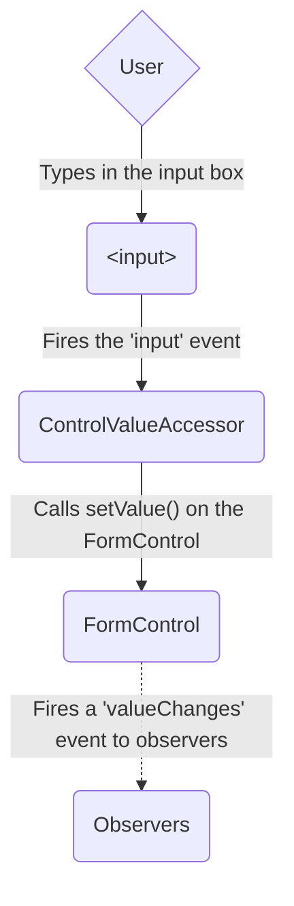
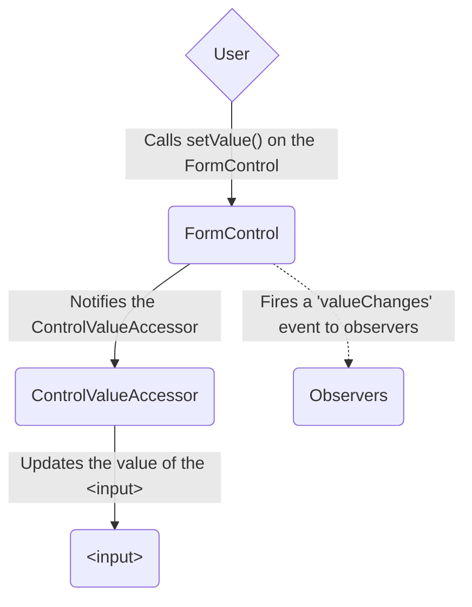
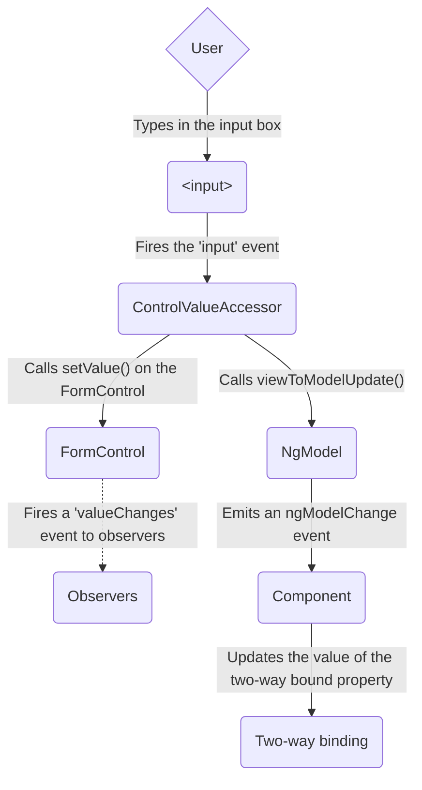
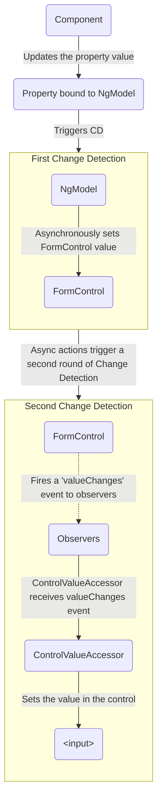

<docs-decorative-header title="Формы в Angular" imgSrc="adev/src/assets/images/overview.svg"> <!-- markdownlint-disable-line -->
Обработка пользовательского ввода через формы — основа многих типичных приложений.
</docs-decorative-header>

Приложения используют формы, чтобы пользователи могли войти в систему, обновить профиль, ввести конфиденциальные данные и выполнить множество других задач ввода данных.

Angular предлагает два подхода к обработке пользовательского ввода через формы: reactive и template-driven.

Оба захватывают события ввода из представления, валидируют ввод, создают форму и модель данных и предоставляют способ отслеживать изменения.

TIP: Если вы ищете новые Signal Forms, см. наше [руководство по основам Signal Forms](/essentials/signal-forms)!

Это руководство помогает решить, какой тип форм лучше подходит вашей ситуации.
В нём представлены общие строительные блоки обоих подходов.
Также суммируются ключевые различия и демонстрируются они в контексте настройки, потока данных и тестирования.

## Выбор подхода {#choosing-an-approach}

Reactive forms и template-driven forms по-разному обрабатывают и управляют данными формы.
У каждого подхода свои преимущества.

| Формы                 | Подробности                                                                                                                                                                                                                                                                                                                                                                                                             |
| :-------------------- | :---------------------------------------------------------------------------------------------------------------------------------------------------------------------------------------------------------------------------------------------------------------------------------------------------------------------------------------------------------------------------------------------------------------------- |
| Reactive forms        | Дают прямой, явный доступ к объектной модели формы. По сравнению с template-driven они более надёжны: масштабируемы, переиспользуемы и тестируемы. Если формы — ключевая часть приложения или вы уже используете реактивные паттерны, выбирайте reactive forms.                                                                                            |
| Template-driven forms | Опираются на директивы в шаблоне для создания и манипуляции объектной моделью. Полезны для простой формы в приложении, например подписки на email-рассылку. Их просто добавить, но они масштабируются хуже reactive forms. Если требования к форме очень базовые и логику можно вести только в шаблоне, template-driven forms могут подойти. |

### Ключевые различия {#key-differences}

Следующая таблица суммирует ключевые различия между reactive и template-driven forms.

|                                                   | Reactive                             | Template-driven                 |
| :------------------------------------------------ | :----------------------------------- | :------------------------------ |
| [Настройка модели формы](#setting-up-the-form-model) | Явная, создаётся в классе компонента | Неявная, создаётся директивами |
| [Модель данных](#mutability-of-the-data-model)       | Структурированная и неизменяемая     | Неструктурированная и изменяемая |
| [Поток данных](#data-flow-in-forms)                  | Синхронный                           | Асинхронный                     |
| [Валидация формы](#form-validation)                  | Функции                              | Директивы                       |

### Масштабируемость {#scalability}

Если формы — центральная часть приложения, масштабируемость очень важна.
Возможность переиспользовать модели форм между компонентами критична.

Reactive forms масштабируются лучше template-driven.
Они дают прямой доступ к underlying form API и используют [синхронный поток данных](#data-flow-in-reactive-forms) между представлением и моделью данных, что упрощает создание крупных форм.
Reactive forms требуют меньше настройки для тестирования, и тестирование не требует глубокого понимания обнаружения изменений для корректной проверки обновлений и валидации.

Template-driven forms ориентированы на простые сценарии и менее переиспользуемы.
Они абстрагируют underlying form API и используют [асинхронный поток данных](#data-flow-in-template-driven-forms) между представлением и моделью данных.
Абстракция template-driven forms также влияет на тестирование.
Тесты сильно зависят от ручного запуска обнаружения изменений и требуют больше настройки.

## Настройка модели формы {#setting-up-the-form-model}

И reactive, и template-driven forms отслеживают изменения значений между элементами ввода формы, с которыми взаимодействует пользователь, и данными формы в модели компонента.
Оба подхода разделяют underlying строительные блоки, но различаются в том, как вы создаёте и управляете общими экземплярами form-control.

### Общие базовые классы форм {#common-form-foundation-classes}

И reactive, и template-driven forms построены на следующих базовых классах.

| Базовые классы         | Подробности                                                                             |
| :--------------------- | :-------------------------------------------------------------------------------------- |
| `FormControl`          | Отслеживает значение и статус валидации отдельного form control.                        |
| `FormGroup`            | Отслеживает те же значения и статус для коллекции form controls.                        |
| `FormArray`            | Отслеживает те же значения и статус для массива form controls.                          |
| `ControlValueAccessor` | Создаёт мост между экземплярами Angular `FormControl` и встроенными DOM-элементами.     |

### Настройка в reactive forms {#setup-in-reactive-forms}

В reactive forms модель формы определяется напрямую в классе компонента.
Директива `[formControl]` связывает явно созданный экземпляр `FormControl` с конкретным элементом формы в представлении через внутренний value accessor.

Следующий компонент реализует поле ввода для одного control с помощью reactive forms.
В этом примере модель формы — экземпляр `FormControl`.

<docs-code language="angular-ts" path="adev/src/content/examples/forms-overview/src/app/reactive/favorite-color/favorite-color.component.ts"/>

IMPORTANT: В reactive forms модель формы — источник истины; она предоставляет значение и статус элемента формы в любой момент через директиву `[formControl]` на элементе `<input>`.

### Настройка в template-driven forms {#setup-in-template-driven-forms}

В template-driven forms модель формы неявная, а не явная.
Директива `NgModel` создаёт и управляет экземпляром `FormControl` для данного элемента формы.

Следующий компонент реализует то же поле ввода для одного control с помощью template-driven forms.

<docs-code language="angular-ts" path="adev/src/content/examples/forms-overview/src/app/template/favorite-color/favorite-color.component.ts"/>

IMPORTANT: В template-driven форме источник истины — шаблон. Директива `NgModel` автоматически управляет экземпляром `FormControl` за вас.

## Поток данных в формах {#data-flow-in-forms}

Когда в приложении есть форма, Angular должен синхронизировать представление с моделью компонента и модель компонента с представлением.
Когда пользователи меняют значения и делают выбор через представление, новые значения должны отражаться в модели данных.
Аналогично, когда программная логика меняет значения в модели данных, эти значения должны отражаться в представлении.

Reactive и template-driven forms различаются в том, как обрабатывают поток данных от пользователя или от программных изменений.
Следующие диаграммы иллюстрируют оба вида потока данных для каждого типа формы на примере поля favorite-color, определённого выше.

### Поток данных в reactive forms {#data-flow-in-reactive-forms}

В reactive forms каждый элемент формы в представлении напрямую связан с моделью формы (экземпляром `FormControl`).
Обновления от представления к модели и от модели к представлению синхронны и не зависят от того, как рендерится UI.

Диаграмма view-to-model показывает, как текут данные при изменении значения поля ввода из представления:

1. Пользователь вводит значение в элемент input, в данном случае любимый цвет _Blue_.
1. Элемент ввода формы испускает событие "input" с последним значением.
1. `ControlValueAccessor`, слушающий события на элементе ввода формы, сразу передаёт новое значение экземпляру `FormControl`.
1. Экземпляр `FormControl` испускает новое значение через observable `valueChanges`.
1. Любые подписчики на observable `valueChanges` получают новое значение.

Диаграмма model-to-view показывает, как программное изменение модели распространяется в представление:

1. Пользователь вызывает метод `favoriteColorControl.setValue()`, который обновляет значение `FormControl`.
1. Экземпляр `FormControl` испускает новое значение через observable `valueChanges`.
1. Любые подписчики на observable `valueChanges` получают новое значение.
1. Control value accessor на элементе ввода формы обновляет элемент новым значением.

### Поток данных в template-driven forms {#data-flow-in-template-driven-forms}

В template-driven forms каждый элемент формы связан с директивой, которая управляет моделью формы внутренне.

Диаграмма view-to-model показывает, как текут данные при изменении значения поля ввода из представления:

1. Пользователь вводит _Blue_ в элемент input.
1. Элемент input испускает событие "input" со значением _Blue_.
1. Control value accessor, прикреплённый к input, вызывает метод `setValue()` на экземпляре `FormControl`.
1. Экземпляр `FormControl` испускает новое значение через observable `valueChanges`.
1. Любые подписчики на observable `valueChanges` получают новое значение.
1. Control value accessor также вызывает метод `NgModel.viewToModelUpdate()`, который испускает событие `ngModelChange`.
1. Поскольку шаблон компонента использует двустороннюю привязку данных для свойства `favoriteColor`, свойство `favoriteColor` в компоненте обновляется значением, испущенным событием `ngModelChange` \(_Blue_\).

Диаграмма model-to-view показывает, как текут данные от модели к представлению при изменении `favoriteColor` с _Blue_ на _Red_:

1. Значение `favoriteColor` обновляется в компоненте.
1. Начинается обнаружение изменений.
1. Во время обнаружения изменений вызывается хук жизненного цикла `ngOnChanges` на экземпляре директивы `NgModel`, потому что изменилось значение одного из её inputs.
1. Метод `ngOnChanges()` ставит в очередь async-задачу для установки значения внутреннего экземпляра `FormControl`.
1. Обнаружение изменений завершается.
1. На следующем тике выполняется задача установки значения экземпляра `FormControl`.
1. Экземпляр `FormControl` испускает последнее значение через observable `valueChanges`.
1. Любые подписчики на observable `valueChanges` получают новое значение.
1. Control value accessor обновляет элемент ввода формы в представлении последним значением `favoriteColor`.

NOTE: `NgModel` запускает второе обнаружение изменений, чтобы избежать ошибок `ExpressionChangedAfterItHasBeenChecked`, потому что изменение значения исходит из привязки input.

### Изменяемость модели данных {#mutability-of-the-data-model}

Метод отслеживания изменений влияет на эффективность приложения.

| Формы                 | Подробности                                                                                                                                                                                                                                                                                                                                                                                                                                                                                                                                  |
| :-------------------- | :------------------------------------------------------------------------------------------------------------------------------------------------------------------------------------------------------------------------------------------------------------------------------------------------------------------------------------------------------------------------------------------------------------------------------------------------------------------------------------------------------------------------------------------- |
| Reactive forms        | Сохраняют модель данных чистой, предоставляя её как неизменяемую структуру. При каждом изменении модели данных экземпляр `FormControl` возвращает новую модель данных, а не обновляет существующую. Это позволяет отслеживать уникальные изменения модели данных через observable control. Обнаружение изменений эффективнее, потому что обновляется только при уникальных изменениях. Поскольку обновления данных следуют реактивным паттернам, можно интегрироваться с операторами observable для преобразования данных. |
| Template-driven forms | Опираются на изменяемость с двусторонней привязкой данных для обновления модели данных в компоненте при изменениях в шаблоне. Поскольку при двусторонней привязке нет уникальных изменений для отслеживания в модели данных, обнаружение изменений менее эффективно при определении необходимости обновлений.                                                                                                                                                                                                                                 |

Разница демонстрируется в предыдущих примерах с элементом ввода favorite-color.

- В reactive forms **экземпляр `FormControl`** всегда возвращает новое значение при обновлении значения control
- В template-driven forms **свойство favorite color** всегда модифицируется до нового значения

## Валидация формы {#form-validation}

Валидация — неотъемлемая часть управления любым набором форм.
Проверяете ли вы обязательные поля или запрашиваете внешний API на существующее имя пользователя, Angular предоставляет набор встроенных валидаторов, а также возможность создавать пользовательские.

| Формы                 | Подробности                                                                                                      |
| :-------------------- | :--------------------------------------------------------------------------------------------------------------- |
| Reactive forms        | Определяют пользовательские валидаторы как **функции**, получающие control для валидации                         |
| Template-driven forms | Привязаны к **директивам** шаблона и должны предоставлять пользовательские директивы-валидаторы, оборачивающие функции валидации |

Подробнее см. [Валидация форм](guide/forms/form-validation#validating-input-in-reactive-forms).

## Тестирование {#testing}

Тестирование играет большую роль в сложных приложениях.
Более простая стратегия тестирования полезна при проверке корректной работы форм.
Reactive forms и template-driven forms по-разному зависят от рендера UI для утверждений на основе изменений form control и полей формы.
Следующие примеры демонстрируют процесс тестирования форм с reactive и template-driven forms.

### Тестирование reactive forms {#testing-reactive-forms}

Reactive forms дают относительно прямолинейную стратегию тестирования, потому что обеспечивают синхронный доступ к форме и моделям данных и могут тестироваться без рендера UI.
В этих тестах статус и данные запрашиваются и манипулируются через control без взаимодействия с циклом обнаружения изменений.

Следующие тесты используют компоненты favorite-color из предыдущих примеров для проверки потоков данных view-to-model и model-to-view для reactive form.

<!--todo: make consistent with other topics -->

#### Проверка потока данных view-to-model {#verifying-view-to-model-data-flow}

Первый пример выполняет следующие шаги для проверки потока данных view-to-model.

1. Запросить представление на элемент ввода формы и создать пользовательское событие "input" для теста.
1. Установить новое значение input в _Red_ и отправить событие "input" на элемент ввода формы.
1. Утвердить, что значение `favoriteColorControl` компонента совпадает со значением из input.

<docs-code header="Favorite color test - view to model" path="adev/src/content/examples/forms-overview/src/app/reactive/favorite-color/favorite-color.component.spec.ts" region="view-to-model"/>

Следующий пример выполняет шаги для проверки потока данных model-to-view.

1. Использовать `favoriteColorControl`, экземпляр `FormControl`, для установки нового значения.
1. Запросить представление на элемент ввода формы.
1. Утвердить, что новое значение, установленное на control, совпадает со значением в input.

<docs-code header="Favorite color test - model to view" path="adev/src/content/examples/forms-overview/src/app/reactive/favorite-color/favorite-color.component.spec.ts" region="model-to-view"/>

### Тестирование template-driven forms {#testing-template-driven-forms}

Написание тестов с template-driven forms требует детального знания процесса обнаружения изменений и понимания того, как директивы выполняются на каждом цикле, чтобы элементы запрашивались, тестировались или изменялись в правильное время.

Следующие тесты используют упомянутые ранее компоненты favorite color для проверки потоков данных от представления к модели и от модели к представлению для template-driven form.

Следующий тест проверяет поток данных от представления к модели.

<docs-code header="Favorite color test - view to model" path="adev/src/content/examples/forms-overview/src/app/template/favorite-color/favorite-color.component.spec.ts" region="view-to-model"/>

Шаги, выполненные в тесте view to model:

1. Запросить представление на элемент ввода формы и создать пользовательское событие "input" для теста.
1. Установить новое значение input в _Red_ и отправить событие "input" на элемент ввода формы.
1. Запустить обнаружение изменений через test fixture.
1. Утвердить, что значение свойства `favoriteColor` компонента совпадает со значением из input.

Следующий тест проверяет поток данных от модели к представлению.

<docs-code header="Favorite color test - model to view" path="adev/src/content/examples/forms-overview/src/app/template/favorite-color/favorite-color.component.spec.ts" region="model-to-view"/>

Шаги, выполненные в тесте model to view:

1. Использовать экземпляр компонента для установки значения свойства `favoriteColor`.
1. Запустить обнаружение изменений через test fixture.
1. Использовать `await fixture.whenStable()`, чтобы дождаться следующего рендера.
1. Запросить представление на элемент ввода формы.
1. Утвердить, что значение input совпадает со значением свойства `favoriteColor` в экземпляре компонента.

## Следующие шаги {#next-steps}

Чтобы узнать больше о reactive forms, см. следующие руководства:

<docs-pill-row>
  <docs-pill href="guide/forms/reactive-forms" title="Reactive forms"/>
  <docs-pill href="guide/forms/form-validation#validating-input-in-reactive-forms" title="Form validation"/>
  <docs-pill href="guide/forms/dynamic-forms" title="Dynamic forms"/>
</docs-pill-row>

Чтобы узнать больше о template-driven forms, см. следующие руководства:

<docs-pill-row>
  <docs-pill href="guide/forms/template-driven-forms" title="Template Driven Forms tutorial" />
  <docs-pill href="guide/forms/form-validation#validating-input-in-template-driven-forms" title="Form validation" />
  <docs-pill href="api/forms/NgForm" title="NgForm directive API reference" />
</docs-pill-row>
