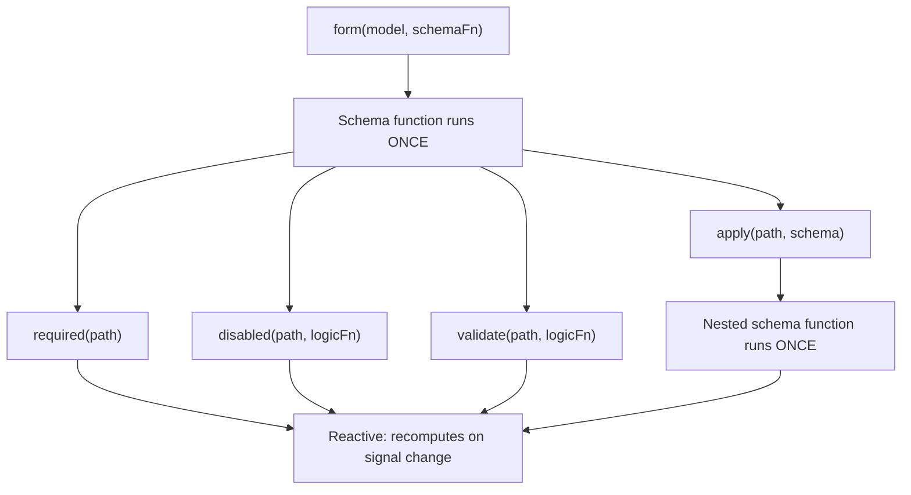

# Schemas and schema composability

Signal Forms uses a two-layer architecture to separate _how your form is structured_ from _how it behaves at runtime_.

When you pass a schema function to `form()`, that function _runs once_ during form creation. Its job is to set up the form's logic tree by declaring which fields have validation, which fields are disabled, and which fields depend on other fields. This is the **structural layer** of your form.

Inside a schema function, you call rule functions such as `disabled()` and `validate()`. These rule functions accept reactive logic that recomputes whenever the signals they reference change. Other rules like `required()` accept optional configuration, including a `when` function that conditionally activates the rule. Together, these form the **behavioral layer** of your form during runtime.

```ts
contactForm = form(this.contactModel, (schemaPath) => {
  // Schema function: runs ONCE during form creation
  required(schemaPath.name);
  disabled(schemaPath.couponCode, ({valueOf}) => valueOf(schemaPath.total) < 50);
  //  ^^^ Reactive logic: recomputes when total changes
});
```



This distinction is important when you compose schemas because functions like `apply()`, `applyWhen()`, and `schema()` all operate at the structural layer. Schemas control _which_ rules exist and _whether_ they're active, while rule functions define _what_ those rules evaluate.

## Create reusable schemas with `schema()`

When multiple forms share the same rules for a common data shape, you can use the `schema()` function to extract those rules into a reusable schema.

```ts
import {schema, required, minLength} from '@angular/forms/signals';

const nameSchema = schema<{first: string; last: string}>((name) => {
  required(name.first);
  required(name.last);
  minLength(name.first, 2);
  minLength(name.last, 2);
});
```

The `schema()` function wraps a function and converts it into a reusable `Schema<T>` object. Like any schema function, it _runs once_ per form, but the object itself can be shared across as many forms as you need.

TIP: If rules only appear in one place, an inline schema function works just as well. Use `schema()` when you want to reuse the same schema across multiple forms or apply the same schema to multiple paths. Reusable `Schema` objects are cached per form compilation.

### Using the schema with `apply()`

You can apply a reusable schema to a specific path in a form by using the `apply()` function. When you call `apply()`, the schema receives a scoped path that only sees the fields within that sub-path:

```ts
import {apply} from '@angular/forms/signals';

profileForm = form(this.profileModel, (schemaPath) => {
  apply(schemaPath.name, nameSchema);
});

registrationForm = form(this.registrationModel, (schemaPath) => {
  apply(schemaPath.name, nameSchema);
});
```

## Conditional schemas with `applyWhen()`

NOTE: The [Adding form logic guide](guide/forms/signals/form-logic) introduced `applyWhen()` for conditional rules with inline logic. This section covers how to compose `applyWhen()` with reusable schemas.

Some rules should only apply under certain conditions. For example, a zip code field might require validation only when the selected country is the United States.

The `applyWhen()` function applies a schema conditionally based on reactive state. It accepts three arguments:

1. A path to apply the schema to
1. A reactive logic function that returns `true` when the schema should be active
1. A schema or schema function containing the conditional rules

```ts
import {form, applyWhen, required, pattern} from '@angular/forms/signals';

addressForm = form(this.addressModel, (schemaPath) => {
  applyWhen(
    schemaPath,
    ({valueOf}) => valueOf(schemaPath.country) === 'US',
    (schemaPath) => {
      required(schemaPath.zipCode);
      pattern(schemaPath.zipCode, /^\d{5}(-\d{4})?$/);
    },
  );
});
```

The logic function receives a `FieldContext`, which provides access to `value`, `valueOf`, `stateOf`, and other reactive helpers. Because it's reactive, the condition is re-evaluated whenever the signals it reads change. When the condition becomes `false`, the rules inside the schema deactivate. When it becomes `true` again, they reactivate.

The schema itself is still structural — the schema function runs once during form creation. The condition controls whether those rules are _active_, not whether they _exist_.

Inside the conditional schema, use the scoped path parameter passed to that schema function. Paths from an outer schema are not valid inside a nested schema.

### Combining `applyWhen()` with reusable schemas

Since `applyWhen()` accepts a `Schema` object, you can pair it with `schema()` to conditionally apply reusable schemas:

```ts
const usZipCodeSchema = schema<{zipCode: string}>((address) => {
  required(address.zipCode);
  pattern(address.zipCode, /^\d{5}(-\d{4})?$/);
});

const caPostalCodeSchema = schema<{postalCode: string}>((address) => {
  required(address.postalCode);
  pattern(address.postalCode, /^[A-Z]\d[A-Z] \d[A-Z]\d$/);
});

shippingForm = form(this.shippingModel, (schemaPath) => {
  applyWhen(
    schemaPath.address,
    ({valueOf}) => valueOf(schemaPath.country) === 'US',
    usZipCodeSchema,
  );
  applyWhen(
    schemaPath.address,
    ({valueOf}) => valueOf(schemaPath.country) === 'CA',
    caPostalCodeSchema,
  );
});
```

NOTE: The logic function accesses `valueOf(schemaPath.country)` even though the path argument is `schemaPath.address`. This is because the `valueOf` helper can access any field in the form, not just fields within the scoped path.

This pattern keeps validation logic modular — each country's address rules live in their own schema, and the form selects which one to activate based on the user's choice.

## Type-narrowing with `applyWhenValue()`

The `applyWhenValue()` function simplifies conditions that only need to check the field's value. Instead of receiving a `FieldContext`, the condition function receives the field's raw value directly.

```ts {header: "applyWhen — logic function receives FieldContext"}
applyWhen(schemaPath.payment, ({value}) => value().type === 'credit-card', creditCardSchema);
```

```ts {header: "applyWhenValue — condition receives the value directly"}
applyWhenValue(schemaPath.payment, (payment) => payment.type === 'credit-card', creditCardSchema);
```

The main advantage of `applyWhenValue()` is TypeScript type guard support. When the condition function is a type guard, the schema's type parameter narrows to the guarded type. This is especially useful for discriminated unions, where each variant has different fields that need different rules.

```ts
import {form, applyWhenValue, required} from '@angular/forms/signals';

interface CreditCard {
  type: 'credit-card';
  cardNumber: string;
  expiry: string;
  cvv: string;
}

interface BankTransfer {
  type: 'bank-transfer';
  accountNumber: string;
  routingNumber: string;
}

type PaymentMethod = CreditCard | BankTransfer;

function isCreditCard(value: PaymentMethod): value is CreditCard {
  return value.type === 'credit-card';
}

function isBankTransfer(value: PaymentMethod): value is BankTransfer {
  return value.type === 'bank-transfer';
}

paymentForm = form(this.paymentModel, (schemaPath) => {
  applyWhenValue(schemaPath.payment, isCreditCard, (payment) => {
    // TypeScript knows payment is scoped to CreditCard
    required(payment.cardNumber);
    required(payment.expiry);
    required(payment.cvv);
  });

  applyWhenValue(schemaPath.payment, isBankTransfer, (payment) => {
    // TypeScript knows payment is scoped to BankTransfer
    required(payment.accountNumber);
    required(payment.routingNumber);
  });
});
```

Without the type guard, TypeScript would not know which fields are available inside each schema function. The type narrowing ensures that accessing `payment.cardNumber` is type-safe in the credit card branch and `payment.accountNumber` is type-safe in the bank transfer branch.

## Array items with `applyEach()`

When a form contains an array of objects, you often need the same rules applied to every item. The `applyEach()` function applies a schema to each item in an array field, regardless of how many items exist.

```ts
import {form, applyEach, required, min} from '@angular/forms/signals';

type LineItem = {name: string; quantity: number};

orderForm = form(this.orderModel, (schemaPath) => {
  required(schemaPath.title);

  applyEach(schemaPath.items, (item) => {
    required(item.name);
    min(item.quantity, 1);
  });
});
```

The schema function passed to `applyEach()` receives a `SchemaPathTree` scoped to a single array item. Rules declared inside apply to every item in the array, including items added after form creation.

### Combining `applyEach()` with reusable schemas

Since `applyEach()` accepts a `Schema` object, you can extract item-level rules into a reusable schema and share them across forms:

```ts
const lineItemSchema = schema<LineItem>((item) => {
  required(item.name);
  min(item.quantity, 1);
});

orderForm = form(this.orderModel, (schemaPath) => {
  required(schemaPath.title);
  applyEach(schemaPath.items, lineItemSchema);
});

invoiceForm = form(this.invoiceModel, (schemaPath) => {
  required(schemaPath.invoiceNumber);
  applyEach(schemaPath.lineItems, lineItemSchema);
});
```

TIP: For more on validating array items, including custom error messages per field, see the [Validation guide](guide/forms/signals/validation).

## Next steps

To learn more about Signal Forms, check out these related guides:

- [Adding form logic](guide/forms/signals/form-logic) - Learn how to add conditional logic, dynamic behavior, and metadata to your forms
- [Validation](guide/forms/signals/validation) - Learn about validation rules and error handling
- [Async operations](guide/forms/signals/async-operations) - Learn how to handle form submission and async validation
