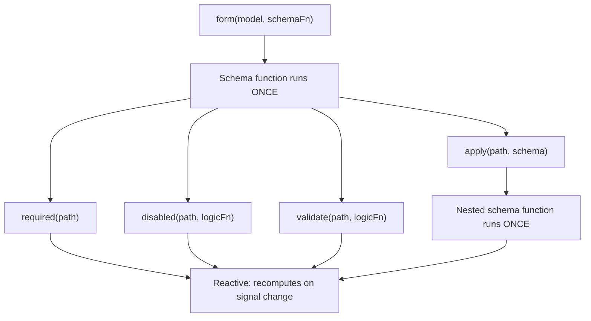

# Схемы и композируемость схем

Signal Forms используют двухслойную архитектуру, чтобы отделить _как структурирована ваша форма_ от _как она ведёт себя в runtime_.

Когда вы передаёте функцию схемы в `form()`, эта функция _выполняется один раз_ при создании формы. Её задача — настроить дерево логики формы, объявив, какие поля имеют валидацию, какие отключены и какие зависят от других полей. Это **структурный слой** вашей формы.

Внутри функции схемы вы вызываете функции правил, такие как `disabled()` и `validate()`. Эти функции правил принимают реактивную логику, которая пересчитывается при изменении сигналов, на которые они ссылаются. Условные правила вроде `disabled()` и `required()` принимают опциональную конфигурацию, включая функцию `when`, которая активирует правило. Вместе они образуют **поведенческий слой** вашей формы в runtime.

```ts
contactForm = form(this.contactModel, (schemaPath) => {
  // Schema function: runs ONCE during form creation
  required(schemaPath.name);
  disabled(schemaPath.couponCode, {when: ({valueOf}) => valueOf(schemaPath.total) < 50});
  //  ^^^ Reactive logic: recomputes when total changes
});
```



Это различие важно при композиции схем, потому что функции вроде `apply()`, `applyWhen()` и `schema()` работают на структурном слое. Схемы контролируют, _какие_ правила существуют и _активны_ ли они, а функции правил определяют, _что_ эти правила оценивают.

## Создание переиспользуемых схем с `schema()` {#create-reusable-schemas-with-schema}

Когда несколько форм разделяют одни и те же правила для общей формы данных, можно использовать функцию `schema()`, чтобы извлечь эти правила в переиспользуемую схему.

```ts
import {schema, required, minLength} from '@angular/forms/signals';

const nameSchema = schema<{first: string; last: string}>((name) => {
  required(name.first);
  required(name.last);
  minLength(name.first, 2);
  minLength(name.last, 2);
});
```

Функция `schema()` оборачивает функцию и преобразует её в переиспользуемый объект `Schema<T>`. Как любая функция схемы, она _выполняется один раз_ на форму, но сам объект можно разделять между столькими формами, сколькими нужно.

TIP: Если правила появляются только в одном месте, inline-функция схемы работает так же хорошо. Используйте `schema()`, когда хотите переиспользовать одну схему в нескольких формах или применить одну схему к нескольким путям. Переиспользуемые объекты `Schema` кэшируются на компиляцию формы.

### Использование схемы с `apply()` {#using-the-schema-with-apply}

Переиспользуемую схему можно применить к конкретному пути в форме с помощью функции `apply()`. При вызове `apply()` схема получает scoped-путь, который видит только поля внутри этого подпути:

```ts
import {apply} from '@angular/forms/signals';

profileForm = form(this.profileModel, (schemaPath) => {
  apply(schemaPath.name, nameSchema);
});

registrationForm = form(this.registrationModel, (schemaPath) => {
  apply(schemaPath.name, nameSchema);
});
```

## Условные схемы с `applyWhen()` {#conditional-schemas-with-applywhen}

NOTE: [Руководство по добавлению логики формы](guide/forms/signals/form-logic) представило `applyWhen()` для условных правил с inline-логикой. Этот раздел охватывает, как компоновать `applyWhen()` с переиспользуемыми схемами.

Некоторые правила должны применяться только при определённых условиях. Например, поле zip code может требовать валидации только когда выбранная страна — США.

Функция `applyWhen()` применяет схему условно на основе реактивного состояния. Она принимает три аргумента:

1. Путь, к которому применить схему
1. Реактивную логическую функцию, возвращающую `true`, когда схема должна быть активна
1. Схему или функцию схемы, содержащую условные правила

```ts
import {form, applyWhen, required, pattern} from '@angular/forms/signals';

addressForm = form(this.addressModel, (schemaPath) => {
  applyWhen(
    schemaPath,
    ({valueOf}) => valueOf(schemaPath.country) === 'US',
    (schemaPath) => {
      required(schemaPath.zipCode);
      pattern(schemaPath.zipCode, /^\d{5}(-\d{4})?$/);
    },
  );
});
```

Логическая функция получает `FieldContext`, который предоставляет доступ к `value`, `valueOf`, `stateOf` и другим реактивным хелперам. Поскольку она реактивна, условие переоценивается при изменении сигналов, которые она читает. Когда условие становится `false`, правила внутри схемы деактивируются. Когда снова становится `true` — реактивируются.

Сама схема по-прежнему структурна — функция схемы выполняется один раз при создании формы. Условие контролирует, _активны_ ли эти правила, а не _существуют_ ли они.

Внутри условной схемы используйте scoped-параметр пути, переданный этой функции схемы. Пути из внешней схемы невалидны внутри вложенной схемы.

### Комбинация `applyWhen()` с переиспользуемыми схемами {#combining-applywhen-with-reusable-schemas}

Поскольку `applyWhen()` принимает объект `Schema`, его можно сочетать с `schema()` для условного применения переиспользуемых схем:

```ts
const usZipCodeSchema = schema<{zipCode: string}>((address) => {
  required(address.zipCode);
  pattern(address.zipCode, /^\d{5}(-\d{4})?$/);
});

const caPostalCodeSchema = schema<{postalCode: string}>((address) => {
  required(address.postalCode);
  pattern(address.postalCode, /^[A-Z]\d[A-Z] \d[A-Z]\d$/);
});

shippingForm = form(this.shippingModel, (schemaPath) => {
  applyWhen(
    schemaPath.address,
    ({valueOf}) => valueOf(schemaPath.country) === 'US',
    usZipCodeSchema,
  );
  applyWhen(
    schemaPath.address,
    ({valueOf}) => valueOf(schemaPath.country) === 'CA',
    caPostalCodeSchema,
  );
});
```

NOTE: Логическая функция обращается к `valueOf(schemaPath.country)`, даже если аргумент пути — `schemaPath.address`. Это потому что хелпер `valueOf` может обращаться к любому полю в форме, а не только к полям внутри scoped-пути.

Этот паттерн держит логику валидации модульной — правила адреса каждой страны живут в собственной схеме, а форма выбирает, какую активировать, на основе выбора пользователя.

## Сужение типов с `applyWhenValue()` {#type-narrowing-with-applywhenvalue}

Функция `applyWhenValue()` упрощает условия, которым нужно только проверить значение поля. Вместо `FieldContext` функция условия получает сырое значение поля напрямую.

```ts {header: "applyWhen — logic function receives FieldContext"}
applyWhen(schemaPath.payment, ({value}) => value().type === 'credit-card', creditCardSchema);
```

```ts {header: "applyWhenValue — condition receives the value directly"}
applyWhenValue(schemaPath.payment, (payment) => payment.type === 'credit-card', creditCardSchema);
```

Главное преимущество `applyWhenValue()` — поддержка type guard TypeScript. Когда функция условия — type guard, параметр типа схемы сужается до охраняемого типа. Это особенно полезно для discriminated unions, где у каждого варианта разные поля, нуждающиеся в разных правилах.

```ts
import {form, applyWhenValue, required} from '@angular/forms/signals';

interface CreditCard {
  type: 'credit-card';
  cardNumber: string;
  expiry: string;
  cvv: string;
}

interface BankTransfer {
  type: 'bank-transfer';
  accountNumber: string;
  routingNumber: string;
}

type PaymentMethod = CreditCard | BankTransfer;

function isCreditCard(value: PaymentMethod): value is CreditCard {
  return value.type === 'credit-card';
}

function isBankTransfer(value: PaymentMethod): value is BankTransfer {
  return value.type === 'bank-transfer';
}

paymentForm = form(this.paymentModel, (schemaPath) => {
  applyWhenValue(schemaPath, isCreditCard, (payment) => {
    // TypeScript knows payment is scoped to CreditCard
    required(payment.cardNumber);
    required(payment.expiry);
    required(payment.cvv);
  });

  applyWhenValue(schemaPath, isBankTransfer, (payment) => {
    // TypeScript knows payment is scoped to BankTransfer
    required(payment.accountNumber);
    required(payment.routingNumber);
  });
});
```

Без type guard TypeScript не знал бы, какие поля доступны внутри каждой функции схемы. Сужение типов гарантирует, что обращение к `payment.cardNumber` типобезопасно в ветке credit card, а `payment.accountNumber` — в ветке bank transfer.

## Элементы массива с `applyEach()` {#array-items-with-applyeach}

Когда форма содержит массив объектов, часто нужны одни и те же правила для каждого элемента. Функция `applyEach()` применяет схему к каждому элементу поля-массива независимо от того, сколько элементов существует.

```ts
import {form, applyEach, required, min} from '@angular/forms/signals';

type LineItem = {name: string; quantity: number};

orderForm = form(this.orderModel, (schemaPath) => {
  required(schemaPath.title);

  applyEach(schemaPath.items, (item) => {
    required(item.name);
    min(item.quantity, 1);
  });
});
```

Функция схемы, переданная в `applyEach()`, получает `SchemaPathTree`, scoped к одному элементу массива. Правила, объявленные внутри, применяются к каждому элементу массива, включая элементы, добавленные после создания формы.

### Комбинация `applyEach()` с переиспользуемыми схемами {#combining-applyeach-with-reusable-schemas}

Поскольку `applyEach()` принимает объект `Schema`, можно извлечь правила уровня элемента в переиспользуемую схему и разделять их между формами:

```ts
const lineItemSchema = schema<LineItem>((item) => {
  required(item.name);
  min(item.quantity, 1);
});

orderForm = form(this.orderModel, (schemaPath) => {
  required(schemaPath.title);
  applyEach(schemaPath.items, lineItemSchema);
});

invoiceForm = form(this.invoiceModel, (schemaPath) => {
  required(schemaPath.invoiceNumber);
  applyEach(schemaPath.lineItems, lineItemSchema);
});
```

TIP: Подробнее о валидации элементов массива, включая пользовательские сообщения об ошибках на поле, см. в [руководстве по валидации](guide/forms/signals/validation).

## Следующие шаги {#next-steps}

Чтобы узнать больше о Signal Forms, см. эти связанные руководства:

- [Добавление логики формы](guide/forms/signals/form-logic) — как добавлять условную логику, динамическое поведение и метаданные в формы
- [Валидация](guide/forms/signals/validation) — правила валидации и обработка ошибок
- [Асинхронные операции](guide/forms/signals/async-operations) — отправка формы и async-валидация
