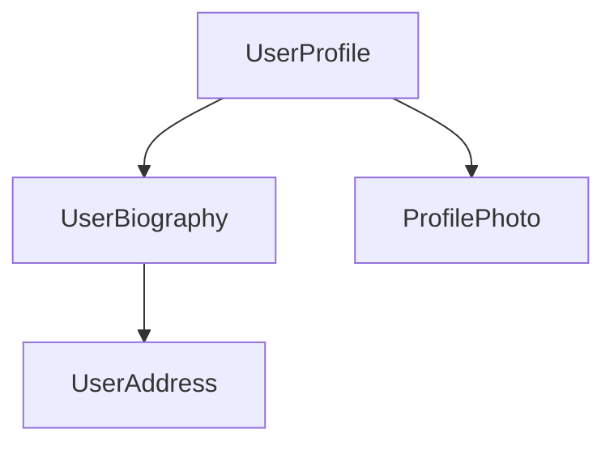

<docs-decorative-header title="Komponentlər" imgSrc="adev/src/assets/images/components.svg"> 
<!-- markdownlint-disable-line -->
Angular-da tətbiqlər yaratmaq üçün əsas tikinti bloku (building block).
</docs-decorative-header>

Komponentlər Angular tətbiqlərinin əsas tikinti bloklarıdır (building block). Hər bir komponent daha böyük bir veb səhifənin bir hissəsini təmsil edir. Tətbiqi komponentlərə bölmək layihənizə struktur qazandırır, kodu asan idarə edilə bilən və zamanla inkişaf etdirilə bilən spesifik hissələrə aydın şəkildə ayırır.

## Komponentin təyini

Hər bir komponentin bir neçə əsas hissəsi vardır:

1. Angular tərəfindən istifadə olunan bəzi konfiqurasiyaları ehtiva edən `@Component`[decorator-u](https://www.typescriptlang.org/docs/handbook/decorators.html).
2. DOM-a nə render olunacağını idarə edən HTML şablonu.
3. Komponentin HTML-də necə istifadə olunacağını müəyyən edən [CSS selector-u](https://developer.mozilla.org/docs/Learn/CSS/Building_blocks/Selectors).
4. İstifadəçi daxilolmasını idarə etmək və ya serverə sorğular göndərmək kimi davranışları olan TypeScript sinfi.

Budur `UserProfile` komponentinin sadələşdirilmiş nümunəsi.

```angular-ts
// user-profile.ts
@Component({
  selector: 'user-profile',
  template: `
    <h1>User profile</h1>
    <p>This is the user profile page</p>
  `,
})
export class UserProfile {
  /* Komponent kodu buraya yazılır */
}
```

`@Component` dekoratoru həmçinin şablonunuza tətbiq etmək istədiyiniz hər hansı CSS üçün istəyə bağlı olaraq `styles` xassəsini qəbul edir:

```angular-ts
// user-profile.ts
@Component({
  selector: 'user-profile',
  template: `
    <h1>User profile</h1>
    <p>This is the user profile page</p>
  `,
  styles: `
    h1 {
      font-size: 3em;
    }
  `,
})
export class UserProfile {
  /* Komponent kodu buraya yazılır */
}
```

### HTML və CSS-i ayrı fayllara ayırmaq

komponentin `templateUrl` və `styleUrl` istifadə edərək HTML və CSS-ni ayrı fayllarda təyin edə bilərsiniz:

```angular-ts
// user-profile.ts
@Component({
  selector: 'user-profile',
  templateUrl: 'user-profile.html',
  styleUrl: 'user-profile.css',
})
export class UserProfile {
  // Komponent davranışı burada müəyyən edilir
}
```

```angular-html
<!-- user-profile.html -->
<h1>User profile</h1>
<p>This is the user profile page</p>
```

```css
/* user-profile.css */
h1 {
  font-size: 3em;
}
```

## Komponentləri istifadə etmək

Bir tətbiqi bir neçə komponenti birləşdirərək qurursunuz. Məsələn, istifadəçi profil səhifəsi yaradarkən səhifəni aşağıdakı kimi bir neçə komponentə bölə bilərsiniz:



Burada `UserProfile` komponenti son səhifəni yaratmaq üçün bir neçə digər komponentdən istifadə edir.

Bir komponenti idxal edib istifadə etmək üçün aşağıdakıları etməlisiniz:

1. Komponentinizin TypeScript faylında istifadə etmək istədiyiniz komponent üçün `import` bəyanatı əlavə edin.
2. `@Component` dekoratorunda istifadə etmək istədiyiniz komponent üçün `imports` massivinə giriş əlavə edin.
3. Komponentinizin şablonunda istifadə etmək istədiyiniz komponentin seçicisinə uyğun element əlavə edin.

Budur `UserProfile` komponentinin `ProfilePhoto` komponentini idxal etmə nümunəsi:

```angular-ts
// user-profile.ts
import {ProfilePhoto} from 'profile-photo.ts';

@Component({
  selector: 'user-profile',
  imports: [ProfilePhoto],
  template: `
    <h1>User profile</h1>
    <profile-photo />
    <p>This is the user profile page</p>
  `,
})
export class UserProfile {
  // Komponent davranışı burada müəyyən edilir
}
```

MƏSLƏHƏT: Angular komponentləri haqqında daha çox məlumat əldə etmək istəyirsiniz? Tam təfərrüatlar üçün [Dərin Komponentlər bələdçisinə (In-depth Components guide)](guide/components) baxın.

## Növbəti addım

İndi Angular-da komponentlərin necə işlədiyini bildiyinizə görə, tətbiqimizdə dinamik məlumatı necə əlavə edib idarə edəcəyimizi öyrənmək vaxtıdır.

<docs-pill-row>
  <docs-pill title="Siqnallarla Reaktivlik" href="essentials/signals" />
  <docs-pill title="Dərin komponentlər bələdçisi (In-depth components guide)" href="guide/components" />
</docs-pill-row>
