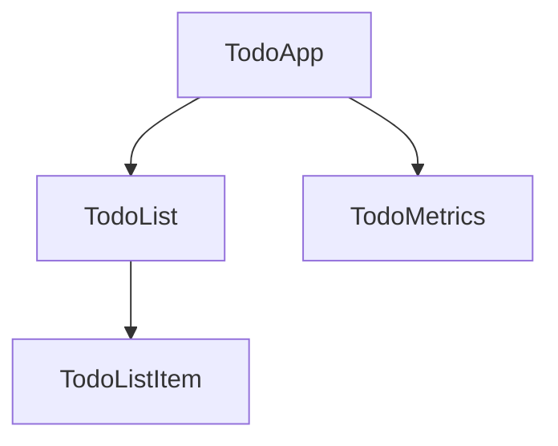

<docs-decorative-header title="Components" imgSrc="adev/src/assets/images/components.svg"> <!-- markdownlint-disable-line -->
The fundamental building block for creating applications in Angular.
</docs-decorative-header>

Components provide structure for organizing your project into easy-to-understand parts with clear responsibilities so that your code is maintainable and scalable.

Here is an example of how a Todo application could be broken down into a tree of components.



In this guide, we'll take a look at how to create and use components in Angular.

## Defining a Component

Every component has the following core properties:

1. A `@Component`[decorator](https://www.typescriptlang.org/docs/handbook/decorators.html) that contains some configuration
2. An HTML template that controls what renders into the DOM
3. A [CSS selector](https://developer.mozilla.org/docs/Learn/CSS/Building_blocks/Selectors) that defines how the component is used in HTML
4. A TypeScript class with behaviors such as managing state, handling user input, or fetching data from a server.

Here is a simplified example of a TodoListItem component.

```ts
// todo-list-item.component.ts
@Component({
  selector: 'todo-list-item',
  template: `
    <li>(TODO) Read Angular Essentials Guide</li>
  `,
})
export class TodoListItem {
  /* Component behavior is defined in here */
}
```

Other common metadata that you'll also see in components include:

- `standalone: true` — The recommended approach of streamlining the authoring experience of components
- `styles` — A string or array of strings that contains any CSS styles you want applied to the component

Knowing this, here is an updated version of our `TodoListItem` component.

```ts
// todo-list-item.component.ts
@Component({
  standalone: true,
  selector: 'todo-list-item',
  template: `
    <li>(TODO) Read Angular Essentials Guide</li>
  `,
  styles: `
    li {
      color: red;
      font-weight: 300;
    }
  `,
})
export class TodoListItem {
  /* Component behavior is defined in here */
}
```

### Separating HTML and CSS into separate files

For teams that prefer managing their HTML and/or CSS in separate files, Angular provides two additional properties: `templateUrl` and `styleUrl`.

Using the previous `TodoListItem` component, the alternative approach looks like:

```ts
// todo-list-item.component.ts
@Component({
  standalone: true,
  selector: 'todo-list-item',
  templateUrl: './todo-list-item.component.html',
  styleUrl: './todo-list-item.component.css',
})
export class TodoListItem {
  /* Component behavior is defined in here */
}
```

```html
<!-- todo-list-item.component.html -->
<li>(TODO) Read Angular Essentials Guide</li>
```

```css
// todo-list-item.component.css
li {
  color: red;
  font-weight: 300;
}
```

## Using a Component

One advantage of component architecture is that your application is modular. In other words, components can be used in other components.

To use a component, you need to:

1. Import the component into the file
2. Add it to the component's `imports` array
3. Use the component's selector in the `template`

Here's an example of a `TodoList` component importing the `TodoListItem` component from before:

```ts
// todo-list.component.ts
import {TodoListItem} from './todo-list-item.component.ts';

@Component({
  standalone: true,
  imports: [TodoListItem],
  template: `
    <ul>
      <todo-list-item></todo-list-item>
    </ul>
  `,
})
export class TodoList {}
```

## Next Step

Now that you know how components work in Angular, it's time to learn how we add and manage dynamic data in our application.

<docs-pill-row>
  <docs-pill title="Managing Dynamic Data" href="essentials/managing-dynamic-data" />
</docs-pill-row>
