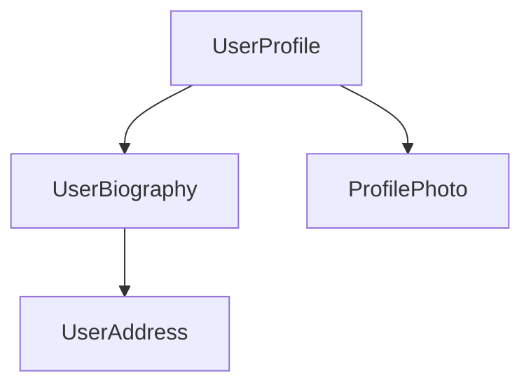

<docs-decorative-header title="Components" imgSrc="adev/src/assets/images/components.svg"> <!-- markdownlint-disable-line -->
The fundamental building block for creating applications in Angular.
</docs-decorative-header>

Components are the main building blocks of Angular applications. Each component represents a part of a larger web page. Organizing an application into components helps provide structure to your project, clearly separating code into specific parts that are easy to maintain and grow over time.

## Defining a component

Every component has a few main parts:

1. A `@Component`[decorator](https://www.typescriptlang.org/docs/handbook/decorators.html) that contains some configuration used by Angular.
2. An HTML template that controls what renders into the DOM.
3. A [CSS selector](https://developer.mozilla.org/docs/Learn/CSS/Building_blocks/Selectors) that defines how the component is used in HTML.
4. A TypeScript class with behaviors, such as handling user input or making requests to a server.

Here is a simplified example of a `UserProfile` component.

```angular-ts
// user-profile.ts
@Component({
  selector: 'user-profile',
  template: `
    <h1>User profile</h1>
    <p>This is the user profile page</p>
  `,
})
export class UserProfile { /* Your component code goes here */ }
```

The `@Component` decorator also optionally accepts a `styles` property for any CSS you want to apply to your template:

```angular-ts
// user-profile.ts
@Component({
  selector: 'user-profile',
  template: `
    <h1>User profile</h1>
    <p>This is the user profile page</p>
  `,
  styles: `h1 { font-size: 3em; } `,
})
export class UserProfile { /* Your component code goes here */ }
```

### Separating HTML and CSS into separate files

You can define a component's HTML and CSS in separate files using `templateUrl` and `styleUrl`:

```angular-ts
// user-profile.ts
@Component({
  selector: 'user-profile',
  templateUrl: 'user-profile.html',
  styleUrl: 'user-profile.css',
})
export class UserProfile {
  // Component behavior is defined in here
}
```

```angular-html
<!-- user-profile.html -->
<h1>User profile</h1>
<p>This is the user profile page</p>
```

```css
/* user-profile.css */
h1 {
  font-size: 3em;
}
```

## Using components

You build an application by composing multiple components together. For example, if you are building a user profile page, you might break the page up into several components like this:



Here, the `UserProfile` component uses several other components to produce the final page.

To import and use a component, you need to:
1. In your component's TypeScript file, add an `import` statement for the component you want to use.
2. In your `@Component` decorator, add an entry to the `imports` array for the component you want to use.
3. In your component's template, add an element that matches the selector of the component you want to use.

Here's an example of a `UserProfile` component importing a `ProfilePhoto` component:

```angular-ts
// user-profile.ts
import {ProfilePhoto} from 'profile-photo.ts';

@Component({
  selector: 'user-profile',
  imports: [ProfilePhoto],
  template: `
    <h1>User profile</h1>
    <profile-photo />
    <p>This is the user profile page</p>
  `,
})
export class UserProfile {
  // Component behavior is defined in here
}
```

TIP: Want to know more about Angular components? See the [In-depth Components guide](guide/components) for the full details.

## Next Step

Now that you know how components work in Angular, it's time to learn how we add and manage dynamic data in our application.

<docs-pill-row>
  <docs-pill title="Reactivity with signals" href="essentials/signals" />
  <docs-pill title="In-depth components guide" href="guide/components" />
</docs-pill-row>
