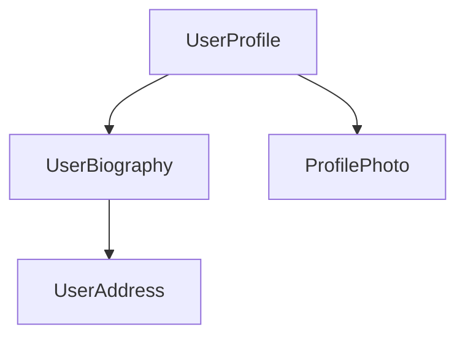

<docs-decorative-header title="Компоненты" imgSrc="adev/src/assets/images/components.svg"> <!-- markdownlint-disable-line -->
Фундаментальный строительный блок для создания приложений в Angular.
</docs-decorative-header>

Компоненты — основные строительные блоки приложений Angular. Каждый компонент представляет часть более крупной веб-страницы. Организация приложения в компоненты помогает структурировать проект, чётко разделяя код на конкретные части, которые легко поддерживать и развивать со временем.

## Определение компонента {#defining-a-component}

У каждого компонента есть несколько основных частей:

1. [Декоратор](https://www.typescriptlang.org/docs/handbook/decorators.html) `@Component`, содержащий конфигурацию, используемую Angular.
2. HTML-шаблон, который управляет тем, что отрисовывается в DOM.
3. [CSS-селектор](https://developer.mozilla.org/docs/Learn/CSS/Building_blocks/Selectors), определяющий, как компонент используется в HTML.
4. Класс TypeScript с поведением, например обработкой ввода пользователя или запросами к серверу.

Вот упрощённый пример компонента `UserProfile`.

```angular-ts
// user-profile.ts
@Component({
  selector: 'user-profile',
  template: `
    <h1>User profile</h1>
    <p>This is the user profile page</p>
  `,
})
export class UserProfile {
  /* Your component code goes here */
}
```

Декоратор `@Component` также опционально принимает свойство `styles` для любого CSS, который вы хотите применить к шаблону:

```angular-ts
// user-profile.ts
@Component({
  selector: 'user-profile',
  template: `
    <h1>User profile</h1>
    <p>This is the user profile page</p>
  `,
  styles: `
    h1 {
      font-size: 3em;
    }
  `,
})
export class UserProfile {
  /* Your component code goes here */
}
```

### Разделение HTML и CSS в отдельные файлы {#separating-html-and-css-into-separate-files}

Вы можете определить HTML и CSS компонента в отдельных файлах с помощью `templateUrl` и `styleUrl`:

```angular-ts
// user-profile.ts
@Component({
  selector: 'user-profile',
  templateUrl: 'user-profile.html',
  styleUrl: 'user-profile.css',
})
export class UserProfile {
  // Component behavior is defined in here
}
```

```angular-html
<!-- user-profile.html -->
<h1>User profile</h1>
<p>This is the user profile page</p>
```

```css
/* user-profile.css */
h1 {
  font-size: 3em;
}
```

## Использование компонентов {#using-components}

Вы строите приложение, объединяя несколько компонентов. Например, при создании страницы профиля пользователя можно разбить страницу на несколько компонентов:


```mermaid
flowchart TD
    A[UserProfile]-->B
    A-->C
    B[UserBiography]-->D
    C[ProfilePhoto]
    D[UserAddress]
```

Здесь компонент `UserProfile` использует несколько других компонентов для формирования итоговой страницы.

Чтобы импортировать и использовать компонент, нужно:

1. В TypeScript-файле компонента добавить оператор `import` для нужного компонента.
2. В декораторе `@Component` добавить запись в массив `imports` для нужного компонента.
3. В шаблоне компонента добавить элемент, соответствующий селектору нужного компонента.

Вот пример компонента `UserProfile`, импортирующего компонент `ProfilePhoto`:

```angular-ts
// user-profile.ts
import {ProfilePhoto} from 'profile-photo.ts';

@Component({
  selector: 'user-profile',
  imports: [ProfilePhoto],
  template: `
    <h1>User profile</h1>
    <profile-photo />
    <p>This is the user profile page</p>
  `,
})
export class UserProfile {
  // Component behavior is defined in here
}
```

TIP: Хотите узнать больше о компонентах Angular? См. [Подробное руководство по компонентам](guide/components) для полной информации.

## Следующий шаг {#next-step}

Теперь, когда вы знаете, как работают компоненты в Angular, пора узнать, как добавлять и управлять динамическими данными в приложении.

<docs-pill-row>
  <docs-pill title="Реактивность с сигналами" href="essentials/signals" />
  <docs-pill title="Подробное руководство по компонентам" href="guide/components" />
</docs-pill-row>
