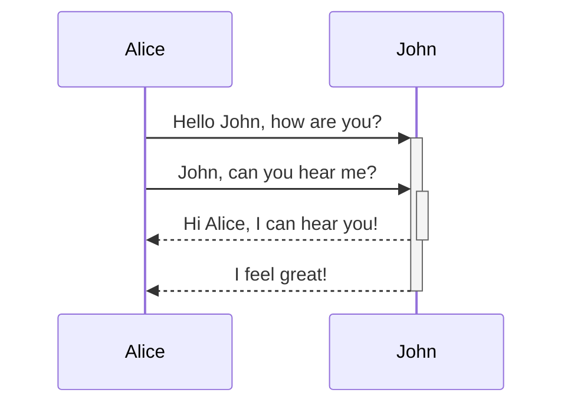
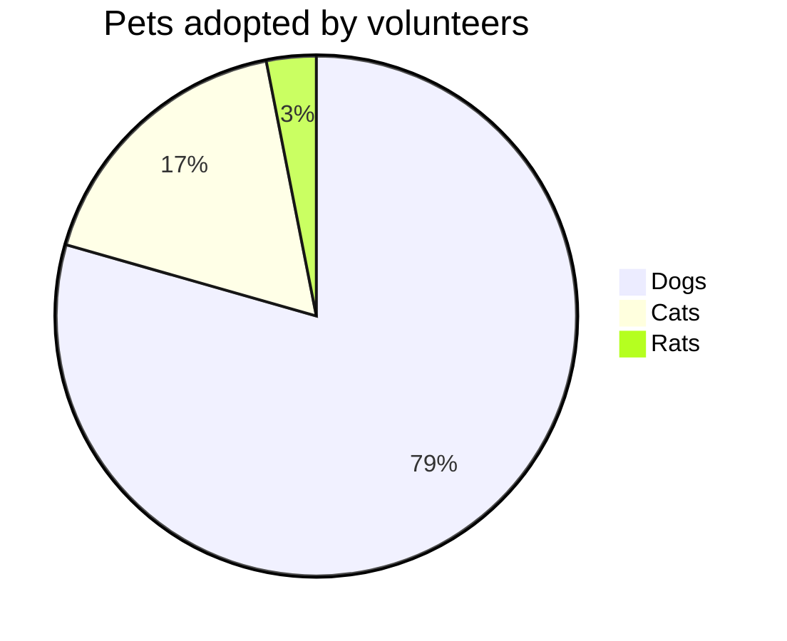

<docs-decorative-header title="Kitchen sink" imgSrc="adev/src/assets/images/components.svg"> <!-- markdownlint-disable-line -->
This is a visual list of all custom components and styles for Angular.dev.
</docs-decorative-header>

As a design system, this page contains visual and Markdown authoring guidance for:

* Custom Angular docs elements: [`docs-card`](#cards), [`docs-callout`](#callouts), [`docs-pill`](#pills), and [`docs-steps`](#workflow)
* Custom text elements: [alerts](#alerts)
* Code examples: [`docs-code`](#code)
* Built-in Markdown styled elements: links, lists, [headers](#headers), [horizontal lines](#horizontal-line-divider), [tables](#tables)
* and more!

Get ready to:

1. Write...
2. great...
3. docs!

## Headers (h2)

### Smaller headers (h3)

#### Even smaller (h4)

##### Even more smaller (h5)

###### The smallest! (h6)

## Cards

<docs-card-container>
  <docs-card title="What is Angular?" link="Platform Overview" href="tutorials/first-app">
    Lorem ipsum dolor sit amet, consectetur adipiscing elit. Nullam ornare ligula nisi
  </docs-card>
  <docs-card title="Second Card" link="Try It Now" href="essentials/what-is-angular">
    Lorem ipsum dolor sit amet, consectetur adipiscing elit. Nullam ornare ligula nisi
  </docs-card>
    <docs-card title="No Link Card">
    Lorem ipsum dolor sit amet, consectetur adipiscing elit. Nullam ornare ligula nisi
  </docs-card>
</docs-card-container>

### `<docs-card>` Attributes

| Attributes               | Details                                           |
|:---                      |:---                                               |
| `<docs-card-container>`  | All cards must be nested inside a container       |
| `title`                  | Card title                                        |
| card body contents       | Anything between `<docs-card>` and `</docs-card>` |
| `link`                   | (Optional) Call to Action link text               |
| `href`                   | (Optional) Call to Action link href               |

## Callouts

<docs-callout title="Title of a callout that is helpful">
  Lorem ipsum dolor sit amet, consectetur adipiscing elit. Nulla luctus metus blandit semper faucibus. Sed blandit diam quis tellus maximus, ac scelerisque ex egestas. Ut euismod lobortis mauris pretium iaculis. Quisque ullamcorper, elit ut lacinia blandit, magna sem finibus urna, vel suscipit tortor dolor id risus.
</docs-callout>

<docs-callout critical title="Title of a callout that is critical">
  Lorem ipsum dolor sit amet, consectetur adipiscing elit. Nulla luctus metus blandit semper faucibus. Sed blandit diam quis tellus maximus, ac scelerisque ex egestas. Ut euismod lobortis mauris pretium iaculis. Quisque ullamcorper, elit ut lacinia blandit, magna sem finibus urna, vel suscipit tortor dolor id risus.
</docs-callout>

<docs-callout important title="Title of a callout that is important">
  Lorem ipsum dolor sit amet, consectetur adipiscing elit. Nulla luctus metus blandit semper faucibus. Sed blandit diam quis tellus maximus, ac scelerisque ex egestas. Ut euismod lobortis mauris pretium iaculis. Quisque ullamcorper, elit ut lacinia blandit, magna sem finibus urna, vel suscipit tortor dolor id risus.
</docs-callout>

### `<docs-callout>` Attributes

| Attributes                                       | Details                                                   |
|:---                                              |:---                                                       |
| `title`                                          | Callout title                                             |
| card body contents                               | Anything between `<docs-callout>` and `</docs-callout>`   |
| `helpful` (default) \| `critical` \| `important` | (Optional) Adds styling and icons based on severity level |

## Pills

Pill rows are helpful as a sort of navigation with links to helpful resources.

<docs-pill-row>
  <docs-pill href="#pill-row" title="Link"/>
  <docs-pill href="#pill-row" title="Link"/>
  <docs-pill href="#pill-row" title="Link"/>
  <docs-pill href="#pill-row" title="Link"/>
  <docs-pill href="#pill-row" title="Link"/>
  <docs-pill href="#pill-row" title="Link"/>
</docs-pill-row>

### `<docs-pill>` Attributes

| Attributes               | Details                                      |
|:---                      |:---                                          |
| `<docs-pill-row`         | All pills must be nested inside a pill row   |
| `title`                  | Pill text                                    |
| `href`                   | Pill href                                    |

Pills may also be used inline by themselves, but we haven't built that out yet.

## Alerts

Alerts are just special paragraphs. They are helpful to call out (not to be confused with call-out) something that's a bit more urgent. They gain font size from context and are available in many levels. Try not to use alerts to render too much content, but rather to enhance and call attention to surrounding content.

Style alerts starting on a new line in Markdown using the format `SEVERITY_LEVEL` + `:` + `ALERT_TEXT`.

NOTE: Use Note for ancillary/additional information that's not _essential_ to the main text.

TIP: Use Tip to call out a specific task/action users can perform, or a fact that plays directly into a task/action.

TODO: Use TODO for incomplete documentation that you plan to expand soon. You can also assign the TODO, e.g. TODO(emmatwersky): Text.

QUESTION: Use Question to pose a question to the reader, kind of like a mini-quiz that they should be able to answer.

SUMMARY: Use Summary to provide a two- or three-sentence synopsis of the page or section content, so readers can figure out whether this is the right place for them.

TLDR: Use TL;DR (or TLDR) if you can provide the essential information about a page or section in a sentence or two. For example, TLDR: Rhubarb is a cat.

CRITICAL: Use Critical to call out potential bad stuff or alert the reader they ought to be careful before doing something. For example, Warning: Running `rm` with the `-f` option will delete write-protected files or directories without prompting you.

IMPORTANT: Use Important for information that's crucial to comprehending the text or to completing some task.

HELPFUL: Use Best practice to call out practices that are known to be successful or better than alternatives.

NOTE: Heads up `developers`! Alerts _can_ have a [link](#alerts) and other nested styles (but try to **use this sparingly**)!.

## Code

You can display `code` using the built in triple backtick:

```ts
example code
```

Or using the `<docs-code>` element.

<docs-code header="Your first example" language="ts" linenums>
import { Component } from '@angular/core';

@Component({
  selector: 'example-code',
  template: '<h1>Hello World!</h1>',
})
export class ComponentOverviewComponent {}
</docs-code>

### Styling the example

Here's a code example fully styled:

<docs-code
  path="adev/src/content/examples/hello-world/src/app/app.component-old.ts"
  header="A styled code example"
  language='ts'
  linenums
  highlight="[[3,7], 9]"
  preview
  visibleLines="[3,10]">
</docs-code>

We also have styling for the terminal, just set the language as `shell`:

<docs-code language="shell">
  npm install @angular/material --save
</docs-code>

#### `<docs-code>` Attributes

| Attributes               | Type        | Details                                              |
|:---                      |:---         |:---                                                  |
| code                     | `string`    | Anything between tags is treated as code             |
| `path`                   | `string`    | Path to code example (root: `content/examples/`)     |
| `header`                 | `string`    | Title of the example (default: `file-name`)          |
| `language`               | `string`    | code language                                        |
| `linenums`               | `boolean`   | (False) displays line numbers                        |
| `highlight`              | `string of number[]` | lines highlighted                           |
| `diff`                   | `string`    | path to changed code                                 |
| `visibleLines`           | `string of number[]` | range of lines for collapse mode            |
| `visibleRegion`          | `string`    | **DEPRECATED** FOR `visibleLines`                    |
| `preview`                | `boolean`   | (False) display preview                              |

### Multifile examples

You can create multifile examples by wrapping the examples inside a `<docs-code-multifile>`.

<docs-code-multifile
  path="adev/src/content/examples/hello-world/src/app/app.component.ts"
  preview>
  <docs-code
    path="adev/src/content/examples/hello-world/src/app/app.component.ts"
    diff="adev/src/content/examples/hello-world/src/app/app.component-old.ts"
    linenums
    visibleLines="[3, 11]"/>
  <docs-code
    path="adev/src/content/examples/hello-world/src/app/app.component.html"
    highlight="[1]"
    linenums/>
  <docs-code
    path="adev/src/content/examples/hello-world/src/app/app.component.css" />
</docs-code-multifile>

#### `<docs-code-multifile>` Attributes

| Attributes               | Type        | Details                                          |
|:---                      |:---         |:---                                              |
| body contents            | `string`    | nested tabs of `docs-code` examples              |
| `path`                   | `string`    | Path to code example for preview and external link |
| `preview`                | `boolean`   | (False) display preview                          |

### Adding `preview` to your code example

Adding the `preview` flag builds a running example of the code below the code snippet. This also automatically adds a button to open the running example in Stackblitz.

NOTE: `preview` only works with standalone.

## Workflow

Style numbered steps using `<docs-step>`. Numbering is created using CSS (handy!).

### `<docs-workflow>` and `<docs-step>` Attributes

| Attributes               | Details                                           |
|:---                      |:---                                               |
| `<docs-workflow>`        | All steps must be nested inside a workflow        |
| `title`                  | Step title                                        |
| step body contents       | Anything between `<docs-step>` and `</docs-step>` |

Steps must start on a new line, and can contain `docs-code`s and other nested elements and styles.

<docs-workflow>

<docs-step title="Install the Angular CLI">
  You use the Angular CLI to create projects, generate application and library code, and perform a variety of ongoing development tasks such as testing, bundling, and deployment.

  To install the Angular CLI, open a terminal window and run the following command:

  <docs-code language="shell">
    npm install -g @angular/cli
  </docs-code>
</docs-step>

<docs-step title="Create a workspace and initial application">
  You develop apps in the context of an Angular workspace.

  To create a new workspace and initial starter app:

* Run the CLI command `ng new` and provide the name `my-app`, as shown here:
    <docs-code language="shell">
      ng new my-app
    </docs-code>

* The ng new command prompts you for information about features to include in the initial app. Accept the defaults by pressing the Enter or Return key.

  The Angular CLI installs the necessary Angular npm packages and other dependencies. This can take a few minutes.

  The CLI creates a new workspace and a simple Welcome app, ready to run.
</docs-step>

<docs-step title="Run the application">
  The Angular CLI includes a server, for you to build and serve your app locally.

  1. Navigate to the workspace folder, such as `my-app`.
  2. Run the following command:
    <docs-code language="shell">
      cd my-app
      ng serve --open
    </docs-code>

  The `ng serve` command launches the server, watches your files, and rebuilds the app as you make changes to those files.

  The `--open` (or just `-o`) option automatically opens your browser to <http://localhost:4200/>.
  If your installation and setup was successful, you should see a page similar to the following.
</docs-step>

<docs-step title="Final step">
  That's all the docs components! Now:

  <docs-pill-row>
    <docs-pill href="#pill-row" title="Go"/>
    <docs-pill href="#pill-row" title="write"/>
    <docs-pill href="#pill-row" title="great"/>
    <docs-pill href="#pill-row" title="docs!"/>
  </docs-pill-row>
</docs-step>

</docs-workflow>

## Images and video

You can add images using the semantic Markdown image:


### Add `#small` and `#medium` to change the image size


Embedded videos are created with `docs-video` and just need a `src` and `alt`:

<docs-video src="https://www.youtube.com/embed/O47uUnJjbJc" alt=""/>

## Charts & Graphs

Write diagrams and charts using [Mermaid](http://mermaid.js.org/) by setting the code language to `mermaid`, all theming is built-in.






## Horizontal Line Divider

This can be used to separate page sections, like we're about to do below.  These styles will be added by default, nothing custom needed.

<hr/>

The end!
