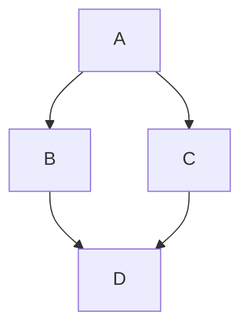
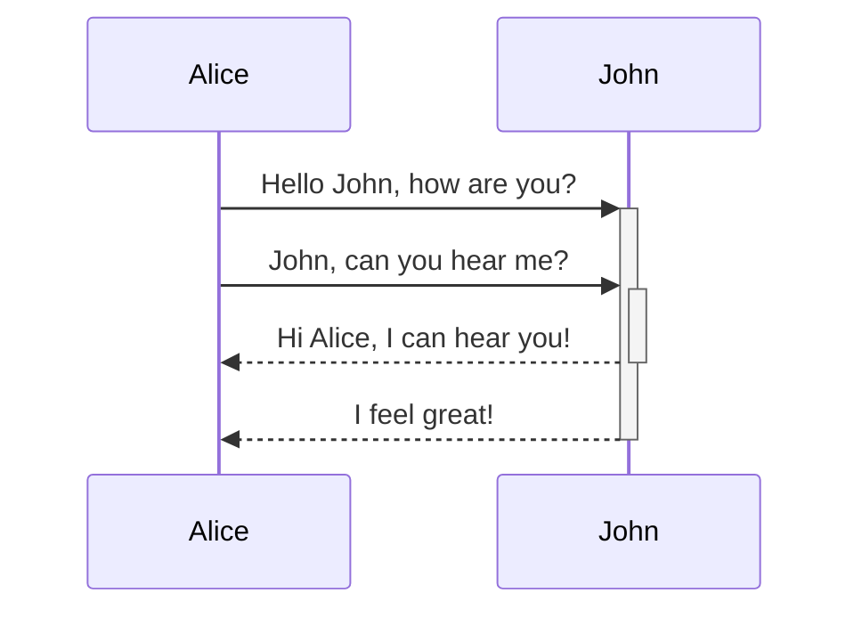
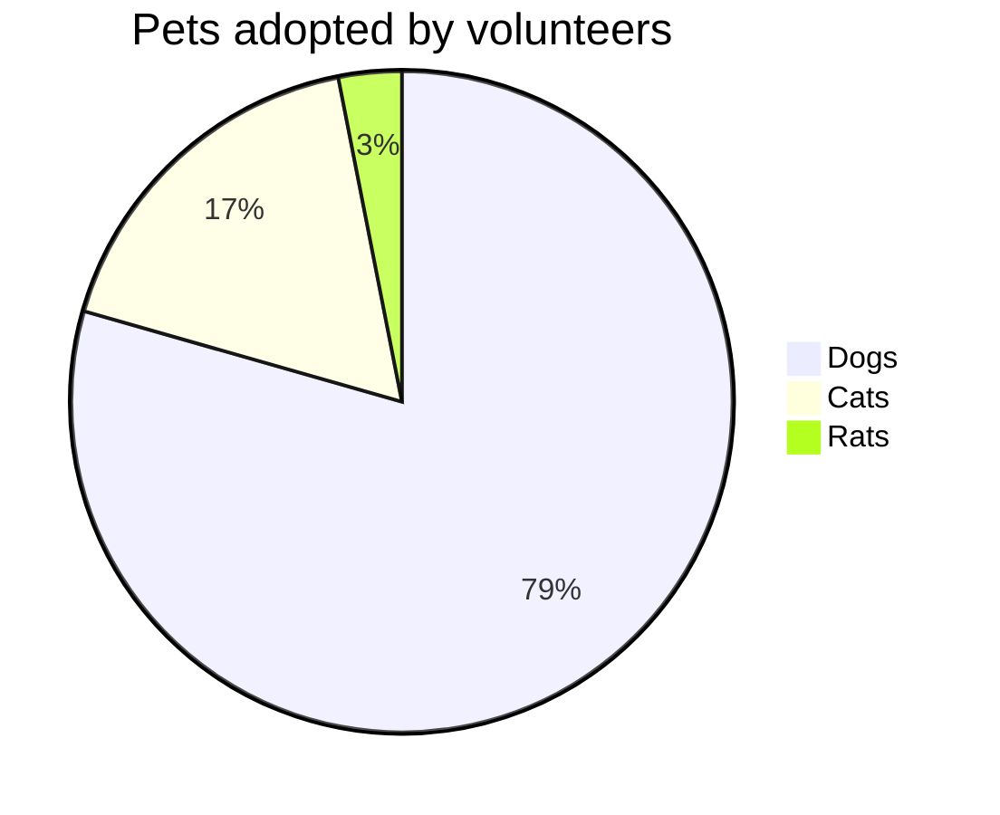

<docs-decorative-header title="Kitchen sink" imgSrc="adev/src/assets/images/components.svg"> <!-- markdownlint-disable-line -->
Это визуальный список всех пользовательских компонентов и стилей для Angular.dev.
</docs-decorative-header>

Как дизайн-система, эта страница содержит визуальные руководства и руководства по разметке Markdown для:

- Пользовательских элементов Angular docs: [`docs-card`](#cards), [`docs-callout`](#callouts), [`docs-pill`](#pills) и [`docs-steps`](#workflow)
- Пользовательских текстовых элементов: [оповещения](#alerts)
- Примеров кода: [`docs-code`](#code)
- Встроенных стилизованных элементов Markdown: ссылки, списки, [заголовки](#headers-h2), [горизонтальные разделители](#horizontal-line-divider)
- и многое другое!

Приготовьтесь:

1. Писать...
2. отличную...
3. документацию!

## Заголовки (h2) {#headers-h2}

### Заголовки меньше (h3) {#smaller-headers-h3}

#### Ещё меньше (h4) {#even-smaller-h4}

##### Ещё меньше (h5) {#even-more-smaller-h5}

###### Самый маленький! (h6) {#the-smallest-h6}

## Карточки {#cards}

<docs-card-container>
  <docs-card title="What is Angular?" link="Platform Overview" href="tutorials/first-app">
    Lorem ipsum dolor sit amet, consectetur adipiscing elit. Nullam ornare ligula nisi
  </docs-card>
  <docs-card title="Second Card" link="Try It Now" href="essentials/what-is-angular">
    Lorem ipsum dolor sit amet, consectetur adipiscing elit. Nullam ornare ligula nisi
  </docs-card>
    <docs-card title="No Link Card">
    Lorem ipsum dolor sit amet, consectetur adipiscing elit. Nullam ornare ligula nisi
  </docs-card>
</docs-card-container>

### Атрибуты `<docs-card>` {#docs-card-attributes}

| Атрибуты                | Описание                                                |
| :---------------------- | :------------------------------------------------------ |
| `<docs-card-container>` | Все карточки должны быть вложены в контейнер            |
| `title`                 | Заголовок карточки                                      |
| содержимое тела         | Всё между `<docs-card>` и `</docs-card>`                |
| `link`                  | (Необязательно) Текст ссылки призыва к действию         |
| `href`                  | (Необязательно) Href ссылки призыва к действию          |

## Выноски {#callouts}

<docs-callout title="Title of a callout that is helpful">
  Lorem ipsum dolor sit amet, consectetur adipiscing elit. Nulla luctus metus blandit semper faucibus. Sed blandit diam quis tellus maximus, ac scelerisque ex egestas. Ut euismod lobortis mauris pretium iaculis. Quisque ullamcorper, elit ut lacinia blandit, magna sem finibus urna, vel suscipit tortor dolor id risus.
</docs-callout>

<docs-callout critical title="Title of a callout that is critical">
  Lorem ipsum dolor sit amet, consectetur adipiscing elit. Nulla luctus metus blandit semper faucibus. Sed blandit diam quis tellus maximus, ac scelerisque ex egestas. Ut euismod lobortis mauris pretium iaculis. Quisque ullamcorper, elit ut lacinia blandit, magna sem finibus urna, vel suscipit tortor dolor id risus.
</docs-callout>

<docs-callout important title="Title of a callout that is important">
  Lorem ipsum dolor sit amet, consectetur adipiscing elit. Nulla luctus metus blandit semper faucibus. Sed blandit diam quis tellus maximus, ac scelerisque ex egestas. Ut euismod lobortis mauris pretium iaculis. Quisque ullamcorper, elit ut lacinia blandit, magna sem finibus urna, vel suscipit tortor dolor id risus.
</docs-callout>

### Атрибуты `<docs-callout>` {#docs-callout-attributes}

| Атрибуты                                         | Описание                                                   |
| :----------------------------------------------- | :--------------------------------------------------------- |
| `title`                                          | Заголовок выноски                                          |
| содержимое тела                                  | Всё между `<docs-callout>` и `</docs-callout>`             |
| `helpful` (по умолчанию) \| `critical` \| `important` | (Необязательно) Добавляет стили и иконки по уровню серьёзности |

## Пилюли {#pills}

Строки пилюль полезны как своеобразная навигация со ссылками на полезные ресурсы.

<docs-pill-row id=pill-row>
  <docs-pill href="#pill-row" title="Link"/>
  <docs-pill href="#pill-row" title="Link"/>
  <docs-pill href="#pill-row" title="Link"/>
  <docs-pill href="#pill-row" title="Link"/>
  <docs-pill href="#pill-row" title="Link"/>
  <docs-pill href="#pill-row" title="Link"/>
</docs-pill-row>

### Атрибуты `<docs-pill>` {#docs-pill-attributes}

| Атрибуты         | Описание                                       |
| :--------------- | :--------------------------------------------- |
| `<docs-pill-row` | Все пилюли должны быть вложены в строку пилюль |
| `title`          | Текст пилюли                                   |
| `href`           | Href пилюли                                    |

Пилюли также можно использовать отдельно, встроенными, но эта функция ещё не реализована.

## Оповещения {#alerts}

Оповещения — это просто специальные абзацы. Они полезны для выделения (не путать с выноской) чего-то более срочного. Размер шрифта определяется контекстом, и они доступны на многих уровнях. Старайтесь не использовать оповещения для отображения слишком большого количества контента, а используйте их для усиления и привлечения внимания к окружающему контенту.

Оповещения задаются с новой строки в Markdown в формате `УРОВЕНЬ_СЕРЬЁЗНОСТИ` + `:` + `ТЕКСТ_ОПОВЕЩЕНИЯ`.

NOTE: Используйте Note для вспомогательной/дополнительной информации, которая не является _обязательной_ для основного текста.

TIP: Используйте Tip для выделения конкретной задачи/действия, которое могут выполнить пользователи, или факта, непосредственно связанного с задачей/действием.

TODO: Используйте TODO для незавершённой документации, которую вы планируете расширить в ближайшее время. Можно также назначить TODO, например TODO(emmatwersky): Текст.

QUESTION: Используйте Question, чтобы задать читателю вопрос, своего рода мини-тест, на который он должен уметь ответить.

SUMMARY: Используйте Summary для краткого изложения содержимого страницы или раздела в двух-трёх предложениях, чтобы читатели могли определить, то ли это место, которое им нужно.

TLDR: Используйте TL;DR (или TLDR), если можете изложить основную информацию о странице или разделе в одном-двух предложениях. Например, TLDR: Ревень — это кот.

CRITICAL: Используйте Critical для предупреждения о потенциальных проблемах или для предупреждения читателя о необходимости соблюдать осторожность перед выполнением чего-либо. Например, Warning: Running `rm` with the `-f` option will delete write-protected files or directories without prompting you.

IMPORTANT: Используйте Important для информации, критически важной для понимания текста или выполнения какой-либо задачи.

HELPFUL: Используйте Best practice для выделения практик, которые известны как успешные или лучшие по сравнению с альтернативами.

NOTE: Обратите внимание, `разработчики`! Оповещения _могут_ содержать [ссылку](#alerts) и другие вложенные стили (но старайтесь **использовать это экономно**)!.

## Код {#code}

Вы можете отобразить `код` с помощью встроенных тройных обратных кавычек:

```ts
example code
```

Или с помощью элемента `<docs-code>`.

<docs-code header="Your first example" language="ts" linenums>
import { Component } from '@angular/core';

@Component({
selector: 'example-code',
template: '<h1>Hello World!</h1>',
})
export class ComponentOverviewComponent {}
</docs-code>

### Стилизация примера {#styling-the-example}

Вот полностью стилизованный пример кода:

<docs-code
  path="adev/src/content/examples/hello-world/src/app/app.component-old.ts"
  header="A styled code example"
  language='ts'
  linenums
  highlight="[[3,7], 9]"
  preview
  visibleLines="[3,10]">
</docs-code>

Также есть стилизация для терминала — просто задайте язык `shell`:

```shell
npm install @angular/material --save
```

Вы можете стилизовать стандартные тройные обратные кавычки Markdown с атрибутами для расширенного представления:

```ts {header:"Awesome Title", linenums, highlight="[2]", hideCopy}
console.log('Hello, World!');
console.log('Awesome Angular Docs!');
```

#### Атрибуты `<docs-code>` {#docs-code-attributes}

| Атрибуты       | Тип                  | Описание                                                              |
| :------------- | :------------------- | :-------------------------------------------------------------------- |
| code           | `string`             | Всё между тегами интерпретируется как код                             |
| `path`         | `string`             | Путь к примеру кода (корень: `content/examples/`)                     |
| `header`       | `string`             | Заголовок примера (по умолчанию: `file-name`)                         |
| `language`     | `string`             | Язык кода                                                             |
| `linenums`     | `boolean`            | (False) отображает номера строк                                       |
| `highlight`    | `string of number[]` | Выделенные строки                                                     |
| `diff`         | `string`             | Путь к изменённому коду                                               |
| `visibleLines` | `string of number[]` | Диапазон строк для режима свёртки                                     |
| `region`       | `string`             | Показывать только указанный регион.                                   |
| `preview`      | `boolean`            | (False) отображать предпросмотр                                       |
| `hideCode`     | `boolean`            | (False) Сворачивать ли пример кода по умолчанию.                      |
| `hideDollar`   | `boolean`            | (False) Скрывать ли знак доллара в примерах кода для командной строки. |

### Многофайловые примеры {#multifile-examples}

Вы можете создавать многофайловые примеры, обернув примеры в `<docs-code-multifile>`.

<docs-code-multifile
  path="adev/src/content/examples/hello-world/src/app/app.component.ts"
  preview>
<docs-code
    path="adev/src/content/examples/hello-world/src/app/app.component.html"
    highlight="[1]"
    linenums/>
<docs-code
    path="adev/src/content/examples/hello-world/src/app/app.component.css" />
</docs-code-multifile>

#### Атрибуты `<docs-code-multifile>` {#docs-code-multifile-attributes}

| Атрибуты      | Тип       | Описание                                                              |
| :------------ | :-------- | :-------------------------------------------------------------------- |
| содержимое    | `string`  | Вложенные вкладки с примерами `docs-code`                             |
| `path`        | `string`  | Путь к примеру кода для предпросмотра и внешней ссылки                |
| `preview`     | `boolean` | (False) отображать предпросмотр                                       |
| `hideCode`    | `boolean` | (False) Сворачивать ли пример кода по умолчанию.                      |
| `hideDollar`  | `boolean` | (False) Скрывать ли знак доллара в примерах кода для командной строки. |

### Добавление `preview` к примеру кода {#adding-preview-to-your-code-example}

Добавление флага `preview` создаёт запущенный пример кода под фрагментом кода. Это также автоматически добавляет кнопку для открытия запущенного примера в Stackblitz.

NOTE: `preview` работает только со standalone-компонентами.

### Стилизация предпросмотров примеров с помощью Tailwind CSS {#styling-example-previews-with-tailwind-css}

Утилитарные классы Tailwind можно использовать в примерах кода.

<docs-code-multifile
  path="adev/src/content/examples/hello-world/src/app/tailwind-app.component.ts"
  preview>
<docs-code path="adev/src/content/examples/hello-world/src/app/tailwind-app.component.html" />
<docs-code path="adev/src/content/examples/hello-world/src/app/tailwind-app.component.ts" />
</docs-code-multifile>

## Вкладки {#tabs}

<docs-tab-group>
  <docs-tab label="Code Example">
    <docs-code-multifile
      path="adev/src/content/examples/hello-world/src/app/tailwind-app.component.ts"
      hideCode="true"
      preview>
    <docs-code path="adev/src/content/examples/hello-world/src/app/tailwind-app.component.html" />
    <docs-code path="adev/src/content/examples/hello-world/src/app/tailwind-app.component.ts" />
    </docs-code-multifile>
  </docs-tab>
  <docs-tab label="Some Text">
    Lorem ipsum dolor sit amet, consectetur adipiscing elit. Nulla luctus metus blandit semper faucibus. Sed blandit diam quis tellus maximus, ac scelerisque ex egestas. Ut euismod lobortis mauris pretium iaculis. Quisque ullamcorper, elit ut lacinia blandit, magna sem finibus urna, vel suscipit tortor dolor id risus.
  </docs-tab>
</docs-tab-group>

## Рабочий процесс {#workflow}

Стилизуйте нумерованные шаги с помощью `<docs-step>`. Нумерация создаётся с помощью CSS (удобно!).

### Атрибуты `<docs-workflow>` и `<docs-step>` {#docs-workflow-and-docs-step-attributes}

| Атрибуты           | Описание                                              |
| :----------------- | :---------------------------------------------------- |
| `<docs-workflow>`  | Все шаги должны быть вложены в рабочий процесс        |
| `title`            | Заголовок шага                                        |
| содержимое шага    | Всё между `<docs-step>` и `</docs-step>`              |

Шаги должны начинаться с новой строки и могут содержать `docs-code` и другие вложенные элементы и стили.

<docs-workflow>

<docs-step title="Install the Angular CLI">
  You use the Angular CLI to create projects, generate application and library code, and perform a variety of ongoing development tasks such as testing, bundling, and deployment.

To install the Angular CLI, open a terminal window and run the following command:

```shell
npm install -g @angular/cli
```

</docs-step>

<docs-step title="Create a workspace and initial application">
  You develop apps in the context of an Angular workspace.

To create a new workspace and initial starter app:

- Run the CLI command `ng new` and provide the name `my-app`, as shown here:

  ```shell
  ng new my-app
  ```

- The ng new command prompts you for information about features to include in the initial app. Accept the defaults by pressing the Enter or Return key.

  The Angular CLI installs the necessary Angular npm packages and other dependencies. This can take a few minutes.

  The CLI creates a new workspace and a simple Welcome app, ready to run.
  </docs-step>

<docs-step title="Run the application">
  The Angular CLI includes a server, for you to build and serve your app locally.

1. Navigate to the workspace folder, such as `my-app`.
2. Run the following command:

   ```shell
   cd my-app
   ng serve --open
   ```

The `ng serve` command launches the server, watches your files, and rebuilds the app as you make changes to those files.

The `--open` (or just `-o`) option automatically opens your browser to <http://localhost:4200/>.
If your installation and setup was successful, you should see a page similar to the following.
</docs-step>

<docs-step title="Final step">
  That's all the docs components! Now:

  <docs-pill-row>
    <docs-pill href="#pill-row" title="Go"/>
    <docs-pill href="#pill-row" title="write"/>
    <docs-pill href="#pill-row" title="great"/>
    <docs-pill href="#pill-row" title="docs!"/>
  </docs-pill-row>
</docs-step>

</docs-workflow>

## Изображения и видео {#images-and-video}

Вы можете добавлять изображения с помощью семантической разметки Markdown:


### Добавьте `#small` и `#medium` для изменения размера изображения {#add-small-and-medium-to-change-the-image-size}


## Добавление атрибутов с помощью синтаксиса фигурных скобок {#add-attributes-using-curly-braces-syntax}


Встроенные видео создаются с помощью `docs-video` и требуют только `src` и `alt`:

<docs-video src="https://www.youtube.com/embed/O47uUnJjbJc" alt=""/>

## Графики и диаграммы {#charts-graphs}

Создавайте диаграммы и графики с помощью [Mermaid](http://mermaid.js.org/), задав язык кода `mermaid` — все темы встроены.


```mermaid
    graph TD;
      A-->B;
      A-->C;
      B-->D;
      C-->D;
```


```mermaid
  sequenceDiagram
      Alice->>+John: Hello John, how are you?
      Alice->>+John: John, can you hear me?
      John-->>-Alice: Hi Alice, I can hear you!
      John-->>-Alice: I feel great!
```


```mermaid
  pie title Pets adopted by volunteers
      "Dogs" : 386
      "Cats" : 85
      "Rats" : 15
```

## Горизонтальный разделитель {#horizontal-line-divider}

Его можно использовать для разделения разделов страницы, как показано ниже. Эти стили добавляются по умолчанию, никакой дополнительной настройки не требуется.

<hr/>

Конец!

## Предпочтительно / Следует избегать {#prefer-avoid}

```ts {prefer}
const foo = 'bar';
```

```ts {avoid}
const bar = 'foo';
```

```ts {avoid, header: 'with a header'}
const baz = 42;
```

<docs-code
  path="adev/src/content/examples/hello-world/src/app/app.component-old.ts"
  header="A styled code example"
  language='ts'
  linenums
  highlight="[[3,7], 9]"
  prefer>
</docs-code>
