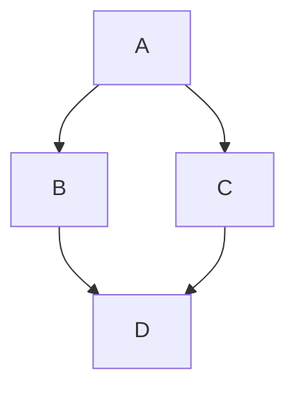
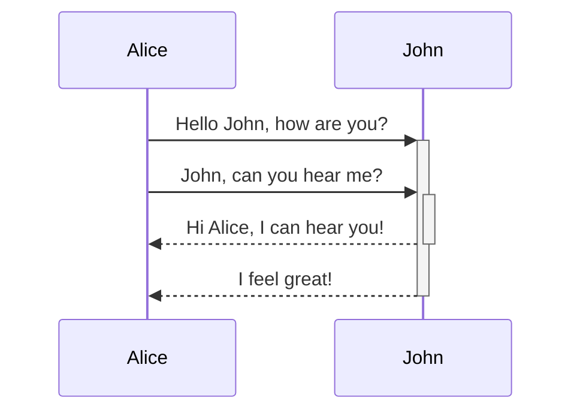
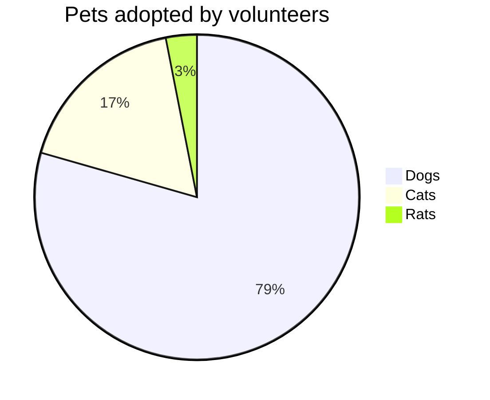

<docs-decorative-header title="Kitchen sink" imgSrc="adev/src/assets/images/components.svg"> <!-- markdownlint-disable-line -->
Это визуальный список всех пользовательских компонентов и стилей для Angular.dev.
</docs-decorative-header>

Как дизайн-система, эта страница содержит визуальные и Markdown-рекомендации по авторству для:

- Пользовательских элементов документации Angular: [`docs-card`](#cards), [`docs-callout`](#callouts), [`docs-pill`](#pills) и [`docs-steps`](#workflow)
- Пользовательских текстовых элементов: [alerts](#alerts)
- Примеров кода: [`docs-code`](#code)
- Встроенных стилизованных элементов Markdown: ссылки, списки, [заголовки](#headers-h2), [горизонтальные линии](#horizontal-line-divider)
- и многого другого!

Приготовьтесь:

1. Писать...
2. отличные...
3. документы!

## Заголовки (h2) {#headers-h2}

### Меньшие заголовки (h3) {#smaller-headers-h3}

#### Ещё меньше (h4)

##### Ещё меньше (h5)

###### Самые маленькие! (h6)

## Карточки {#cards}

<docs-card-container>
  <docs-card title="Что такое Angular?" link="Обзор платформы" href="tutorials/first-app">
    Lorem ipsum dolor sit amet, consectetur adipiscing elit. Nullam ornare ligula nisi
  </docs-card>
  <docs-card title="Вторая карточка" link="Попробовать сейчас" href="essentials/what-is-angular">
    Lorem ipsum dolor sit amet, consectetur adipiscing elit. Nullam ornare ligula nisi
  </docs-card>
    <docs-card title="Карточка без ссылки">
    Lorem ipsum dolor sit amet, consectetur adipiscing elit. Nullam ornare ligula nisi
  </docs-card>
</docs-card-container>

### Атрибуты `<docs-card>` {#docs-card-attributes}

| Атрибуты                | Подробности                                           |
| :---------------------- | :------------------------------------------------ |
| `<docs-card-container>` | Все карточки должны быть вложены в контейнер       |
| `title`                 | Заголовок карточки                                        |
| содержимое тела карточки  | Всё между `<docs-card>` и `</docs-card>` |
| `link`                  | (Необязательно) Текст ссылки Call to Action               |
| `href`                  | (Необязательно) href ссылки Call to Action               |

## Callouts {#callouts}

<docs-callout title="Заголовок callout, который helpful">
  Lorem ipsum dolor sit amet, consectetur adipiscing elit. Nulla luctus metus blandit semper faucibus. Sed blandit diam quis tellus maximus, ac scelerisque ex egestas. Ut euismod lobortis mauris pretium iaculis. Quisque ullamcorper, elit ut lacinia blandit, magna sem finibus urna, vel suscipit tortor dolor id risus.
</docs-callout>

<docs-callout critical title="Заголовок callout, который critical">
  Lorem ipsum dolor sit amet, consectetur adipiscing elit. Nulla luctus metus blandit semper faucibus. Sed blandit diam quis tellus maximus, ac scelerisque ex egestas. Ut euismod lobortis mauris pretium iaculis. Quisque ullamcorper, elit ut lacinia blandit, magna sem finibus urna, vel suscipit tortor dolor id risus.
</docs-callout>

<docs-callout important title="Заголовок callout, который important">
  Lorem ipsum dolor sit amet, consectetur adipiscing elit. Nulla luctus metus blandit semper faucibus. Sed blandit diam quis tellus maximus, ac scelerisque ex egestas. Ut euismod lobortis mauris pretium iaculis. Quisque ullamcorper, elit ut lacinia blandit, magna sem finibus urna, vel suscipit tortor dolor id risus.
</docs-callout>

### Атрибуты `<docs-callout>` {#docs-callout-attributes}

| Атрибуты                                       | Подробности                                                   |
| :----------------------------------------------- | :-------------------------------------------------------- |
| `title`                                          | Заголовок callout                                             |
| содержимое тела                                   | Всё между `<docs-callout>` и `</docs-callout>`   |
| `helpful` (по умолчанию) \| `critical` \| `important` | (Необязательно) Добавляет стили и иконки по уровню важности |

## Pills {#pills}

Ряды pills полезны как навигация со ссылками на полезные ресурсы.

<docs-pill-row id=pill-row>
  <docs-pill href="#pill-row" title="Ссылка"/>
  <docs-pill href="#pill-row" title="Ссылка"/>
  <docs-pill href="#pill-row" title="Ссылка"/>
  <docs-pill href="#pill-row" title="Ссылка"/>
  <docs-pill href="#pill-row" title="Ссылка"/>
  <docs-pill href="#pill-row" title="Ссылка"/>
</docs-pill-row>

### Атрибуты `<docs-pill>` {#docs-pill-attributes}

| Атрибуты         | Подробности                                    |
| :--------------- | :----------------------------------------- |
| `<docs-pill-row` | Все pills должны быть вложены в pill row |
| `title`          | Текст pill                                  |
| `href`           | href pill                                  |

Pills также можно использовать inline по отдельности, но мы ещё это не реализовали.

## Alerts {#alerts}

Alerts — это особые абзацы. Они полезны, чтобы выделить (не путать с call-out) что-то более срочное. Они наследуют размер шрифта из контекста и доступны на многих уровнях. Старайтесь не использовать alerts для слишком большого объёма контента — скорее для усиления и привлечения внимания к окружающему контенту.

Стилизуйте alerts, начиная с новой строки в Markdown, в формате `SEVERITY_LEVEL` + `:` + `ALERT_TEXT`.

NOTE: Используйте Note для вспомогательной/дополнительной информации, не _существенной_ для основного текста.

TIP: Используйте Tip, чтобы выделить конкретную задачу/действие, которое могут выполнить пользователи, или факт, напрямую связанный с задачей/действием.

TODO: Используйте TODO для незавершённой документации, которую планируете скоро расширить. Также можно назначить TODO, например TODO(emmatwersky): Text.

QUESTION: Используйте Question, чтобы задать вопрос читателю — вроде мини-квиза, на который он должен уметь ответить.

SUMMARY: Используйте Summary для краткого синопсиса страницы или раздела в два-три предложения, чтобы читатели поняли, подходит ли им это место.

TLDR: Используйте TL;DR (или TLDR), если можете дать существенную информацию о странице или разделе в одном-двух предложениях. Например, TLDR: Rhubarb — кот.

CRITICAL: Используйте Critical, чтобы предупредить о потенциальных проблемах или напомнить читателю быть осторожным перед действием. Например, Warning: Запуск `rm` с опцией `-f` удалит защищённые от записи файлы или каталоги без запроса.

IMPORTANT: Используйте Important для информации, критичной для понимания текста или выполнения задачи.

HELPFUL: Используйте Best practice, чтобы выделить практики, известные как успешные или лучшие альтернатив.

NOTE: Внимание, `developers`! Alerts _могут_ содержать [ссылку](#alerts) и другие вложенные стили (но старайтесь **использовать это умеренно**)!.

## Код {#code}

Можно отображать `code` с помощью встроенных тройных обратных кавычек:

```ts
example code
```

Или с помощью элемента `<docs-code>`.

<docs-code header="Ваш первый пример" language="ts" linenums>
import { Component } from '@angular/core';

@Component({
selector: 'example-code',
template: '<h1>Hello World!</h1>',
})
export class ComponentOverviewComponent {}
</docs-code>

### Стилизация примера {#styling-the-example}

Вот полностью стилизованный пример кода:

<docs-code
  path="adev/src/content/examples/hello-world/src/app/app.component-old.ts"
  header="Стилизованный пример кода"
  language='ts'
  linenums
  highlight="[[3,7], 9]"
  preview
  visibleLines="[3,10]">
</docs-code>

Также есть стилизация для терминала — просто задайте язык как `shell`:

```shell
npm install @angular/material --save
```

Стандартные Markdown тройные обратные кавычки можно стилизовать атрибутами для улучшенного представления:

```ts {header:"Awesome Title", linenums, highlight="[2]", hideCopy}
console.log('Hello, World!');
console.log('Awesome Angular Docs!');
```

#### Атрибуты `<docs-code>` {#docs-code-attributes}

| Атрибуты       | Тип                  | Подробности                                                         |
| :------------- | :------------------- | :-------------------------------------------------------------- |
| code           | `string`             | Всё между тегами считается кодом                        |
| `path`         | `string`             | Путь к примеру кода (корень: `content/examples/`)                |
| `header`       | `string`             | Заголовок примера (по умолчанию: `file-name`)                     |
| `language`     | `string`             | язык кода                                                   |
| `linenums`     | `boolean`            | (False) отображает номера строк                                   |
| `highlight`    | `string of number[]` | подсвеченные строки                                               |
| `diff`         | `string`             | путь к изменённому коду                                            |
| `visibleLines` | `string of number[]` | диапазон строк для режима свёртки                                |
| `region`       | `string`             | показывать только указанный region.                                  |
| `preview`      | `boolean`            | (False) показать preview                                         |
| `hideCode`     | `boolean`            | (False) Сворачивать пример кода по умолчанию.            |
| `hideDollar`   | `boolean`            | (False) Скрывать знак доллара в shell-примерах. |

### Многофайловые примеры {#multifile-examples}

Многофайловые примеры создаются обёрткой примеров в `<docs-code-multifile>`.

<docs-code-multifile
  path="adev/src/content/examples/hello-world/src/app/app.component.ts"
  preview>
<docs-code
    path="adev/src/content/examples/hello-world/src/app/app.component.html"
    highlight="[1]"
    linenums/>
<docs-code
    path="adev/src/content/examples/hello-world/src/app/app.component.css" />
</docs-code-multifile>

#### Атрибуты `<docs-code-multifile>` {#docs-code-multifile-attributes}

| Атрибуты      | Тип       | Подробности                                                         |
| :------------ | :-------- | :-------------------------------------------------------------- |
| содержимое тела | `string`  | вложенные вкладки примеров `docs-code`                             |
| `path`        | `string`  | Путь к примеру кода для preview и внешней ссылки              |
| `preview`     | `boolean` | (False) показать preview                                         |
| `hideCode`    | `boolean` | (False) Сворачивать пример кода по умолчанию.            |
| `hideDollar`  | `boolean` | (False) Скрывать знак доллара в shell-примерах. |

### Добавление `preview` к примеру кода {#adding-preview-to-your-code-example}

Флаг `preview` собирает работающий пример кода под сниппетом. Также автоматически добавляется кнопка для открытия работающего примера в StackBlitz.

NOTE: `preview` работает только со standalone.

### Стилизация preview примеров с Tailwind CSS {#styling-example-previews-with-tailwind-css}

Utility-классы Tailwind можно использовать внутри примеров кода.

<docs-code-multifile
  path="adev/src/content/examples/hello-world/src/app/tailwind-app.component.ts"
  preview>
<docs-code path="adev/src/content/examples/hello-world/src/app/tailwind-app.component.html" />
<docs-code path="adev/src/content/examples/hello-world/src/app/tailwind-app.component.ts" />
</docs-code-multifile>

## Вкладки {#tabs}

<docs-tab-group>
  <docs-tab label="Пример кода">
    <docs-code-multifile
      path="adev/src/content/examples/hello-world/src/app/tailwind-app.component.ts"
      hideCode="true"
      preview>
    <docs-code path="adev/src/content/examples/hello-world/src/app/tailwind-app.component.html" />
    <docs-code path="adev/src/content/examples/hello-world/src/app/tailwind-app.component.ts" />
    </docs-code-multifile>
  </docs-tab>
  <docs-tab label="Какой-то текст">
    Lorem ipsum dolor sit amet, consectetur adipiscing elit. Nulla luctus metus blandit semper faucibus. Sed blandit diam quis tellus maximus, ac scelerisque ex egestas. Ut euismod lobortis mauris pretium iaculis. Quisque ullamcorper, elit ut lacinia blandit, magna sem finibus urna, vel suscipit tortor dolor id risus.
  </docs-tab>
</docs-tab-group>

## Workflow {#workflow}

Стилизуйте нумерованные шаги с помощью `<docs-step>`. Нумерация создаётся через CSS (удобно!).

### Атрибуты `<docs-workflow>` и `<docs-step>` {#docs-workflow-and-docs-step-attributes}

| Атрибуты           | Подробности                                           |
| :----------------- | :------------------------------------------------ |
| `<docs-workflow>`  | Все шаги должны быть вложены в workflow        |
| `title`            | Заголовок шага                                        |
| содержимое тела шага | Всё между `<docs-step>` и `</docs-step>` |

Шаги должны начинаться с новой строки и могут содержать `docs-code` и другие вложенные элементы и стили.

<docs-workflow>

<docs-step title="Install the Angular CLI">
  Angular CLI используется для создания проектов, генерации кода приложений и библиотек, а также для различных текущих задач разработки: тестирование, сборка и развёртывание.

Чтобы установить Angular CLI, откройте окно терминала и выполните следующую команду:

```shell
npm install -g @angular/cli
```

</docs-step>

<docs-step title="Create a workspace and initial application">
  Приложения разрабатывают в контексте Angular workspace.

Чтобы создать новый workspace и начальное starter-приложение:

- Выполните команду CLI `ng new` и укажите имя `my-app`, как показано здесь:

  ```shell
  ng new my-app
  ```

- Команда ng new запросит информацию о функциях для включения в начальное приложение. Примите значения по умолчанию, нажав Enter или Return.

  Angular CLI устанавливает необходимые Angular npm-пакеты и другие зависимости. Это может занять несколько минут.

  CLI создаёт новый workspace и простое Welcome-приложение, готовое к запуску.
  </docs-step>

<docs-step title="Run the application">
  Angular CLI включает сервер для локальной сборки и обслуживания приложения.

1. Перейдите в каталог workspace, например `my-app`.
2. Выполните следующую команду:

   ```shell
   cd my-app
   ng serve --open
   ```

Команда `ng serve` запускает сервер, следит за файлами и пересобирает приложение при изменениях.

Опция `--open` (или просто `-o`) автоматически открывает браузер на <http://localhost:4200/>.
Если установка и настройка прошли успешно, вы должны увидеть страницу, похожую на следующую.
</docs-step>

<docs-step title="Final step">
  Это все компоненты документации! Теперь:

  <docs-pill-row>
    <docs-pill href="#pill-row" title="Пишите"/>
    <docs-pill href="#pill-row" title="отличные"/>
    <docs-pill href="#pill-row" title="документы"/>
    <docs-pill href="#pill-row" title="!"/>
  </docs-pill-row>
</docs-step>

</docs-workflow>

## Изображения и видео {#images-and-video}

Изображения можно добавлять семантическим Markdown-изображением:


### Добавьте `#small` и `#medium`, чтобы изменить размер изображения {#add-small-and-medium-to-change-the-image-size}


## Добавление атрибутов синтаксисом фигурных скобок {#add-attributes-using-curly-braces-syntax}


Встроенные видео создаются с `docs-video` и нуждаются только в `src` и `alt`:

<docs-video src="https://www.youtube.com/embed/O47uUnJjbJc" alt=""/>

## Диаграммы и графики {#charts--graphs}

Диаграммы и графики пишутся с помощью [Mermaid](http://mermaid.js.org/), задавая язык кода `mermaid`; вся темизация встроена.


```mermaid
    graph TD;
      A-->B;
      A-->C;
      B-->D;
      C-->D;
```


```mermaid
  sequenceDiagram
      Alice->>+John: Hello John, how are you?
      Alice->>+John: John, can you hear me?
      John-->>-Alice: Hi Alice, I can hear you!
      John-->>-Alice: I feel great!
```


```mermaid
  pie title Pets adopted by volunteers
      "Dogs" : 386
      "Cats" : 85
      "Rats" : 15
```

## Горизонтальный разделитель {#horizontal-line-divider}

Его можно использовать для разделения секций страницы, как мы сейчас сделаем ниже. Эти стили добавляются по умолчанию, ничего кастомного не нужно.

<hr/>

Конец!

## Prefer / Avoid {#prefer--avoid}

```ts {prefer}
const foo = 'bar';
```

```ts {avoid}
const bar = 'foo';
```

```ts {avoid, header: 'with a header'}
const baz = 42;
```

<docs-code
  path="adev/src/content/examples/hello-world/src/app/app.component-old.ts"
  header="Стилизованный пример кода"
  language='ts'
  linenums
  highlight="[[3,7], 9]"
  prefer>
</docs-code>
