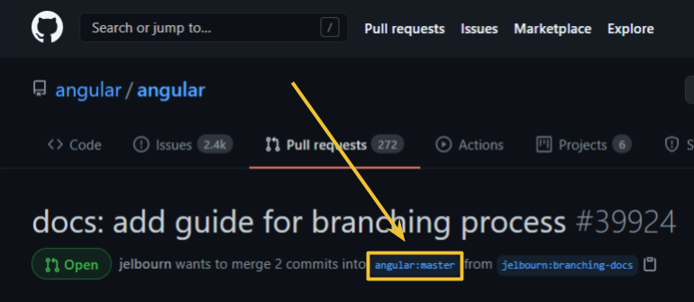

# Angular Branching and Versioning: A Practical Guide

This guide explains how the Angular team manages branches and how those branches relate to
merging PRs and publishing releases. Before reading, you should understand
[Semantic Versioning](https://semver.org/#semantic-versioning-200).

## Distribution tags on npm

Angular's branching relates directly to versions published on npm. We will reference these [npm
distribution tags](https://docs.npmjs.com/cli/v6/commands/npm-dist-tag#purpose) throughout:

| Tag    | Description                                                                       |
|--------|-----------------------------------------------------------------------------------|
| latest | The most recent stable version.                                                   |
| next   | The most recent pre-release version of Angular for testing. May not always exist. |
| v*-lts | The most recent LTS release for the specified version, such as `v9-lts`.          |

## Branch naming

Angular's main branch is `main`. This branch always represents the absolute latest changes. The
code on `main` always represents a pre-release version, often published with the `next` tag on npm.

For each minor and major version increment, a new branch is created. These branches use a naming
scheme matching `\d+\.\d+\.x` and receive subsequent patch changes for that version range. For
example, the `10.2.x` branch represents the latest patch changes for subsequent releases starting
with `10.2.`. The version tagged on npm as `latest` will always correspond to such a branch,
referred to as the **active patch branch**.

## Major releases lifecycle

Angular releases a major version roughly every six months. Following a major release, we move
through a consistent lifecycle to the next major release, and repeat. At a high level, this
process proceeds as follows:

* A major release occurs. The `main` branch now represents the next minor version.
* Six weeks later, a minor release occurs. The `main` branch now represents the next minor
  version.
* Six weeks later, a second minor release occurs. The `main` branch now represents the next major
  version.
* Three months later, a major release occurs and the process repeats.

### Example
* Angular publishes `11.0.0`. At this point in time, the `main` branch represents `11.1.0`.
* Six weeks later, we publish `11.1.0` and `main` represents `11.2.0`.
* Six weeks later, we publish `11.2.0` and `main` represents `12.0.0`.
* Three months later, this cycle repeats with the publication of `12.0.0`.

### Feature freeze and release candidates

Before publishing minor and major versions as `latest` on npm, they go through a feature freeze and
a release candidate (RC) phase.

**Feature freeze** means that `main` is forked into a branch for a specific version, with no
additional features permitted before releasing as `latest` to npm. This branch becomes the **active
RC branch**. Upon branching, the `main` branch increments to the next minor or major pre-release
version. One week after feature freeze, the first RC is published with the `next` tag on npm from
the active RC branch. Patch bug fixes continue to merge into `main`, the active RC branch, and
the active patch branch during this entire period.

One to three weeks after publishing the first RC, the active RC branch is published as `latest` on
npm and the branch becomes the active patch branch. At this point there is no active RC branch until
the next minor or major release.

## Targeting pull requests

Every pull request has a **base branch**:

This base branch represents the latest branch that will receive the change. Most pull requests
should specify `main`. However, some changes will explicitly use an earlier branch, such as
`11.1.x`, in order to patch an older version. Specific GitHub labels, described below, control the
additional branches into which a pull request will be cherry-picked.

### Labelling pull requests

There are five labels that target PRs to versions:

| Label         | Description                                                                 |
|---------------|-----------------------------------------------------------------------------|
| target: major | A change that includes a backwards-incompatible behavior or API change.     |
| target: minor | A change that introduces a new, backwards-compatible functionality.         |
| target: patch | A backwards-compatible bug fix.                                             |
| target: rc    | A change that should be explicitly included in an active release candidate. |
| target: lts   | A critical security or browser compatibility fix for LTS releases.          |

Every PR must have exactly one `target: *` label. Angular's dev tooling will merge the pull request
into its base branch and then cherry-pick the commits to the appropriate branches based on the
specified target label.

The vast majority of pull requests will target `major`, `minor`, or `patch` based on the contents of
the code change. In rare cases, a pull request will specify `target: rc` or `target: lts` to
explicitly target a special branch.

Note that PRs merged with `target: rc` often benefit from additional testing in an RC release.
Therefore PR authors and caretakers should consider publishing a new `-next` release after merging
any PRs to an RC branch to support extra testing before the stable release.

Breaking changes, marked with `target: major`, can only be merged when `main` represents the next
major version.

Two additional target labels do not map to specific versions while still defining which branch to merge into.

| Label                | Description                                                                 |
|----------------------|-----------------------------------------------------------------------------|
| target: automation   | A automated change made by the angular-robot account.                       |
| target: feature      | A change to be made in a feature branch.                                    |

Changes made to a feature branch, outside of our typical branching and merging process utilize the
`target: feature` branch. Additionally, the `target: automation` label, which is only able to be
utilized by the `angular-robot` account targets only the branch defined within the Github UI.

### Pull request examples

| I want to...                                                | Target branch           | Target label | Your change will land in...                                                                                                |
| ----------------------------------------------------------- | ----------------------- | ------------ | -------------------------------------------------------------------------------------------------------------------------- |
| Make a non-breaking bug fix                                 | `main`                  | `patch`      | `main`, the active patch branch, and the active RC branch if there is one                                                  |
| Introduce a new feature                                     | `main`                  | `minor`      | `main` (any time)                                                                                                          |
| Make a breaking change                                      | `main`                  | `major`      | `main` (only when `main` represents the next major version)                                                                |
| Make a critical security fix                                | `main`                  | `lts`        | `main`, the active patch branch, the active RC branch if there is one, and all branches for versions within the LTS window |
| Bump the version of an RC                                   | the active RC branch    | `rc`         | The active RC branch                                                                                                       |
| Fix an RC bug for a major release feature                   | `main`                  | `rc`         | `main` and the active RC branch                                                                                            |
| Backport a bug fix to the `latest` npm version during an RC | the active patch branch | `patch`      | the active patch branch only                                                                                               |
