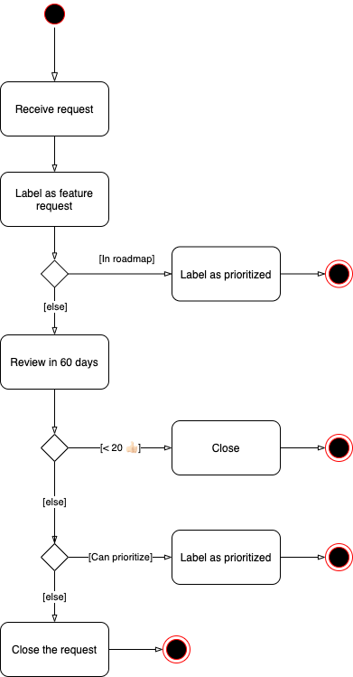

# Feature request process

To manage the requests we receive at scale, we introduced automation in our feature request
management process. After we identify an issue as a feature request, it goes through several steps.

## Manual review

First, we manually review the issue to see if it aligns with any of the existing roadmap efforts. If
it does, we prioritize it accordingly. Alternatively, we keep it open and our feature request bot
initiates a voting process.

## Voting phase

To include the community in the feature request process, we open voting for a fixed length of time.
Anyone can cast a vote for the request with a thumbs-up (👍) reaction on the original issue
description.
When a feature request reaches 20 or more upvotes, we formally consider the feature request.
Alternatively, the bot closes the request.

**For issues that are 60+ days old**: The voting phase is 20 days

**For new issues**: The voting phase is 60 days

## Consideration phase

If the feature request receives 20 or more thumbs-up (👍) votes on the original issue description
(during the voting phase described above), we verify the Angular team can afford to maintain the
feature and whether it aligns with the long-term vision of Angular. If the answers to both of these
questions are yes, we prioritize the request, alternatively we close it with an explanation of our
decision.

## Diagram

  

## What if I want to implement the feature to help the Angular team?

Often implementing the feature as a separate package is a better option. Building an external
package rather than including the functionality in Angular helps with:

- Keeping the framework's runtime smaller and simpler
- Makes the learning journey of developers getting started with Angular smoother
- Reduces maintainers' burden and the complexity of the source code
