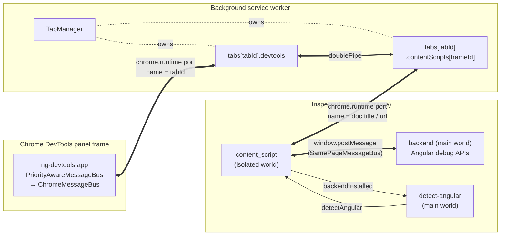
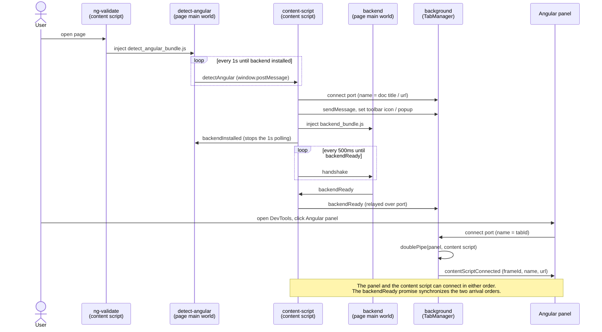

# How Angular DevTools connects to a tab

This describes how the extension wires the **Angular** panel in Chrome DevTools to the
inspected page, per browser tab, and how it routes messages between them. It covers the
real browser extension ("chrome shell"). The dev shell is noted at the end.

## The pieces

| Script                       | Bundle                                                                                                        | Where it runs                              | Job                                                                    |
| ---------------------------- | ------------------------------------------------------------------------------------------------------------- | ------------------------------------------ | ---------------------------------------------------------------------- |
| Panel UI                     | [`index.html`](../projects/shell-browser/src/index.html) + [`main.ts`](../projects/shell-browser/src/main.ts) | The "Angular" DevTools panel frame         | The `ng-devtools` Angular app the user sees                            |
| Background                   | `background_bundle.js` ([`background.ts`](../projects/shell-browser/src/app/background.ts))                   | Extension service worker                   | Hosts the `TabManager` that routes per tab; toggles toolbar icon/popup |
| `ng-validate` content script | `ng_validate_bundle.js` ([`ng-validate.ts`](../projects/shell-browser/src/app/ng-validate.ts))                | Inspected page, isolated world, all frames | Injects `detect_angular_bundle.js` into the page's main world          |
| `detect-angular`             | `detect_angular_bundle.js` ([`detect-angular.ts`](../projects/shell-browser/src/app/detect-angular.ts))       | Inspected page, main world                 | Reports whether the page is a supported Angular app                    |
| Content script               | `content_script_bundle.js` ([`content-script.ts`](../projects/shell-browser/src/app/content-script.ts))       | Inspected page, isolated world, all frames | Opens the port to the background, injects the backend, relays messages |
| Backend                      | `backend_bundle.js` ([`backend.ts`](../projects/shell-browser/src/app/backend.ts))                            | Inspected page, main world                 | Talks to Angular's debug APIs (`ng-devtools-backend`)                  |

Two manifest-registered content scripts run in every frame (`all_frames: true`):
`ng_validate_bundle.js` and `content_script_bundle.js`. The detect and backend bundles are
`web_accessible_resources`, injected into the page's main world by a `<script>` tag so they
can read the page's Angular globals.

## Content script and backend execution environments

The two in-page scripts run in different JavaScript environments, which is why the in-page relay
exists.

- The content script (`content_script_bundle.js`) runs in the content-script **isolated world**,
  a separate JS context that shares the page's DOM but not its `window`, globals, or prototypes.
  It can call extension `chrome.*` APIs (`chrome.runtime.connect`/`sendMessage`) to reach the
  background, but can't read the page's `ng` debug globals. See
  [`content-script.ts`](../projects/shell-browser/src/app/content-script.ts).
- The backend (`backend_bundle.js`) runs in the page's **main world**, the same context as the
  app's own scripts, so it can reach Angular's debug APIs (`ng-devtools-backend`). The trade-off
  is the reverse: no access to `chrome.*`, so it can't talk to the extension directly.
  [`backend.ts`](../projects/shell-browser/src/app/backend.ts) uses only a `SamePageMessageBus`.

The content script injects the backend and then bridges the two worlds. It injects by appending
a `<script src="…backend_bundle.js">` element, which runs in the page's main world; the bundle
must be in `web_accessible_resources` for the page to load it, and the element is removed right
after appending because the script has already started. `detect-angular` reaches the page the
same way through `ng-validate`. For the bridge, the content script forwards every message between
its `chrome.runtime.Port` and a `SamePageMessageBus`, the only channels the two worlds have for
passing structured-cloneable data over `window.postMessage`. The full panel-to-backend chain is
in [The double pipe and message relay](#the-double-pipe-and-message-relay) below.

## Topology (one tab)



## How a tab is keyed

The background's `TabManager` ([`shell-browser/src/app/tab_manager.ts`](../projects/shell-browser/src/app/tab_manager.ts)) keeps one entry per
tab:

```ts
tabs[tabId] = {
  devtools: Port | null, // the panel's port
  contentScripts: {[frameId]: {port, enabled, frameId, backendReady}},
};
```

Both sides reach the background through `chrome.runtime.connect`, and `TabManager` tells them
apart by the **port name** in its `runtime.onConnect` listener:

- A numeric port name means the panel. [`app.config.ts`](../projects/shell-browser/src/app/app.config.ts) opens
  `chrome.runtime.connect({ name: '' + chrome.devtools.inspectedWindow.tabId })`, so the name
  is the tab id, and `registerDevToolsForTab` parses it and stores `tabs[tabId].devtools`.
- Any other name comes from a content script. [`content-script.ts`](../projects/shell-browser/src/app/content-script.ts) connects with
  `name: document.title || location.href`. The port carries `sender.tab.id` and
  `sender.frameId`, so `registerContentScriptForTab` files it under
  `tabs[tabId].contentScripts[frameId]`.

## Boot sequence



The page setup (everything up to `backendReady`) and the panel opening are order-independent.
If the panel connects first, `registerDevToolsForTab` waits on each content script's
`backendReady` promise before piping. If a content script connects first, its `backendReady`
handler sets up the pipe once the panel is present. The panel itself is registered by
[`devtools.ts`](../projects/shell-browser/src/devtools.ts) through `chrome.devtools.panels.create`.

## The double pipe and message relay

`doublePipe(devtoolsPort, contentScript)` installs two listeners that forward messages between
the panel port and the content script port. Inside the page, the content script bridges that
port to the backend over a second `SamePageMessageBus`:

```
panel  ⇄  [port]  ⇄  background doublePipe  ⇄  [port]  ⇄  content script  ⇄  [postMessage]  ⇄  backend
        ChromeMessageBus                                  ChromeMessageBus / SamePageMessageBus
```

`ChromeMessageBus` ([`chrome-message-bus.ts`](../projects/shell-browser/src/app/chrome-message-bus.ts)) wraps a `chrome.runtime.Port`.
`SamePageMessageBus` ([`same-page-message-bus.ts`](../projects/shell-browser/src/app/same-page-message-bus.ts)) wraps `window.postMessage` and filters by
source and destination URIs built from the page URL in [`comm-utils.ts`](../projects/shell-browser/src/app/comm-utils.ts)
(`angular-devtools-content-script-<url>`, `angular-devtools-backend-<url>`, and the detect
variant), which keeps frames and unrelated `postMessage` traffic from crossing wires. The
panel side wraps everything in a `PriorityAwareMessageBus` so a large, late response cannot
overwrite a newer one.

## Frame selection

A tab can hold many frames, so `contentScripts` can hold many connections. Only one is
`enabled` at a time, and that is the frame the panel is talking to. The panel picks one by
sending `enableFrameConnection [frameId, tabId]`. In `doublePipe`, `onDevToolsMessage` matches
the frame id, disables every other frame on the tab, enables the chosen one, and replies
`frameConnected`. While a connection is disabled, the pipe drops messages in both directions.

The in-page `SamePageMessageBus` mirrors this with a `BusStatus`: it starts at `init`, moves
to `waiting` on `backendReady` (only `enableFrameConnection` passes), and reaches `ready` on
`enableFrameConnection`. This stops the bus from emitting before the panel has selected a
frame.

## Background service worker lifecycle

No code registers the background; Chrome registers `app/background_bundle.js` from the manifest's
`background.service_worker` key when the extension is installed or updated and on browser start. It
is then event-driven: terminated after ~30s idle and re-evaluated from scratch on each wake. Every
wake re-runs the top level of [`background.ts`](../projects/shell-browser/src/app/background.ts),
which sets the default icon, adds the `runtime.onMessage` listener, and adds the `runtime.onConnect`
listener via `TabManager.initialize`. It wakes when one of those events fires: a content
script connecting (every page load, since [`content-script.ts`](../projects/shell-browser/src/app/content-script.ts)
connects unconditionally), the panel connecting, or a detect-angular result arriving over
`runtime.sendMessage`. Firefox instead uses an MV2 persistent background page (`background.scripts`),
which stays loaded for the extension's whole enabled lifetime. See Chrome's
[service worker lifecycle](https://developer.chrome.com/docs/extensions/develop/concepts/service-workers/lifecycle)
docs for the event details.

## Heartbeat (Manifest V3)

That ~30s idle termination would drop a live connection. Since Chrome 114, holding the port open
does not reset the idle timer, though messages over it still do. The content script posts
`__NG_DEVTOOLS_BEAT` every 20s to keep the worker alive
([`content-script.ts`](../projects/shell-browser/src/app/content-script.ts)).

## Teardown

- Panel disconnects: `tabs[tabId].devtools` is set to null and every content script on the tab
  is marked disabled.
- Content script disconnects: its frame entry is removed, the tab entry is deleted once no
  frames remain, and the panel receives `contentScriptDisconnected`.

## Dev shell

`pnpm devtools:devserver` runs a development shell at `http://localhost:4200` with no
extension and no `chrome.runtime` ports. It loads the user's app in an iframe and the panel
talks to it through plain `window` message passing. The protocol and message-bus interfaces
are the same, so the panel code does not change between the two shells.

## Q&A

**Why is `backendReady` a `Promise<void>` and not a boolean?**

The first version ([#53934](https://github.com/angular/angular/pull/53934)) stored it as a
boolean that the panel read once when it connected. If the panel connected before a frame's
backend finished initializing, the boolean was already `false` and nothing reconnected the
panel later. The panel got stuck showing "Angular application not detected" after a page reload
([issue #53953](https://github.com/angular/angular/issues/53953)), and refreshing just re-ran
the same losing race. The re-land ([#54805](https://github.com/angular/angular/pull/54805))
switched to a promise so the panel can attach a callback that fires whenever the content script
eventually emits `backendReady`, no matter which side connected first. That bug was bad enough
to force a full revert ([#54629](https://github.com/angular/angular/pull/54629)) before the fix
landed.

**Why does registration handle the panel and content script connecting in either order?**

A page can finish loading and run its content script before the user opens the Angular panel,
and an already-open panel can outlive a page reload. `registerDevToolsForTab` and
`registerContentScriptForTab` each set up the double pipe from their own side once
`backendReady` resolves, so the final wiring is identical regardless of arrival order. The
spec exercises every permutation of that ordering on purpose, to keep the property from
regressing. The intent is that `TabManager`'s end state stays the same whatever order it
processes events in.

**Why key connections by both tab and frame?**

This whole change exists to support iframes ([#53934](https://github.com/angular/angular/pull/53934)). One panel can inspect an Angular app that lives
in nested frames, so the background keeps a `contentScripts[frameId]` entry per frame under
each tab and lets the user pick which frame to inspect. The single-`enabled`-frame gating in
`doublePipe` is how that selection works.

**Why a static `TabManager.initialize()` instead of `new TabManager()`?**

A bare constructor leaves the manager inert until someone wires up the `onConnect` listener,
which is easy to forget. The factory bundles construction and wiring together, so you cannot
hold a half-initialized manager.
