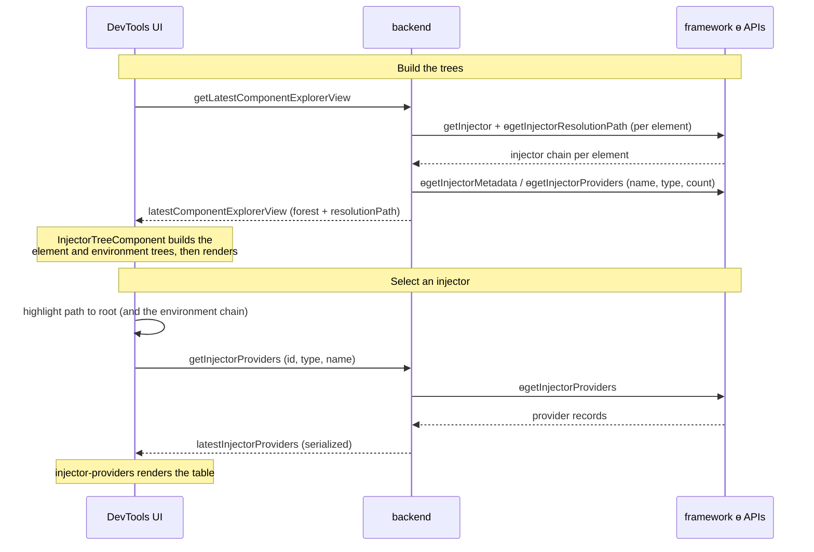
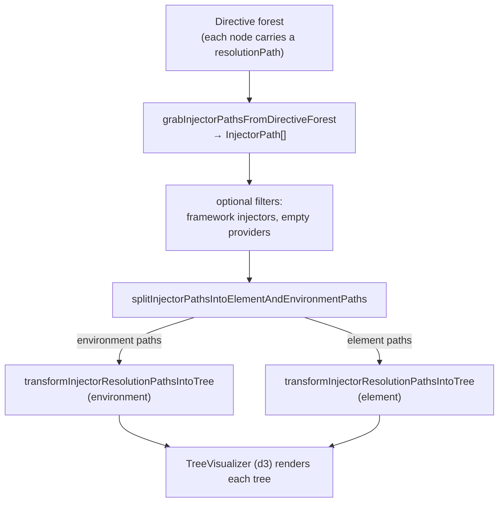

# How the injector tree visualization works

The **Injector Tree** tab draws the inspected app's dependency injection hierarchy as two
graphs, one for environment injectors and one for element injectors. It highlights the
resolution path from a selected injector up to the root, and lists the providers configured on
each injector. This doc covers the implementation: where the data comes from, how the two
trees get built, and how rendering, selection, and the providers panel work. The feature needs
Angular v17 or higher, because it reads framework debug APIs added in v17.

## The pieces

- **Tab UI and orchestration** (`InjectorTreeComponent`): reacts to new forest data, builds both
  trees, and drives selection and highlighting.
- **Tree construction**: pure functions that turn resolution paths into trees.
- **Providers panel** (`InjectorProvidersComponent`): lists and filters the selected injector's
  providers.
- **Renderer** (`TreeVisualizerComponent`): a generic d3 tree renderer shared with other tabs.
- **Backend data source**: reads the DI graph from the page and serializes it.
- **Framework debug APIs** (`ɵgetInjectorResolutionPath`, `ɵgetInjectorProviders`,
  `ɵgetInjectorMetadata`, `getInjector`): the debug APIs the backend calls.

The UI and backend talk over the typed message bus. Everything below rides that channel.

## Data flow

The forest is the shared component explorer view, the same tree the Components tab reads. It
gets fetched on refresh or selection, and the injector tab reacts to each
`latestComponentExplorerView` update through its `componentExplorerView` input.

## Where the data comes from (backend)

The backend serializes the forest in `prepareForestForSerialization`, attaching a
`resolutionPath` to a node only when the DI debug APIs are available
(`ngDebugDependencyInjectionApiIsSupported()`). Without those APIs the path
is left off and the tab stays hidden.

`getNodeDIResolutionPath` builds the path for one node. It reads the element's injector with
`getInjector`, walks to the root with `ɵgetInjectorResolutionPath`, and caches the result in the
`nodeInjectorToResolutionPath` WeakMap so later serializations reuse it. Two cases stop early: a
node with no `nativeElement` (for example a `@defer` block) returns `undefined`, and a component
created through `createComponent` with a `NullInjector` returns an empty path, since only element
injectors yield a real one.

Each injector in the path is a `SerializedInjector` holding:

- `id`, `name`, and `type` (one of `imported-module`, `environment`, `element`, `null`, or `hidden`)
- a `providers` count
- an optional back-reference to the owning `node`

`serializeInjector` reads the type and name from `ɵgetInjectorMetadata` (#51900) and labels the
platform and root environment injectors specially. `getOrCreateInjectorId` assigns the `id`,
holds the injector by `WeakRef` in `idToInjector`, and registers a `FinalizationRegistry` so the
id drops once the injector is garbage collected.

## Building the two trees (frontend)

`InjectorTreeComponent` runs the forest through a pipeline of pure transform functions whenever
a new `componentExplorerView` arrives.

The split step also records a map from each element path's leaf to its environment path, so
selecting an element injector can light up the environment chain it falls back to. The
framework-injector filter list (`IGNORED_ANGULAR_INJECTORS`) is hardcoded and a known stopgap,
so it drifts as the framework adds directives.

The two trees live in signals with a custom `areInjectorTreesEqual` equality, so an identical
rebuild does not trigger a re-render.

## Rendering

Both trees use the shared `TreeVisualizerComponent`, a generic d3 renderer built on
`d3.hierarchy`, `d3.tree`, and `d3.zoom`. The injector tab passes two hooks through its config:

- `d3InjectorTreeNodeModifier` tags each SVG node with a CSS class for its injector type, a
  `data-id` holding the injector id, and a `data-component-id` for element injectors (the owning
  component's id). The synthetic root is hidden.
- `d3InjectorTreeLinkModifier` tags each edge with a `data-id` of the form
  `${childId}-to-${parentId}` and hides edges under the synthetic root.

Arrows point child to parent, matching the direction resolution walks. `snapToNode` and
`snapToRoot` handle zoom-to-fit.

## Q&A

**Why two separate trees instead of one?**

Angular has two injector hierarchies with different resolution rules, the environment hierarchy
and the element hierarchy. Splitting each resolution path at its first element injector keeps
the two on screen as distinct graphs and mirrors how resolution moves from the element tree up
into the environment tree when a token is not found.

**Why a synthetic hidden root?**

An Angular application can have multiple roots, and d3's layout needs a single root. The `N/A`
node gives every path one parent for layout, and the node and link modifiers hide it so users
see only real injectors.

**Why cache resolution paths in a WeakMap keyed by element?**

An element injector's path to the root stays the same between serializations, and recomputing
it on every forest dump would be wasteful. Keying the cache on the element lets the entry be
collected once the element goes away.

**Why hold injectors with WeakRef and a FinalizationRegistry?**

The backend hands ids to the panel and has to map them back to live injectors when the user
opens the providers list. A strong reference would keep destroyed injectors, and their
elements, alive. The `WeakRef` lets them be collected, and the `FinalizationRegistry` removes
the dead id from `idToInjector`.

**Why collapse multi providers into one row?**

A multi-provider token has one record per contributor. Listing each as its own row would repeat
the token many times, so the panel emits a single `multi` row that carries every contributing
index.

**How do we know that the DI debugging is supported in the inspected app?**

The backend attaches `resolutionPath` only when it detects the DI debug APIs are available
(introduced in v17), so the tab reads that as its capability check (`diDebugAPIsAvailable` looks
at `view.forest[0].resolutionPath`) rather than probing the APIs itself.
