- [DevTools Overview](#devtools-overview)
  - [Bug reports](#bug-reports)
  - [Debug your application](#debug-your-application)
    - [Explore the application structure](#explore-the-application-structure)
    - [View properties](#view-properties)
    - [Navigate to the host node](#navigate-to-the-host-node)
    - [Navigate to source](#navigate-to-source)
    - [Update property value](#update-property-value)
    - [Access selected component or directive in console](#access-selected-component-or-directive-in-console)
    - [Select a directive or component](#select-a-directive-or-component)
  - [Profile your application](#profile-your-application)
    - [Understand your application's execution](#understand-your-applications-execution)
    - [Understand component execution](#understand-component-execution)
    - [Hierarchical views](#hierarchical-views)
    - [Debug OnPush](#debug-onpush)
    - [Import recording](#import-recording)

# DevTools Overview

Angular DevTools is a Chrome extension that provides debugging and profiling capabilities for Angular applications. Angular DevTools supports Angular v12 and above.

You can find Angular DevTools in the [Chrome Web Store](https://chrome.google.com/webstore/detail/angular-developer-tools/ienfalfjdbdpebioblfackkekamfmbnh).

After installing Angular DevTools, you can find the extension under the Angular tab in Chrome DevTools.

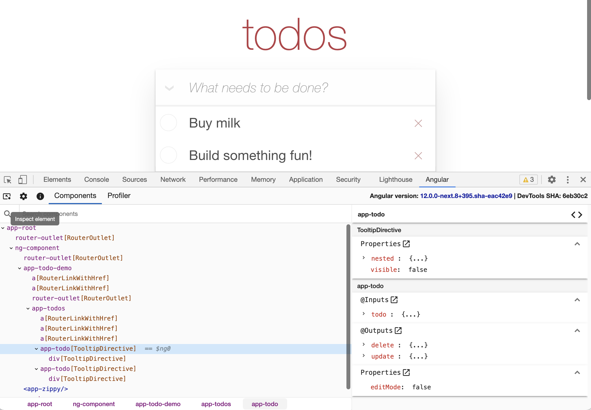

When you open the extension, you'll see two additional tabs:

- [Components](#components) - lets you explore the components and directives in your application and preview or edit their state.

- [Profiler](#profiler) - lets you profile your application and understand what the performance bottleneck is during change detection execution.

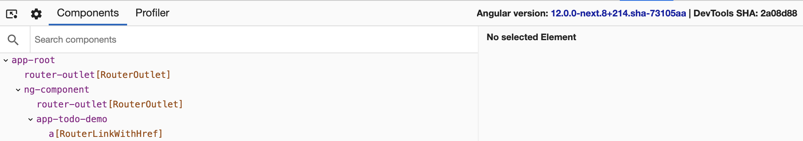

In the top-right corner of Angular DevTools you'll find which version of Angular is running on the page as well as the latest commit hash for the extension.

## Bug reports

You can report issues and feature requests on [GitHub](https://github.com/angular/angular/issues).

To report an issue with the Profiler, export the Profiler recording by clicking the **Save Profile** button, and then attaching that export as a file in the issue.

> Make sure that the Profiler recording does not contain any confidential information.\*\*\*\*

## Debug your application

The **Components** tab lets you explore the structure of your application. You can visualize and inspect the component and directive instances and preview or modify their state. In the next couple of sections we'll look into how you can use this tab effectively to debug your application.

### Explore the application structure

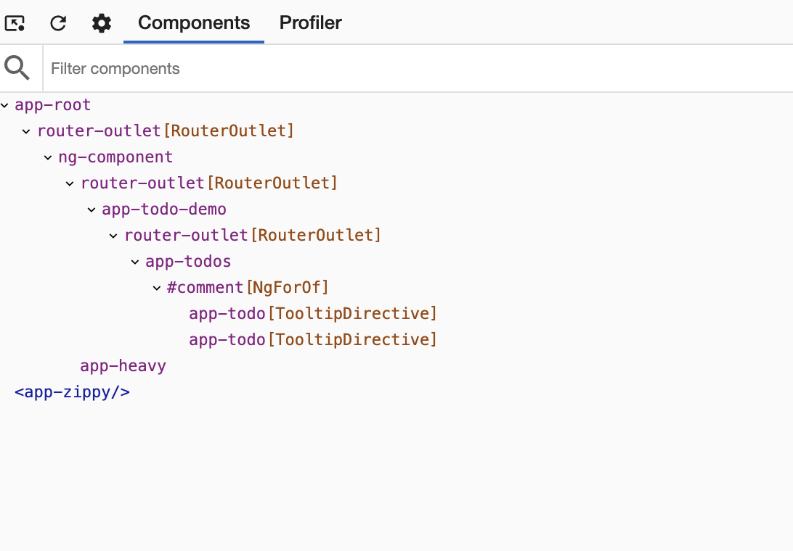

In the preceding screenshot, you can see the component tree of an application.

The component tree displays a hierarchical relationship of the _components and directives_ within your application. When you select a component or a directive instance, Angular DevTools presents additional information about that instance.

### View properties

Click the individual components or directives in the component explorer to select them and preview their properties. Angular DevTools displays their properties and metadata on the right-hand side of the component tree.

You can navigate in the component tree using the mouse or the following keyboard shortcuts:

- Up and down arrows select the previous and next nodes.
- Left and right arrows collapse and expand a node.

To look up a component or directive by name use the search box above the component tree. To navigate to the next search match, press `Enter`. To navigate to the previous search match, press `Shift + Enter`.

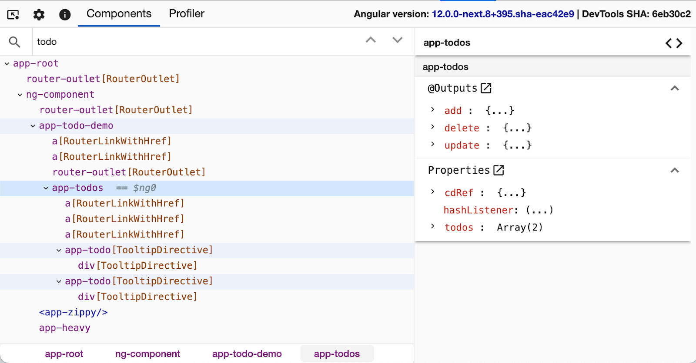

### Navigate to the host node

To go to the host element of a particular component or directive, find it in the component explorer and double-click it. Chrome DevTools opens the Elements tab and selects the associated DOM node.

### Navigate to source

For components, Angular DevTools also lets you navigate to the component definition in the source tab. After you select a particular component, click the icon at the top-right of the properties view:

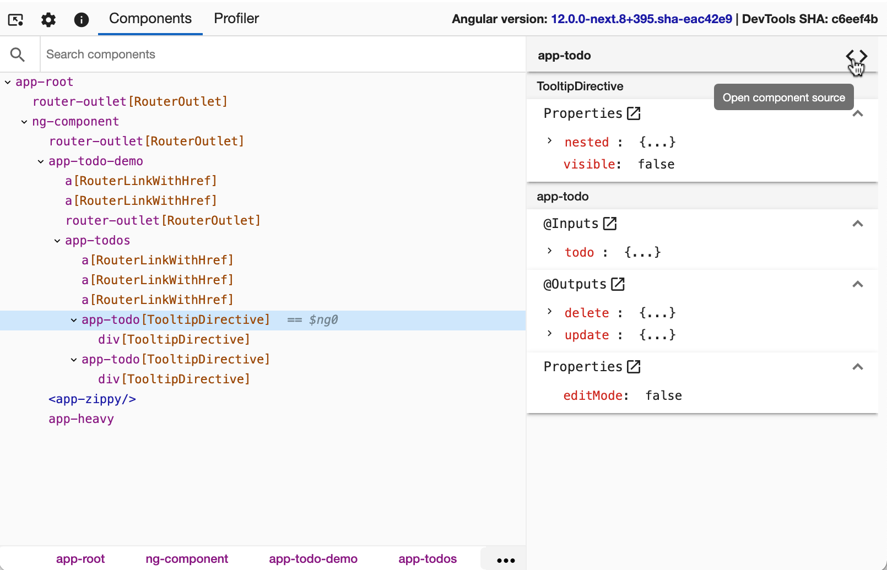

### Update property value

Like Chrome DevTools, the properties view allows you to edit the value of an input, output, or another property. Right-click on the property value. If edit functionality is available for this value type, you'll see a text input. Type the new value and press `Enter`.

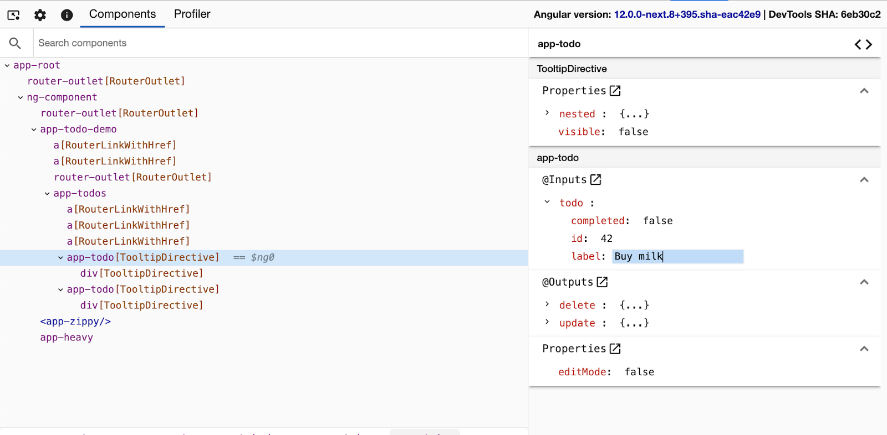

### Access selected component or directive in console

As a shortcut in the console, Angular DevTools provides you access to instances of the recently selected components or directives. Type `$ng0` to get a reference to the instance of the currently selected component or directive, and type `$ng1` for the previously selected instance.

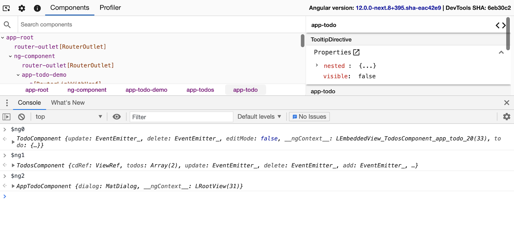

### Select a directive or component

Similar to Chrome DevTools, you can inspect the page to select a particular component or directive. Click the **_Inspect element_** icon at the top left corner within Devtools and hover over a DOM element on the page. Angular DevTools recognizes the associated directives and/or components and lets you select the corresponding element in the Component tree.

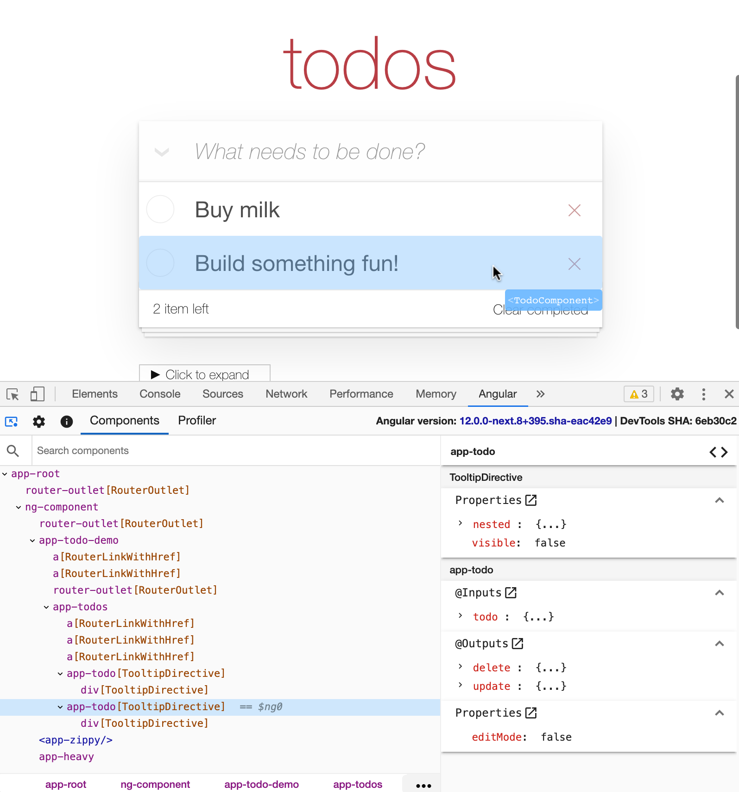

## Profile your application

The **Profiler** tab lets you preview the execution of Angular's change detection.

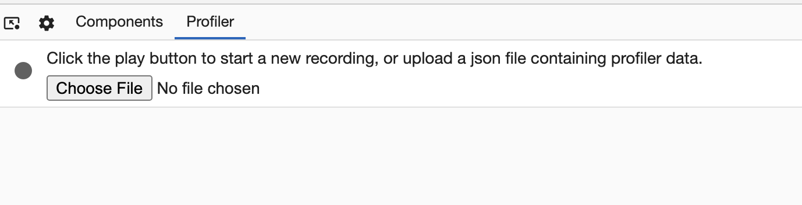

The Profiler lets you start profiling or import an existing profile. To start profiling your application, hover over the circle at the top-left corner within the **Profiler** tab and click **Start recording**.

During profiling, Angular DevTools captures execution events, such as change detection and lifecycle hook execution. To finish recording, click the circle again to **Stop recording**.

You can also import an existing recording. Read more about this feature in the [Import recording](#) section.

### Understand your application's execution

In the following screenshot, you can find the default view of the Profiler after you complete recording.

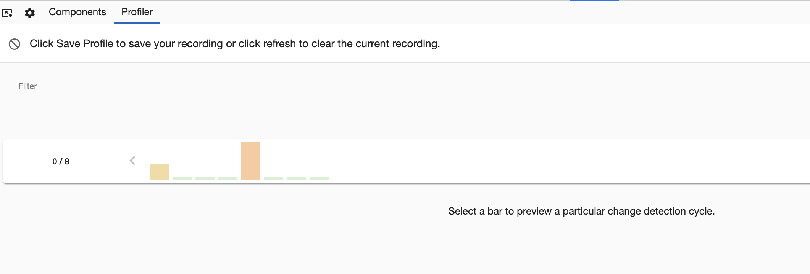

Near the top of the view you can see a sequence of bars, each one of them symbolizing change detection cycles in your app. The taller a bar is, the longer your application has spent in this cycle. When you select a bar, DevTools renders a bar chart with all the components and directives that it captured during this cycle.

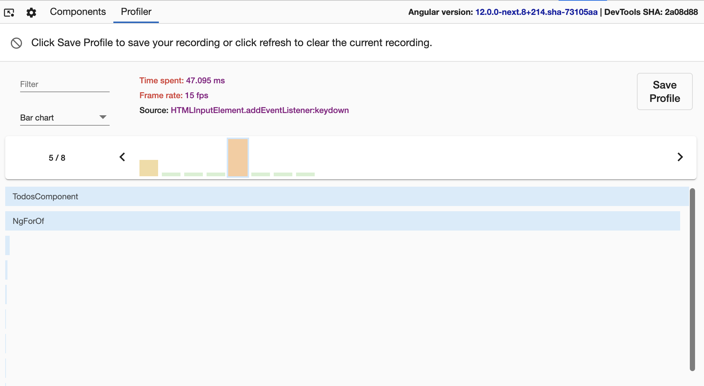

Above the change detection timeline, you can find how much time Angular spent in this cycle. Angular DevTools attempts to estimate the frame drop at this point to indicate when the execution of your application might impact the user experience.

Angular DevTools also indicates what triggered the change detection (that is, the change detection's source).

### Understand component execution

When you click on a bar, you'll find a detailed view about how much time your application spent in the particular directive or component:

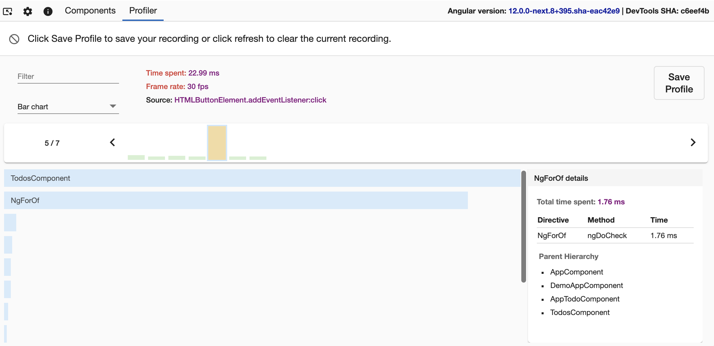
Figure shows the total time spent by NgforOf directive and which method was called in it. It also shows the parent hierarchy of the directive selected.

### Hierarchical views

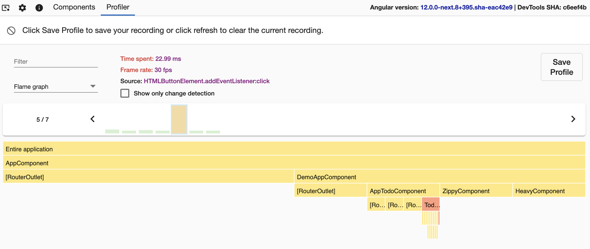

You can also preview the change detection execution in a flame graph-like view. Each tile in the graph represents an element on the screen at a specific position in the render tree.

For example, if during one change detection cycle at a specific position in the component tree we had `ComponentA`, this component was removed and in its place Angular rendered `ComponentB`, you'll see both components at the same tile.

Each tile is colored depending on how much time Angular has spent there. DevTools determines the intensity of the color by the time spent relative to the tile where we've spent the most time in change detection.

When you click on a certain tile, you'll see details about it in the panel on the right. Double-clicking the tile zooms it in so you can preview the nested children.

### Debug OnPush

To preview the components in which Angular did change detection, select the **Change detection** checkbox at the top, above the flame graph.

This view will color all the tiles in which Angular performed change detection in green, and the rest in gray:

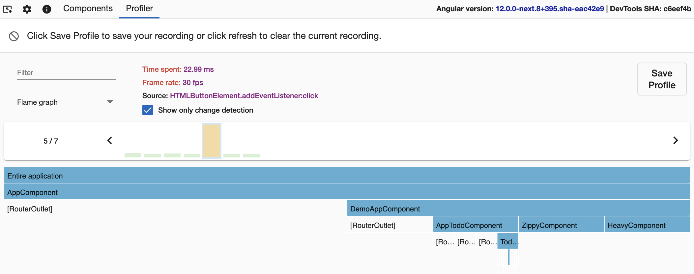

### Import recording

Click the **Save Profile** button at the top-left of a recorded profiling session to export it as a JSON file and save it to the disk. Then, you can import the file in the initial view of the profiler by clicking the **Choose file** input:

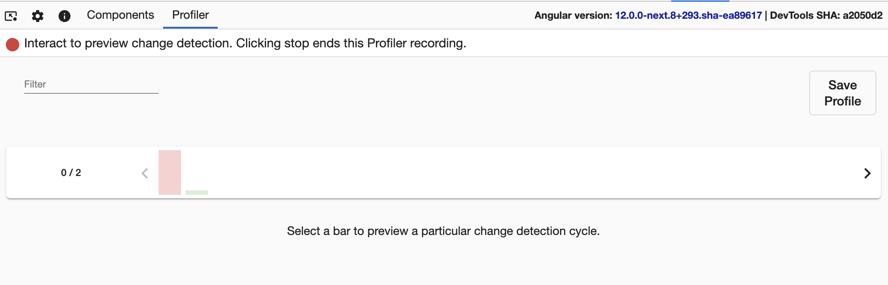
