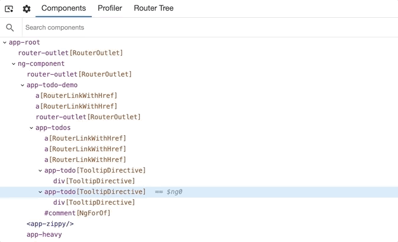
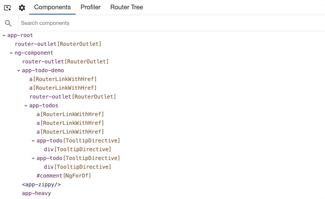
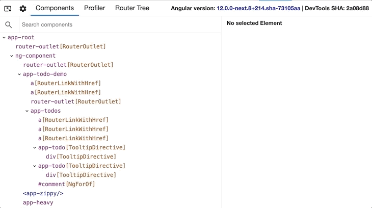

### Component Explorer

The component tree displays a hierarchical relationship of the _components_. When a _component_ is selected, Devtools presents additional information about the selected _component_.

At the screenshot below, you can see the UI of the component explorer:

On the left-hand side is the component tree. You can click on the individual elements to select them and preview their properties. To navigate in the component tree, you can use the arrows:

- Up & down to select the previous and next nodes.
- Left & right to collapse and expand a node.

If you have a lot of components and directives, you can look up for a particular element using the search box at the top. It'll perform a case insensitive exact substring match and highlight the found nodes. To navigate to the next search match, just press "Enter." To navigate to the previous search match, press "Shift + Enter."

### Navigate to DOM node

To go to the host element of a particular component or directive, just double click on it. Chrome DevTools will open the Elements tab and select the associated DOM element if available.

### Navigate to source

For components, Angular DevTools would also allow you to navigate to the component definition in the source tab. Once you select a particular component, click on the icon at the top-right of the property view (if available):

### Update property value

The property view, similarly to Chrome DevTools, allows you to edit the value of an input, output, or state property. Just right click on the property value. If edit functionality is available for this value type, you'll see a text input.
Type the new value and press enter.

### Access selected component in console

As a shortcut in the console, Angular DevTools provides you access to the currently selected component. Just type `$ng0` to get a reference to the instance of the selected component. DevTools keeps references to the last 5 selections in the variables `$ng0`, `$ng1`, `$ng2`, `$ng3`, and `$ng4`.

