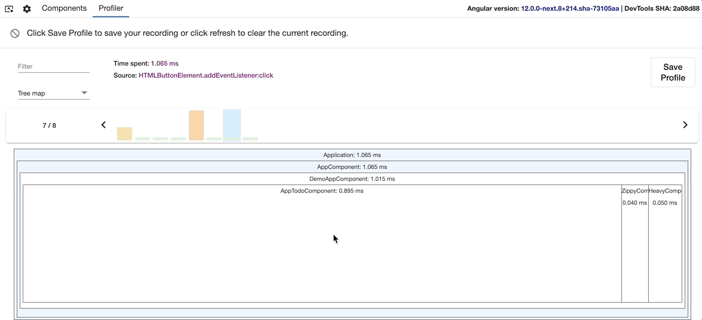

- [Overview](#overview)
  - [Bug reports](#bug-reports)
  - [Components](#components)
    - [Exploring the component tree](#exploring-the-component-tree)
    - [Viewing properties of a Component](#viewing-properties-of-a-component)
    - [Navigate to DOM node](#navigate-to-dom-node)
    - [Navigate to source](#navigate-to-source)
    - [Update property value](#update-property-value)
    - [Access selected component in console](#access-selected-component-in-console)
    - [Selecting DOM Node](#selecting-dom-node)
  - [Profiler](#profiler)
    - [Default profiler view](#default-profiler-view)
    - [Directive details](#directive-details)
    - [Flame graph view](#flame-graph-view)
    - [Debugging OnPush](#debugging-onpush)
    - [Treemap view](#treemap-view)
    - [Import recording](#import-recording)

# Overview

Angular DevTools is a Chrome extension, which provides debugging and profiling experience for **Angular (AngularTS or Angular2) Ivy** projects. To use DevTools, your project must be already compatible with Angular Ivy since the tooling uses Ivy-specific APIs.

You can install devtools from Chrome Webstore by searching "Angular Devtools" or can click here.

Once installed, open Chrome DevTools. You should see an "Angular" tab. When you open it, you'll see two additional tabs:

- [Components](#components) - provides a component explorer functionality, which lets you preview and modify the component tree of your application.
- [Profiler](#profiler) - allows you to profile your application and understand what is the performance bottleneck during change detection execution.

You will also see the version of Angular your application is using in the top right corner followed by the commit version of Devtools you are using.

## Bug reports

You can **report issues and feature requests [here](https://github.com/rangle/angular-devtools/issues)**.

If you're reporting issue in the profiler, make sure you export the recording to a JSON file and apply it as an attachment. To help us fix the issue faster, please list the steps which caused it, and share instructions on how to reproduce the problem with your codebase.

## Components

The components tab shows the component tree displaying a hierarchical relationship of the components. You can visualize and inspect the component tree of your application. Additionally, you can also preview and modify the properties of a particular component, view its source, and navigate to the element in Chrome Devtools.

### Exploring the component tree

The component tree displays a hierarchical relationship of the _components_. When a _component_ is selected, Devtools presents additional information about the selected _component_.

In the screenshot below, you can see the component tree of an application:

### Viewing properties of a Component

You can click on the individual elements to select them and preview their properties. Component properties will get displayed on the left-hand side of the component tree. To navigate in the component tree, you can use the arrows:

- Up & down to select the previous and next nodes.
- Left & right to collapse and expand a node.

If you have a lot of components and directives, you can look up for a particular element using the search box at the top. It'll perform a case insensitive exact substring match and highlight the found nodes. To navigate to the next search match, just press "Enter." To navigate to the previous search match, press "Shift + Enter."

### Navigate to DOM node

To go to the host element of a particular component or directive, just double-click on it. Chrome DevTools will open the Elements tab and select the associated DOM element if available.

### Navigate to source

For components, Angular DevTools would also allow you to navigate to the component definition in the source tab. Once you select a particular component, click on the icon at the top-right of the property view (if available):

### Update property value

Like Chrome DevTools, the property view allows you to edit the value of an input, output, or state property. Right-click on the property value. If edit functionality is available for this value type, you'll see a text input. Type the new value and press enter.

### Access selected component in console

As a shortcut in the console, Angular DevTools provides you access to the currently selected component. Just type `$ng0` to get a reference to the instance of the selected component. DevTools keeps references to the last 5 selections in the variables `$ng0`, `$ng1`, `$ng2`, `$ng3`, and `$ng4`.

### Selecting DOM Node

Like Chrome Devtools you can use selection to hover over the rendered components on the page and select the component within the component tree.

## Profiler

The profiler tab allows you to preview the execution time of Angular's change detection and your component's lifecycle hooks.

Currently, Angular DevTools does not allow profiling of component and the directive's outputs.

The profiler allows you to start profiling or import an existing profile. You can start profiling your application by clicking on the circle at the top left.

During profiling, Angular DevTools will capture execution events, such as change detection and lifecycle hook execution. To finish recording, click on the same button.

You can also import an existing recording. Read more about this feature at the [Import recording](#import-recording) section.

### Default profiler view

On the screenshot below, you can find the default view of the profiler once you complete recording.

At the top, you can see a sequence of bars, each one of them symbolizing change detection cycles in your app. The taller a bar is, the longer your application has spent in this cycle. When you select a bar, DevTools will render a bar chart with all the components and directives that it captured during this cycle.

Above the change detection cycle visualization, you can find how much time exactly Angular spent in this cycle. Angular DevTools will also try to estimate the frame drop at this point so that it can indicate when you should consider
optimizing your component tree.

Additionally, Angular DevTools will also indicate what triggered the change detection (i.e., change detection's source).

### Directive details

You can easily notice how much time you spend on the individual components/directives. When you click on a bar, you'll see detailed view about your selection:

On the screenshot above you can find a pie chart showing how much time the specific directive/component spent in change detection versus lifecycle hooks and also, its parent hierarchy, so that you can efficiently allocate it in the
component tree.

### Flame graph view

You can also preview the change detection execution in a flame graph. Each tile in the graph represents an element on the screen at a specific position in the DOM tree.

> For example, if during one change detection cycle at a specific position in the component tree we had `ComponentA`, this component was removed, and on its place Angular rendered `ComponentB`; you'll see both components at the same tile.

Each tile is colored depending on how much time Angular has spent there. DevTools determines the intensity of the color by the time spent relative to the tile where we've spent the most time in change detection.

When you click on a certain tile, you'll see details about it in the panel on the right. Double click on the tile, will zoom it in so you can preview the nested children:

### Debugging OnPush

To preview in which components Angular did change detection, check the "Change detection" checkbox at the top, above the flame graph.

This view will color in green all the tiles in which Angular change detection, and in gray the rest:

### Treemap view

The treemap view is experimental. It aims to show in which component in the component tree you spent the most time during the selected change detection cycle.

### Import recording

Pressing the "Export to JSON" button at the top-left of a recorded profiling session will export it as a JSON file and save it on the disk. Later on, you can import the file in the initial view of the profiler, pressing on the "Choose file" input:

