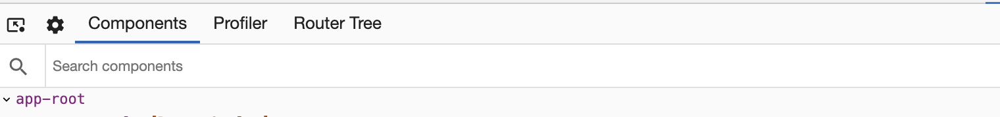

## Overview

Angular DevTools is a Chrome extension, which provides debugging and profiling experience for **Angular (AngularTS or Angular2) Ivy** projects. To use DevTools, your project must be already compatible with Angular Ivy since the tooling uses Ivy-specific APIs.

You can install devtools from Chrome Webstore by searching "Angular Devtools" or can click here.

Once installed, open Chrome DevTools. You should see an "Angular" tab. When you open it, you'll see two additional tabs:

- [Components](#components) - provides a component explorer functionality, which lets you preview and modify the component tree of your app.
- [Profiler](#profiler) - allows you to profile your application and understand what is the performance bottleneck during change detection execution.
- [Router Tree](#router-tree) - allows you to view different routes and understand the navigation hierarchy of the application.

## Bug reports

You can **report issues and feature requests [here](https://github.com/rangle/angular-devtools/issues)**.

If you're reporting issue in the profiler, make sure you export the recording to a JSON file and apply it as an attachment. To help us fix the issue faster, please list the steps which caused it, and share instructions on how to reproduce the problem with your codebase.
