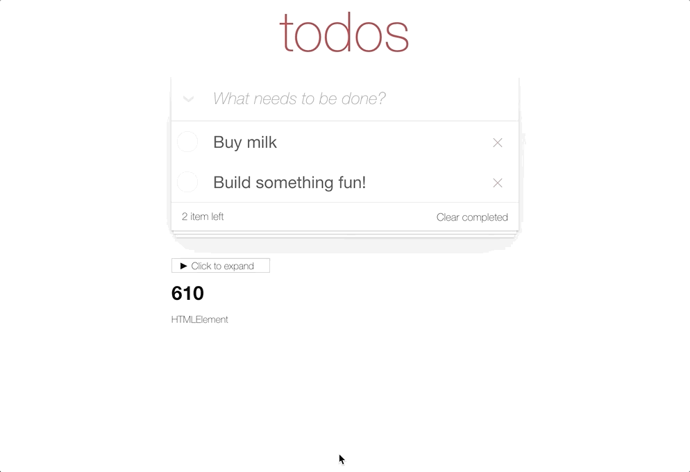
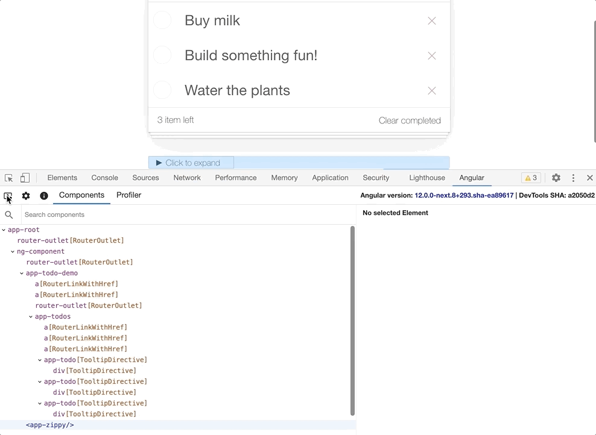
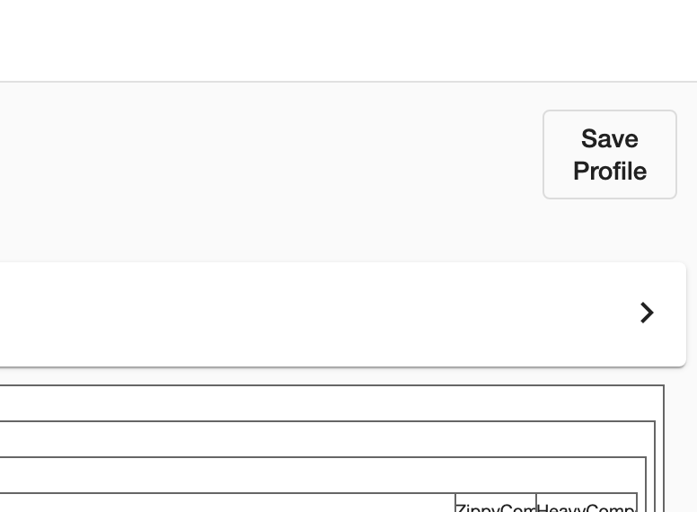

- [Overview](#overview)
  - [Bug reports](#bug-reports)
  - [Debugging your application](#debugging-your-application)
    - [Exploring the structure of the application](#exploring-the-structure-of-the-application)
    - [Viewing properties](#viewing-properties)
    - [Navigate to the host node](#navigate-to-the-host-node)
    - [Navigate to source](#navigate-to-source)
    - [Update property value](#update-property-value)
    - [Access selected component or directive in console](#access-selected-component-or-directive-in-console)
    - [Selecting a directive or component](#selecting-a-directive-or-component)
  - [Profiling your application](#profiling-your-application)
    - [Understanding your application's execution](#understanding-your-applications-execution)
    - [Understanding component's execution](#understanding-components-execution)
    - [Hierarchical views](#hierarchical-views)
    - [Debugging OnPush](#debugging-onpush)
    - [Import recording](#import-recording)

# Overview

Angular DevTools is a Chrome DevTools extension that provides debugging and profiling capabilities for Angular applications. Angular DevTools supports Angular Ivy applications v9 and above.

You can find Angular DevTools in the [Chrome Web Store](...).

Once you install Angular DevTools, you can find the extension under the "Angular" tab in Chrome DevTools.

When you open the extension, you'll see two additional tabs:

- [Components](#components) - allows you to explore the components and directives in your application and preview or edit their state.
- [Profiler](#profiler) - allows you to profile your application and understand what is the performance bottleneck during change detection execution.

At the top-right corner of Angular DevTools you'll find what is the version of Angular running on the page as well as the latest commit hash for the extension.

## Bug reports

You can **report issues and feature requests on [GitHub](https://github.com/rangle/angular-devtools/issues)**.

If you're reporting an issue with the profiler, export the profiler recording by clicking the "save profile" button, and then attach that export as a file in the issue.

> Make sure while exporting profiler recording, it does not contain any confidential information.

## Debugging your application

The component tab allows you to explore the structure of your application. You can visualize and inspect the component and directive instances and preview or modify their state. In the next a couple of sections we'll look into how you can use this tab effectively to debug your application.

### Exploring the structure of the application

In the screenshot above, you can see the component tree of an application.

The component tree displays a hierarchical relationship of the _components_ and _directives_ within your application. When you select a component or a directive instance, Angular DevTools presents additional information about it.

### Viewing properties

You can click on the individual components or directives to select them and preview their properties. Angular DevTools will display their properties and metadata on the right-hand side of the component tree.

You can navigate in the component tree using the mouse or the following keyboard shortcuts:

- Up and down to select the previous and next nodes.
- Left and right to collapse and expand a node.

To look up for a component or directive by name use the search box at the top. It'll perform a case insensitive exact substring match and highlight the found nodes. To navigate to the next search match, just press "Enter." To navigate to the previous search match, press "Shift + Enter."

### Navigate to the host node

To go to the host element of a particular component or directive, just double-click on it. Chrome DevTools will open the Elements tab and select the associated DOM node.

### Navigate to source

For components, Angular DevTools would also allow you to navigate to the component definition in the source tab. Once you select a particular component, click on the icon at the top-right of the property view (if available):

### Update property value

Like Chrome DevTools, the property view allows you to edit the value of an input, output, or another property. Right-click on the property value. If edit functionality is available for this value type, you'll see a text input. Type the new value and press enter.

### Access selected component or directive in console

As a shortcut in the console, Angular DevTools provides you access to the instances of the recently selected components or directives. Type `$ng0` to get a reference to the instance of the currently selected component or directive, `$ng1` for the previously selected instance, etc.

### Selecting a directive or component

Similarly to Chrome DevTools you can inspect the page to select a particular component or directive. Click on the directive explorer and hover a DOM element on the page. Angular DevTools will recognize the associated directives and/or components and allow you to select the corresponding entry in the component explorer.

## Profiling your application

The profiler tab allows you to preview the execution of Angular's change detection.

The profiler allows you to start profiling or import an existing profile. You can start profiling your application by clicking on the circle at the top-left.

During profiling, Angular DevTools will capture execution events, such as change detection and lifecycle hook execution. To finish recording, click on the same button.

You can also import an existing recording. Read more about this feature at the [Import recording](#import-recording) section.

### Understanding your application's execution

On the screenshot below, you can find the default view of the profiler once you complete recording.

At the top, you can see a sequence of bars, each one of them symbolizing change detection cycles in your app. The taller a bar is, the longer your application has spent in this cycle. When you select a bar, DevTools will render a bar chart with all the components and directives that it captured during this cycle.

Above the change detection timeline, you can find how much time Angular spent in this cycle. Angular DevTools will also try to estimate the frame drop at this point so that it can indicate when the execution of your application may impact the user experience.

Angular DevTools will also indicate what triggered the change detection (i.e., change detection's source).

### Understanding component's execution

When you click on a bar, you'll find a detailed view about how much time your application spent in the particular directive or component:

### Hierarchical views

You can also preview the change detection execution in a flame graph-like view. Each tile in the graph represents an element on the screen at a specific position in the render tree.

For example, if during one change detection cycle at a specific position in the component tree we had `ComponentA`, this component was removed, and on its place Angular rendered `ComponentB`; you'll see both components at the same tile.

Each tile is colored depending on how much time Angular has spent there. DevTools determines the intensity of the color by the time spent relative to the tile where we've spent the most time in change detection.

When you click on a certain tile, you'll see details about it in the panel on the right. Double click on the tile, will zoom it in so you can preview the nested children:

### Debugging OnPush

To preview in which components Angular did change detection, check the "Change detection" checkbox at the top, above the flame graph.

This view will color in green all the tiles in which Angular change detection, and in gray the rest:

### Import recording

Pressing the "Export to JSON" button at the top-left of a recorded profiling session will export it as a JSON file and save it on the disk. Later on, you can import the file in the initial view of the profiler, pressing on the "Choose file" input:

