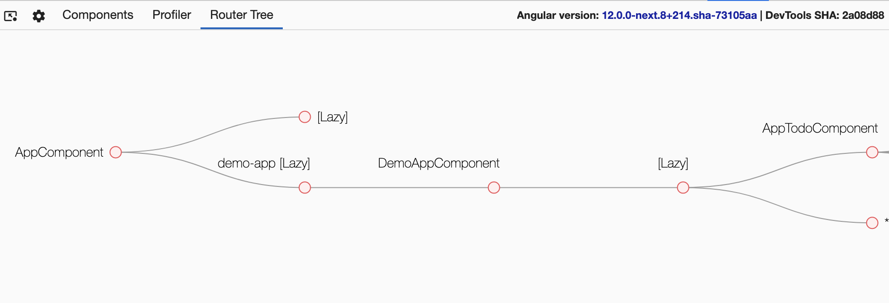
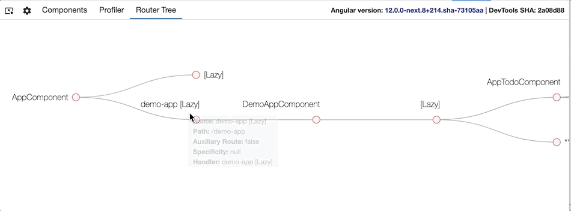

### Router Tree

Router Tree displays the routing information for the application. It will show all the defined routes that are currently loaded in the application.



The routes shows the path to each component (think view). The `AppComponent` path is the root `/`. AppComponent loads two `[lazy]` loaded routes `/` and `/demo-app`. Hovering over each route will display additional details about the route.



Additional details about a specific route is displayed when hoovering over the routes.

- _Name_: name of the component used to render the route. If route is being lazy loaded just path name is displayed.
- _Path_: actual path for the route being used within the application.
- _Auxiliary Route_: if the route is an auxiliary route or not.

### Enabling Router Tree

To be able to view the router tree, you will need to inject the Router in the application _Root_ component as shown below (it must be named `router` exactly).

```typescript
export class AppComponent {
  constructor(public router: Router) {}
}
```

### Detecting Routes

The way Angular Devtools detects the name of a route is through:

1. Checking if a component is connected to the route. If so, use the name of that component
2. If there is no component, Devtools checks if it's a _lazy route_, if so it will specify the name as `path + [Lazy]`, example `demo-app [Lazy]`
3. If there is no component and it's not a _lazy route_. Devtools will check if it's a redirect route, if it is - Devtools will return `path -> redirecting to -> redirectPath`.
4. If none of the above matches, Augury will return `no-name-route`, ideally this shouldn't happen.
