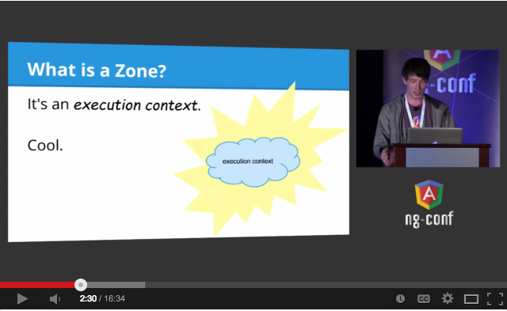

# Zone.js

[](https://cdnjs.com/libraries/zone.js)

Implements _Zones_ for JavaScript, inspired by [Dart](https://dart.dev/articles/archive/zones).

> If you're using zone.js via unpkg (i.e. using `https://unpkg.com/zone.js`)
> and you're using any of the following libraries, make sure you import them first

> * 'newrelic' as it patches global.Promise before zone.js does
> * 'async-listener' as it patches global.setTimeout, global.setInterval before zone.js does
> * 'continuation-local-storage' as it uses async-listener

## Development Status of Zone.js

As Angular moves towards a zoneless application development model, Zone.js is no longer accepting new features, including additional patches for native platform APIs. The team will also not be accepting any low priority bug fixes. Any critical bug fixes that relate to Angular's direct use of Zone.js will still be accepted.

While still a supported part of Angular, the Angular team strongly discourages using Zone.js outside of Angular application contexts.


## NEW Zone.js POST-v0.6.0

See the new API [here](./lib/zone.ts).

Read up on [Zone Primer](https://docs.google.com/document/d/1F5Ug0jcrm031vhSMJEOgp1l-Is-Vf0UCNDY-LsQtAIY).

## BREAKING CHANGES since Zone.js v0.11.1

Prior to `v0.11.1`, Zone.js provided two distribution bundle formats in the `dist` folder.
They were (1) `ES5` bundle distributed as `zone.js` and (2) `ES2015` bundle distributed as `zone-evergreen.js`.
Both of these bundles were in `UMD` format, and are used for Angular's differential-loading mechanism.

Starting with `v0.11.1`, Zone.js follows the [Angular Package Format](https://docs.google.com/document/d/1CZC2rcpxffTDfRDs6p1cfbmKNLA6x5O-NtkJglDaBVs). Therefor the new Zone.js file layout is:

- `bundles`: `ES5` bundle in `UMD` format.
- `fesm2015`: `ES5` bundle in `ESM` format.
- `dist`: `ES5` bundle in `UMD` format. This directory is present to keep backward compatibility.

If you are using `Angular CLI`, the `polyfills.ts` file will contain:

```
import 'zone.js/dist/zone';
```

Starting with Zone.js `v0.11.1+` the import changes to:

```
import 'zone.js';
```

Prior to `v0.11.1` the import would load the `ES5` bundle in `UMD` format from `dist/zone.js`. 
Starting with `v0.11.1` the import loads the `ES2015` bundle in `ESM` format instead.

This is a breaking change for legacy browsers such as `IE11`.

For backwards compatibility `zone.js` continues to distribute the same bundles under `dist`.
To restore the old behavior import from the `dist` directory instead like so:

```
import 'zone.js/dist/zone';
```

For details, please refer the [changelog](./CHANGELOG.md) and the [PR](https://github.com/angular/angular/pull/36540).

## What's a Zone?

A Zone is an execution context that persists across async tasks.
You can think of it as [thread-local storage](https://en.wikipedia.org/wiki/Thread-local_storage) for JavaScript VMs.

See this video from ng-conf 2014 for a detailed explanation:

[](//www.youtube.com/watch?v=3IqtmUscE_U&t=150)

## See also
* [async-listener](https://github.com/othiym23/async-listener) - a similar library for node
* [Async stack traces in Chrome](https://www.html5rocks.com/en/tutorials/developertools/async-call-stack/)
* [strongloop/zone](https://github.com/strongloop/zone) (Deprecated)
* [vizone](https://github.com/gilbox/vizone) - control flow visualizer that uses zone.js

## Standard API support

zone.js patched most standard web APIs (such as DOM events, `XMLHttpRequest`, ...) and nodejs APIs
(`EventEmitter`, `fs`, ...), for more details, please see [STANDARD-APIS.md](STANDARD-APIS.md).

## Nonstandard API support

We are adding support to some nonstandard APIs, such as MediaQuery and
Notification. Please see [NON-STANDARD-APIS.md](NON-STANDARD-APIS.md) for more details.

## Examples

You can find some samples to describe how to use zone.js in [SAMPLE.md](SAMPLE.md).

## Modules

zone.js patches the async APIs described above, but those patches will have some overhead.
Starting from zone.js v0.8.9, you can choose which web API module you want to patch.
For more details, please
see [MODULE.md](MODULE.md).

## Bundles

Starting with `v0.11.0`, `zone.js`  uses `Angular Package Format` for bundle distribution.
(For backwards compatibility, all bundles can still be accessed from `dist` folder.)

|Bundle|Summary|
|---|---|
|`zone.js`| The default bundle. Contains the most used APIs such as `setTimeout/Promise/EventTarget...`, it also supports differential loading by importing  this bundle using `import zone.js`.  In legacy browsers it includes some additional patches such as `registerElement` and `EventTarget` like APIs.|
|`zone-testing.js`| The bundle for zone testing support of `jasmine` / `mocha` / `jest`. Also includes test utility functions `async` / `fakeAsync` / `sync`.|
|`zone-node.js`|The NodeJS support bundle.|
|`zone-mix.js`|A mixed bundle which supports both browser and NodeJS. Useful for mixed environment such as Electron.|
|`zone-externs.js`|the API definitions for `closure compiler`.|

Additional optional patches not included in the `zone.js` bundles which extend functionality.
The additional bundles can  be found under `zone.js/plugins` folder.
To use these bundles, add the following code after importing zone.js bundle.

```
import 'zone.js';
// For example, import canvas patch
import 'zone.js/plugins/zone-patch-canvas';
```

|Patch|Summary|
|---|---|
|`webapis-media-query.js`|patch for `MediaQuery APIs`|
|`webapis-notification.js`|patch for `Notification APIs`|
|`webapis-rtc-peer-connection.js`|patch for `RTCPeerConnection APIs`|
|`webapis-shadydom.js`|patch for `Shady DOM APIs`|
|`zone-bluebird.js`|patch for `Bluebird APIs`|
|`zone-error.js`|patch for `Error Global Object`, supports adding zone information to stack frame, and also removing unrelated stack frames from `zone.js` internally|
|`zone-patch-canvas.js`|patch for `Canvas API`|
|`zone-patch-cordova.js`|patch for `Cordova API`|
|`zone-patch-electron.js`|patch for `Electron API`|
|`zone-patch-fetch.js`|patch for `Fetch API`|
|`zone-patch-jsonp.js`|helper utility for `jsonp API`|
|`zone-patch-resize-observer.js`|patch for `ResizeObserver API`|
|`zone-patch-rxjs.js`|patch for `rxjs API`|
|`zone-patch-rxjs-fake-async.js`|patch for `rxjs fakeasync test`|
|`zone-patch-socket-io.js`|patch for `socket-io`|
|`zone-patch-user-media.js`|patch for `UserMedia API`|
|`zone-patch-message-port.js`|patch for `MessagePort API`|

## License
MIT