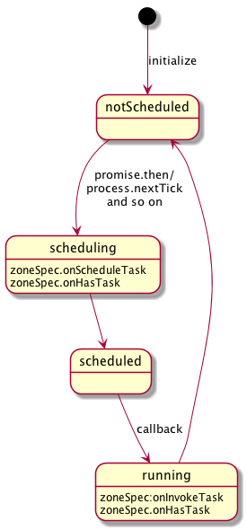
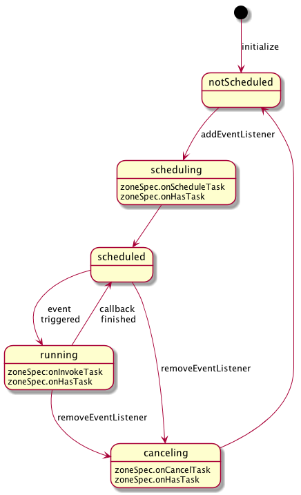
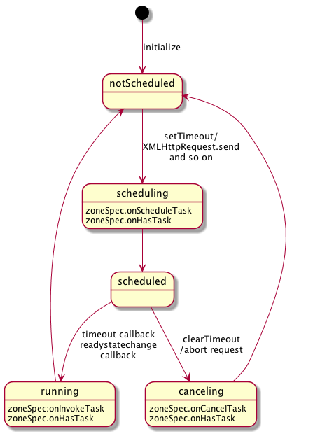
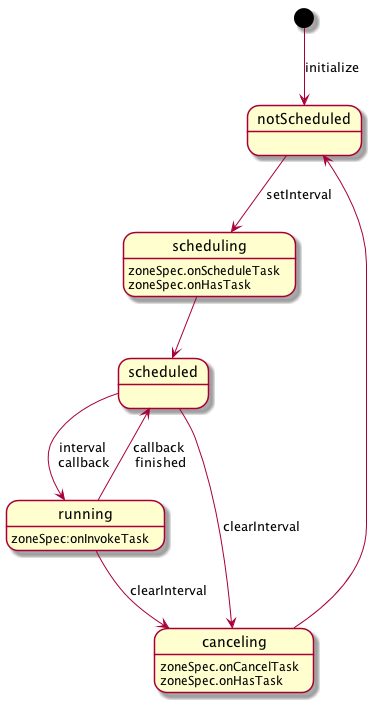
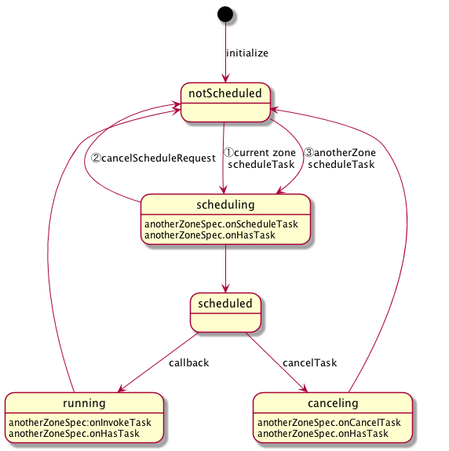
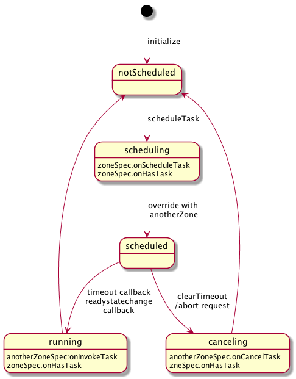
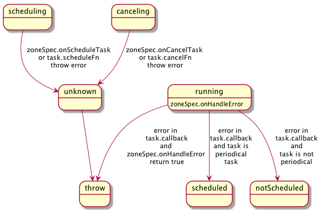

## Task lifecycle

We handle several kinds of tasks in zone.js,

- MacroTask
- MicroTask
- EventTask

For details, please refer to [here](../dist/zone.js.d.ts)

This document will explain the lifecycle (state-transition) of different types of tasks and also the triggering of various zonespec's callback during that cycle.

The motivation to write this document has come from this [PR](https://github.com/angular/zone.js/pull/629) of @mhevery. This has made the task's state more clear. Also, tasks can now be cancelled and rescheduled in different zone.

### MicroTask
Such as Promise.then, process.nextTick, they are microTasks, the lifecycle(state transition)
looks like this.

ZoneSpec's onHasTask callback will be triggered when the first microTask were scheduled or the 
last microTask was invoked.

### EventTask
Such as EventTarget's EventListener, EventEmitter's EventListener, their lifecycle(state transition)
looks like this.

ZoneSpec's onHasTask callback will be triggered when the first eventTask were scheduled or the 
last eventTask was cancelled.

EventTask will go back to scheduled state after invoked(running state), and will become notScheduled after cancelTask(such as removeEventListener) 

### MacroTask

#### Non Periodical MacroTask 
Such as setTimeout/XMLHttpRequest, their lifecycle(state transition)
looks like this.

ZoneSpec's onHasTask callback will be triggered when the first macroTask were scheduled or the 
last macroTask was invoked or cancelled.

Non periodical macroTask will become notScheduled after being invoked or being cancelled(such as clearTimeout) 

#### Periodical MacroTask 
Such as setInterval, their lifecycle(state transition)
looks like this.

ZoneSpec's onHasTask callback will be triggered when first macroTask was scheduled or last macroTask 
 was cancelled, it will not triggered after invoke, because it is periodical and become scheduled again.

Periodical macroTask will go back to scheduled state after invoked(running state), and will become notScheduled after cancelTask(such as clearInterval) 

### Reschedule Task to a new zone
Sometimes you may want to reschedule task into different zone, the lifecycle looks like

the ZoneTask's cancelScheduleRequest method can be only called in onScheduleTask callback of ZoneSpec,
because it is still under scheduling state.

And after rescheduling, the task will be scheduled to new zone(the otherZoneSpec in the graph),
and will have nothing todo with the original zone.

### Override zone when scheduling 
Sometimes you may want to just override the zone when scheduling, the lifecycle looks like

After overriding, the task will be invoked/cancelled in the new zone(the otherZoneSpec in the graph),
but hasTask callback will still be invoked in original zone.

### Error occurs in task lifecycle

